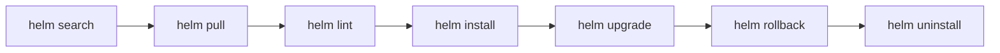

# Helm

**Type:** Package manager for Kubernetes  
**Config files:** `Chart.yaml`, `values.yaml`, `templates/*.yaml`  
**Docs:** https://helm.sh/docs

---

## Contents

- [Key Concepts](#key-concepts)
- [Where to Find Things](#where-to-find-things)
- [Lifecycle](#lifecycle)
- [Chart Anatomy](#chart-anatomy)
- [Templating](#templating)
- [Repositories](#repositories)
- [Common Patterns](#common-patterns)
- [Limitations](#limitations)

---

## Key Concepts

| Term | Meaning |
|------|---------|
| **Chart** | Versioned package of Kubernetes resources (templates + values) |
| **Values** | Parameters that customize a chart for an environment |
| **Release** | A specific deployment of a chart into a cluster (with a name and revision) |
| **Repository** | Indexed collection of charts (HTTP server or OCI registry) |
| **Hook** | Lifecycle action (`pre-install`, `post-upgrade`, `pre-delete`, …) |
| **Sub-chart / dependency** | A chart embedded inside another chart |
| **Library chart** | Reusable templates shared by other charts (no resources of its own) |

---

## Where to Find Things

| What | Where |
|------|-------|
| `helm` CLI | `/usr/local/bin/helm` |
| Per-user config | `~/.config/helm/` |
| Cache | `~/.cache/helm/` |
| Repositories list | `~/.config/helm/repositories.yaml` |
| Chart structure | `Chart.yaml`, `values.yaml`, `templates/`, `charts/` |
| Release history | Stored as Kubernetes Secrets in the release namespace |

---

## Lifecycle



| Verb | What it does |
|------|--------------|
| `repo add` / `repo update` | Manage chart repos |
| `search hub` / `search repo` | Find charts |
| `pull` | Download a chart locally |
| `template` | Render templates without applying (dry-run output) |
| `lint` | Static checks on a chart |
| `install <name> <chart>` | First-time deploy |
| `upgrade <name> <chart>` | Change values or chart version |
| `rollback <name> <revision>` | Revert to a previous revision |
| `history <name>` | List revisions |
| `uninstall <name>` | Remove a release |

---

## Chart Anatomy

```
mychart/
├── Chart.yaml          # name, version, appVersion, dependencies
├── values.yaml         # default parameters
├── values.schema.json  # optional JSON Schema for validation
├── templates/
│   ├── _helpers.tpl    # named template snippets
│   ├── deployment.yaml
│   ├── service.yaml
│   └── ingress.yaml
├── charts/             # vendored sub-charts
└── README.md
```

`Chart.yaml`:

```yaml
apiVersion: v2
name: mychart
version: 1.4.2     # chart version (SemVer)
appVersion: "5.0"  # the application's version
dependencies:
  - name: postgresql
    version: 13.x.x
    repository: https://charts.bitnami.com/bitnami
```

---

## Templating

Helm uses Go templates with custom helpers:

```yaml
apiVersion: apps/v1
kind: Deployment
metadata:
  name: {{ include "mychart.fullname" . }}
spec:
  replicas: {{ .Values.replicaCount }}
  template:
    spec:
      containers:
        - name: app
          image: "{{ .Values.image.repository }}:{{ .Values.image.tag | default .Chart.AppVersion }}"
          {{- if .Values.env }}
          env:
            {{- toYaml .Values.env | nindent 12 }}
          {{- end }}
```

Key constructs:

| Construct | Purpose |
|-----------|---------|
| `{{ .Values.x }}` | Interpolate a value |
| `{{ include "name" . }}` | Render a named template (from `_helpers.tpl`) |
| `{{- ... -}}` | Whitespace trim |
| `{{ if }} ... {{ end }}` | Conditional |
| `{{ range }} ... {{ end }}` | Iteration |
| `{{ toYaml .Values.x \| nindent 4 }}` | Marshal value as YAML, then indent |

---

## Repositories

Two repository formats:

| Type | Notes |
|------|-------|
| **HTTP repo** | Static `index.yaml` + `.tgz` files |
| **OCI registry** | Helm 3.8+; reuse Docker / GHCR / ECR / GAR for charts |

```bash
# OCI workflow
helm package ./mychart                                 # produces mychart-1.4.2.tgz
helm push mychart-1.4.2.tgz oci://ghcr.io/me/charts
helm install web oci://ghcr.io/me/charts/mychart --version 1.4.2
```

Public chart sources: **Artifact Hub**, **Bitnami**, **Prometheus Community**.

---

## Common Patterns

| Pattern | Description |
|---------|-------------|
| **Per-environment values files** | `values-dev.yaml`, `values-prod.yaml`; `helm upgrade -f values-prod.yaml` |
| **Umbrella chart** | One chart depends on multiple service charts to deploy a whole stack |
| **Library charts** | Share templates (probes, labels, ingress macros) across charts |
| **Helm + ArgoCD** | ArgoCD renders the chart and applies it; Helm itself doesn't track the release |
| **Helm + Kustomize post-renderer** | Helm renders, Kustomize patches before apply |

---

## Limitations

- **Templating complexity** — string-based templates over YAML are error-prone for non-trivial logic
- **Drift vs cluster state** — Helm tracks revisions in Secrets but doesn't reconcile drift
- **Two-way nature** — `helm upgrade` is imperative; mixing with kubectl edits causes confusion
- **Alternatives gain ground** — Kustomize (overlay-based, no templates), Carvel (`ytt` + `kapp`), CUE, jsonnet
- **Sub-chart values plumbing** — passing values down nested charts is verbose

---

## Related

- [Containers & Orchestration](index.md) — overview
- [Kubernetes](kubernetes.md) — what Helm packages target
- [Alternatives](alternatives.md) — Kustomize and Carvel as Helm alternatives
- [CI/CD Providers](../process/ci-cd/index.md) — pipelines run `helm upgrade --install`
