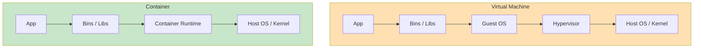
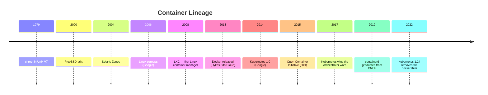

# Containers & Orchestration

Overview of container runtimes and orchestrators that package, ship,
and run software at scale.

## Contents

- [What Is a Container?](#what-is-a-container)
- [A Brief History](#a-brief-history)
- [Choosing a Tool](#choosing-a-tool)
- [Comparison: Runtimes](#comparison-runtimes)
- [Comparison: Orchestrators](#comparison-orchestrators)
- [Core Concepts Across Tools](#core-concepts-across-tools)
- [Build Tools](#build-tools)
- [Runtimes](#runtimes)
- [Orchestrators](#orchestrators)
- [Sandboxed and MicroVM Runtimes](#sandboxed-and-microvm-runtimes)
- [Standards: OCI and CRI](#standards-oci-and-cri)
- [Related](#related)

---

## What Is a Container?

A container is an isolated process tree that:

1. **Sees its own filesystem** (Linux mount namespace + union filesystem)
2. **Sees its own processes, users, network, and IPC** (PID / user / network / IPC namespaces)
3. **Has bounded resources** (cgroups for CPU, memory, I/O)
4. **Shares the host kernel** — unlike a virtual machine, there is no guest OS

A **container image** is the immutable, layered, content-addressed package
that the container is created from. Images are pulled from **registries**,
unpacked into local storage, and instantiated as containers on demand.

---

## A Brief History

The decisive shift in 2013 was developer experience: namespaces and cgroups
already existed for years, but Docker made them usable through a single CLI,
a `Dockerfile`, and a shared registry.

→ [Solomon Hykes](../../authors/solomon-hykes.md) — Docker creator

---

## Choosing a Tool

| Factor | Considerations |
|--------|---------------|
| **Scope** | Single host vs cluster — runtime alone, or orchestrator? |
| **Daemon model** | Daemon-based (Docker) vs daemonless (Podman, Buildah) |
| **Rootless** | Can it run without root privileges? |
| **OCI compliance** | Will it work with images and runtimes from other tools? |
| **Kubernetes compatibility** | Does it implement the CRI? |
| **Ecosystem** | Build tools, registries, orchestrators that integrate |
| **Licensing** | Apache / BSD / proprietary; Docker Desktop license model |
| **Operational maturity** | Production track record, community, vendor support |

---

## Comparison: Runtimes

| Runtime | Daemon | Rootless | OCI | K8s CRI | Build support | Compose |
|---------|--------|----------|-----|---------|--------------|---------|
| [Docker](docker.md) | Yes (`dockerd`) | Optional | Yes | via [containerd](containerd.md) | BuildKit | `docker compose` |
| [Podman](podman.md) | No | Default | Yes | via CRI-O | Buildah | `podman-compose`, Quadlet |
| [containerd](containerd.md) | Yes | Optional | Yes | Yes (native) | via BuildKit | — (use `nerdctl compose`) |
| CRI-O | Yes | Limited | Yes | Yes (native) | — | — |
| LXC / LXD | Yes | Yes | Partial | No | — | — |

---

## Comparison: Orchestrators

| Orchestrator | Scheduling | Networking | Storage | HA | Add-ons | Curve |
|-------------|-----------|-----------|--------|-----|--------|-------|
| [Kubernetes](kubernetes.md) | Pods + controllers | CNI plugins, NetworkPolicy | CSI / PV / PVC | etcd Raft | Vast (CNCF) | Steep |
| [Docker Swarm](docker-swarm.md) | Services + tasks | Built-in overlay | Volumes / plugins | Raft (managers) | Limited | Gentle |
| [Nomad](nomad.md) | Jobs + groups | Consul (optional) | CSI plugins | Raft | Consul / Vault | Moderate |
| Amazon ECS | Tasks + services | AWS VPC | EBS / EFS | AWS-managed | AWS-only | Gentle (in AWS) |
| HashiCorp Waypoint | App-level | Provider-specific | Provider-specific | Provider-specific | — | Gentle |

---

## Core Concepts Across Tools

| Concept | Docker | Podman | Kubernetes | Docker Swarm | Nomad |
|---------|--------|--------|-----------|--------------|-------|
| **Unit of execution** | Container | Container / Pod | Pod | Task | Allocation |
| **Workload definition** | `docker run` / Compose service | `podman run` / Quadlet | Deployment / StatefulSet | Service | Job |
| **Image source** | Registry | Registry | Registry | Registry | Registry / artifact |
| **Networking** | Bridge / overlay | slirp4netns / CNI | CNI plugin | Overlay (VXLAN) | Consul / CNI |
| **Storage** | Volume / bind | Volume / bind | PV / PVC | Volume / plugin | Host volume / CSI |
| **Secrets** | Docker Secret (Swarm) | Secrets via files | Secret object | Docker Secret | Vault integration |
| **Configuration** | Env / file | Env / file | ConfigMap | Config | Template stanza |
| **Scheduler** | (single host) | (single host) | kube-scheduler | Swarm manager | Nomad server |

---

## Build Tools

| Tool | Daemon | Rootless | Output | Notes |
|------|--------|----------|--------|-------|
| **Dockerfile + BuildKit** | Yes | Optional | OCI image | Default for Docker; advanced cache and secrets |
| **Buildah** | No | Yes | OCI image | Podman's build tool; scriptable beyond Dockerfile |
| **Kaniko** | No | Yes | OCI image | Runs inside K8s pods; popular in CI |
| **img** | No | Yes | OCI image | Standalone BuildKit frontend |
| **ko** | No | Yes | OCI image | Go-specific; no Dockerfile needed |
| **Jib** | No | Yes | OCI image | [Maven](../process/build-systems/maven.md) / [Gradle](../process/build-systems/gradle.md) plugin for Java |

---

## Runtimes

- [Docker](docker.md) — the canonical runtime; familiar CLI, BuildKit, Compose
- [Podman](podman.md) — daemonless and rootless; pods, Quadlet, drop-in for Docker
- [containerd](containerd.md) — low-level OCI runtime that powers Docker and Kubernetes
- [Alternatives](alternatives.md) — CRI-O, LXC/LXD, plus build tools (Buildah, Kaniko, ko)

---

## Orchestrators

- [Kubernetes](kubernetes.md) — the de facto orchestrator; Pods, Deployments, Services
- [Docker Swarm](docker-swarm.md) — Docker-native, simpler, smaller ecosystem
- [Nomad](nomad.md) — HashiCorp scheduler for containers and non-container workloads
- [Helm](helm.md) — package manager for Kubernetes (charts, releases)

---

## Sandboxed and MicroVM Runtimes

When kernel sharing is unacceptable (multi-tenant clouds, untrusted workloads),
specialized runtimes add isolation:

- **gVisor** — userspace kernel that intercepts syscalls (used by Google Cloud Run)
- **Kata Containers** — runs each container in a lightweight VM
- **Firecracker** — minimal hypervisor (used by AWS Lambda and Fargate)

→ [Alternatives](alternatives.md) — full overview

---

## Standards: OCI and CRI

Two specifications keep the ecosystem interoperable:

| Spec | What it defines | Maintained by |
|------|----------------|---------------|
| **OCI image-spec** | Image format on disk and in registries | Open Container Initiative |
| **OCI runtime-spec** | Contract between higher-level tools and low-level runtimes | Open Container Initiative |
| **OCI distribution-spec** | Registry HTTP API | Open Container Initiative |
| **Kubernetes CRI** | Container Runtime Interface — how kubelet talks to runtimes | Kubernetes project |

Without OCI, every runtime and orchestrator would speak its own format and
images would not be portable. The 2015 donation of `runc` and the image
specification by Docker, Inc. created this common ground.

---

## Related

- [DevOps](../process/index.md#devops-2009) — culture in which containers became standard
- [Continuous Delivery](../process/index.md#continuous-delivery-2010) — the practice containers enable
- [SRE](../process/index.md#site-reliability-engineering--sre-2016) — what runs on top of orchestrators
- [CI/CD Providers](../process/ci-cd/index.md) — pipelines that build and ship images
- [Distributed Systems](../distributed/index.md) — orchestrators are distributed systems themselves
- [Microservices](../architecture/structural/microservices.md) — primary architectural style behind container adoption
- [Solomon Hykes](../../authors/solomon-hykes.md) — Docker creator
- [Diego Ongaro](../../authors/diego-ongaro.md) — Raft consensus, used by etcd in Kubernetes
