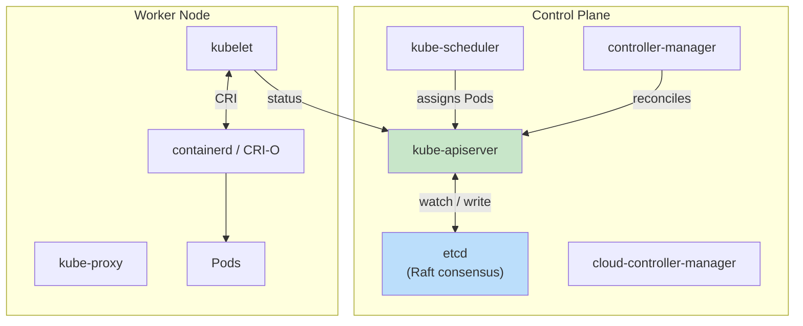
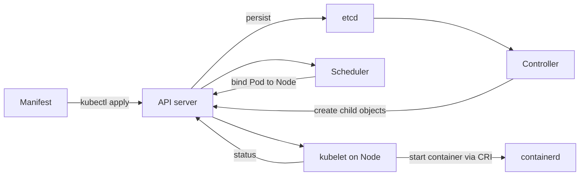

# Kubernetes

**Type:** Container orchestrator (CNCF graduated)  
**Config files:** YAML manifests, `~/.kube/config`  
**Docs:** https://kubernetes.io/docs

---

## Contents

- [Key Concepts](#key-concepts)
- [Architecture](#architecture)
- [Where to Find Things](#where-to-find-things)
- [Object Lifecycle](#object-lifecycle)
- [Workload Types](#workload-types)
- [Networking](#networking)
- [Storage](#storage)
- [Configuration and Secrets](#configuration-and-secrets)
- [Operators and CRDs](#operators-and-crds)
- [Distributions](#distributions)
- [Common Patterns](#common-patterns)
- [Limitations](#limitations)

---

## Key Concepts

| Term | Meaning |
|------|---------|
| **Pod** | Smallest deployable unit; one or more containers sharing network and IPC |
| **Deployment** | Declarative manager for stateless replicas (ReplicaSet under the hood) |
| **Service** | Stable virtual IP / DNS name routing to a set of Pods |
| **Ingress** | HTTP/HTTPS routing into the cluster (paired with an Ingress controller) |
| **ConfigMap** | Non-secret configuration data injected as env or files |
| **Secret** | Sensitive data (base64-encoded; encrypted at rest if configured) |
| **Namespace** | Logical partition for objects, RBAC, and quotas |
| **Node** | Worker machine (physical or virtual) running the kubelet |
| **Controller** | Reconciliation loop that drives observed state toward desired state |
| **CRD** | Custom Resource Definition — extends the API with new object types |

---

## Architecture



→ [Diego Ongaro](../../authors/diego-ongaro.md) — Raft, the consensus
algorithm used by `etcd` to keep Kubernetes' state durable.

---

## Where to Find Things

| What | Where |
|------|-------|
| Cluster connection config | `~/.kube/config` |
| API server | `https://<endpoint>/api`, `/apis` |
| Persistent state | `etcd` cluster (control plane) |
| Logs (per-pod) | `kubectl logs <pod>` |
| Per-container runtime view | `crictl` on the node |
| RBAC | `Role`, `ClusterRole`, `RoleBinding`, `ClusterRoleBinding` |
| Resource quotas | `ResourceQuota`, `LimitRange` (per namespace) |
| Add-ons | `kube-system` namespace |
| Dashboards | `k9s` (TUI), Lens, headlamp, Rancher UI, Octant |

`kubectl` cheat sheet:

| Verb | What it does |
|------|--------------|
| `get` / `describe` | List or detail objects |
| `apply -f` | Declarative create/update from YAML |
| `create -f` | Imperative create (rejects updates) |
| `delete` | Remove objects |
| `logs` / `exec` / `port-forward` | Debug a Pod |
| `rollout` | Manage Deployment revisions and rollbacks |
| `scale` | Change replica count |
| `top` | Show resource usage |
| `kustomize` / `apply -k` | Apply a Kustomize overlay |

---

## Object Lifecycle



The reconciliation loop is continuous: controllers compare desired state
(in `etcd`) against observed state (reported by `kubelet`) and act to close
the gap.

---

## Workload Types

| Object | When to use |
|--------|-------------|
| **Deployment** | Stateless replicas; rolling updates; the default |
| **StatefulSet** | Stable network identity and persistent storage per replica (databases) |
| **DaemonSet** | One Pod per node (log collectors, CNI agents) |
| **Job** | Run to completion (batch tasks) |
| **CronJob** | Scheduled `Job` |
| **ReplicaSet** | Lower-level; rarely created directly — `Deployment` manages them |

---

## Networking

Kubernetes assumes a flat Pod network — every Pod can reach every other Pod
without NAT. **CNI plugins** implement that model:

| CNI plugin | Highlights |
|------------|------------|
| **Calico** | BGP, NetworkPolicy, eBPF data plane |
| **Cilium** | eBPF-native; Hubble for observability |
| **Flannel** | Simple, VXLAN overlay |
| **Weave Net** | Encrypted overlay |
| **AWS VPC CNI / Azure CNI / GKE Dataplane V2** | Cloud-provider integrations |

Service types:

| Type | Behavior |
|------|----------|
| `ClusterIP` | Internal-only virtual IP (default) |
| `NodePort` | Open a port on every node |
| `LoadBalancer` | Provision a cloud LB |
| `ExternalName` | DNS CNAME alias |
| `Headless` | No virtual IP; returns Pod IPs directly (StatefulSets) |

`NetworkPolicy` objects allow zero-trust segmentation (default-deny + explicit allow).

---

## Storage

| Object | Role |
|--------|------|
| **Volume** | A directory mounted into a container (lifetime tied to the Pod) |
| **PersistentVolume (PV)** | Cluster-wide storage resource |
| **PersistentVolumeClaim (PVC)** | A Pod's request for a PV |
| **StorageClass** | Provisioner template (e.g., `gp3`, `azure-disk`) |
| **CSI driver** | Container Storage Interface — pluggable storage backends |

Dynamic provisioning: PVC + StorageClass → PV created on the fly by the CSI driver.

---

## Configuration and Secrets

- **ConfigMap** — non-secret key/value or files
- **Secret** — base64-encoded; encrypt at rest in `etcd` (`--encryption-provider-config`)
- **Downward API** — Pod metadata (name, namespace, labels) injected as env or files
- **External secret stores** — sealed-secrets, External Secrets Operator (ESO), Vault Agent injector

Best practice: never commit raw `Secret` YAML; use sealed-secrets, SOPS, or ESO.

---

## Operators and CRDs

A **CRD** registers a new object type with the API server. An **Operator**
is a controller that reconciles instances of that CRD.

```text
CRD: PostgresCluster   →   Operator watches, creates StatefulSet + Service + PVCs
```

Major operators: cert-manager, Prometheus Operator, ArgoCD, Crossplane,
Strimzi (Kafka), Postgres operators (Zalando, Crunchy, CNPG), KEDA.

---

## Distributions

| Distribution | Use case |
|--------------|----------|
| **Vanilla / kubeadm** | Self-managed control plane |
| **EKS / GKE / AKS** | Managed control plane on AWS / GCP / Azure |
| **k3s / k0s** | Lightweight; edge, IoT, single-binary |
| **kind / minikube** | Local dev (in Docker / VM) |
| **OpenShift** | Red Hat distribution; opinionated, integrated build/CI/CD |
| **Rancher / RKE2** | Multi-cluster management |

---

## Common Patterns

| Pattern | Description |
|---------|-------------|
| **Rolling update** | Default `Deployment` strategy; gradually replace Pods |
| **Blue-green** | Two Deployments behind one Service; switch the selector |
| **Canary** | Small subset of traffic via Ingress weight or service mesh |
| **HPA / VPA** | Horizontal / Vertical Pod Autoscalers |
| **GitOps** | ArgoCD or Flux reconcile cluster state from a Git repo |
| **Sidecar** | Companion container in the Pod (log shipper, proxy) |
| **Init containers** | Run setup tasks before the main container |
| **Service mesh** | Istio / Linkerd add mTLS, traffic shifting, telemetry |

---

## Limitations

- **Steep learning curve** — even basic apps require Pod, Service, Ingress, ConfigMap, RBAC, Network Policy
- **Networking model assumptions** — flat Pod network may clash with corporate networks
- **etcd as scale ceiling** — large clusters need careful etcd tuning
- **Resource overhead** — control plane and per-node agents are non-trivial for small workloads
- **YAML sprawl** — Helm or Kustomize is almost always needed; tooling churn is constant
- **Multi-tenancy is hard** — namespaces alone don't isolate fully; vCluster, hierarchical namespaces, or separate clusters

---

## Related

- [Containers & Orchestration](index.md) — overview
- [Docker](docker.md) / [Podman](podman.md) — local dev for Kubernetes workloads
- [containerd](containerd.md) — the runtime kubelet talks to
- [Helm](helm.md) — package manager for Kubernetes
- [Docker Swarm](docker-swarm.md) / [Nomad](nomad.md) — alternative orchestrators
- [Distributed Systems](../distributed/index.md) — Raft, consensus, etcd
- [Microservices](../architecture/structural/microservices.md) — primary architectural style
- [SRE](../process/index.md#site-reliability-engineering--sre-2016) — operational discipline that runs Kubernetes at scale
- [Diego Ongaro](../../authors/diego-ongaro.md) — Raft (used by etcd)
- [Solomon Hykes](../../authors/solomon-hykes.md) — Docker, the runtime Kubernetes was built around
