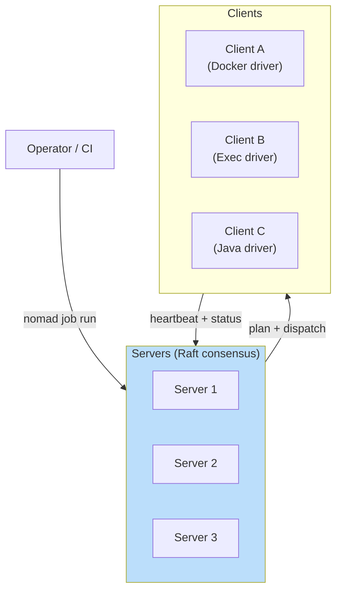
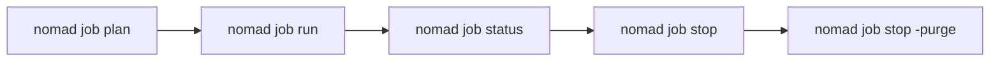

# Nomad

**Type:** General-purpose workload scheduler (HashiCorp)  
**Config files:** HCL job files, `nomad.hcl` agent config  
**Docs:** https://developer.hashicorp.com/nomad

---

## Contents

- [Key Concepts](#key-concepts)
- [Architecture](#architecture)
- [Where to Find Things](#where-to-find-things)
- [Lifecycle](#lifecycle)
- [Drivers](#drivers)
- [Integration: Consul and Vault](#integration-consul-and-vault)
- [Common Patterns](#common-patterns)
- [Limitations](#limitations)

---

## Key Concepts

| Term | Meaning |
|------|---------|
| **Job** | Top-level workload definition |
| **Group** | A set of tasks scheduled together on the same client |
| **Task** | A single unit of execution (a container, a binary, a JVM, …) |
| **Allocation** | A scheduled instance of a group on a specific client |
| **Driver** | Plugin that knows how to run a task type (`docker`, `exec`, `java`, `qemu`, `raw_exec`) |
| **Client** | A node that runs allocations (Kubernetes' "worker" equivalent) |
| **Server** | Control-plane node, joins a Raft quorum |
| **Region / Datacenter** | Federation hierarchy for multi-region deployments |

---

## Architecture



Servers form a Raft cluster (3 or 5). Clients run any drivers they support
and report capabilities to the servers, which schedule allocations
matching constraints.

---

## Where to Find Things

| What | Where |
|------|-------|
| Server / client config | `/etc/nomad.d/nomad.hcl` |
| State directory | `/opt/nomad/data/` |
| HTTP API | `http://<server>:4646` |
| RPC port | `4647` |
| Serf gossip | `4648` |
| UI | `http://<server>:4646/ui` |
| Job files | Author as `<name>.nomad.hcl` |
| Logs | `journalctl -u nomad` |

---

## Lifecycle



| Verb | What it does |
|------|--------------|
| `job plan` | Dry-run; shows scheduling preview |
| `job run` | Submit a job |
| `job status` / `alloc status` | Inspect state |
| `job dispatch` | Run a parameterised batch job |
| `job stop` / `job stop -purge` | Stop and (optionally) remove |
| `node status` | List clients |
| `monitor` | Stream events |

Example job:

```hcl
job "web" {
  datacenters = ["dc1"]
  group "app" {
    count = 3
    task "server" {
      driver = "docker"
      config {
        image = "ghcr.io/me/web:1.2.3"
        ports = ["http"]
      }
      resources { cpu = 200 memory = 256 }
      service { name = "web" port = "http" provider = "consul" }
    }
    network { port "http" { static = 8080 } }
  }
}
```

---

## Drivers

| Driver | Workload |
|--------|----------|
| `docker` | Docker / OCI containers |
| `podman` | Podman containers |
| `exec` | Linux process in an isolated namespace |
| `raw_exec` | Process without isolation (use sparingly) |
| `java` | JAR with chroot and resource limits |
| `qemu` | KVM virtual machine |
| `containerd` (community) | containerd-native execution |

The variety of drivers means **one scheduler for containers and
non-container workloads** — useful when you have legacy services or VMs
alongside microservices.

---

## Integration: Consul and Vault

- **Consul** — service discovery, health checks, optional service mesh
  (Consul Connect with mTLS)
- **Vault** — short-lived secrets injected as templates rendered by the
  task's `template` stanza

This stack (Nomad + Consul + Vault) is the HashiCorp answer to the
Kubernetes + Istio + cert-manager stack.

---

## Common Patterns

| Pattern | Description |
|---------|-------------|
| **Mixed workloads** | Containers, JVM apps, raw binaries, and VMs in one cluster |
| **Batch + service** | Same scheduler handles both — no separate batch system |
| **Multi-region federation** | Native; jobs can target a region or be replicated |
| **Periodic jobs** | Cron-like schedule built in |
| **Canary deployments** | Built into the `update` stanza |
| **Lightweight ops** | Single binary, simple config; small teams ship faster |

---

## Limitations

- **Smaller ecosystem than Kubernetes** — fewer operators, fewer integrations
- **No built-in ingress** — usually paired with Consul + Fabio / Traefik
- **Networking is more DIY** — CNI plugins exist but aren't the cultural default
- **HashiCorp BSL license (post-2023)** — open-source fork (OpenBao for Vault, OpenTofu for Terraform) ecosystem is forming; Nomad itself remains under BSL

---

## Related

- [Containers & Orchestration](index.md) — overview
- [Kubernetes](kubernetes.md) — most direct comparison
- [Docker Swarm](docker-swarm.md) — simpler orchestrator, container-only
- [Distributed Systems](../distributed/index.md) — Raft, gossip, federation
