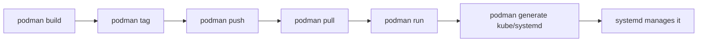

# Podman

**Type:** Daemonless, rootless OCI container engine  
**Config files:** `~/.config/containers/`, `containers.conf`, `Containerfile`  
**Docs:** https://docs.podman.io

---

## Contents

- [Key Concepts](#key-concepts)
- [Where to Find Things](#where-to-find-things)
- [Drop-in Compatibility with Docker](#drop-in-compatibility-with-docker)
- [Lifecycle](#lifecycle)
- [Pods](#pods)
- [Rootless Mode](#rootless-mode)
- [Quadlet (systemd integration)](#quadlet-systemd-integration)
- [podman-compose](#podman-compose)
- [Common Patterns](#common-patterns)
- [Limitations](#limitations)

---

## Key Concepts

| Term | Meaning |
|------|---------|
| **Container** | OCI container, fork-execed directly by the user (no daemon) |
| **Pod** | Group of containers sharing a network namespace — same idea as a Kubernetes Pod |
| **Image** | OCI image, fully compatible with Docker images |
| **Containerfile** | Dockerfile-equivalent (the file `Dockerfile` is also accepted) |
| **Quadlet** | Systemd unit generator that turns container definitions into managed services |
| **Buildah** | Companion build tool used under the hood for `podman build` |
| **Skopeo** | Companion tool for moving images between registries without a local store |

---

## Where to Find Things

| What | Where |
|------|-------|
| Per-user config | `~/.config/containers/` |
| Per-user storage | `~/.local/share/containers/storage/` |
| System config | `/etc/containers/` |
| Registry config | `/etc/containers/registries.conf` |
| Quadlet user units | `~/.config/containers/systemd/` |
| Quadlet system units | `/etc/containers/systemd/` |
| API socket (Docker-compatible) | `unix://$XDG_RUNTIME_DIR/podman/podman.sock` |

---

## Drop-in Compatibility with Docker

Podman's CLI mirrors Docker's verbs:

```bash
alias docker=podman
docker run hello-world      # works
docker build -t myapp .     # works
```

The Docker-compatible REST socket lets tools like Testcontainers, devcontainers,
and IDE plugins talk to Podman with `DOCKER_HOST=unix://…/podman.sock`.

The `podman-docker` package provides the alias and the socket service.

---

## Lifecycle



| Verb | What it does |
|------|--------------|
| `podman build` | Build image (uses Buildah) |
| `podman run` / `start` / `stop` | Standard lifecycle, identical to Docker |
| `podman ps` / `images` | List containers / images |
| `podman pod create` | Create a pod (multi-container unit) |
| `podman generate kube` | Emit Kubernetes YAML for a running pod |
| `podman play kube` | Reverse: spin up a pod from a Kubernetes manifest |
| `podman generate systemd` | Emit a systemd unit (legacy; prefer Quadlet) |
| `podman auto-update` | Pull and restart containers tagged for auto-update |

---

## Pods

A Podman **pod** is a group of containers that share network and IPC namespaces,
matching the Kubernetes Pod concept. This is unique among Docker-style runtimes.

```bash
podman pod create --name web --publish 8080:80
podman run -d --pod web --name app   myapp:latest
podman run -d --pod web --name proxy nginx:latest
```

Both containers share `localhost`. The pod owns the published ports.

This makes the local-dev → Kubernetes path smooth: `podman generate kube web > web.yaml`
produces a manifest that runs unchanged on a cluster.

---

## Rootless Mode

Podman runs as the unprivileged user by default. Containers see UID 0 inside
but map to the user's UID outside (via **subuid / subgid** ranges).

| Aspect | How it works |
|--------|--------------|
| User namespaces | UID 0 inside ↔ unprivileged UID outside |
| Networking | `slirp4netns` (userspace TCP/IP) or `pasta` |
| Storage | Per-user `~/.local/share/containers/storage/` |
| Privileged ports (<1024) | Not bindable without `setcap` or sysctl tweak |

This eliminates the "membership in `docker` group equals root" problem.

---

## Quadlet (systemd integration)

Quadlet generates systemd units from container definitions. Drop a file
into `~/.config/containers/systemd/`:

```ini
# myapp.container
[Container]
Image=ghcr.io/me/myapp:latest
PublishPort=8080:8080
AutoUpdate=registry

[Service]
Restart=always

[Install]
WantedBy=default.target
```

```bash
systemctl --user daemon-reload
systemctl --user start myapp.service
```

Systemd handles restarts, dependencies, and logs (`journalctl --user -u myapp`).
Combined with `podman auto-update.timer`, this is a viable lightweight
alternative to a full orchestrator on a single host.

---

## podman-compose

A separate Python tool that consumes `docker-compose.yml` and translates it
into Podman commands. Coverage of the Compose spec is partial; complex
networks and Compose v3 features can lag.

For new projects, **Quadlet + a Kubernetes manifest via `podman play kube`**
is often preferable.

---

## Common Patterns

| Pattern | Description |
|---------|-------------|
| **Local Kubernetes-shaped dev** | Run `podman play kube` against the same YAML used in production |
| **Auto-updating services** | `Label=io.containers.autoupdate=registry` plus the timer |
| **Ephemeral CI containers** | Daemonless model means no privileged daemon to coexist with |
| **Buildah scripts** | Build images with shell scripts instead of a Dockerfile when logic is dynamic |
| **Skopeo image promotion** | Copy images between registries without unpacking them |

---

## Limitations

- **Some Docker socket APIs missing or partially supported** — the gap shrinks each release but check before adopting niche tooling
- **podman-compose lags the Compose spec** — Quadlet or `play kube` are the recommended alternatives
- **BuildKit parity** — Buildah covers most needs but is not BuildKit; some advanced cache features differ
- **Windows/macOS** — works via the `podman machine` VM, similar to Docker Desktop's model

---

## Related

- [Containers & Orchestration](index.md) — overview
- [Docker](docker.md) — daemon-based alternative; same image format
- [Kubernetes](kubernetes.md) — Pods are the same concept Podman exposes locally
- [containerd](containerd.md) — Podman uses `crun`/`runc`, not containerd
- [Alternatives](alternatives.md) — Buildah and Skopeo (Podman's siblings)
