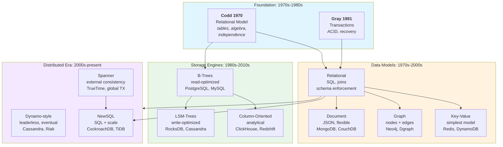

# Databases

How we store, structure, and query data at scale. A database is not merely
a place to put data — it is a system of theoretical guarantees, physical
structures, and design trade-offs that shape everything built on top of it.

## Contents

- [The Big Picture](#the-big-picture)
- [What Is a Database?](#what-is-a-database)
- [Data Models](#data-models)
- [Storage and Retrieval](#storage-and-retrieval)
- [Indexing](#indexing)
- [Transactions](#transactions)
- [Query Languages](#query-languages)
- [OLTP vs OLAP](#oltp-vs-olap)
- [Distributed Databases](#distributed-databases)
- [Timeline](#timeline)
- [Further Reading](#further-reading)
- [Key Authors](#key-authors)
- [Related Topics](#related-topics)

---

## The Big Picture



---

## What Is a Database?

A database is a system that provides:

1. **Structured storage** — data organized according to a model
2. **Query interface** — a language to retrieve and modify data
3. **Durability guarantees** — data survives crashes
4. **Concurrency control** — multiple users operate safely

| Aspect | Filesystem | Database |
|--------|-----------|----------|
| **Structure** | Unstructured bytes | Structured records with schema |
| **Query** | Read/write blocks | Declarative queries (SQL, etc.) |
| **Concurrency** | File locks | Fine-grained transactions |
| **Durability** | Best effort | Guaranteed (WAL, replication) |
| **Integrity** | Application-enforced | Schema + constraints |

The relational model (Codd 1970) showed that data independence — separating
logical structure from physical storage — is the key to building systems
that can evolve without rewriting applications.

---

## Data Models

A data model defines how data is structured, what operations are allowed,
and what guarantees the system provides.

| Model | Structure | Strengths | Weaknesses | Use case |
|-------|-----------|-----------|------------|----------|
| **Relational** | Tables, rows, columns | Mature, joins, strong consistency | Schema rigidity, impedance mismatch | OLTP, reporting |
| **Document** | JSON/XML documents | Flexible schema, locality | Poor joins, denormalisation | Content, catalogs |
| **Graph** | Nodes, edges, properties | Relationship queries | Scaling challenges | Social networks, fraud detection |
| **Key-Value** | Opaque keys to values | Simple, fast, scalable | No query expressiveness | Caching, sessions |
| **Wide-Column** | Column families, sparse rows | Compression, analytical | Complex mental model | Time-series, analytics |
| **Vector** | Embedding vectors | Similarity search | Specialized, rapidly evolving | AI/ML, semantic search |

The relational model remains the default choice for transactional systems
because its mathematical foundation (relational algebra) gives strong
guarantees about query correctness. NoSQL models trade some of those
guarantees for flexibility or scale.

---

## Storage and Retrieval

How data is physically stored determines performance characteristics far
more than the logical data model.

### B-Trees

- In-place updates within fixed-size pages
- Read-optimized: point lookups and range scans are efficient
- Used by: PostgreSQL, MySQL (InnoDB), SQL Server, Oracle

### Log-Structured Merge Trees (LSM)

- Sequential writes to immutable SSTables; compaction merges files over time
- Write-optimized: append-only writes avoid random I/O
- Used by: LevelDB, RocksDB, Cassandra, ScyllaDB

### Column-Oriented

- Store columns separately, not rows
- Aggressive compression; vectorized execution
- Used by: ClickHouse, DuckDB, Redshift (and columnar formats like Parquet)

| Engine | Write pattern | Read pattern | Best for |
|--------|--------------|-------------|----------|
| **B-Tree** | In-place update | Point + range | OLTP, general purpose |
| **LSM** | Sequential append | Range scans | Write-heavy, time-series |
| **Column** | Batch load | Aggregations | OLAP, analytics |

---

## Indexing

Indexes are auxiliary data structures that speed up queries at the cost
of slower writes and additional storage.

| Index type | Structure | Best for | Trade-off |
|-----------|-----------|----------|-----------|
| **B-Tree** | Balanced tree | Range queries, sorting | Write amplification |
| **Hash** | Hash table | Exact match | No range queries |
| **Inverted** | Term to document list | Full-text search | Large index size |
| **Bitmap** | Bit arrays | Low-cardinality columns | CPU-efficient, space trade-off |
| **GiST / GIN** | Generalised search trees | Complex data types (PostgreSQL) | Specialized |

The choice of index depends on the query pattern. A system without the
right index for its workload will perform orders of magnitude worse than
one with it — regardless of hardware.

---

## Transactions

A transaction is a group of operations that must execute as a single unit.
The **ACID** properties guarantee reliability:

| Property | Meaning | How achieved |
|----------|---------|--------------|
| **Atomicity** | All or nothing | Write-ahead logging, rollback |
| **Consistency** | Valid state transitions | Constraints, foreign keys |
| **Isolation** | Concurrent transactions don't interfere | Locking, MVCC |
| **Durability** | Survives crashes | WAL, replication |

ACID was formalised by Jim Gray (1981) and the terminology codified by
Haerder and Reuter (1983).

### Isolation Levels

Not all transactions need the strongest isolation. SQL defines levels that
trade correctness for performance:

| Level | Prevents | Allows | Typical use |
|-------|----------|--------|-------------|
| **Read Uncommitted** | Nothing | Dirty reads | Rarely used |
| **Read Committed** | Dirty reads | Non-repeatable reads | Default in many systems |
| **Snapshot Isolation** | Non-repeatable reads | Write skew | PostgreSQL default |
| **Serializable** | All anomalies | Nothing anomalous | Financial transactions |

### MVCC

**Multi-Version Concurrency Control** gives each transaction a consistent
snapshot of data. Readers don't block writers, and writers don't block
readers — a significant improvement over lock-based systems.

Used by: PostgreSQL, MySQL (InnoDB), SQL Server, Oracle.

For distributed transactions, see [Distributed Systems](../distributed/index.md).

---

## Query Languages

A query language is the interface between human intent and physical storage.

**Declarative** (SQL): describe *what* you want, the engine decides *how*.
```sql
SELECT name, salary FROM employees WHERE department = 'Engineering'
```

**Imperative** (many NoSQL APIs): describe *how* to fetch data step by step.

SQL's power comes from its basis in relational algebra — a formal system
with well-defined semantics. This makes query optimisation possible: the
engine can rewrite a query into a more efficient equivalent plan without
changing the result.

---

## OLTP vs OLAP

Database workloads fall into two broad categories:

| Aspect | OLTP | OLAP |
|--------|------|------|
| **Reads** | Small, by key or range | Large aggregations, scans |
| **Writes** | Frequent, small | Batch loads, infrequent |
| **Data size** | GB to TB | TB to PB |
| **Users** | Thousands | Tens (analysts) |
| **Latency** | Milliseconds | Seconds to minutes |
| **Schema** | Normalised (3NF) | Denormalised, star/snowflake |
| **Typical engines** | B-Tree RDBMS | Column stores, data warehouses |

The storage engine, indexing strategy, and schema design should match the
workload. Using an OLTP system for OLAP queries (or vice versa) leads to
poor performance regardless of hardware.

---

## Distributed Databases

When a single machine cannot hold the data or serve the traffic, databases
must scale across nodes. This introduces the same challenges as distributed
systems in general — but with the additional constraint of preserving data
correctness.

| Challenge | Single-node solution | Distributed solution |
|-----------|---------------------|----------------------|
| **Scale** | Bigger machine | Sharding (partitioning) |
| **Availability** | Backups | Replication |
| **Consensus** | Single writer | Leader election, Paxos/Raft |
| **Consistency** | ACID transactions | CAP trade-offs, consensus |

For full coverage of distributed data — replication, consensus, CAP,
consistency models, and streaming — see [Distributed Systems](../distributed/index.md).

---

## Timeline

| Year | Event | Impact |
|------|-------|--------|
| 1970 | Codd — Relational Model | Foundation of modern databases |
| 1974 | System R (IBM) | First implementation of SQL |
| 1979 | Oracle V2 | One of the first commercial RDBMS |
| 1981 | Gray — Transaction Concept | ACID formalised |
| 1983 | Haerder & Reuter — ACID | Terminology codified |
| 1986 | SQL standard (ANSI) | Interoperability |
| 1989 | PostgreSQL project begins | Open-source advanced RDBMS |
| 1995 | MySQL released | Web-era open-source database |
| 2006 | Google Bigtable paper | Column-family, NoSQL precursor |
| 2007 | Amazon Dynamo paper | Leaderless, eventual consistency |
| 2009 | MongoDB released | Document model mainstream |
| 2008 | Cassandra (Facebook) | Dynamo + Bigtable hybrid |
| 2012 | Google Spanner | Globally distributed SQL |
| 2014 | Amazon Aurora | Cloud-native storage layer |
| 2015 | CockroachDB | Open-source NewSQL |
| 2017 | Kleppmann — DDIA | Synthesis of database theory |

---

## Further Reading

- Codd, E.F. (1970). "A Relational Model of Data for Large Shared Data
  Banks." *Communications of the ACM*, 13(6), 377–387.
- Gray, J. (1981). "The Transaction Concept: Virtues and Limitations."
  *Proceedings of the 7th VLDB Conference*.
- Haerder, T. & Reuter, A. (1983). "Principles of Transaction-Oriented
  Database Recovery." *ACM Computing Surveys*, 15(4), 287–317.
- Gray, J. & Reuter, A. (1993). *Transaction Processing: Concepts and
  Techniques.* Morgan Kaufmann.
- Kleppmann, M. (2017). *Designing Data-Intensive Applications.* O'Reilly.

---

## Key Authors

- [Edgar F. Codd](../../authors/edgar-codd.md) — relational model
- [Jim Gray](../../authors/jim-gray.md) — transactions, ACID
- [Michael Stonebraker](../../authors/michael-stonebraker.md) — PostgreSQL, Ingres, NewSQL
- [Martin Kleppmann](../../authors/martin-kleppmann.md) — DDIA synthesis
- [Eric Brewer](../../authors/eric-brewer.md) — CAP, Dynamo

---

## Related Topics

- [Distributed Systems](../distributed/index.md) — replication, consensus, CAP, consistency models
- [Architecture & Modularity](../architecture/index.md) — data patterns (CQRS, Event Sourcing)
- [Concurrency](../concurrency/index.md) — locking, serialisability
- [Containers & Orchestration](../containers/index.md) — operational substrate for stateful workloads
- [Process](../process/index.md) — CI/CD for schema changes
