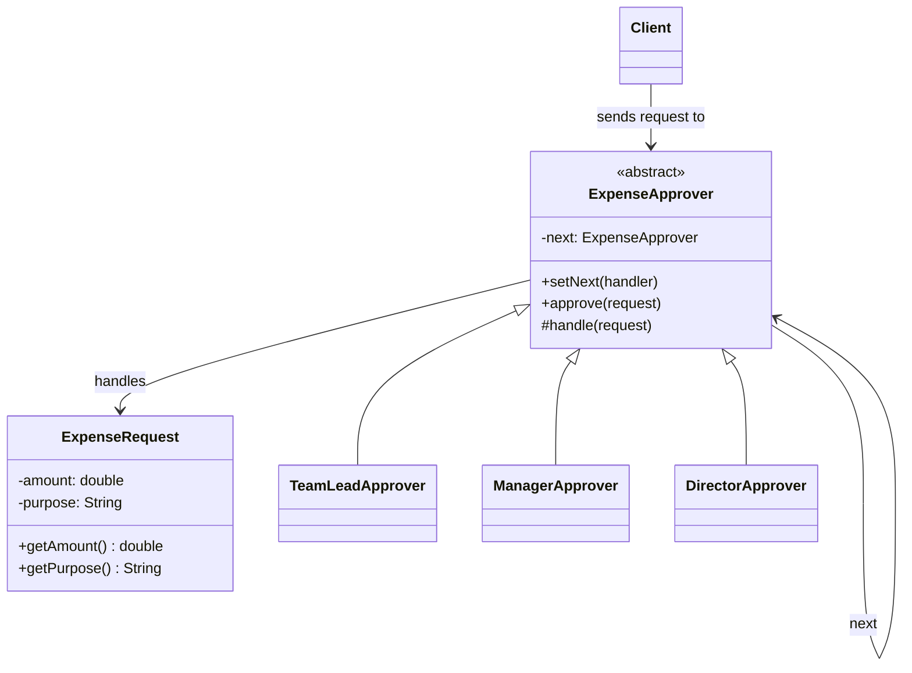
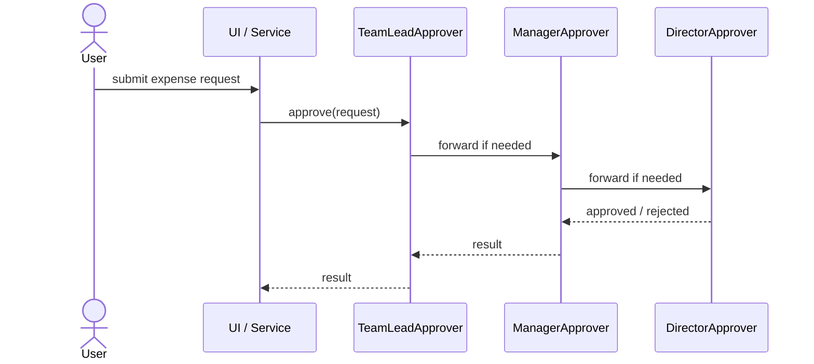

# Chain of Responsibility

**Group:** Behavioral  
**Source:** GoF — *Design Patterns: Elements of Reusable Object-Oriented Software* (1994)

> Avoid coupling the sender of a request to its receiver by giving more than one object a chance to handle the request.

---

## Contents

1. [What it does](#what-it-does)
2. [How it works](#how-it-works)
3. [Class Diagram](#class-diagram)
4. [Sequence Diagram](#sequence-diagram)
5. [Example](#example)
6. [Typical Use](#typical-use)
7. [See Also](#see-also)

---

## What it does

The **Chain of Responsibility** pattern lets you pass a request through a chain of handlers until one of them handles it.

Instead of hard-coding a single receiver, the sender only knows the chain entry point. Each handler decides:

- whether it can process the request,
- whether to handle it and stop,
- or whether to pass it to the next handler.

This is useful when:

- multiple objects may handle a request,
- the exact handler is not known in advance,
- you want to decouple sender and receiver.

In this example, an expense approval request goes through several approval levels:

- `TeamLeadApprover`
- `ManagerApprover`
- `DirectorApprover`

---

## How it works

| Part | Role |
|------|------|
| `ExpenseApprover` | Abstract handler that stores the next handler |
| `TeamLeadApprover`, `ManagerApprover`, `DirectorApprover` | Concrete handlers |
| `ExpenseRequest` | Request object |
| Client | Sends the request to the first handler in the chain |

Typical flow:

1. The client creates a request.
2. The client sends it to the first handler.
3. If the handler cannot approve it, it forwards the request.
4. The chain continues until one handler approves it or the request reaches the end.

---

## Class Diagram



---

## Sequence Diagram

Example: a request travels through the chain until a handler approves it.



---

## Example

A Java implementation of the Chain of Responsibility pattern for expense approvals.

```java
class ExpenseRequest {
    private final double amount;
    private final String purpose;

    ExpenseRequest(double amount, String purpose) {
        this.amount = amount;
        this.purpose = purpose;
    }

    public double getAmount() {
        return amount;
    }

    public String getPurpose() {
        return purpose;
    }
}

abstract class ExpenseApprover {
    private ExpenseApprover next;

    public ExpenseApprover setNext(ExpenseApprover next) {
        this.next = next;
        return next;
    }

    public final void approve(ExpenseRequest request) {
        if (!handle(request) && next != null) {
            next.approve(request);
        }
    }

    protected abstract boolean handle(ExpenseRequest request);
}

class TeamLeadApprover extends ExpenseApprover {
    @Override
    protected boolean handle(ExpenseRequest request) {
        if (request.getAmount() <= 100) {
            System.out.println("Team lead approved: " + request.getPurpose());
            return true;
        }
        return false;
    }
}

class ManagerApprover extends ExpenseApprover {
    @Override
    protected boolean handle(ExpenseRequest request) {
        if (request.getAmount() <= 1000) {
            System.out.println("Manager approved: " + request.getPurpose());
            return true;
        }
        return false;
    }
}

class DirectorApprover extends ExpenseApprover {
    @Override
    protected boolean handle(ExpenseRequest request) {
        if (request.getAmount() <= 5000) {
            System.out.println("Director approved: " + request.getPurpose());
            return true;
        }
        System.out.println("Request rejected: " + request.getPurpose());
        return true;
    }
}
```

Usage:

```java
ExpenseApprover chain = new TeamLeadApprover();
chain.setNext(new ManagerApprover())
     .setNext(new DirectorApprover());

chain.approve(new ExpenseRequest(250, "Conference travel"));
chain.approve(new ExpenseRequest(6000, "Office renovation"));
```

---

## Typical Use

| Property | Value |
|----------|-------|
| **Use case** | Approval workflows, logging pipelines, UI event handling, middleware |
| **Language** | Java |
| **Description** | A request is passed through a chain of handlers until one of them processes it. The sender does not know which handler will handle the request. |

---

## See Also

- [Composite](../structural/composite.md)
- [Command](../behavioral/command.md)
