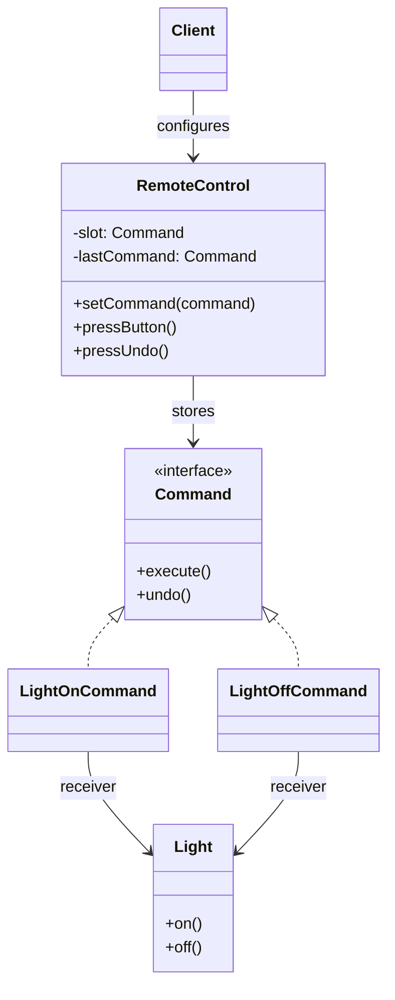
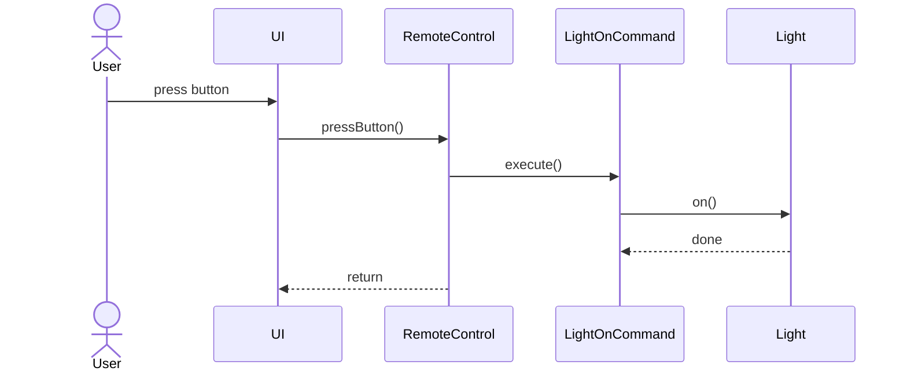

# Command

**Group:** Behavioral  
**Source:** GoF — *Design Patterns: Elements of Reusable Object-Oriented Software* (1994)

> Encapsulate a request as an object, thereby letting you parameterize clients with different requests.

---

## Contents

1. [What it does](#what-it-does)
2. [How it works](#how-it-works)
3. [Class Diagram](#class-diagram)
4. [Sequence Diagram](#sequence-diagram)
5. [Example](#example)
6. [Typical Use](#typical-use)
7. [See Also](#see-also)

---

## What it does

The **Command** pattern turns a request into an object.

Instead of calling a method directly, the client creates a command object and gives it to an invoker. The invoker can then:

- execute it later,
- queue it,
- log it,
- undo it,
- or combine it with other commands.

This is useful when you want to decouple:

- the object that sends the request,
- the object that performs the work.

In this example, a remote control sends commands to a light.

---

## How it works

| Part | Role |
|------|------|
| `Command` | Command interface with `execute()` and optionally `undo()` |
| `LightOnCommand`, `LightOffCommand` | Concrete command objects |
| `Light` | Receiver that performs the actual work |
| `RemoteControl` | Invoker that stores and triggers commands |
| Client | Configures commands and assigns them to the invoker |

Typical flow:

1. The client creates a receiver.
2. The client creates command objects that wrap the receiver.
3. The client assigns commands to the invoker.
4. The invoker triggers `execute()` without knowing implementation details.

---

## Class Diagram



---

## Sequence Diagram

Example: the user presses a remote button.



---

## Example

A Java implementation of the Command pattern with undo support.

```java
interface Command {
    void execute();
    void undo();
}

class Light {
    public void on() {
        System.out.println("Light is ON");
    }

    public void off() {
        System.out.println("Light is OFF");
    }
}

class LightOnCommand implements Command {
    private final Light light;

    LightOnCommand(Light light) {
        this.light = light;
    }

    @Override
    public void execute() {
        light.on();
    }

    @Override
    public void undo() {
        light.off();
    }
}

class LightOffCommand implements Command {
    private final Light light;

    LightOffCommand(Light light) {
        this.light = light;
    }

    @Override
    public void execute() {
        light.off();
    }

    @Override
    public void undo() {
        light.on();
    }
}

class RemoteControl {
    private Command command;
    private Command lastCommand = new NoCommand();

    public void setCommand(Command command) {
        this.command = command;
    }

    public void pressButton() {
        if (command != null) {
            command.execute();
            lastCommand = command;
        }
    }

    public void pressUndo() {
        lastCommand.undo();
    }

    private static class NoCommand implements Command {
        @Override public void execute() {}
        @Override public void undo() {}
    }
}
```

Usage:

```java
Light light = new Light();

RemoteControl remote = new RemoteControl();
remote.setCommand(new LightOnCommand(light));
remote.pressButton(); // Light is ON

remote.pressUndo();    // Light is OFF

remote.setCommand(new LightOffCommand(light));
remote.pressButton();  // Light is OFF
```

---

## Typical Use

| Property | Value |
|----------|-------|
| **Use case** | GUI buttons, menus, task queues, macros, undo/redo |
| **Language** | Java |
| **Description** | A request is wrapped in a command object, which can be passed around and executed later by an invoker. |

---

## See Also

- [Composite](../structural/composite.md)
- [Memento](../behavioral/memento.md)
- [Prototype](../creational/prototype.md)
