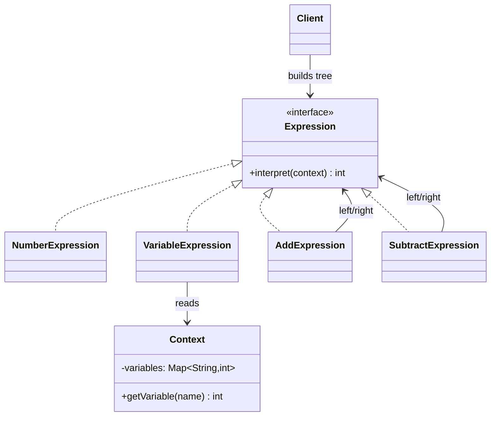
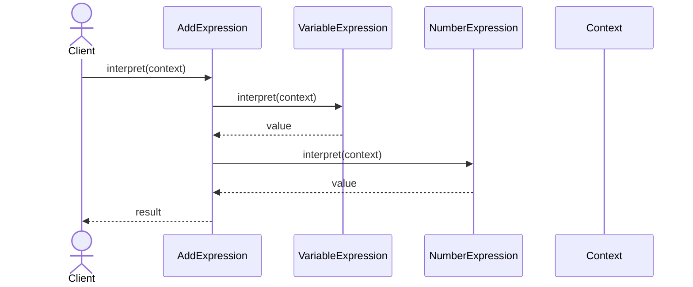

# Interpreter

**Group:** Behavioral  
**Source:** GoF — *Design Patterns: Elements of Reusable Object-Oriented Software* (1994)

> Given a language, define a representation for its grammar along with an interpreter that uses the representation to interpret sentences in the language.

---

## Contents

1. [What it does](#what-it-does)
2. [How it works](#how-it-works)
3. [Class Diagram](#class-diagram)
4. [Sequence Diagram](#sequence-diagram)
5. [Example](#example)
6. [Typical Use](#typical-use)
7. [See Also](#see-also)

---

## What it does

The **Interpreter** pattern defines a grammar for a simple language and provides classes that interpret expressions in that language.

It is usually used for small languages, rules, or expression trees. Each grammar rule becomes a class. Expressions are composed recursively, so the object structure mirrors the language grammar.

This pattern is useful when:

- the grammar is simple and stable,
- you want to model it explicitly in code,
- you need to evaluate expressions repeatedly.

In this example, arithmetic expressions are built as an object tree and interpreted against a context of variables.

---

## How it works

| Part | Role |
|------|------|
| `Expression` | Abstract expression interface |
| `NumberExpression`, `VariableExpression` | Terminal expressions |
| `AddExpression`, `SubtractExpression` | Non-terminal expressions |
| `Context` | Holds variable values |
| Client | Builds the expression tree and asks it to interpret itself |

Typical flow:

1. The client creates terminal and non-terminal expressions.
2. The expressions are composed into a tree.
3. The root expression interprets itself recursively.
4. Terminal expressions return values, while non-terminal expressions combine results.

---

## Class Diagram



---

## Sequence Diagram

Example: the client interprets an expression tree.



---

## Example

A Java implementation of the Interpreter pattern for simple arithmetic expressions.

```java
import java.util.Map;

interface Expression {
    int interpret(Context context);
}

class Context {
    private final Map<String, Integer> variables;

    Context(Map<String, Integer> variables) {
        this.variables = variables;
    }

    public int getVariable(String name) {
        return variables.getOrDefault(name, 0);
    }
}

class NumberExpression implements Expression {
    private final int value;

    NumberExpression(int value) {
        this.value = value;
    }

    @Override
    public int interpret(Context context) {
        return value;
    }
}

class VariableExpression implements Expression {
    private final String name;

    VariableExpression(String name) {
        this.name = name;
    }

    @Override
    public int interpret(Context context) {
        return context.getVariable(name);
    }
}

class AddExpression implements Expression {
    private final Expression left;
    private final Expression right;

    AddExpression(Expression left, Expression right) {
        this.left = left;
        this.right = right;
    }

    @Override
    public int interpret(Context context) {
        return left.interpret(context) + right.interpret(context);
    }
}

class SubtractExpression implements Expression {
    private final Expression left;
    private final Expression right;

    SubtractExpression(Expression left, Expression right) {
        this.left = left;
        this.right = right;
    }

    @Override
    public int interpret(Context context) {
        return left.interpret(context) - right.interpret(context);
    }
}
```

Usage:

```java
Context context = new Context(Map.of(
    "x", 10,
    "y", 5
));

Expression expression =
    new SubtractExpression(
        new AddExpression(
            new VariableExpression("x"),
            new NumberExpression(3)
        ),
        new VariableExpression("y")
    );

int result = expression.interpret(context); // 8
System.out.println(result);
```

---

## Typical Use

| Property | Value |
|----------|-------|
| **Use case** | Rule engines, mini-languages, formulas, expression evaluation |
| **Language** | Java |
| **Description** | A grammar is represented by a tree of expression objects, and the tree interprets itself against a context. |

---

## See Also

- [Composite](../structural/composite.md)
- [Flyweight](../structural/flyweight.md)
- [Visitor](../behavioral/visitor.md)
