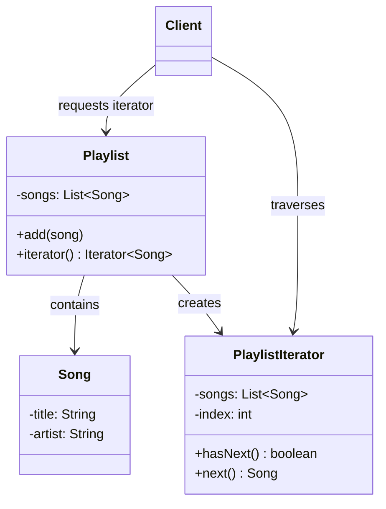
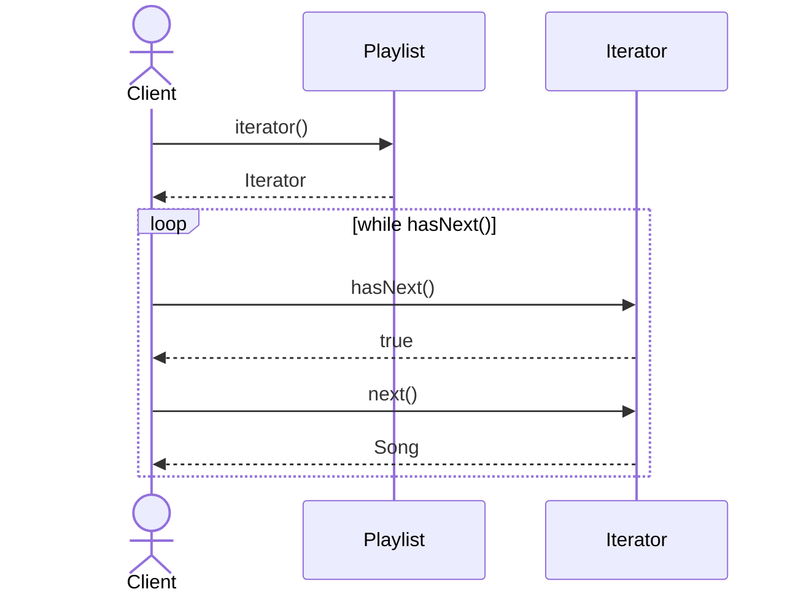

# Iterator

**Group:** Behavioral  
**Source:** GoF — *Design Patterns: Elements of Reusable Object-Oriented Software* (1994)

> Provide a way to access the elements of an aggregate object sequentially without exposing its underlying representation.

---

## Contents

1. [What it does](#what-it-does)
2. [How it works](#how-it-works)
3. [Class Diagram](#class-diagram)
4. [Sequence Diagram](#sequence-diagram)
5. [Example](#example)
6. [Typical Use](#typical-use)
7. [See Also](#see-also)

---

## What it does

The **Iterator** pattern lets you traverse a collection without exposing how that collection is stored internally.

The client asks the collection for an iterator and then uses a standard traversal API:

- `hasNext()`
- `next()`

This is useful when:

- the collection structure should remain hidden,
- you want different traversal strategies,
- you need to separate traversal logic from collection logic.

In Java, `Iterator` and `Iterable` are built into the language and standard library.

---

## How it works

| Part | Role |
|------|------|
| `Iterable` / aggregate | Collection that can create an iterator |
| `Iterator` | Traversal interface |
| `PlaylistIterator` | Concrete iterator |
| `Playlist` | Concrete aggregate |
| Client | Uses the iterator to process elements sequentially |

Typical flow:

1. The client requests an iterator from the aggregate.
2. The iterator tracks the current position.
3. The client repeatedly calls `hasNext()` and `next()`.
4. The collection internals remain hidden.

---

## Class Diagram



---

## Sequence Diagram

Example: the client traverses a playlist.



---

## Example

A Java implementation of the Iterator pattern with a custom playlist.

```java
import java.util.ArrayList;
import java.util.Iterator;
import java.util.List;

class Song {
    private final String title;
    private final String artist;

    Song(String title, String artist) {
        this.title = title;
        this.artist = artist;
    }

    public String getTitle() {
        return title;
    }

    public String getArtist() {
        return artist;
    }
}

class Playlist implements Iterable<Song> {
    private final List<Song> songs = new ArrayList<>();

    public void add(Song song) {
        songs.add(song);
    }

    @Override
    public Iterator<Song> iterator() {
        return new PlaylistIterator(songs);
    }
}

class PlaylistIterator implements Iterator<Song> {
    private final List<Song> songs;
    private int index = 0;

    PlaylistIterator(List<Song> songs) {
        this.songs = songs;
    }

    @Override
    public boolean hasNext() {
        return index < songs.size();
    }

    @Override
    public Song next() {
        return songs.get(index++);
    }
}
```

Usage:

```java
Playlist playlist = new Playlist();
playlist.add(new Song("Imagine", "John Lennon"));
playlist.add(new Song("Billie Jean", "Michael Jackson"));

for (Song song : playlist) {
    System.out.println(song.getTitle() + " - " + song.getArtist());
}
```

---

## Typical Use

| Property | Value |
|----------|-------|
| **Use case** | Collections, streams, tree traversal, custom data structures |
| **Language** | Java |
| **Description** | The aggregate exposes a standard way to traverse its elements while keeping the internal representation hidden. |

---

## See Also

- [Composite](../structural/composite.md)
- [Memento](../behavioral/memento.md)
- [Visitor](../behavioral/visitor.md)
