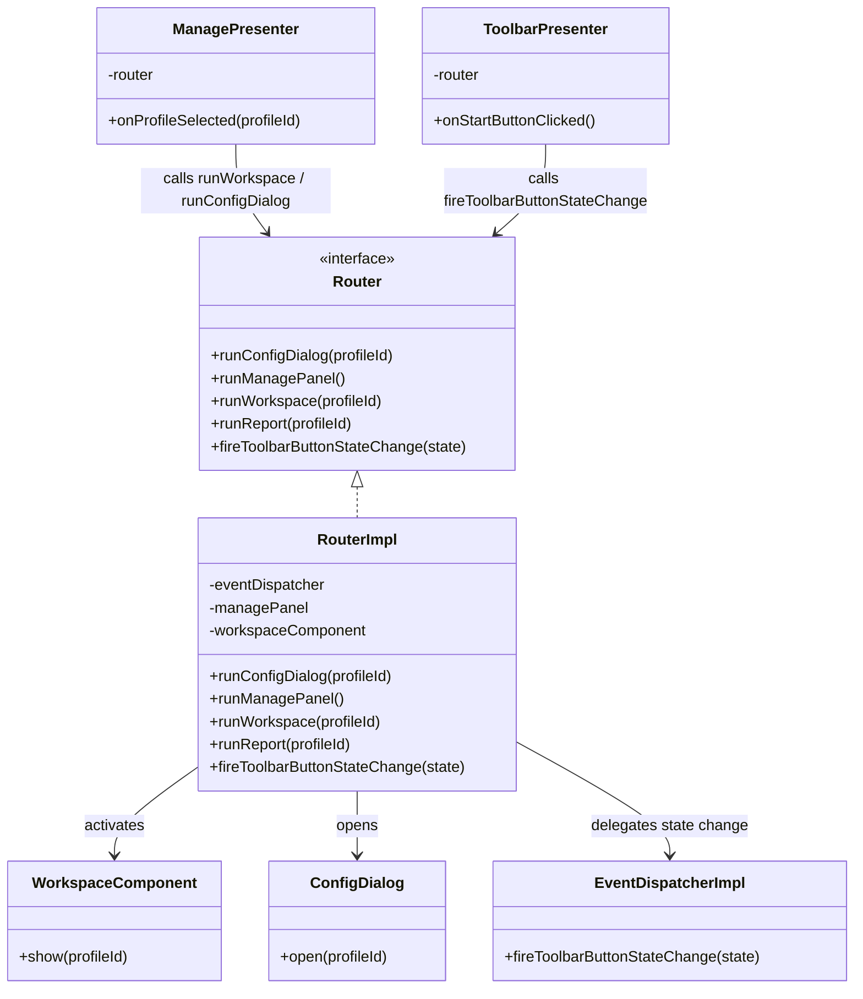
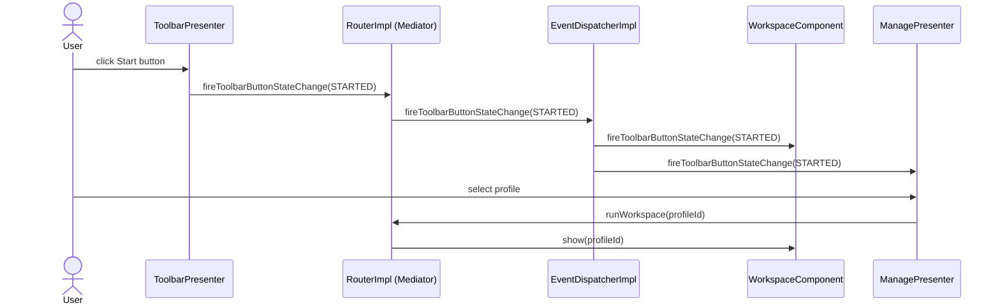

# Mediator

**Group:** Behavioral  
**Source:** GoF — *Design Patterns: Elements of Reusable Object-Oriented Software* (1994)

> Define an object that encapsulates how a set of objects interact. Mediator promotes loose coupling by keeping objects from referring to each other explicitly, and it lets you vary their interaction independently.

---

## Contents

1. [What it does](#what-it-does)
2. [How it works](#how-it-works)
3. [Class Diagram](#class-diagram)
4. [Sequence Diagram](#sequence-diagram)
5. [Example](#example)
6. [Key Files](#key-files)
7. [Examples](#examples)
8. [See Also](#see-also)

---

## What it does

`RouterImpl` acts as the central mediator in Dimension UI. UI components — panels, toolbars, dialogs — do not communicate with each other directly. Instead, every navigation action, dialog request, or state transition is routed through `Router` / `RouterImpl`.

This keeps individual UI components decoupled: a panel that wants to open a config dialog simply calls the router; it has no knowledge of which component will handle the request or how it will be rendered.

---

## How it works

The mediator role is split into two parts:

| Part | Role |
|------|------|
| `Router` | Interface that defines all coordination operations available to components |
| `RouterImpl` | Concrete mediator: receives calls from components, decides what to do, and invokes the appropriate participants |

Participants (panels, presenters) only hold a reference to `Router`. They never reference each other directly.

---

## Class Diagram



---

## Sequence Diagram



---

## Example

```java
// A component holds only the Router interface — no knowledge of other components
public class ManagePresenter {
    private final Router router;

    @Inject
    public ManagePresenter(Router router) {
        this.router = router;
    }

    public void onProfileSelected(int profileId) {
        router.runWorkspace(profileId);
    }

    public void onConfigRequested(int profileId) {
        router.runConfigDialog(profileId);
    }
}
```

```java
// RouterImpl decides what to do and coordinates the actual participants
@Override
public void runWorkspace(int profileId) {
    workspaceComponent.show(profileId);
}

@Override
public void fireToolbarButtonStateChange(ToolbarButtonState state) {
    eventDispatcher.fireToolbarButtonStateChange(state);
}
```

---

## Key Files

| Role | File |
|------|------|
| Mediator interface | `desktop/src/main/java/ru/dimension/ui/router/Router.java` |
| Concrete mediator | `desktop/src/main/java/ru/dimension/ui/router/RouterImpl.java` |
| Participant (caller) | `desktop/src/main/java/ru/dimension/ui/component/manage/ManagePresenter.java` |
| Participant (caller) | `desktop/src/main/java/ru/dimension/ui/view/BaseFrame.java` |
| Participant (target) | `desktop/src/main/java/ru/dimension/ui/component/WorkspaceComponent.java` |
| Participant (target) | `desktop/src/main/java/ru/dimension/ui/router/event/EventDispatcherImpl.java` |

---

## Examples

| Property | Value |
|----------|-------|
| **Application** | [Dimension UI](https://github.com/akardapolov/dimension-ui) |
| **Language** | Java |
| **Description** | Desktop application for real-time collection and visualization of time series data. `RouterImpl` acts as a central mediator: all navigation requests, dialog openings, and toolbar state transitions pass through `Router`, keeping individual UI components fully decoupled from one another. |

> All code snippets in this document are taken directly from the Dimension UI source code.  
> Additional examples in other languages will be added here as the documentation evolves.

---

## See Also

- [Facade](../structural/facade.md)
- [Observer](../behavioral/observer.md)
