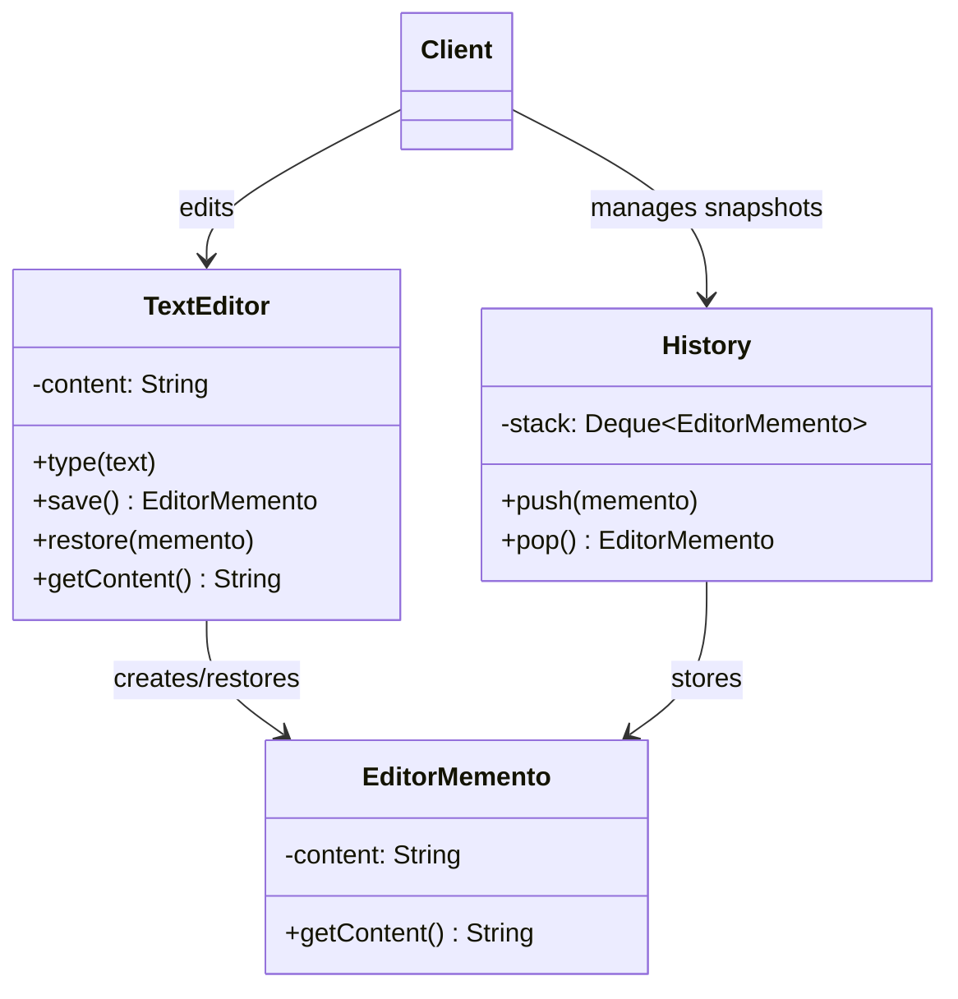
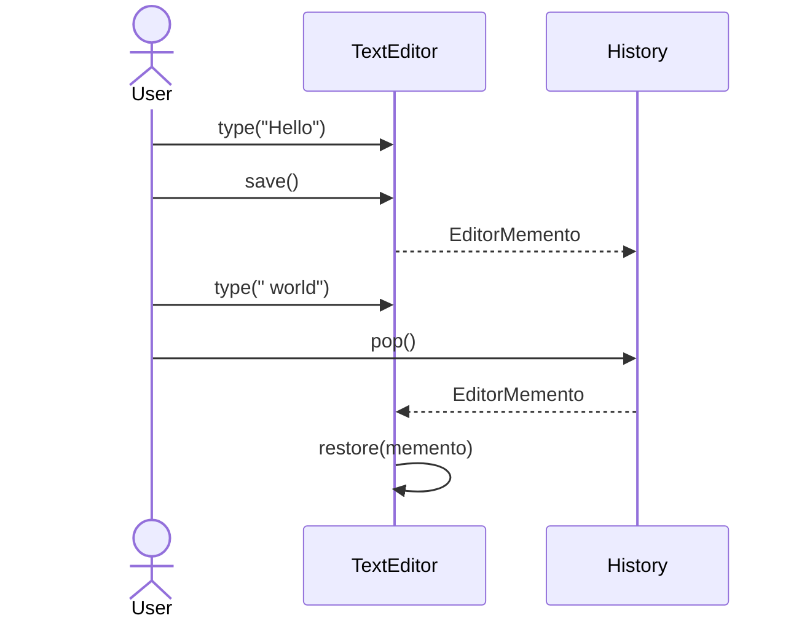

# Memento

**Group:** Behavioral  
**Source:** GoF — *Design Patterns: Elements of Reusable Object-Oriented Software* (1994)

> Without violating encapsulation, capture and externalize an object's internal state so that the object can be restored to this state later.

---

## Contents

1. [What it does](#what-it-does)
2. [How it works](#how-it-works)
3. [Class Diagram](#class-diagram)
4. [Sequence Diagram](#sequence-diagram)
5. [Example](#example)
6. [Typical Use](#typical-use)
7. [See Also](#see-also)

---

## What it does

The **Memento** pattern captures an object's internal state and stores it externally so the object can be restored later.

It is commonly used for:

- undo/redo,
- snapshots,
- rollback,
- checkpoints.

The key idea is that the object whose state is saved does not expose its internal representation to other objects.

In this example, a text editor can save and restore content snapshots.

---

## How it works

| Part | Role |
|------|------|
| `TextEditor` | Originator that creates and restores snapshots |
| `EditorMemento` | Snapshot object storing internal state |
| `History` | Caretaker that keeps mementos |
| Client | Requests save/undo operations |

Typical flow:

1. The originator creates a memento with its current state.
2. The caretaker stores the memento.
3. Later, the originator restores its state from a memento.
4. The saved state is applied without exposing internals.

---

## Class Diagram



---

## Sequence Diagram

Example: the user edits text, saves a snapshot, then undoes the change.



---

## Example

A Java implementation of the Memento pattern for a text editor.

```java
import java.util.ArrayDeque;
import java.util.Deque;

class TextEditor {
    private String content = "";

    public void type(String text) {
        content += text;
    }

    public String getContent() {
        return content;
    }

    public EditorMemento save() {
        return new EditorMemento(content);
    }

    public void restore(EditorMemento memento) {
        this.content = memento.getContent();
    }
}

final class EditorMemento {
    private final String content;

    EditorMemento(String content) {
        this.content = content;
    }

    public String getContent() {
        return content;
    }
}

class History {
    private final Deque<EditorMemento> stack = new ArrayDeque<>();

    public void push(EditorMemento memento) {
        stack.push(memento);
    }

    public EditorMemento pop() {
        return stack.pop();
    }

    public boolean isEmpty() {
        return stack.isEmpty();
    }
}
```

Usage:

```java
TextEditor editor = new TextEditor();
History history = new History();

editor.type("Hello");
history.push(editor.save());

editor.type(" world");
System.out.println(editor.getContent()); // Hello world

editor.restore(history.pop());
System.out.println(editor.getContent()); // Hello
```

---

## Typical Use

| Property | Value |
|----------|-------|
| **Use case** | Undo/redo, snapshots, rollback, form state restoration |
| **Language** | Java |
| **Description** | The originator stores snapshots of its internal state in memento objects so it can be restored later without exposing its internals. |

---

## See Also

- [Command](../behavioral/command.md)
- [Iterator](../behavioral/iterator.md)
