# Observer

**Group:** Behavioral
**Source:** GoF — *Design Patterns: Elements of Reusable Object-Oriented Software* (1994)

> Define a one-to-many dependency between objects so that when one object changes state, all its dependents are notified and updated automatically.

---

## Contents

1. [Observer, Listener, Subscriber](#observer-listener-subscriber)
2. [Why the project has multiple observer-like implementations](#why-the-project-has-multiple-observer-like-implementations)
3. [`IDetailPanel` — direct callback listener](#1-idetailpanel--direct-callback-listener)
4. [`MessageBroker` — keyed message bus / pub-sub](#2-messagebroker--keyed-message-bus--pub-sub)
5. [`EventDispatcher` — typed composite observer / dispatcher](#3-eventdispatcher--typed-composite-observer--dispatcher)
6. [`EventBus` — annotation-driven async message bus](#4-eventbus--annotation-driven-async-message-bus)
7. [Quick comparison](#quick-comparison)
8. [When to use which](#when-to-use-which)
9. [Schema](#schema)
10. [Examples](#examples)
11. [See Also](#see-also)

---

## Observer, Listener, Subscriber

In practice these terms are related, but not identical:

| Term           | General meaning                                                                       | Meaning in Dimension UI                                                           | Example                                                       |
|----------------|---------------------------------------------------------------------------------------|-----------------------------------------------------------------------------------|---------------------------------------------------------------|
| **Observer**   | Generic role in the pattern: a dependent object that gets notified when state changes | Umbrella term for all notification mechanisms in the codebase                     | `IDetailPanel`, `EventDispatcherImpl`, `MessageBroker`, `EventBus` |
| **Listener**   | Callback interface for events, usually in UI/event-driven code                        | Direct method invocation from a subject to registered handlers                    | `IDetailPanel`, `ToolbarListener`, `CollectStartStopListener` |
| **Subscriber** | Consumer of messages in a broker / pub-sub system                                     | Registered receiver addressed through `Destination` and routed by `MessageBroker`; or any object with `@Handler` methods registered in `EventBus` | `ChartsPresenter`, `TaskButtonPanelHandler` |

> In this codebase the terms are sometimes used interchangeably, but technically they describe different communication styles.

## Why the project has multiple observer-like implementations

The codebase uses four communication styles that all follow the same high-level idea — one side notifies many dependents — but solve different problems:

| Problem                                                                     | Pattern in project                                 | Why it fits                                       |
|-----------------------------------------------------------------------------|----------------------------------------------------|---------------------------------------------------|
| A chart selection must notify a small set of detail panels                  | **Direct callback listener** (`IDetailPanel`)      | Simple, fast, low overhead                        |
| Decoupled UI modules exchange typed commands                                | **Message broker** (`MessageBroker`)               | Reduces coupling between modules                  |
| Application-wide state/lifecycle events must reach heterogeneous components | **Typed composite dispatcher** (`EventDispatcher`) | Supports multiple event types and keyed listeners |
| Cross-layer domain events must be delivered without coupling publisher to subscriber | **Async message bus** (`EventBus`)          | Zero coupling, annotation-driven, async-capable   |

---

## 1. `IDetailPanel` — direct callback listener

### What it does
When a user completes a mouse drag on a chart, the chart notifies all registered `IDetailPanel` observers with the selected time range.

This is the simplest form of observer-style communication in the project:
- one subject,
- a small set of listeners,
- one callback method: `loadDataToDetail(begin, end)`.

### Class Diagram

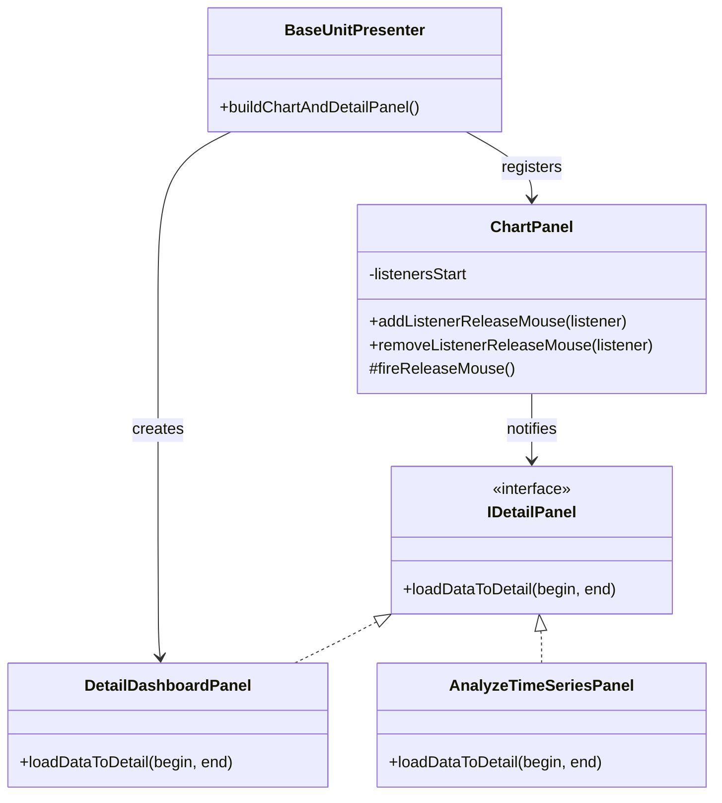

### Sequence Diagram

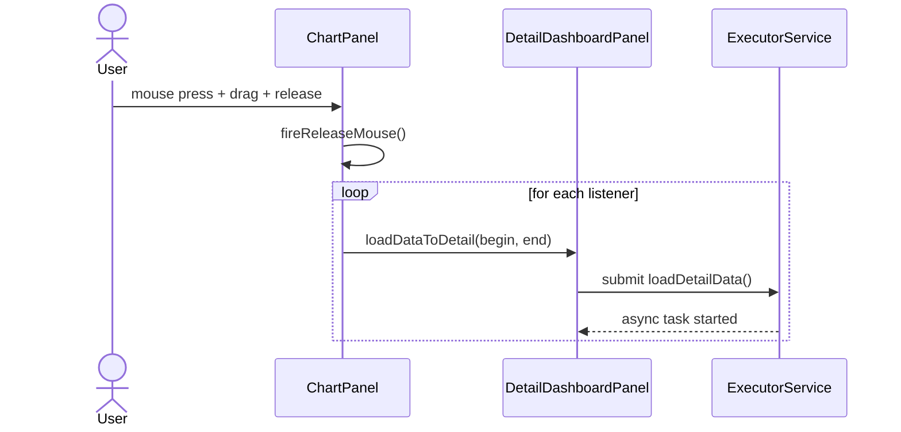

### Example

```java
chartPanel.addListenerReleaseMouse(detailDashboardPanel);
chartPanel.addListenerReleaseMouse(analyzeTimeSeriesPanel);
```

```java
@Override
public void loadDataToDetail(Date begin, Date end) {
    executorService.submit(() -> loadDetailData(begin, end));
}
```

### Key Files

| Role | File |
|------|------|
| Observer interface | `jfreechart-fse/src/main/java/org/jfree/chart/util/IDetailPanel.java` |
| Subject | `jfreechart-fse/src/main/java/org/jfree/chart/ChartPanel.java` |
| Concrete observer | `desktop/src/main/java/ru/dimension/ui/view/detail/DetailDashboardPanel.java` |
| Concrete observer | `desktop/src/main/java/ru/dimension/ui/component/module/analyze/AnalyzeTimeSeriesPanel.java` |
| Registration | `desktop/src/main/java/ru/dimension/ui/component/module/base/BaseUnitPresenter.java` |

---

## 2. `MessageBroker` — keyed message bus / pub-sub

### What it does
`MessageBroker` routes typed messages between components using a composite `Destination` address:
- Component
- Module
- Panel
- Block
- ChartKey

Publishers send messages, subscribers implement `MessageAction` and register for a specific destination.

Important detail: routing is based on **exact key match** in a `ConcurrentHashMap`.
There is **no hierarchical matching** and **no partial routing**.

### Class Diagram

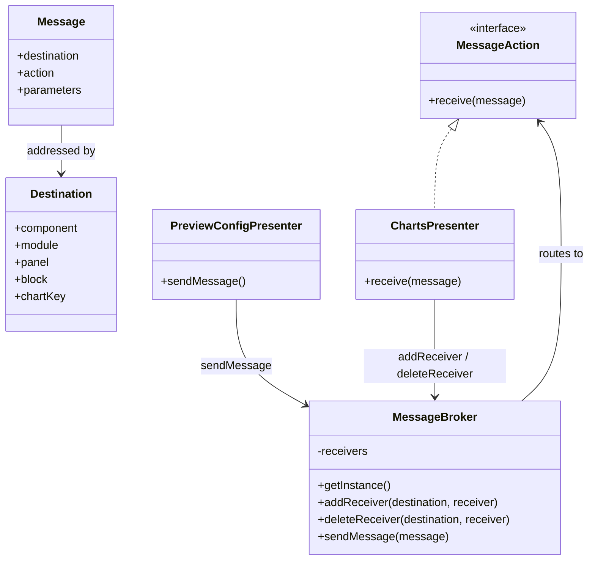

### Sequence Diagram

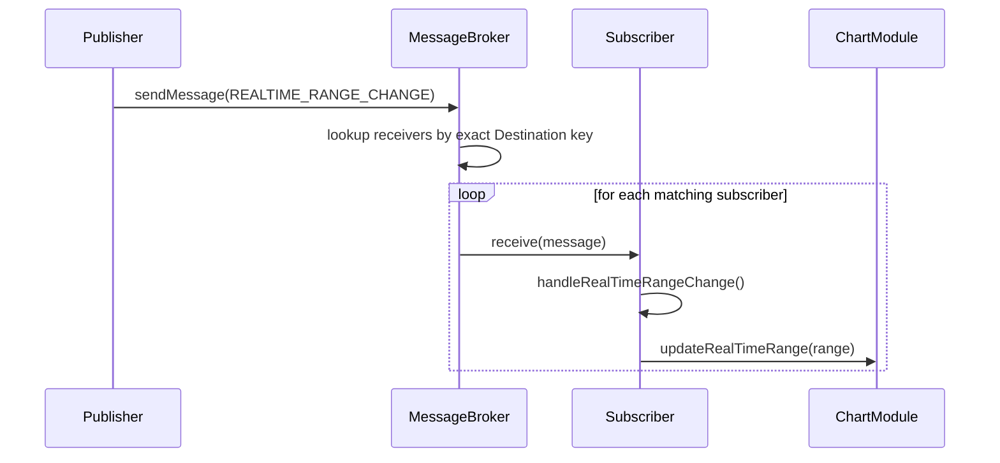

### Example

```java
MessageBroker broker = MessageBroker.getInstance();
broker.addReceiver(destination, chartsPresenter);
broker.sendMessage(message);
```

```java
@Override
public void receive(Message message) {
    if (message.getAction() == MessageActionType.REALTIME_RANGE_CHANGE) {
        handleRealTimeRangeChange(message);
    }
}
```

### Key Files

| Role | File |
|------|------|
| Observer interface | `desktop/src/main/java/ru/dimension/ui/component/broker/MessageAction.java` |
| Subject | `desktop/src/main/java/ru/dimension/ui/component/broker/MessageBroker.java` |
| Message payload | `desktop/src/main/java/ru/dimension/ui/component/broker/Message.java` |
| Routing address | `desktop/src/main/java/ru/dimension/ui/component/broker/Destination.java` |
| Subscriber example | `desktop/src/main/java/ru/dimension/ui/component/module/charts/ChartsPresenter.java` |
| Publisher example | `desktop/src/main/java/ru/dimension/ui/component/module/preview/config/PreviewConfigPresenter.java` |

---

## 3. `EventDispatcher` — typed composite observer / dispatcher

### What it does
`EventDispatcher` is a composite interface that groups multiple strongly typed listener interfaces under one dispatcher.

Instead of one generic callback type, the project uses several event-specific interfaces such as:
- `ToolbarListener`
- `ConfigListener`
- `CollectStartStopListener`
- `ProfileStartStopListener`

The implementation stores:
- simple listeners in `CopyOnWriteArrayList`
- context-specific listeners in `ConcurrentHashMap<ProfileTaskQueryKey, ...>`

This makes it a **typed dispatcher** rather than a single classic observer interface.

### Class Diagram

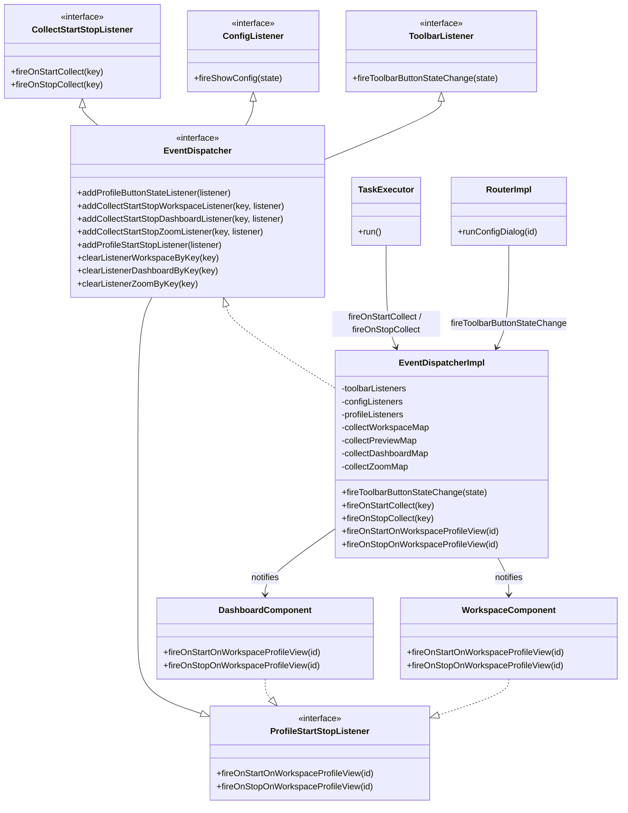

### Sequence Diagram — Collect Lifecycle

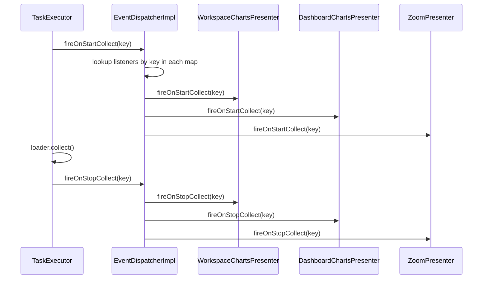

### Sequence Diagram — Profile Start

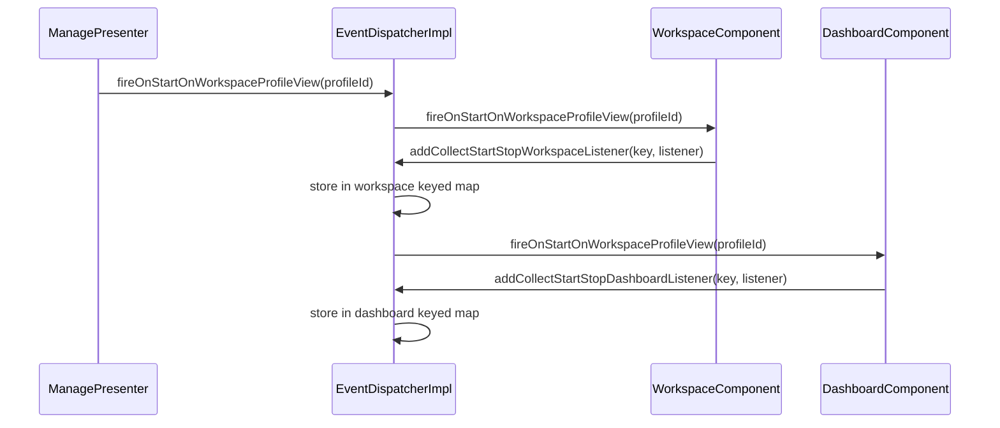

### Example

```java
eventDispatcher.addProfileStartStopListener(workspaceComponent);
eventDispatcher.addCollectStartStopWorkspaceListener(key, workspaceChartsPresenter);
eventDispatcher.addCollectStartStopDashboardListener(key, dashboardChartsPresenter);
```

```java
eventDispatcher.fireOnStartCollect(key);
eventDispatcher.fireOnStopCollect(key);
```

### Key Files

| Role | File |
|------|------|
| Composite interface | `desktop/src/main/java/ru/dimension/ui/router/event/EventDispatcher.java` |
| Subject implementation | `desktop/src/main/java/ru/dimension/ui/router/event/EventDispatcherImpl.java` |
| Sub-interface (collect) | `desktop/src/main/java/ru/dimension/ui/router/listener/CollectStartStopListener.java` |
| Sub-interface (profile) | `desktop/src/main/java/ru/dimension/ui/router/listener/ProfileStartStopListener.java` |
| Sub-interface (toolbar) | `desktop/src/main/java/ru/dimension/ui/router/listener/ToolbarListener.java` |
| Sub-interface (config) | `desktop/src/main/java/ru/dimension/ui/router/listener/ConfigListener.java` |
| Registration (workspace) | `desktop/src/main/java/ru/dimension/ui/component/WorkspaceComponent.java` |
| Registration (dashboard) | `desktop/src/main/java/ru/dimension/ui/component/DashboardComponent.java` |
| Registration (frame) | `desktop/src/main/java/ru/dimension/ui/view/BaseFrame.java` |
| Firing (collect) | `desktop/src/main/java/ru/dimension/ui/executor/TaskExecutor.java` |
| Firing (UI state) | `desktop/src/main/java/ru/dimension/ui/router/RouterImpl.java` |

---

## 4. `EventBus` — annotation-driven async message bus

### What it does

`EventBus` is the most decoupled notification mechanism in the project. It wraps **MBassador** — a high-performance Java message bus — behind a clean application interface.

Publishers call `eventBus.publish(event)` with a plain event object (a Java record or POJO).  
Subscribers annotate their handler methods with `@Handler` and register themselves by calling `eventBus.subscribe(this)`.  
Neither side holds a reference to the other; the bus resolves the relationship at runtime.

This is a pure **publish/subscribe** pattern:
- zero coupling between publisher and subscriber,
- event types serve as the sole routing key,
- delivery can be synchronous or asynchronous depending on MBassador configuration.

Three delivery modes are enabled simultaneously in `EventBusImpl`:
- `SyncPubSub` — synchronous delivery on the publishing thread,
- `AsynchronousHandlerInvocation` — handler runs in a separate thread,
- `AsynchronousMessageDispatch` — dispatch itself happens off the publishing thread.

### How `EventRouteRegistry` extends the pattern

For components that receive several different event types but belong to a specific UI context (a named `MessageBroker.Component`), the project provides `EventRouteRegistry` as a helper.

`EventRouteRegistry` is itself registered as a single `@Handler` subscriber, but it internally maintains a map of event types to handler lambdas. It also filters events by component scope so that, for example, two chart presenters that handle the same event type do not interfere with each other.

This solves a practical problem:
- Without `EventRouteRegistry`, each presenter would need its own `@Handler` methods for every event type it cares about, and would need to implement its own scope-filtering logic.
- With `EventRouteRegistry`, scope-aware routing is centralised and reusable, while the presenter supplies only the business logic handlers.

> **Important:** MBassador stores subscribers using **weak references**. If the caller does not hold a strong reference to the `EventRouteRegistry` instance, it will be garbage-collected silently and stop receiving events. This is explicitly documented in the class.

### Event types

All event record types live in `ru.dimension.ui.bus.event`:

| Event | Meaning |
|-------|---------|
| `ConnectionAddEvent` | A database connection was created (carries id, name, type) |
| `ConnectionRemoveEvent` | A database connection was deleted |
| `ProfileAddEvent` | A profile was added or structurally changed |
| `ProfileRemoveEvent` | A profile was removed |
| `QueryListChangedEvent` | The list of queries in the configuration changed |
| `UpdateQueryList` | The query list for a specific task was updated |
| `UpdateMetadataColumnsEvent` | Column metadata for a query was refreshed |

All event types are immutable: records are used where payload fields are needed, marker classes are used for notification-only events.

### Class Diagram

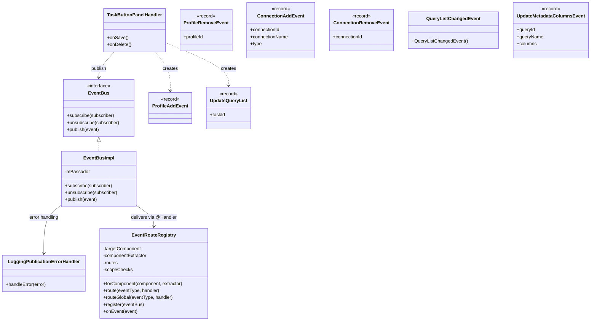

### Sequence Diagram — Task saved, multiple subscribers notified

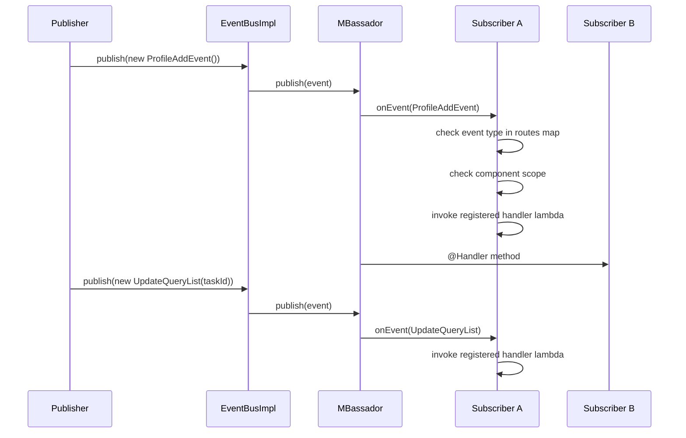

### Sequence Diagram — EventRouteRegistry setup

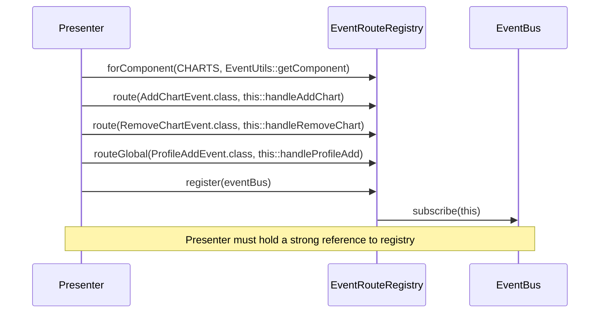

### Example — publishing an event

```java
// In TaskButtonPanelHandler.onSave()
eventBus.publish(new ProfileAddEvent());
eventBus.publish(new UpdateQueryList(info.getId()));
```

```java
// In TaskButtonPanelHandler.onDelete()
eventBus.publish(new ProfileAddEvent());
```

### Example — subscribing with EventRouteRegistry

```java
// In a Presenter constructor or init method
this.registry = EventRouteRegistry
    .forComponent(MessageBroker.Component.CHARTS, EventUtils::getComponent)
    .route(AddChartEvent.class, this::handleAddChart)
    .route(RemoveChartEvent.class, this::handleRemoveChart)
    .routeGlobal(ProfileAddEvent.class, this::handleProfileAdd)
    .register(eventBus);
// 'this.registry' must be a field to prevent GC
```

### Example — subscribing directly with @Handler

```java
// Any class registered via eventBus.subscribe(this)
@Handler
public void onProfileAdd(ProfileAddEvent event) {
    refreshProfileList();
}
```

### Key Files

| Role | File |
|------|------|
| Bus interface | `desktop/src/main/java/ru/dimension/ui/bus/EventBus.java` |
| Bus implementation | `desktop/src/main/java/ru/dimension/ui/bus/EventBusImpl.java` |
| Error handler | `desktop/src/main/java/ru/dimension/ui/bus/LoggingPublicationErrorHandler.java` |
| Scoped routing helper | `desktop/src/main/java/ru/dimension/ui/helper/event/EventRouteRegistry.java` |
| Component scope extractor | `desktop/src/main/java/ru/dimension/ui/helper/event/EventUtils.java` |
| Publisher example | `desktop/src/main/java/ru/dimension/ui/view/handler/task/TaskButtonPanelHandler.java` |
| Event: connection added | `desktop/src/main/java/ru/dimension/ui/bus/event/ConnectionAddEvent.java` |
| Event: connection removed | `desktop/src/main/java/ru/dimension/ui/bus/event/ConnectionRemoveEvent.java` |
| Event: profile added | `desktop/src/main/java/ru/dimension/ui/bus/event/ProfileAddEvent.java` |
| Event: profile removed | `desktop/src/main/java/ru/dimension/ui/bus/event/ProfileRemoveEvent.java` |
| Event: query list changed | `desktop/src/main/java/ru/dimension/ui/bus/event/QueryListChangedEvent.java` |
| Event: update query list | `desktop/src/main/java/ru/dimension/ui/bus/event/UpdateQueryList.java` |
| Event: metadata columns | `desktop/src/main/java/ru/dimension/ui/bus/event/UpdateMetadataColumnsEvent.java` |

---

## Quick comparison

| Aspect | `IDetailPanel` | `MessageBroker` | `EventDispatcher` | `EventBus` |
|--------|----------------|-----------------|-------------------|------------|
| Trigger | Mouse drag release on chart | Explicit `sendMessage()` | Explicit `fire*` method call | Explicit `publish(event)` |
| Routing | Direct method call on each registered listener | Exact `Destination` key match | Typed listener lists / keyed maps | Event type match; optional component scope via `EventRouteRegistry` |
| Scope | Chart time-range selection | Component / module / panel granularity | Application-wide UI state and lifecycle | Cross-layer domain events (config, profile, connection) |
| Threading | Called on the UI thread; heavy work is offloaded | Synchronous iteration | Synchronous iteration | Configurable: sync, async handler, async dispatch (all three enabled) |
| Storage | `ArrayList<IDetailPanel>` | `ConcurrentHashMap<Destination, List<MessageAction>>` | `CopyOnWriteArrayList` / `ConcurrentHashMap` | MBassador internal registry (weak references) |
| Pattern flavor | Single-method callback | Message bus / pub-sub | Typed composite observer | Annotation-driven pub-sub |
| Coupling | Subject knows observer type directly | Publisher and subscriber are decoupled | Dispatcher knows concrete listener types | Publisher and subscriber are fully decoupled; event type is the only contract |
| Subscriber registration | Explicit `addListener` call | Explicit `addReceiver` with `Destination` | Explicit `add*Listener` call | `eventBus.subscribe(this)` or `EventRouteRegistry.register(eventBus)` |
| Extensibility | Add a new observer implementation | Add a new action and handler | Add a new listener interface / registration method | Add a new event record and annotate handler with `@Handler` |
| Error handling | None built-in | None built-in | None built-in | `LoggingPublicationErrorHandler` logs all delivery failures |

---

## When to use which

- Use **direct callback/listener** (`IDetailPanel`) when the subject and observers are tightly related and the event is local and synchronous.
- Use **MessageBroker** when you need decoupled module-to-module communication and routing by a composite address.
- Use **EventDispatcher** when you need typed application-wide events and different listener sets for different contexts (e.g., per profile/task key).
- Use **EventBus** when publisher and subscriber must not know about each other at all, the event is a domain-level fact (connection created, profile changed), and you may need asynchronous delivery or multiple independent subscribers across layers.

---

## Schema

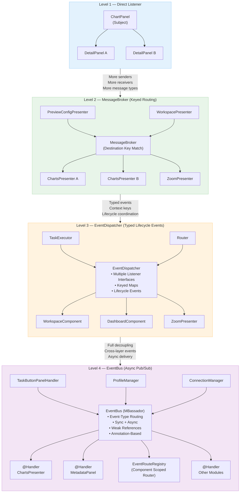

## Examples

| Property | Value |
|----------|-------|
| **Application** | [Dimension UI](https://github.com/akardapolov/dimension-ui) |
| **Language** | Java |
| **Description** | Desktop application for real-time collection, storage, visualization, and analysis of time series data. Connects to databases (PostgreSQL, Oracle) and HTTP APIs (Prometheus), applies analytical algorithms (Matrix Profile, ARIMA), and renders interactive charts. The Observer pattern is used throughout the UI layer to propagate chart selection events, lifecycle state changes, inter-module commands, and domain-level configuration events across loosely coupled components. |

> All code snippets in this document are taken directly from the Dimension UI source code.
> Additional examples in other languages will be added here as the documentation evolves.

---

## See Also

- [Mediator](../behavioral/mediator.md)
- [Singleton](../creational/singleton.md)
