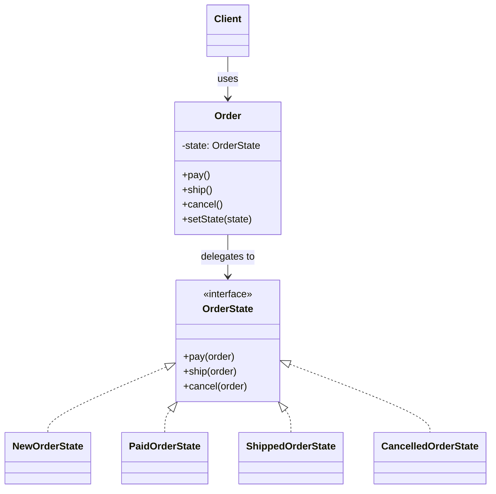
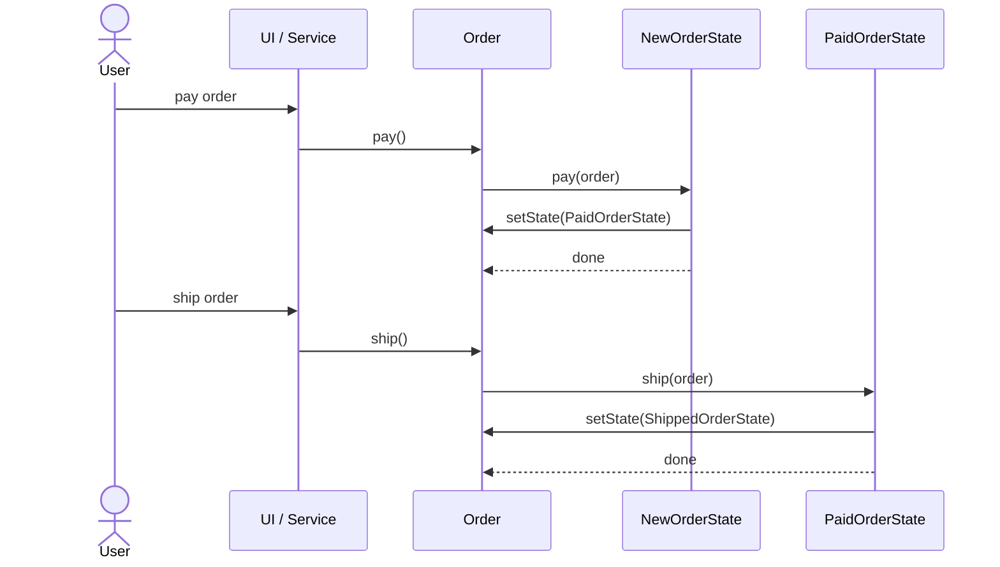

# State

**Group:** Behavioral  
**Source:** GoF — *Design Patterns: Elements of Reusable Object-Oriented Software* (1994)

> Allow an object to alter its behavior when its internal state changes. The object will appear to change its class.

---

## Contents

1. [What it does](#what-it-does)
2. [How it works](#how-it-works)
3. [Class Diagram](#class-diagram)
4. [Sequence Diagram](#sequence-diagram)
5. [Example](#example)
6. [Typical Use](#typical-use)
7. [See Also](#see-also)

---

## What it does

The **State** pattern lets an object change its behavior when its internal state changes.

Instead of writing large `if/else` or `switch` statements, the object delegates behavior to a separate state object. Each state knows:

- what actions are allowed,
- what actions are invalid,
- how to transition to the next state.

In this example, an `Order` changes behavior depending on whether it is:

- `New`
- `Paid`
- `Shipped`
- `Cancelled`

The client code interacts only with the `Order`, not with the transition logic.

---

## How it works

| Part | Role |
|------|------|
| `Order` | Context object that stores the current state and delegates requests |
| `OrderState` | State interface that defines the actions supported by the context |
| `NewOrderState`, `PaidOrderState`, `ShippedOrderState`, `CancelledOrderState` | Concrete states that implement state-specific behavior |
| Client | Calls the context without knowing which state is active |

Typical flow:

1. The client creates an `Order`.
2. The `Order` starts in `NewOrderState`.
3. A call such as `pay()` is forwarded to the current state.
4. The state performs its logic and may change the context’s state.
5. Future calls behave differently because the state has changed.

---

## Class Diagram



---

## Sequence Diagram

Example: the user pays for a new order, then ships it.



---

## Example

A small Java implementation of the State pattern.

```java
interface OrderState {
    void pay(Order order);
    void ship(Order order);
    void cancel(Order order);
}

class Order {
    private OrderState state = new NewOrderState();

    void setState(OrderState state) {
        this.state = state;
    }

    public void pay() {
        state.pay(this);
    }

    public void ship() {
        state.ship(this);
    }

    public void cancel() {
        state.cancel(this);
    }

    public String getStateName() {
        return state.getClass().getSimpleName();
    }
}

class NewOrderState implements OrderState {
    @Override
    public void pay(Order order) {
        System.out.println("Payment accepted");
        order.setState(new PaidOrderState());
    }

    @Override
    public void ship(Order order) {
        System.out.println("Cannot ship a new order");
    }

    @Override
    public void cancel(Order order) {
        System.out.println("Order cancelled");
        order.setState(new CancelledOrderState());
    }
}

class PaidOrderState implements OrderState {
    @Override
    public void pay(Order order) {
        System.out.println("Order is already paid");
    }

    @Override
    public void ship(Order order) {
        System.out.println("Order shipped");
        order.setState(new ShippedOrderState());
    }

    @Override
    public void cancel(Order order) {
        System.out.println("Payment refunded, order cancelled");
        order.setState(new CancelledOrderState());
    }
}

class ShippedOrderState implements OrderState {
    @Override
    public void pay(Order order) {
        System.out.println("Order is already shipped");
    }

    @Override
    public void ship(Order order) {
        System.out.println("Order is already shipped");
    }

    @Override
    public void cancel(Order order) {
        System.out.println("Cannot cancel a shipped order");
    }
}

class CancelledOrderState implements OrderState {
    @Override
    public void pay(Order order) {
        System.out.println("Cancelled order cannot be paid");
    }

    @Override
    public void ship(Order order) {
        System.out.println("Cancelled order cannot be shipped");
    }

    @Override
    public void cancel(Order order) {
        System.out.println("Order is already cancelled");
    }
}
```

Usage:

```java
Order order = new Order();

order.pay();   // Payment accepted
order.ship();  // Order shipped

System.out.println(order.getStateName()); // ShippedOrderState
```

---

## Typical Use

| Property | Value |
|----------|-------|
| **Use case** | Order lifecycle, UI wizard flow, document workflow |
| **Language** | Java |
| **Description** | The `Order` object changes behavior by delegating to different state objects. Each state owns the rules for allowed actions and transitions. |

---

## See Also

- [Flyweight](../structural/flyweight.md)
- [Singleton](../creational/singleton.md)
