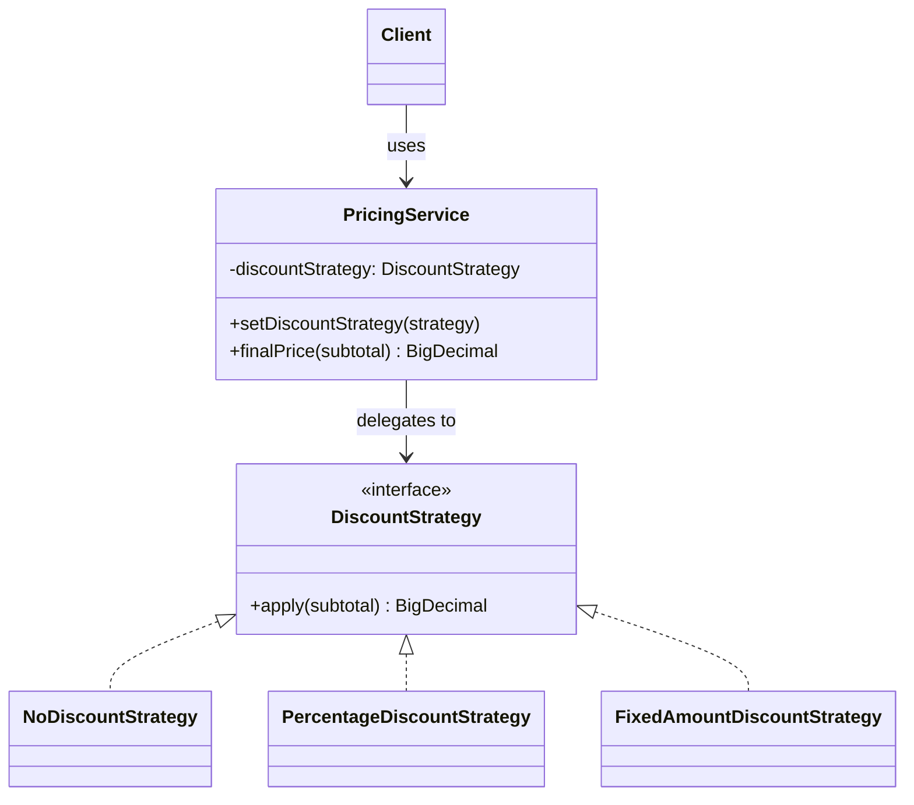
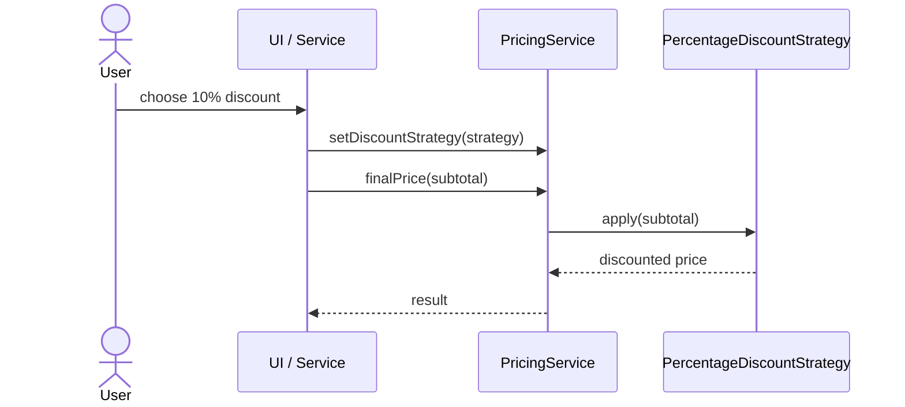

# Strategy

**Group:** Behavioral  
**Source:** GoF — *Design Patterns: Elements of Reusable Object-Oriented Software* (1994)

> Define a family of algorithms, encapsulate each one, and make them interchangeable.

---

## Contents

1. [What it does](#what-it-does)
2. [How it works](#how-it-works)
3. [Class Diagram](#class-diagram)
4. [Sequence Diagram](#sequence-diagram)
5. [Example](#example)
6. [Typical Use](#typical-use)
7. [See Also](#see-also)

---

## What it does

The **Strategy** pattern lets you define a family of algorithms, put each one in its own class, and choose between them at runtime.

Instead of hard-coding a calculation or using many conditionals, the context delegates the work to a strategy object.

This is useful when:

- the same task has multiple implementations,
- you want to switch behavior without changing the client,
- you want to keep the algorithm isolated and testable.

In this example, `PricingService` calculates a final price using different discount strategies.

---

## How it works

| Part | Role |
|------|------|
| `PricingService` | Context that uses a strategy to perform the calculation |
| `DiscountStrategy` | Strategy interface |
| `NoDiscountStrategy`, `PercentageDiscountStrategy`, `FixedAmountDiscountStrategy` | Concrete strategies |
| Client | Chooses which strategy to use and passes it to the context |

Typical flow:

1. The client selects a strategy, for example based on customer type or configuration.
2. The strategy is injected into the context.
3. The context delegates the computation to the strategy.
4. The strategy returns the result.

> Compared with **State**, Strategy is usually chosen by the client, while State is often changed internally by the context.

---

## Class Diagram



---

## Sequence Diagram

Example: the user selects a discount strategy and the service calculates the final price.



---

## Example

A Java implementation of the Strategy pattern using `BigDecimal`.

```java
interface DiscountStrategy {
    BigDecimal apply(BigDecimal subtotal);
}

class NoDiscountStrategy implements DiscountStrategy {
    @Override
    public BigDecimal apply(BigDecimal subtotal) {
        return subtotal;
    }
}

class PercentageDiscountStrategy implements DiscountStrategy {
    private final BigDecimal percent;

    PercentageDiscountStrategy(BigDecimal percent) {
        this.percent = percent;
    }

    @Override
    public BigDecimal apply(BigDecimal subtotal) {
        BigDecimal discount = subtotal
            .multiply(percent)
            .divide(BigDecimal.valueOf(100));

        return subtotal.subtract(discount);
    }
}

class FixedAmountDiscountStrategy implements DiscountStrategy {
    private final BigDecimal amount;

    FixedAmountDiscountStrategy(BigDecimal amount) {
        this.amount = amount;
    }

    @Override
    public BigDecimal apply(BigDecimal subtotal) {
        return subtotal.subtract(amount).max(BigDecimal.ZERO);
    }
}

class PricingService {
    private DiscountStrategy discountStrategy = new NoDiscountStrategy();

    PricingService(DiscountStrategy discountStrategy) {
        this.discountStrategy = discountStrategy;
    }

    public void setDiscountStrategy(DiscountStrategy discountStrategy) {
        this.discountStrategy = discountStrategy;
    }

    public BigDecimal finalPrice(BigDecimal subtotal) {
        return discountStrategy.apply(subtotal);
    }
}
```

Usage:

```java
PricingService pricingService =
    new PricingService(new PercentageDiscountStrategy(BigDecimal.valueOf(10)));

BigDecimal total = pricingService.finalPrice(BigDecimal.valueOf(199.99));
System.out.println(total);
```

---

## Typical Use

| Property | Value |
|----------|-------|
| **Use case** | Shopping cart pricing, compression, routing, validation rules |
| **Language** | Java |
| **Description** | `PricingService` delegates pricing logic to interchangeable strategy objects, allowing the algorithm to change without modifying the context. |

---

## See Also

- [Decorator](../structural/decorator.md)
- [Flyweight](../structural/flyweight.md)
