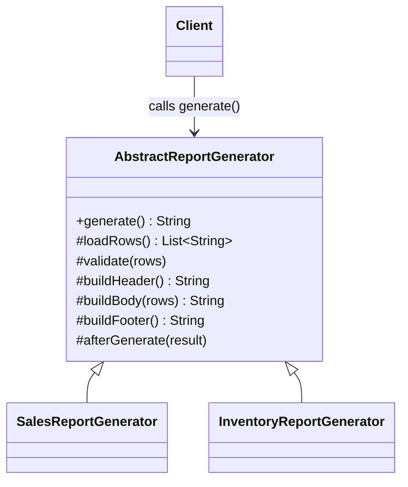
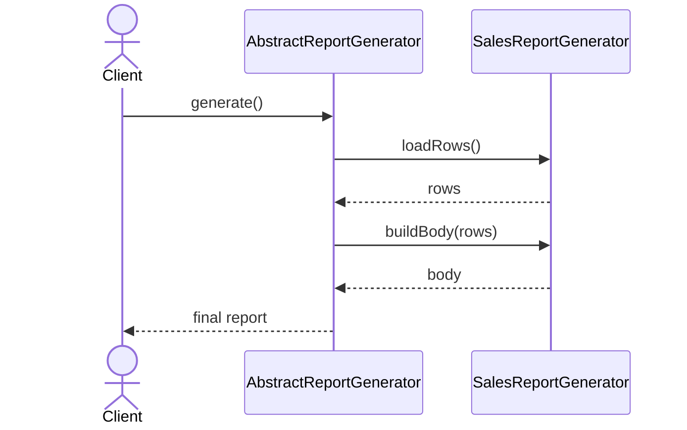

# Template Method

**Group:** Behavioral  
**Source:** GoF — *Design Patterns: Elements of Reusable Object-Oriented Software* (1994)

> Define the skeleton of an algorithm in an operation, deferring some steps to subclasses.

---

## Contents

1. [What it does](#what-it-does)
2. [How it works](#how-it-works)
3. [Class Diagram](#class-diagram)
4. [Sequence Diagram](#sequence-diagram)
5. [Example](#example)
6. [Typical Use](#typical-use)
7. [See Also](#see-also)

---

## What it does

The **Template Method** pattern defines the overall structure of an algorithm in a base class and lets subclasses implement specific steps.

The base class keeps the algorithm stable, while subclasses customize the details.

This is useful when:

- several classes share the same process,
- only some steps differ,
- you want to avoid duplicating the common flow.

In this example, `AbstractReportGenerator` defines the report generation flow, while subclasses provide the report-specific data and formatting.

---

## How it works

| Part | Role |
|------|------|
| `AbstractReportGenerator` | Base class that defines the template method |
| `SalesReportGenerator`, `InventoryReportGenerator` | Concrete subclasses that implement the variable steps |
| Hook methods | Optional methods that subclasses may override |
| Client | Calls the template method on the subclass instance |

Typical flow:

1. The client creates a concrete subclass.
2. The client calls the template method defined in the base class.
3. The base class executes the algorithm in a fixed order.
4. The subclass supplies the custom steps.

> Compared with **Strategy**, Template Method uses inheritance and keeps the algorithm structure in the base class.

---

## Class Diagram



---

## Sequence Diagram

Example: the client generates a report using a concrete subclass.



---

## Example

A Java implementation of the Template Method pattern.

```java
abstract class AbstractReportGenerator {

    public final String generate() {
        List<String> rows = loadRows();
        validate(rows);

        StringBuilder result = new StringBuilder();
        result.append(buildHeader());
        result.append(buildBody(rows));
        result.append(buildFooter());

        afterGenerate(result);
        return result.toString();
    }

    protected abstract List<String> loadRows();

    protected void validate(List<String> rows) {
        // hook method: default no-op
    }

    protected String buildHeader() {
        return "=== Report ===\n";
    }

    protected abstract String buildBody(List<String> rows);

    protected String buildFooter() {
        return "\n=== End ===";
    }

    protected void afterGenerate(StringBuilder result) {
        // hook method: default no-op
    }
}

class SalesReportGenerator extends AbstractReportGenerator {
    @Override
    protected List<String> loadRows() {
        return List.of("Laptop", "Mouse", "Keyboard");
    }

    @Override
    protected String buildBody(List<String> rows) {
        return String.join("\n", rows) + "\n";
    }
}

class InventoryReportGenerator extends AbstractReportGenerator {
    @Override
    protected List<String> loadRows() {
        return List.of("Item A: 10", "Item B: 25");
    }

    @Override
    protected String buildBody(List<String> rows) {
        return String.join(" | ", rows) + "\n";
    }
}
```

Usage:

```java
AbstractReportGenerator generator = new SalesReportGenerator();
String report = generator.generate();
System.out.println(report);
```

---

## Typical Use

| Property | Value |
|----------|-------|
| **Use case** | Report generation, file parsing, export pipelines, test setup/teardown |
| **Language** | Java |
| **Description** | The base class defines the fixed algorithm, while subclasses implement the steps that vary between report types. |

---

## See Also

- [Factory Method](../creational/factory-method.md)
- [Strategy](../behavioral/strategy.md)
