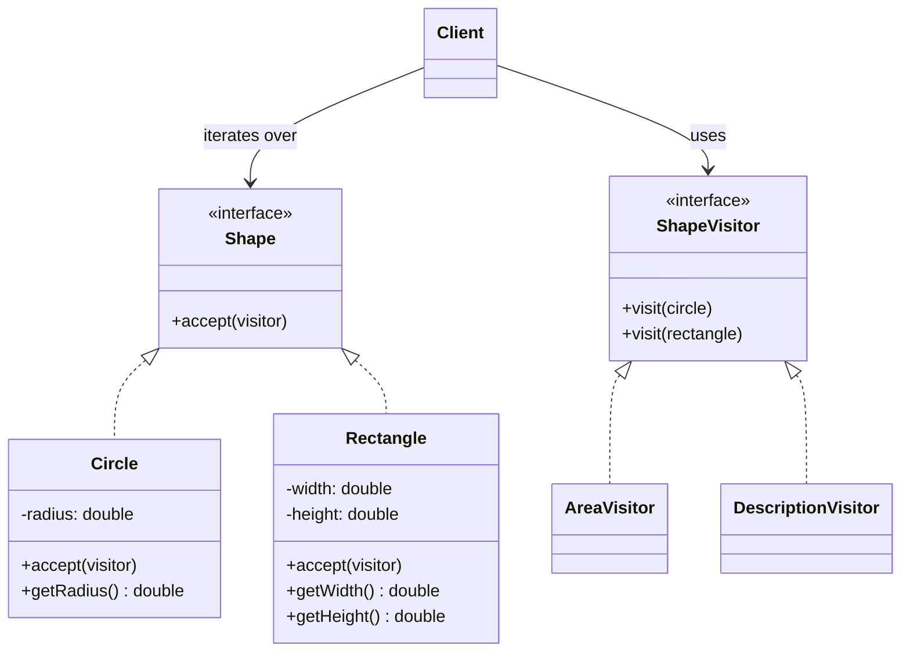
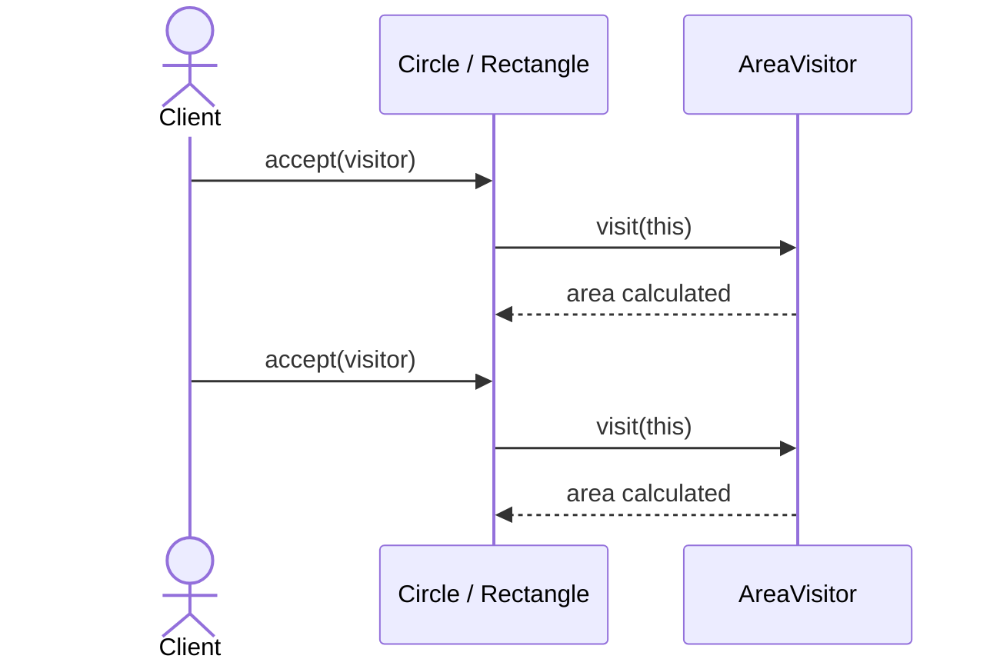

# Visitor

**Group:** Behavioral  
**Source:** GoF — *Design Patterns: Elements of Reusable Object-Oriented Software* (1994)

> Represent an operation to be performed on the elements of an object structure. Visitor lets you define a new operation without changing the classes of the elements on which it operates.

---

## Contents

1. [What it does](#what-it-does)
2. [How it works](#how-it-works)
3. [Class Diagram](#class-diagram)
4. [Sequence Diagram](#sequence-diagram)
5. [Example](#example)
6. [Typical Use](#typical-use)
7. [See Also](#see-also)

---

## What it does

The **Visitor** pattern lets you add new operations to an object structure without changing the element classes.

Each element exposes an `accept()` method. The visitor provides a `visit()` method for each concrete element type.

This is useful when:

- the object structure is stable,
- you want to add many operations over time,
- you want to keep operations separate from the data model.

In this example, the object structure is a set of shapes. Visitors can calculate area, export descriptions, or generate reports.

---

## How it works

| Part | Role |
|------|------|
| `Shape` | Element interface with `accept()` |
| `Circle`, `Rectangle` | Concrete elements |
| `ShapeVisitor` | Visitor interface with one `visit()` method per element type |
| `AreaVisitor`, `DescriptionVisitor` | Concrete visitors that implement operations |
| Client | Traverses the object structure and passes a visitor to each element |

Typical flow:

1. The client creates a visitor.
2. The client iterates over the object structure.
3. Each element calls back into the visitor using `accept()`.
4. The correct `visit()` method is selected for the concrete element type.

This is called **double dispatch**: the element type and the visitor type both influence the final method call.

---

## Class Diagram



---

## Sequence Diagram

Example: the client calculates the total area of a list of shapes.



---

## Example

A Java implementation of the Visitor pattern for shapes.

```java
interface Shape {
    void accept(ShapeVisitor visitor);
}

interface ShapeVisitor {
    void visit(Circle circle);
    void visit(Rectangle rectangle);
}

class Circle implements Shape {
    private final double radius;

    Circle(double radius) {
        this.radius = radius;
    }

    public double getRadius() {
        return radius;
    }

    @Override
    public void accept(ShapeVisitor visitor) {
        visitor.visit(this);
    }
}

class Rectangle implements Shape {
    private final double width;
    private final double height;

    Rectangle(double width, double height) {
        this.width = width;
        this.height = height;
    }

    public double getWidth() {
        return width;
    }

    public double getHeight() {
        return height;
    }

    @Override
    public void accept(ShapeVisitor visitor) {
        visitor.visit(this);
    }
}

class AreaVisitor implements ShapeVisitor {
    private double totalArea = 0;

    @Override
    public void visit(Circle circle) {
        totalArea += Math.PI * circle.getRadius() * circle.getRadius();
    }

    @Override
    public void visit(Rectangle rectangle) {
        totalArea += rectangle.getWidth() * rectangle.getHeight();
    }

    public double getTotalArea() {
        return totalArea;
    }
}

class DescriptionVisitor implements ShapeVisitor {
    private final List<String> descriptions = new ArrayList<>();

    @Override
    public void visit(Circle circle) {
        descriptions.add("Circle(r=" + circle.getRadius() + ")");
    }

    @Override
    public void visit(Rectangle rectangle) {
        descriptions.add("Rectangle(" + rectangle.getWidth() + "x" + rectangle.getHeight() + ")");
    }

    public List<String> getDescriptions() {
        return descriptions;
    }
}
```

Usage:

```java
List<Shape> shapes = List.of(
    new Circle(10),
    new Rectangle(4, 5)
);

AreaVisitor areaVisitor = new AreaVisitor();
DescriptionVisitor descriptionVisitor = new DescriptionVisitor();

for (Shape shape : shapes) {
    shape.accept(areaVisitor);
    shape.accept(descriptionVisitor);
}

System.out.println(areaVisitor.getTotalArea());
System.out.println(descriptionVisitor.getDescriptions());
```

---

## Typical Use

| Property | Value |
|----------|-------|
| **Use case** | AST processing, document export, reporting, shape traversal |
| **Language** | Java |
| **Description** | The object structure stays stable while new operations are added as separate visitor classes. |

---

## See Also

- [Composite](../structural/composite.md)
- [Interpreter](../behavioral/interpreter.md)
- [Iterator](../behavioral/iterator.md)
