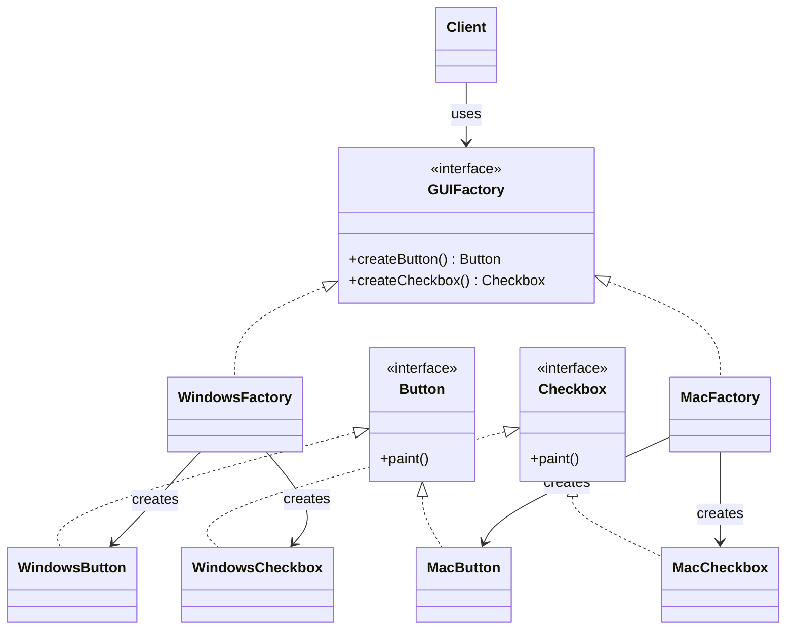
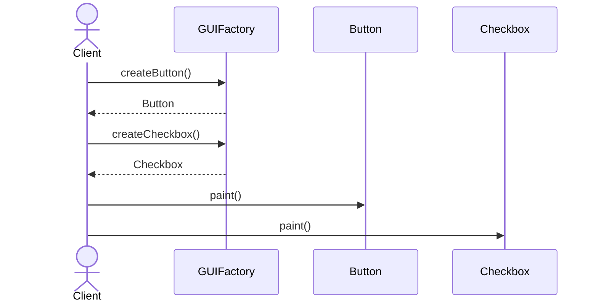

# Abstract Factory

**Group:** Creational  
**Source:** GoF — *Design Patterns: Elements of Reusable Object-Oriented Software* (1994)

> Provide an interface for creating families of related or dependent objects without specifying their concrete classes.

---

## Contents

1. [What it does](#what-it-does)
2. [How it works](#how-it-works)
3. [Class Diagram](#class-diagram)
4. [Sequence Diagram](#sequence-diagram)
5. [Example](#example)
6. [Typical Use](#typical-use)
7. [See Also](#see-also)

---

## What it does

The **Abstract Factory** pattern provides an interface for creating related objects that belong to the same family.

Instead of instantiating concrete classes directly, the client asks a factory for products. The factory ensures that the returned objects are compatible with each other.

This is useful when:

- the application must work with multiple product families,
- the concrete classes should be hidden from the client,
- you want to keep related objects consistent.

In this example, a UI toolkit can create widgets for different platforms:

- `WindowsButton` and `WindowsCheckbox`
- `MacButton` and `MacCheckbox`

The client works with abstract interfaces only.

---

## How it works

| Part | Role |
|------|------|
| `GUIFactory` | Abstract factory interface |
| `WindowsFactory`, `MacFactory` | Concrete factories that create a family of products |
| `Button`, `Checkbox` | Abstract product interfaces |
| `WindowsButton`, `MacButton`, `WindowsCheckbox`, `MacCheckbox` | Concrete products |
| Client | Uses the factory and product interfaces only |

Typical flow:

1. The client receives or chooses a concrete factory.
2. The client asks the factory to create related products.
3. The factory creates matching objects from the same family.
4. The client uses them through abstract interfaces.

> Compared with **Factory Method**, Abstract Factory creates multiple related products, not just one object.

---

## Class Diagram



---

## Sequence Diagram

Example: the client builds a UI using a selected factory.



---

## Example

A Java implementation of the Abstract Factory pattern for cross-platform UI widgets.

```java
interface Button {
    void paint();
}

interface Checkbox {
    void paint();
}

class WindowsButton implements Button {
    @Override
    public void paint() {
        System.out.println("Render a Windows button");
    }
}

class MacButton implements Button {
    @Override
    public void paint() {
        System.out.println("Render a Mac button");
    }
}

class WindowsCheckbox implements Checkbox {
    @Override
    public void paint() {
        System.out.println("Render a Windows checkbox");
    }
}

class MacCheckbox implements Checkbox {
    @Override
    public void paint() {
        System.out.println("Render a Mac checkbox");
    }
}

interface GUIFactory {
    Button createButton();
    Checkbox createCheckbox();
}

class WindowsFactory implements GUIFactory {
    @Override
    public Button createButton() {
        return new WindowsButton();
    }

    @Override
    public Checkbox createCheckbox() {
        return new WindowsCheckbox();
    }
}

class MacFactory implements GUIFactory {
    @Override
    public Button createButton() {
        return new MacButton();
    }

    @Override
    public Checkbox createCheckbox() {
        return new MacCheckbox();
    }
}
```

Usage:

```java
public class Application {
    private final Button button;
    private final Checkbox checkbox;

    public Application(GUIFactory factory) {
        this.button = factory.createButton();
        this.checkbox = factory.createCheckbox();
    }

    public void render() {
        button.paint();
        checkbox.paint();
    }

    public static void main(String[] args) {
        GUIFactory factory = new WindowsFactory();
        Application app = new Application(factory);
        app.render();
    }
}
```

---

## Typical Use

| Property | Value |
|----------|-------|
| **Use case** | Cross-platform UI toolkits, theme-based components, database drivers, document renderers |
| **Language** | Java |
| **Description** | A factory creates related objects from the same family, keeping the client independent of concrete implementations. |

---

## See Also

- [Factory Method](../creational/factory-method.md)
- [Prototype](../creational/prototype.md)
- [Singleton](../creational/singleton.md)
