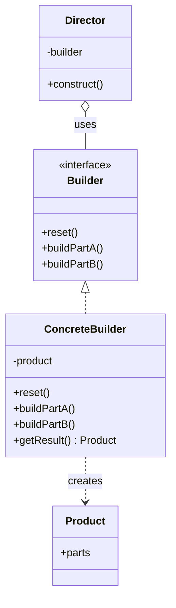
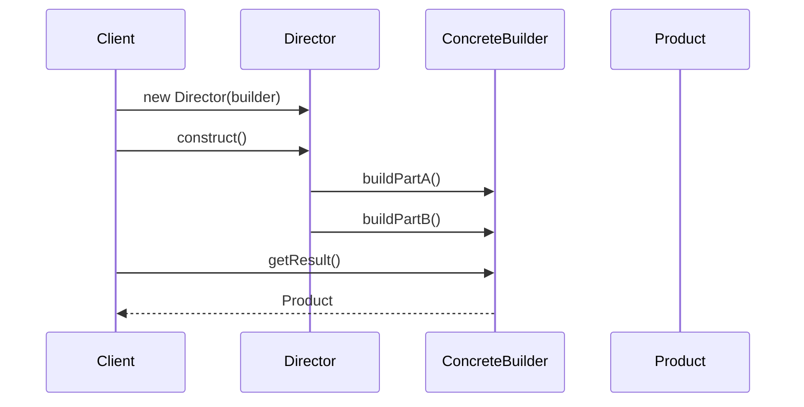

# Builder

**Group:** Creational  
**Source:** GoF — *Design Patterns: Elements of Reusable Object-Oriented Software* (1994)

> Separate the construction of a complex object from its representation so that the same construction process can create different representations.

---

## Contents

1. [What it does](#what-it-does)
2. [How it works](#how-it-works)
3. [Class Diagram](#class-diagram)
4. [Sequence Diagram](#sequence-diagram)
5. [Example](#example)
6. [Key Files](#key-files)
7. [Examples](#examples)
8. [See Also](#see-also)

---

## What it does

The **Builder** pattern solves the "telescoping constructor" problem, when a class has too many parameters, many of which are optional. It allows constructing complex objects step by step, calling only those build methods that are needed, and hiding the creation process from the client.

Unlike the "Abstract Factory," which creates a family of objects, the "Builder" focuses on creating **one** complex object step by step.

---

## How it works

The roles in the pattern are distributed as follows:

| Part | Role |
|------|------|
| `Builder` | Interface defining the steps for creating product parts |
| `ConcreteBuilder` | Implements the builder interface, assembles a specific object |
| `Director` | Controls the assembly process by defining the order of step calls |
| `Product` | The complex object to be built |

---

## Class Diagram



---

## Sequence Diagram



---

## Example

Example implementation in Java: assembling a house.

```java
// Product
public class House {
    private String walls;
    private String roof;
    // Getters/Setters...
}

// Builder interface
public interface HouseBuilder {
    void buildWalls();
    void buildRoof();
    House getResult();
}

// Concrete builder
public class WoodHouseBuilder implements HouseBuilder {
    private House house = new House();

    public void buildWalls() { house.setWalls("Wood walls"); }
    public void buildRoof() { house.setRoof("Wood roof"); }
    public House getResult() { return house; }
}

// Director (defines the order of steps)
public class Director {
    public void construct(HouseBuilder builder) {
        builder.buildWalls();
        builder.buildRoof();
    }
}
```

---

## Key Files

| Role | File |
|------|------|
| Builder Interface | `src/main/java/patterns/builder/HouseBuilder.java` |
| Concrete Builder | `src/main/java/patterns/builder/WoodHouseBuilder.java` |
| Product | `src/main/java/patterns/builder/House.java` |
| Director | `src/main/java/patterns/builder/Director.java` |

---

## Examples

| Property | Value |
|----------|-------|
| **Application** | `java.lang.StringBuilder` |
| **Language** | Java |
| **Description** | A classic example of Builder in the standard library. `StringBuilder` allows you to build a string step by step (append), and then get the final representation via the `toString()` method. |

---

## See Also

- [Abstract Factory](../creational/abstract-factory.md)
- [Composite](../structural/composite.md)
