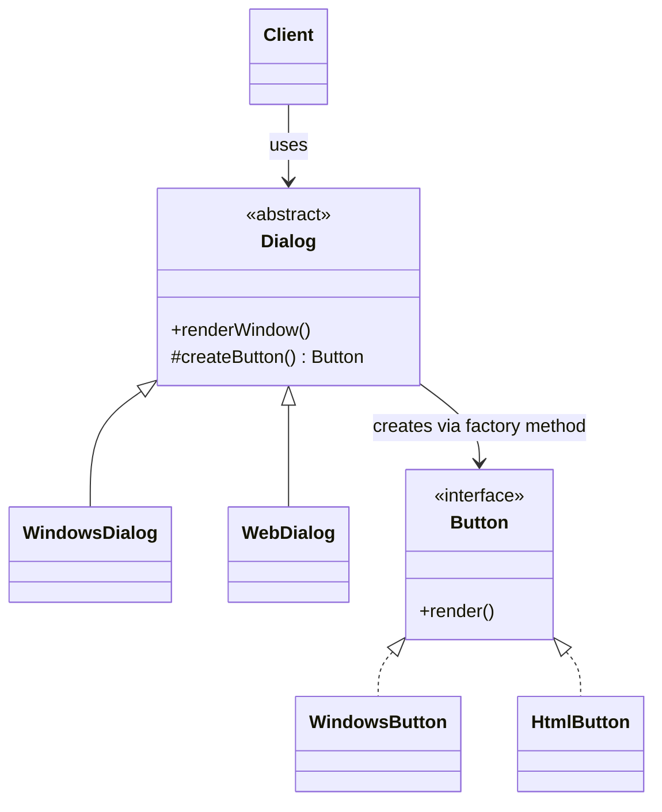
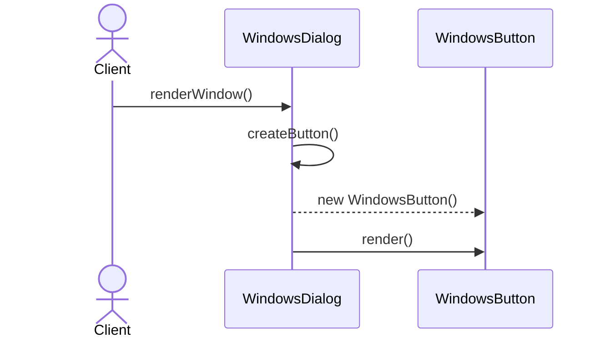

# Factory Method

**Group:** Creational  
**Source:** GoF — *Design Patterns: Elements of Reusable Object-Oriented Software* (1994)

> Define an interface for creating an object, but let subclasses decide which class to instantiate.

---

## Contents

1. [What it does](#what-it-does)
2. [How it works](#how-it-works)
3. [Class Diagram](#class-diagram)
4. [Sequence Diagram](#sequence-diagram)
5. [Example](#example)
6. [Typical Use](#typical-use)
7. [See Also](#see-also)

---

## What it does

The **Factory Method** pattern defines a method for creating an object, but leaves the choice of concrete class to subclasses.

The base class contains the core workflow, while subclasses override the factory method to decide what product to create.

This is useful when:

- a class cannot anticipate which object it needs to create,
- you want to delegate instantiation to subclasses,
- you want to avoid direct coupling to concrete classes.

In this example, a `Dialog` defines a rendering workflow and subclasses decide which kind of `Button` to create.

---

## How it works

| Part | Role |
|------|------|
| `Dialog` | Creator class with the factory method |
| `WindowsDialog`, `WebDialog` | Concrete creators that override the factory method |
| `Button` | Product interface |
| `WindowsButton`, `HtmlButton` | Concrete products |
| Client | Calls the creator without knowing the product class |

Typical flow:

1. The client chooses a concrete creator.
2. The client calls a method on the creator.
3. The creator calls its factory method.
4. The subclass returns the correct product implementation.

> Compared with **Abstract Factory**, Factory Method usually creates one product type, while Abstract Factory creates a family of related products.

---

## Class Diagram



---

## Sequence Diagram

Example: the client renders a window through a concrete dialog.



---

## Example

A Java implementation of the Factory Method pattern for dialogs and buttons.

```java
interface Button {
    void render();
}

class WindowsButton implements Button {
    @Override
    public void render() {
        System.out.println("Render Windows button");
    }
}

class HtmlButton implements Button {
    @Override
    public void render() {
        System.out.println("Render HTML button");
    }
}

abstract class Dialog {
    public void renderWindow() {
        Button okButton = createButton();
        okButton.render();
    }

    protected abstract Button createButton();
}

class WindowsDialog extends Dialog {
    @Override
    protected Button createButton() {
        return new WindowsButton();
    }
}

class WebDialog extends Dialog {
    @Override
    protected Button createButton() {
        return new HtmlButton();
    }
}
```

Usage:

```java
Dialog dialog = new WindowsDialog();
dialog.renderWindow();

dialog = new WebDialog();
dialog.renderWindow();
```

---

## Typical Use

| Property | Value |
|----------|-------|
| **Use case** | UI frameworks, document exporters, parser creation, plugin systems |
| **Language** | Java |
| **Description** | A base class defines the workflow and defers object creation to subclasses through a factory method. |

---

## See Also

- [Abstract Factory](../creational/abstract-factory.md)
- [Template Method](../behavioral/template-method.md)
