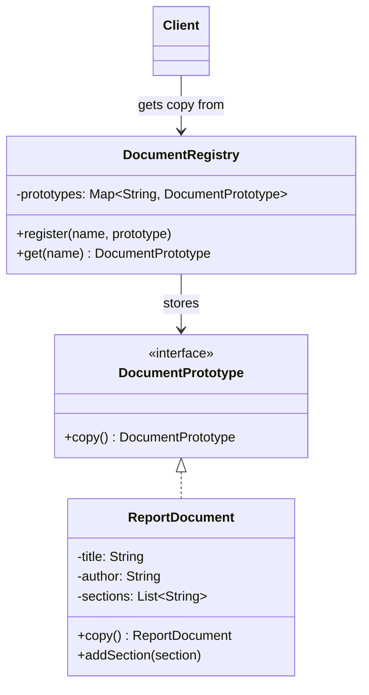
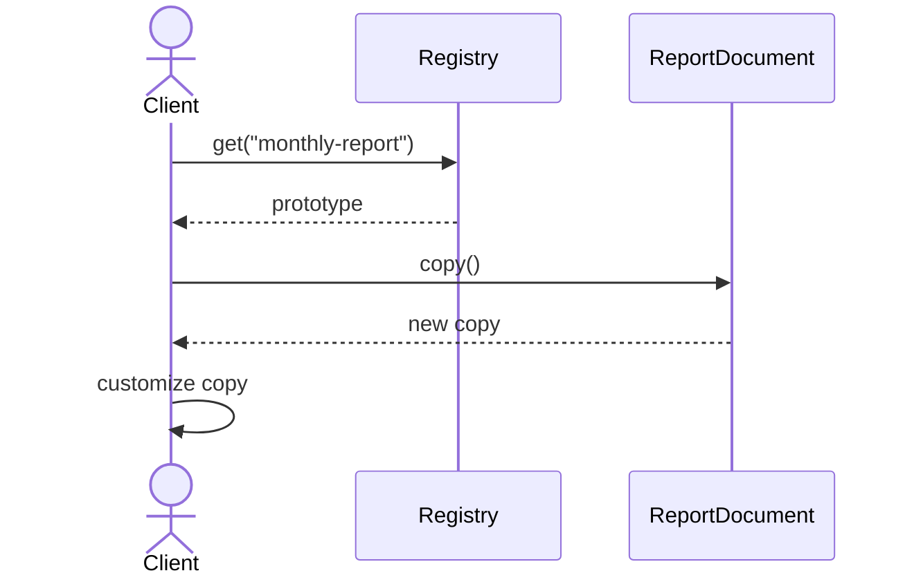

# Prototype

**Group:** Creational  
**Source:** GoF — *Design Patterns: Elements of Reusable Object-Oriented Software* (1994)

> Specify the kinds of objects to create using a prototypical instance, and create new objects by copying this prototype.

---

## Contents

1. [What it does](#what-it-does)
2. [How it works](#how-it-works)
3. [Class Diagram](#class-diagram)
4. [Sequence Diagram](#sequence-diagram)
5. [Example](#example)
6. [Typical Use](#typical-use)
7. [See Also](#see-also)

---

## What it does

The **Prototype** pattern creates new objects by copying an existing object, called the prototype.

Instead of constructing objects from scratch, the client clones or copies a preconfigured instance and then customizes the result.

This is useful when:

- object creation is expensive,
- the exact type is known only at runtime,
- you want to avoid complex construction logic,
- you need many similar objects with small variations.

In this example, a document template is cloned to create new documents quickly.

---

## How it works

| Part | Role |
|------|------|
| `DocumentPrototype` | Prototype interface |
| `ReportDocument` | Concrete prototype with copy logic |
| `DocumentRegistry` | Stores reusable prototypes |
| Client | Clones a prototype and customizes the copy |

Typical flow:

1. The application registers a prototype instance.
2. The client asks for a copy.
3. The prototype creates a clone of itself.
4. The client modifies the copy as needed.

> In Java, this can be implemented with copy constructors, a `copy()` method, or `clone()`.

---

## Class Diagram



---

## Sequence Diagram

Example: the client requests a copy of a document prototype.



---

## Example

A Java implementation of the Prototype pattern using a `copy()` method and deep copy of mutable state.

```java
import java.util.ArrayList;
import java.util.List;
import java.util.Map;
import java.util.HashMap;

interface DocumentPrototype {
    DocumentPrototype copy();
}

class ReportDocument implements DocumentPrototype {
    private String title;
    private String author;
    private List<String> sections;

    public ReportDocument(String title, String author, List<String> sections) {
        this.title = title;
        this.author = author;
        this.sections = new ArrayList<>(sections);
    }

    public ReportDocument(ReportDocument source) {
        this.title = source.title;
        this.author = source.author;
        this.sections = new ArrayList<>(source.sections);
    }

    public void addSection(String section) {
        sections.add(section);
    }

    public void setTitle(String title) {
        this.title = title;
    }

    public String getTitle() {
        return title;
    }

    public List<String> getSections() {
        return sections;
    }

    @Override
    public ReportDocument copy() {
        return new ReportDocument(this);
    }
}

class DocumentRegistry {
    private final Map<String, DocumentPrototype> prototypes = new HashMap<>();

    public void register(String name, DocumentPrototype prototype) {
        prototypes.put(name, prototype);
    }

    public DocumentPrototype get(String name) {
        DocumentPrototype prototype = prototypes.get(name);
        if (prototype == null) {
            throw new IllegalArgumentException("Unknown prototype: " + name);
        }
        return prototype.copy();
    }
}
```

Usage:

```java
DocumentRegistry registry = new DocumentRegistry();

ReportDocument monthlyReport = new ReportDocument(
    "Monthly Report",
    "System",
    List.of("Summary", "Metrics", "Conclusion")
);

registry.register("monthly-report", monthlyReport);

ReportDocument copy = (ReportDocument) registry.get("monthly-report");
copy.setTitle("Monthly Report - Copy");
copy.addSection("Appendix");

System.out.println(monthlyReport.getTitle()); // Monthly Report
System.out.println(copy.getTitle());          // Monthly Report - Copy
System.out.println(monthlyReport.getSections()); // [Summary, Metrics, Conclusion]
System.out.println(copy.getSections());          // [Summary, Metrics, Conclusion, Appendix]
```

---

## Typical Use

| Property | Value |
|----------|-------|
| **Use case** | Object cloning, document templates, game entities, configuration presets |
| **Language** | Java |
| **Description** | New objects are created by copying an existing prototype, which can be cheaper or simpler than building from scratch. |

---

## See Also

- [Abstract Factory](../creational/abstract-factory.md)
- [Composite](../structural/composite.md)
