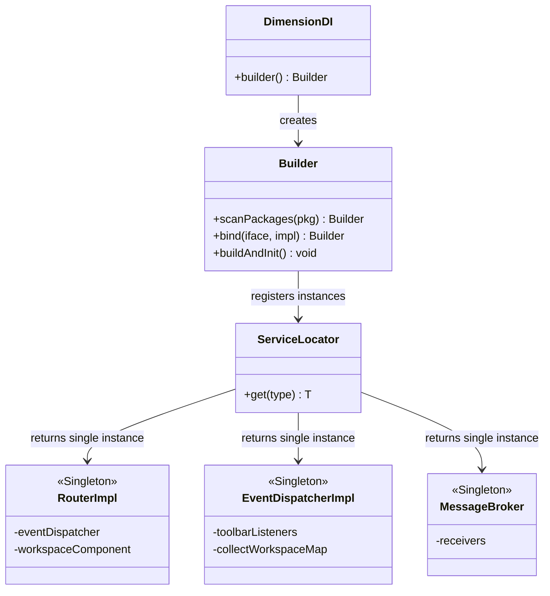
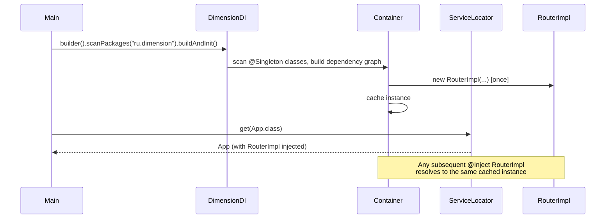

# Singleton

**Group:** Creational  
**Source:** GoF — *Design Patterns: Elements of Reusable Object-Oriented Software* (1994)

> Ensure a class has only one instance, and provide a global point of access to it.

---

## Contents

1. [What it does](#what-it-does)
2. [How it works](#how-it-works)
3. [Class Diagram](#class-diagram)
4. [Sequence Diagram](#sequence-diagram)
5. [Example](#example)
6. [Key Files](#key-files)
7. [Examples](#examples)
8. [See Also](#see-also)

---

## What it does

In Dimension UI, the Singleton pattern is not implemented manually with `getInstance()` locks. Instead, it is delegated to the **Dimension-DI** container via the standard JSR-330 `@Singleton` annotation.

Any class annotated with `@jakarta.inject.Singleton` is instantiated exactly once by the container and reused for every injection point. This covers application-wide shared services such as `RouterImpl`, `EventDispatcherImpl`, and `MessageBroker`.

---

## How it works

| Mechanism | Description |
|-----------|-------------|
| `@Singleton` | Marks a class as a scoped singleton inside the DI container |
| `DimensionDI.builder()` | Scans packages, resolves the dependency graph, and builds the container |
| `ServiceLocator.get(T)` | Retrieves the single instance at the application entry point |
| Container cache | `@Singleton` classes are cached after first construction; subsequent injections receive the same instance |

> The container itself provides **thread-safe** instantiation. No double-checked locking or `static` holders are needed in application code.

---

## Class Diagram



---

## Sequence Diagram



---

## Example

```java
// Declare a singleton service — no manual getInstance() needed
import jakarta.inject.Singleton;
import jakarta.inject.Inject;

@Singleton
public class RouterImpl implements Router {
    private final EventDispatcher eventDispatcher;
    private final WorkspaceComponent workspaceComponent;

    @Inject
    public RouterImpl(EventDispatcher eventDispatcher,
                      WorkspaceComponent workspaceComponent) {
        this.eventDispatcher = eventDispatcher;
        this.workspaceComponent = workspaceComponent;
    }
}
```

```java
// Bootstrap: scan packages, build container, retrieve root object
import ru.dimension.di.DimensionDI;
import ru.dimension.di.ServiceLocator;

public class Main {
    public static void main(String[] args) {
        DimensionDI.builder()
            .scanPackages("ru.dimension.ui")
            .bind(Router.class, RouterImpl.class)
            .bind(EventDispatcher.class, EventDispatcherImpl.class)
            .buildAndInit();

        App app = ServiceLocator.get(App.class);
        app.run();
    }
}
```

```java
// Any component simply declares a dependency — the container injects the same instance
public class ManagePresenter {
    private final Router router; // same RouterImpl instance every time

    @Inject
    public ManagePresenter(Router router) {
        this.router = router;
    }
}
```

---

## Key Files

| Role | File / Artifact |
|------|-----------------|
| DI container | [`dimension-di`](https://github.com/akardapolov/dimension-di) — `ru.dimension.di.DimensionDI` |
| Service locator | `ru.dimension.di.ServiceLocator` |
| Singleton annotation | `jakarta.inject.Singleton` (JSR-330) |
| Singleton example — router | `desktop/src/main/java/ru/dimension/ui/router/RouterImpl.java` |
| Singleton example — dispatcher | `desktop/src/main/java/ru/dimension/ui/router/event/EventDispatcherImpl.java` |
| Singleton example — broker | `desktop/src/main/java/ru/dimension/ui/component/broker/MessageBroker.java` |
| Application entry point | `desktop/src/main/java/ru/dimension/ui/MainApp.java` |

---

## Examples

| Property | Value |
|----------|-------|
| **Application** | [Dimension UI](https://github.com/akardapolov/dimension-ui) + [Dimension DI](https://github.com/akardapolov/dimension-di) |
| **Language** | Java |
| **Description** | Dimension UI uses Dimension-DI — a lightweight JSR-330 DI container — to manage singleton lifecycles. Annotating a class with `@Singleton` is sufficient; the container handles instantiation, caching, and thread-safe reuse. Key application-wide singletons include `RouterImpl`, `EventDispatcherImpl`, and `MessageBroker`. |

> All code snippets in this document are based on the Dimension UI and Dimension-DI source code.  
> Additional examples in other languages will be added here as the documentation evolves.

---

## See Also

- [Abstract Factory](../creational/abstract-factory.md)
- [Facade](../structural/facade.md)
- [Observer](../behavioral/observer.md)
