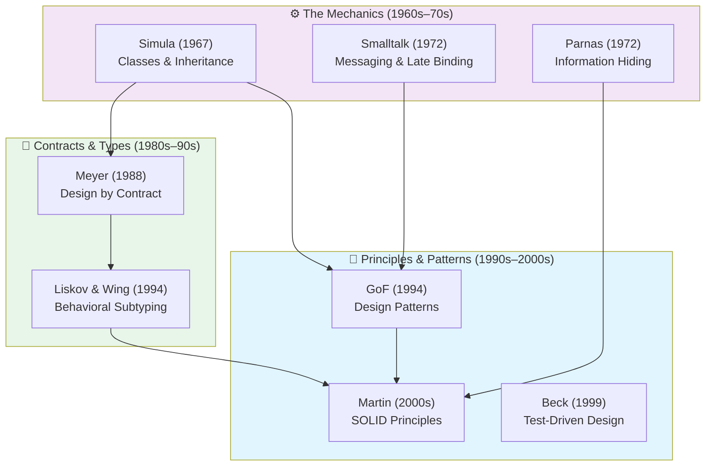

# OOP & Design

If **paradigms** dictate *what* a program is made of, **design** dictates *how* those pieces are shaped, connected, and maintained over time.

This section traces the evolution of Object-Oriented (OO) design: how the basic mechanics of encapsulation, inheritance, and polymorphism evolved into robust principles for managing software complexity.

## The Evolution of Object Design

Object-oriented design did not emerge fully formed. It is the result of decades of trial, error, and formalization, shifting from modeling real-world taxonomies to managing code dependencies.

---

## 1. The Core Mechanics (The Three Pillars)

Classic textbooks define OOP via three pillars. However, in the Atlas view, these are not just definitions—they are historical solutions to specific problems of procedural programming.

### Encapsulation & Information Hiding

Often conflated, these are two related but distinct concepts.

*   **Information Hiding** (David Parnas, 1972): A design rule. A module should hide its secret (a design decision, a data structure, or an algorithm) from the rest of the system to prevent ripple effects when that decision changes.
*   **Encapsulation**: The language mechanism (objects, access modifiers like `private`) that bundles data and the methods that operate on it, enabling information hiding.

**The Trap of Anemic Models:**
Simply making fields `private` and adding `getters` and `setters` is *not* true encapsulation—it exposes the internal data structure anyway. True OO design relies on **"Tell, Don't Ask"**: you tell an object what to do, rather than asking for its state and making decisions outside of it.

### Polymorphism

From Greek *poly* (many) and *morph* (form). In OOP, it means different objects can respond to the same message in their own specific way.

Polymorphism is not a single mechanism — it is a **family** of four distinct mechanisms, first taxonomized by Cardelli & Wegner (1985):

- **Parametric** (generics) — one implementation for any type
- **Inclusion** (subtype) — substitution via inheritance or interfaces
- **Overloading** — same name, different signatures
- **Coercion** — implicit type conversion

> 🔍 **Deep Dive:** For the full taxonomy with diagrams, dispatch mechanisms, and cross-language examples, see **[OOP Deep Dive: Polymorphism, Subtyping & Mechanics](oop-deep-dive.md)**.

Mechanically, inclusion polymorphism is achieved via **Late Binding** (Dynamic Dispatch). In procedural code, the compiler hardwires which function to call. In OOP, the decision of *which code to execute* is deferred until runtime, based on the type of the receiver.

*   **Subtype Polymorphism (Inheritance)**: `Dog` and `Cat` inherit from `Animal` and override `speak()`. (C++, Java).
*   **Structural / Duck Typing**: If it walks like a duck and quacks like a duck, it is a duck. No explicit inheritance needed. (Python, Ruby, Go interfaces).

Polymorphism is the ultimate tool for **dependency inversion**: the caller depends on an abstraction (the message interface), completely decoupled from the concrete implementation.

### Inheritance vs. Composition

Inheritance was introduced in Simula (1967) to model taxonomies ("A Car is a Vehicle"). It allows a new class to absorb the data and behavior of an existing class.

However, implementation inheritance creates the **tightest form of coupling** in software design. It leads to the **Fragile Base Class Problem**: a change in a superclass can inadvertently break assumptions in distant subclasses.

**The Paradigm Shift:**
By 1994, the Gang of Four (GoF) explicitly warned against overusing it, minting the golden rule of modern OO design:
> *"Favor object composition over class inheritance."*

Instead of *being* a thing (inheritance), an object should *contain* a thing (composition) and delegate work to it. Today, features like **Traits** (Rust, PHP) and **Default Interfaces** (Java) provide code reuse without the rigid hierarchies of classic inheritance.

---

## 2. The Era of Formalization (1980s–1990s)

As OOP grew beyond UI programming and simulations into massive enterprise systems, developers needed rigorous rules to ensure systems didn't collapse under their own weight.

### Design by Contract (DbC)
Introduced by **Bertrand Meyer** in 1988 (in the Eiffel language). It states that objects should interact based on mutual obligations:
*   **Preconditions**: What must be true before calling a method.
*   **Postconditions**: What the method guarantees upon completion.
*   **Invariants**: What is always true about the object's state.

*If you break a precondition, it's the caller's fault. If you break a postcondition, it's the receiver's fault. This eliminated defensive programming ("checking for null everywhere").*

### The Liskov Substitution Principle (LSP)
In 1994, **Barbara Liskov** and Jeannette Wing formalized what it actually means to be a "subtype."

> *"If S is a subtype of T, then objects of type T may be replaced with objects of type S without altering any of the desirable properties of the program."*

This connected Meyer's contracts with inheritance: a subclass cannot demand more (stricter preconditions) or deliver less (weaker postconditions) than its parent. Violating LSP means your inheritance is conceptually wrong, even if the code compiles.

---

## 3. The Vocabulary of Design (GoF Patterns)

In 1994, Gamma, Helm, Johnson, and Vlissides published *Design Patterns: Elements of Reusable Object-Oriented Software*.

They didn't invent new language features; they cataloged **recurring architectural structures** that experienced developers used to resolve competing forces in software (e.g., flexibility vs. performance).

Patterns gave the industry a shared vocabulary. Instead of saying, "Let's create an interface, and have a list of objects that implement it, and when state changes, we loop through and call a method on them," a developer could just say: *"Let's use an **Observer**."*

### The 23 GoF Patterns

| Creational | Structural | Behavioral |
|---|---|---|
| [Abstract Factory](creational/abstract-factory.md) | [Adapter](structural/adapter.md) | [Chain of Responsibility](behavioral/chain-of-responsibility.md) |
| [Builder](creational/builder.md) | [Bridge](structural/bridge.md) | [Command](behavioral/command.md) |
| [Factory Method](creational/factory-method.md) | [Composite](structural/composite.md) | [Interpreter](behavioral/interpreter.md) |
| [Prototype](creational/prototype.md) | [Decorator](structural/decorator.md) | [Iterator](behavioral/iterator.md) |
| [Singleton](creational/singleton.md) | [Facade](structural/facade.md) | [Mediator](behavioral/mediator.md) |
| | [Flyweight](structural/flyweight.md) | [Memento](behavioral/memento.md) |
| | [Proxy](structural/proxy.md) | [Observer](behavioral/observer.md) |
| | | [State](behavioral/state.md) |
| | | [Strategy](behavioral/strategy.md) |
| | | [Template Method](behavioral/template-method.md) |
| | | [Visitor](behavioral/visitor.md) |

---

## 4. SOLID: Managing Dependencies (2000s)

Coined and popularized by **Robert C. Martin (Uncle Bob)** in the late 1990s and early 2000s, SOLID is a collection of 5 principles aimed squarely at dependency management.

| Principle | Meaning | The Core Goal |
|-----------|---------|---------------|
| **S**RP (Single Responsibility) | A class should have one, and only one, reason to change. | High cohesion. Limit the blast radius of changes. |
| **O**CP (Open/Closed) | Software entities should be open for extension, but closed for modification. | Add new behavior by writing new code, not changing old code (via polymorphism). |
| **L**SP (Liskov Substitution) | Subtypes must be substitutable for their base types. | Ensure inheritance hierarchies are logically sound. |
| **I**SP (Interface Segregation) | Clients should not be forced to depend upon interfaces they do not use. | Keep interfaces small and focused ("role interfaces"). |
| **D**IP (Dependency Inversion) | High-level modules should not depend on low-level modules. Both should depend on abstractions. | Protect business logic from infrastructure details. |

SOLID heavily influenced the rise of **Test-Driven Development (TDD)** and **Agile** practices. Code that follows SOLID is inherently easier to mock and unit-test.

### Multi-Faced Single Responsibility Principle

Alexander Zhidkov explores the ambiguity of SRP, noting that "Single Responsibility" can mean different things depending on interpretation — highlighting the importance of clear terminology in design discussions. The principle remains valuable, but its meaning must be carefully defined in each context.

→ [Multi-Faced SRP article](../../works/talks/zhidkov-2024-srp.md)

### Structural Design (Constantine 1966–1975, Zhidkov 2020–present)

Larry Constantine's **Structural Design** introduced the principle of **balanced system form** — an objective, checkable design criterion. Unlike subjective metrics like "number of abstraction levels," balanced form provides clear guidance for determining whether code is well-structured.

Alexander Zhidkov rediscovered and applied Constantine's work, finding it the objective design principle he had been searching for after years of exploring mainstream literature.

The principle states that a well-designed system should have balanced coupling and cohesion — a structural property that can be measured and verified.

→ [Larry Constantine — Structural Design] ·
[Alexander Zhidkov](../../authors/alexander-zhidkov.md)

---

## 5. Modern Echoes

Today, pure class-based inheritance is less prominent, but OO *design principles* govern modern architecture:

1.  **Microservices:** A microservice architecture is essentially Alan Kay's original vision of OOP applied at a distributed, network level (isolated state, message passing, late binding).
2.  **Hexagonal Architecture:** Relies entirely on the Dependency Inversion Principle (DIP) to isolate the domain from the database and web framework.
3.  **Functional OOP:** Modern design often blends paradigms using the **Functional Core, Imperative Shell** pattern. Objects are used to manage I/O and dependencies, while pure functions handle the domain logic.

## See Also

- 📖 **Authors:** [David Parnas](../../authors/david-parnas.md) · [Barbara Liskov](../../authors/barbara-liskov.md) · [Robert C. Martin](../../authors/robert-c-martin.md) · [Alexander Zhidkov](../../authors/alexander-zhidkov.md)
- 📚 **Works:** [Design Patterns (GoF)](../../works/books/gof-1994-design-patterns.md) · [Behavioral Subtyping (Liskov)](../../works/papers/liskov-1994-subtyping.md)
- 🗺️ **Paths:** [OOP & Design Reading Path](../../reading-paths/oop-and-design-path.md)
- 🧭 **Topics:** [Paradigms](../paradigms/index.md) · [Architecture](../architecture/index.md)
- 🔬 **Deep Dive:** [OOP Deep Dive: Polymorphism, Subtyping & Mechanics](oop-deep-dive.md)
