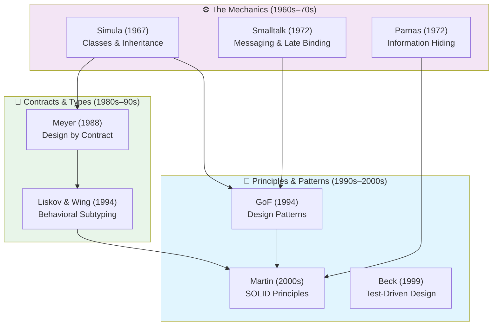
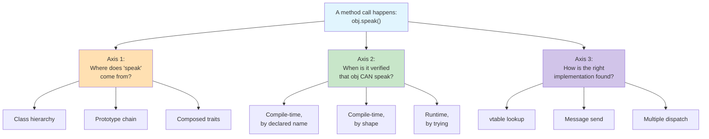
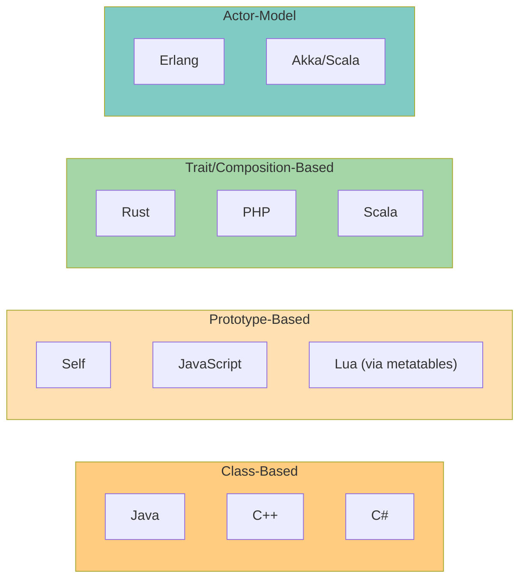
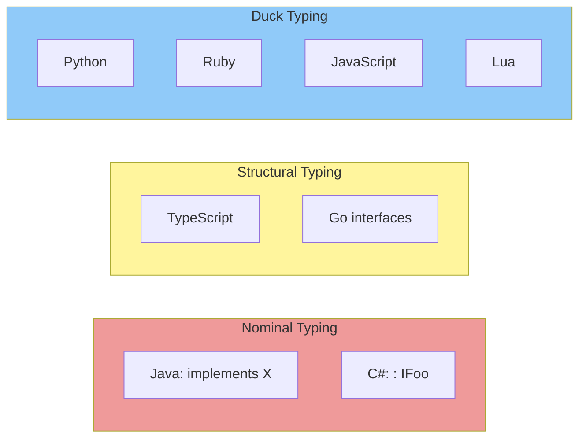
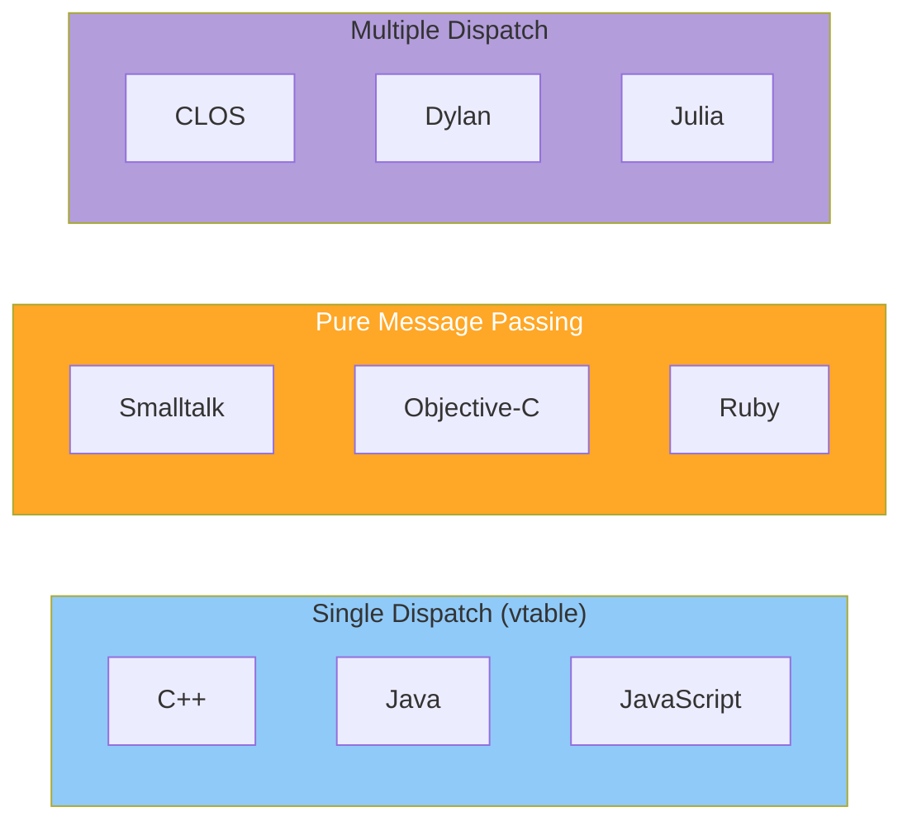
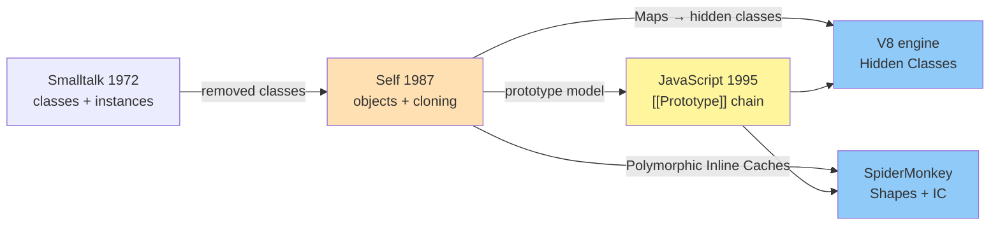

# OOP & Design

If **paradigms** dictate *what* a program is made of, **design** dictates *how* those pieces are shaped, connected, and maintained over time.

This section traces the evolution of Object-Oriented (OO) design: how the basic mechanics of encapsulation, inheritance, and polymorphism evolved into robust principles for managing software complexity.

## The Evolution of Object Design

Object-oriented design did not emerge fully formed. It is the result of decades of trial, error, and formalization, shifting from modeling real-world taxonomies to managing code dependencies.


```mermaid
flowchart TD
    subgraph Mechanics["⚙️ The Mechanics (1960s–70s)"]
        Simula["Simula (1967)<br/>Classes & Inheritance"]
        Smalltalk["Smalltalk (1972)<br/>Messaging & Late Binding"]
        Parnas["Parnas (1972)<br/>Information Hiding"]
    end

    subgraph Contracts["📜 Contracts & Types (1980s–90s)"]
        DbC["Meyer (1988)<br/>Design by Contract"]
        LSP["Liskov & Wing (1994)<br/>Behavioral Subtyping"]
    end

    subgraph Principles["📐 Principles & Patterns (1990s–2000s)"]
        GoF["GoF (1994)<br/>Design Patterns"]
        SOLID["Martin (2000s)<br/>SOLID Principles"]
        TDD["Beck (1999)<br/>Test-Driven Design"]
    end

    Simula --> DbC
    Simula --> GoF
    Smalltalk --> GoF
    Parnas --> SOLID
    DbC --> LSP
    LSP --> SOLID
    GoF --> SOLID

    style Mechanics fill:#f3e5f5
    style Contracts fill:#e8f5e9
    style Principles fill:#e1f5fe
```

---

## 1. The Core Mechanics (The Three Pillars)

Classic textbooks define OOP via three pillars. However, in the Atlas view, these are not just definitions—they are historical solutions to specific problems of procedural programming.

### Encapsulation & Information Hiding

Often conflated, these are two related but distinct concepts.

*   **Information Hiding** (David Parnas, 1972): A design rule. A module should hide its secret (a design decision, a data structure, or an algorithm) from the rest of the system to prevent ripple effects when that decision changes.
*   **Encapsulation**: The language mechanism (objects, access modifiers like `private`) that bundles data and the methods that operate on it, enabling information hiding.

**The Trap of Anemic Models:**
Simply making fields `private` and adding `getters` and `setters` is *not* true encapsulation—it exposes the internal data structure anyway. True OO design relies on **"Tell, Don't Ask"**: you tell an object what to do, rather than asking for its state and making decisions outside of it.

### Polymorphism

From Greek *poly* (many) and *morph* (form). In OOP, it means different objects can respond to the same message in their own specific way.

Polymorphism is not a single mechanism — it is a **family** of four distinct mechanisms, first taxonomized by Cardelli & Wegner (1985):

- **Parametric** (generics) — one implementation for any type
- **Inclusion** (subtype) — substitution via inheritance or interfaces
- **Overloading** — same name, different signatures
- **Coercion** — implicit type conversion

> 🔍 **Deep Dive:** For the full taxonomy with diagrams, dispatch mechanisms, and cross-language examples, see **[OOP Deep Dive: Polymorphism, Subtyping & Mechanics](oop-deep-dive.md)**.

Mechanically, inclusion polymorphism is achieved via **Late Binding** (Dynamic Dispatch). In procedural code, the compiler hardwires which function to call. In OOP, the decision of *which code to execute* is deferred until runtime, based on the type of the receiver.

*   **Subtype Polymorphism (Inheritance)**: `Dog` and `Cat` inherit from `Animal` and override `speak()`. (C++, Java).
*   **Structural / Duck Typing**: If it walks like a duck and quacks like a duck, it is a duck. No explicit inheritance needed. (Python, Ruby, Go interfaces).

Polymorphism is the ultimate tool for **dependency inversion**: the caller depends on an abstraction (the message interface), completely decoupled from the concrete implementation.

### Inheritance vs. Composition

Inheritance was introduced in Simula (1967) to model taxonomies ("A Car is a Vehicle"). It allows a new class to absorb the data and behavior of an existing class.

However, implementation inheritance creates the **tightest form of coupling** in software design. It leads to the **Fragile Base Class Problem**: a change in a superclass can inadvertently break assumptions in distant subclasses.

**The Paradigm Shift:**
By 1994, the Gang of Four (GoF) explicitly warned against overusing it, minting the golden rule of modern OO design:
> *"Favor object composition over class inheritance."*

Instead of *being* a thing (inheritance), an object should *contain* a thing (composition) and delegate work to it. Today, features like **Traits** (Rust, PHP) and **Default Interfaces** (Java) provide code reuse without the rigid hierarchies of classic inheritance.

---

## 2. Object Models: How Different Languages Implement OOP

A common source of confusion (and a great question to ask yourself) is: *"Is JavaScript's prototype system the same kind of thing as Go's structural interfaces?"* The answer is **no** — they solve completely different problems. OOP implementation is not one spectrum; it is **three independent axes** that languages combine in different ways:

1. **Where does behavior come from?** (inheritance mechanism)
2. **When is type compatibility checked?** (nominal vs. structural vs. duck)
3. **How is a method call dispatched?** (single dispatch, message passing, multiple dispatch)

A language's "OOP flavor" is really a *point in this 3D space*, not a single category.


```mermaid
flowchart TD
    Q["A method call happens:<br/>obj.speak()"] --> A1["Axis 1:<br/>Where does 'speak'<br/>come from?"]
    Q --> A2["Axis 2:<br/>When is it verified<br/>that obj CAN speak?"]
    Q --> A3["Axis 3:<br/>How is the right<br/>implementation found?"]

    A1 --> A1a["Class hierarchy"]
    A1 --> A1b["Prototype chain"]
    A1 --> A1c["Composed traits"]

    A2 --> A2a["Compile-time,<br/>by declared name"]
    A2 --> A2b["Compile-time,<br/>by shape"]
    A2 --> A2c["Runtime,<br/>by trying"]

    A3 --> A3a["vtable lookup"]
    A3 --> A3b["Message send"]
    A3 --> A3c["Multiple dispatch"]

    style Q fill:#e1f5fe
    style A1 fill:#ffe0b2
    style A2 fill:#c8e6c9
    style A3 fill:#d1c4e9
```

### Axis 1 — Where Does Behavior Come From?

This is the classic "inheritance mechanism" question: when an object doesn't have a method itself, where does the runtime look for it?


```mermaid
flowchart LR
    subgraph Class["Class-Based"]
        direction TB
        C1["Java"]
        C2["C++"]
        C3["C#"]
    end

    subgraph Proto["Prototype-Based"]
        direction TB
        P1["Self"]
        P2["JavaScript"]
        P3["Lua (via metatables)"]
    end

    subgraph Trait["Trait/Composition-Based"]
        direction TB
        T1["Rust"]
        T2["PHP"]
        T3["Scala"]
    end

    subgraph Actor["Actor-Model"]
        direction TB
        Ac1["Erlang"]
        Ac2["Akka/Scala"]
    end

    style Class fill:#ffcc80
    style Proto fill:#ffe0b2
    style Trait fill:#a5d6a7
    style Actor fill:#80cbc4
```

| Model | Lookup mechanism | Key idea |
|---|---|---|
| **Class-based** | Static class hierarchy, resolved at compile time into a vtable | An object *is an instance of* a fixed blueprint |
| **Prototype-based** | Runtime walk up a chain of live objects | An object *inherits directly* from another object, cloned or linked |
| **Trait-based** | Compile-time linearization/flattening of composed units | Behavior is *assembled*, not inherited from a single parent |
| **Actor-model** | No shared lookup at all — behavior lives inside an isolated process | Objects don't share state; they only exchange messages |

**Self and Lua compared:** both are prototype-based, but the mechanism differs in *how deeply it's built into the language*.

- **Self / JavaScript**: the prototype chain is part of the object's fundamental structure. Every object *has* an internal `[[Prototype]]` slot, full stop — you cannot opt out.
- **Lua**: there is no built-in concept of "prototype." Lua only has **tables** and a general-purpose **metatable** mechanism (originally meant for operator overloading: `+`, `==`, `tostring`, etc.). The metamethod `__index` happens to let you emulate a prototype chain:

```lua
local animal = { sound = "..." }
function animal:speak() return self.sound end

local dog = setmetatable({ sound = "Woof" }, { __index = animal })
print(dog:speak())  -- "Woof" — falls through to `animal` via __index
```

This is why Lua's prototype inheritance feels different: it's a **library-level pattern built from a lower-level primitive**, not a first-class language feature like in Self/JS. You could just as easily use metatables for something completely unrelated to inheritance.

### Axis 2 — When Is Type Compatibility Checked?

This is a *completely separate* question: **can this object be used where that interface is expected — and when do we find out?**


```mermaid
flowchart LR
    subgraph Nominal["Nominal Typing"]
        direction TB
        N1["Java: implements X"]
        N2["C#: : IFoo"]
    end

    subgraph Structural["Structural Typing"]
        direction TB
        S1["TypeScript"]
        S2["Go interfaces"]
    end

    subgraph Duck["Duck Typing"]
        direction TB
        D1["Python"]
        D2["Ruby"]
        D3["JavaScript"]
        D4["Lua"]
    end

    style Nominal fill:#ef9a9a
    style Structural fill:#fff59d
    style Duck fill:#90caf9
```

| Model | When checked | Rule |
|---|---|---|
| **Nominal typing** | Compile time | Type must **explicitly declare** conformance (`class Dog implements Speaker`) |
| **Structural typing** | Compile time | Type conforms automatically **if the shape matches** — no declaration needed |
| **Duck typing** | Runtime | No check at all beforehand — the call is attempted, and it either works or throws |

> 📝 **Gradual Typing** (Siek & Taha, 2006) occupies the space between structural and duck typing. A special type — `Any` in Python/mypy, `unknown`/`any` in TypeScript — is statically compatible with everything in both directions. Annotated code is checked at compile time; unannotated code falls back to runtime behavior. This allows a codebase to migrate from duck typing toward static typing incrementally, file by file. Practically: Python without mypy is duck-typed; Python with mypy and full annotations approaches structural typing; the zone in between is gradual. TypeScript with `noImplicitAny: true` and full coverage behaves as structural typing — the `any` escape hatch is what makes it gradual.

**Structural typing example (TypeScript)** — a class conforms *without ever mentioning* the interface:

```typescript
interface HasSpeak { speak(): string; }

class Dog { speak() { return "Woof"; } }  // no "implements HasSpeak"!

function makeSound(x: HasSpeak) { console.log(x.speak()); }
makeSound(new Dog()); // ✅ compiles — shape matches, checked statically
```

**Duck typing example (Python)** — same idea, but the check happens *only when the call actually runs*:

```python
class Duck:
    def speak(self): return "Quack"

class Robot:
    def speak(self): return "Beep"

def make_it_speak(thing):
    print(thing.speak())  # no check beforehand — just call it and see

make_it_speak(Duck())
make_it_speak(Robot())  # works — nobody verified a shared "type" existed
```

The difference between structural typing and duck typing is **not** what is being checked (shape/behavior) — it's **when**: a compiler doing static analysis (TypeScript, Go) vs. the interpreter finding out live (Python, Ruby, JS, Lua).

> 🔑 **Key insight:** JavaScript and Lua are duck-typed *dynamically*, but their prototype systems (Axis 1) have nothing to do with this. You could imagine a purely class-based language that is also duck-typed (Python is exactly this — classes exist, but method calls aren't checked ahead of time).

### Axis 3 — How Is the Method Call Actually Dispatched?

The final axis is about the **mechanics of dispatch** once the target method is determined to exist.


```mermaid
flowchart LR
    subgraph Single["Single Dispatch (vtable)"]
        direction TB
        V1["C++"]
        V2["Java"]
        V3["JavaScript"]
    end

    subgraph Message["Pure Message Passing"]
        direction TB
        M1["Smalltalk"]
        M2["Objective-C"]
        M3["Ruby"]
    end

    subgraph Multi["Multiple Dispatch"]
        direction TB
        MD1["CLOS"]
        MD2["Dylan"]
        MD3["Julia"]
    end

    style Single fill:#90caf9
    style Message fill:#ffa726,color:#fff
    style Multi fill:#b39ddb
```

| Model | Decision based on | Languages |
|---|---|---|
| **Single dispatch** | Only the type of the *receiver* (`obj.method()`) | C++, Java, JavaScript, Python |
| **Pure message passing** | Same as single dispatch, but *everything* is a message — even `if`, loops, and control flow are sent as messages to objects | Smalltalk, Objective-C, Ruby |
| **Multiple dispatch** | The types of **all** arguments, not just the receiver | CLOS, Dylan, Julia |

### The Combination Matrix: Where Real Languages Actually Land

Because these axes are independent, the same "Axis 1 category" can pair with completely different Axis 2/3 choices. This is why Lua and Go — both "modern, minimalist, C-inspired" languages — end up in totally different corners:

| Language | Axis 1 (behavior source) | Axis 2 (type check) | Axis 3 (dispatch) |
|---|---|---|---|
| **Java** | Class-based | Nominal | Single dispatch |
| **C++** | Class-based | Nominal | Single dispatch |
| **Go** | (no inheritance — composition only) | **Structural** | Single dispatch |
| **TypeScript** | Class-based (optional) | **Structural / Gradual** | Single dispatch |
| **Python** | Class-based | **Duck / Gradual** (with mypy) | Single dispatch |
| **Ruby** | Class-based | **Duck** | Pure message passing |
| **JavaScript** | **Prototype-based** | **Duck** | Single dispatch |
| **Lua** | **Prototype-based** (via metatables) | **Duck** | Single dispatch (via `__index`) |
| **Self** | **Prototype-based** | Duck (untyped) | Single dispatch |
| **Smalltalk** | Class-based | Duck | **Pure message passing** |
| **CLOS** | Class-based (generic functions) | Duck | **Multiple dispatch** |
| **Rust** | **Trait-based** | Nominal (trait bounds) | Single dispatch (static, monomorphized) |
| **Erlang** | **Actor-model** (no shared objects) | N/A | Pattern matching on messages |

**Now the earlier question has a precise answer:**
> *"Is JavaScript's prototype chain the same as Go's structural typing?"*
> No — JavaScript's prototypes are an **Axis 1** answer (where behavior comes from). Go's interfaces are an **Axis 2** answer (when compatibility is checked). JavaScript actually answers Axis 2 with **duck typing**, completely independent of its prototype system. Go, meanwhile, has no prototypes or classes at all — it answers Axis 1 with pure composition (embedding), and Axis 2 with structural typing.

### Deep Dive: From Self to JavaScript — Prototypes Without Classes

This is one of the most consequential — and least widely known — lineages in language history: **the entire object model of JavaScript, running in billions of browsers today, is a direct descendant of a relatively obscure research language, Self.**


```mermaid
flowchart LR
    Smalltalk4["Smalltalk 1972<br/>classes + instances"] -->|removed classes| Self4["Self 1987<br/>objects + cloning"]
    Self4 -->|prototype model| JS4["JavaScript 1995<br/>[[Prototype]] chain"]
    Self4 -->|Maps → hidden classes| V8["V8 engine<br/>Hidden Classes"]
    Self4 -->|Polymorphic Inline Caches| SM["SpiderMonkey<br/>Shapes + IC"]
    JS4 --> V8
    JS4 --> SM

    style Self4 fill:#ffe0b2
    style JS4 fill:#fff59d
    style V8 fill:#90caf9
    style SM fill:#90caf9
```

**Self (1987)**, created by **David Ungar and Randall Smith** at Xerox PARC / Stanford, was born from a radical question: *what if we removed classes from Smalltalk entirely?*

Smalltalk still had a class/instance distinction — classes were themselves objects, but every instance was created from a class template. Self went further:

- There are **no classes** — only objects.
- A new object is created by **cloning** an existing object (a *prototype*) and modifying its slots.
- When a message is sent to an object, the runtime looks for a matching slot; if not found, it walks up the **parent link(s)** — the *prototype chain* — until a match is found or the chain ends.
- Behavior and data are stored identically as "slots" — a method is just a slot containing executable code.

This model eliminated the class/instance split, but it introduced a new engineering challenge: how do you make dynamic slot lookup on individual objects *fast*? The Self team's research (Chambers, Ungar) produced two techniques that became foundational to modern language implementation:

- **Maps (hidden classes)** — grouping objects with identical slot layout so the runtime can treat them like structs internally.
- **Polymorphic Inline Caches (PICs)** — caching the result of a dispatch lookup at each call site.

**JavaScript (1995)**, designed by **Brendan Eich in ten days**, was told to "look like Java," but Eich brought two other influences into its core: **Scheme** (functions as first-class values, closures) and **Self** (the object model). Rather than classical class-based inheritance, JS objects carry an internal `[[Prototype]]` link:

```js
const animal = { speak() { return "..."; } };
const dog = Object.create(animal);   // dog's prototype is animal
dog.speak();                          // walks up the prototype chain
```

`__proto__`, `Object.create()`, and the prototype chain are the Self object model, transplanted almost unchanged into a C-like syntax. Even the ES6 `class` keyword (2015) is **pure syntactic sugar** — under the hood, `class` still builds a prototype chain; there are no classes in the runtime.

The influence didn't stop at semantics. Modern JS engines reuse Self's *implementation* techniques directly:

- **V8** (Chrome/Node.js) uses **"Hidden Classes"** — a direct descendant of Self's "Maps."
- **SpiderMonkey** (Firefox) uses **"Shapes"** — the same idea, different name.
- Both engines use **Inline Caches**, tracing their lineage straight back to the 1989–1991 Self papers on efficient dynamic dispatch.

> In short: **Self solved a language-design problem in 1987 that nobody outside academia noticed — and then quietly became the invisible architecture running most of the interactive web.**

---

## 3. The Era of Formalization (1980s–1990s)

As OOP grew beyond UI programming and simulations into massive enterprise systems, developers needed rigorous rules to ensure systems didn't collapse under their own weight.

### Design by Contract (DbC)
Introduced by **Bertrand Meyer** in 1988 (in the Eiffel language). It states that objects should interact based on mutual obligations:
*   **Preconditions**: What must be true before calling a method.
*   **Postconditions**: What the method guarantees upon completion.
*   **Invariants**: What is always true about the object's state.

*If you break a precondition, it's the caller's fault. If you break a postcondition, it's the receiver's fault. This eliminated defensive programming ("checking for null everywhere").*

### The Liskov Substitution Principle (LSP)
In 1994, **Barbara Liskov** and Jeannette Wing formalized what it actually means to be a "subtype."

> *"If S is a subtype of T, then objects of type T may be replaced with objects of type S without altering any of the desirable properties of the program."*

This connected Meyer's contracts with inheritance: a subclass cannot demand more (stricter preconditions) or deliver less (weaker postconditions) than its parent. Violating LSP means your inheritance is conceptually wrong, even if the code compiles.

---

## 4. The Vocabulary of Design (GoF Patterns)

In 1994, Gamma, Helm, Johnson, and Vlissides published *Design Patterns: Elements of Reusable Object-Oriented Software*.

They didn't invent new language features; they cataloged **recurring architectural structures** that experienced developers used to resolve competing forces in software (e.g., flexibility vs. performance).

Patterns gave the industry a shared vocabulary. Instead of saying, "Let's create an interface, and have a list of objects that implement it, and when state changes, we loop through and call a method on them," a developer could just say: *"Let's use an **Observer**."*

### The 23 GoF Patterns

| Creational | Structural | Behavioral |
|---|---|---|
| [Abstract Factory](creational/abstract-factory.md) | [Adapter](structural/adapter.md) | [Chain of Responsibility](behavioral/chain-of-responsibility.md) |
| [Builder](creational/builder.md) | [Bridge](structural/bridge.md) | [Command](behavioral/command.md) |
| [Factory Method](creational/factory-method.md) | [Composite](structural/composite.md) | [Interpreter](behavioral/interpreter.md) |
| [Prototype](creational/prototype.md) | [Decorator](structural/decorator.md) | [Iterator](behavioral/iterator.md) |
| [Singleton](creational/singleton.md) | [Facade](structural/facade.md) | [Mediator](behavioral/mediator.md) |
| | [Flyweight](structural/flyweight.md) | [Memento](behavioral/memento.md) |
| | [Proxy](structural/proxy.md) | [Observer](behavioral/observer.md) |
| | | [State](behavioral/state.md) |
| | | [Strategy](behavioral/strategy.md) |
| | | [Template Method](behavioral/template-method.md) |
| | | [Visitor](behavioral/visitor.md) |

---

## 5. SOLID: Managing Dependencies (2000s)

Coined and popularized by **Robert C. Martin (Uncle Bob)** in the late 1990s and early 2000s, SOLID is a collection of 5 principles aimed squarely at dependency management.

| Principle | Meaning | The Core Goal |
|-----------|---------|---------------|
| **S**RP (Single Responsibility) | A class should have one, and only one, reason to change. | High cohesion. Limit the blast radius of changes. |
| **O**CP (Open/Closed) | Software entities should be open for extension, but closed for modification. | Add new behavior by writing new code, not changing old code (via polymorphism). |
| **L**SP (Liskov Substitution) | Subtypes must be substitutable for their base types. | Ensure inheritance hierarchies are logically sound. |
| **I**SP (Interface Segregation) | Clients should not be forced to depend upon interfaces they do not use. | Keep interfaces small and focused ("role interfaces"). |
| **D**IP (Dependency Inversion) | High-level modules should not depend on low-level modules. Both should depend on abstractions. | Protect business logic from infrastructure details. |

SOLID heavily influenced the rise of **Test-Driven Development (TDD)** and **Agile** practices. Code that follows SOLID is inherently easier to mock and unit-test.

### Multi-Faced Single Responsibility Principle

Alexander Zhidkov explores the ambiguity of SRP, noting that "Single Responsibility" can mean different things depending on interpretation — highlighting the importance of clear terminology in design discussions. The principle remains valuable, but its meaning must be carefully defined in each context.

→ [Multi-Faced SRP article](../../works/talks/zhidkov-2024-srp.md)

### Structural Design (Constantine 1966–1975, Zhidkov 2020–present)

Larry Constantine's **Structural Design** introduced the principle of **balanced system form** — an objective, checkable design criterion. Unlike subjective metrics like "number of abstraction levels," balanced form provides clear guidance for determining whether code is well-structured.

Alexander Zhidkov rediscovered and applied Constantine's work, finding it the objective design principle he had been searching for after years of exploring mainstream literature.

The principle states that a well-designed system should have balanced coupling and cohesion — a structural property that can be measured and verified.

→ [Larry Constantine — Structural Design] ·
[Alexander Zhidkov](../../authors/alexander-zhidkov.md)

---

## 6. Modern Echoes

Today, pure class-based inheritance is less prominent, but OO *design principles* govern modern architecture:

1.  **Microservices:** A microservice architecture is essentially Alan Kay's original vision of OOP applied at a distributed, network level (isolated state, message passing, late binding).
2.  **Hexagonal Architecture:** Relies entirely on the Dependency Inversion Principle (DIP) to isolate the domain from the database and web framework.
3.  **Functional OOP:** Modern design often blends paradigms using the **Functional Core, Imperative Shell** pattern. Objects are used to manage I/O and dependencies, while pure functions handle the domain logic.

## See Also

- 📖 **Authors:** [David Parnas](../../authors/david-parnas.md) · [Barbara Liskov](../../authors/barbara-liskov.md) · [Robert C. Martin](../../authors/robert-c-martin.md) · [Alexander Zhidkov](../../authors/alexander-zhidkov.md)
- 📚 **Works:** [Design Patterns (GoF)](../../works/books/gof-1994-design-patterns.md) · [Behavioral Subtyping (Liskov)](../../works/papers/liskov-1994-subtyping.md)
- 🗺️ **Paths:** [OOP & Design Reading Path](../../reading-paths/oop-and-design-path.md)
- 🧭 **Topics:** [Paradigms](../paradigms/index.md) · [Architecture](../architecture/index.md)
- 🔬 **Deep Dive:** [OOP Deep Dive: Polymorphism, Subtyping & Mechanics](oop-deep-dive.md)