# OOP Deep Dive: Polymorphism, Subtyping & Mechanics

The [OOP & Design](index.md) topic covers the evolution of design
principles — from encapsulation and GoF patterns to SOLID. This page
goes one level deeper into the **underlying mechanisms** that make OOP
work: polymorphism in all its forms, dispatch strategies, and the
relationship between types and subtypes.

---

## Polymorphism: The Full Taxonomy

Polymorphism — from Greek *poly* (many) and *morphē* (form) — is a
family of mechanisms that allow the **same piece of code to work with
values of different types** in different contexts.

Most introductions to OOP reduce polymorphism to method overriding.
In reality, polymorphism is a rich taxonomy first systematized by
**Luca Cardelli** and **Peter Wegner** in their 1985 paper
*"On Understanding Types, Data Abstraction, and Polymorphism."*

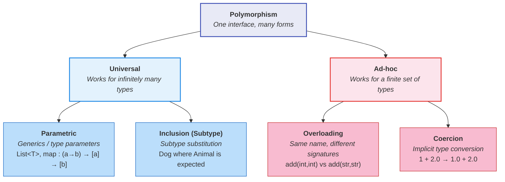

### Key distinction

| Property | Universal | Ad-hoc |
|----------|-----------|--------|
| **How many types?** | Potentially infinite — works for *any* type | Finite — works for a specific list of types |
| **Single implementation?** | Yes — one body of code handles all types | No — each type gets its own implementation |
| **Type awareness** | The function does *not* inspect the type | The function *does* inspect or branch on the type |

---

## Static vs. Dynamic Polymorphism

Before diving into the four forms, it is important to understand a
**orthogonal axis** that cuts across all of them: *when* is the
polymorphic decision made?

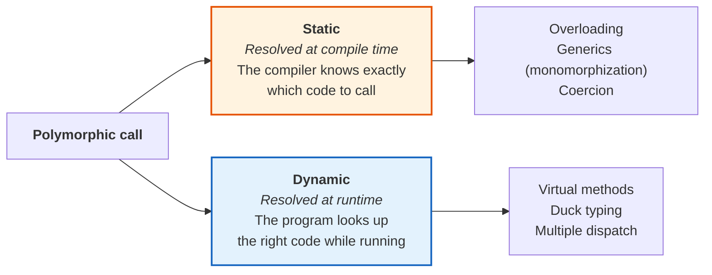

| Axis | Static polymorphism | Dynamic polymorphism |
|------|--------------------|--------------------|
| **When resolved** | Compile time | Runtime |
| **Performance** | Zero overhead — direct call | Small overhead — lookup per call |
| **Flexibility** | Fixed at compile time | Can vary with runtime data |
| **Typical mechanisms** | Overloading, generics, coercion | Virtual methods, duck typing, multiple dispatch |
| **Typical languages** | Java (overloading), C++ (templates), Rust | Python, Ruby, Smalltalk, Julia |
| **Error detection** | Type errors caught early | Type errors surface at runtime |

> **Key insight:** the same *kind* of polymorphism can be resolved
> either statically or dynamically depending on the language. Generics
> in Rust are resolved statically via monomorphization; generics in Java
> use type erasure with some runtime cost. Subtype polymorphism in C++
> is dynamic for virtual methods but static when using CRTP templates.

This axis is not part of the Cardelli–Wegner taxonomy (which classifies
*what* varies) — it classifies *when* the variation is resolved. Both
dimensions together give a complete picture of any polymorphic mechanism.

---

## Universal Polymorphism

### Parametric Polymorphism (Generics)

Parametric polymorphism allows a function or data structure to be
written **generically** — operating uniformly on values of any type,
without knowing or caring what that type is.

The function's signature contains **type parameters** (also called
**type variables**). The same code works for `List<Int>`, `List<String>`,
`List<Order>` — without any change.

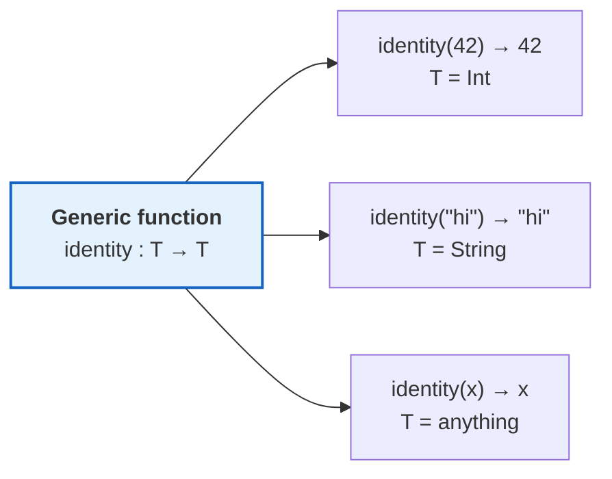

#### Examples across languages

**Haskell** — parametric polymorphism is the default:
```haskell
-- Works for any type 'a'. One implementation.
identity :: a -> a
identity x = x

-- Works for any list of any type.
length :: [a] -> Int
length []     = 0
length (_:xs) = 1 + length xs
```

**Java** — generics (since Java 5):
```java
// T is a type parameter — resolved at compile time
public <T> T identity(T value) {
    return value;
}

// Usage:
String s = identity("hello");  // T = String
Integer n = identity(42);      // T = Integer
```

**TypeScript** — structural generics:
```typescript
function identity<T>(value: T): T {
    return value;
}

// Works with any type
identity<string>("hello");
identity<number>(42);
identity({ name: "Atlas" }); // T inferred as { name: string }
```

**Rust** — monomorphized generics:
```rust
fn identity<T>(value: T) -> T {
    value
}

// The compiler generates separate copies for each concrete type.
// Zero runtime cost.
let s = identity("hello"); // T = &str
let n = identity(42);      // T = i32
```

#### Why it matters

- **Code reuse without duplication** — write sorting once, use for any comparable type.
- **Type safety** — the compiler enforces that `List<Order>` only contains `Order` values.
- **No runtime cost** (in languages with monomorphization like Rust, C++) or minimal cost (Java's type erasure).

> 📖 **Lineage:** Parametric polymorphism was formalized in
> **System F** (Girard 1972 / Reynolds 1974) and is the basis
> of **Hindley–Milner** type inference (Milner 1978), which powers
> ML, Haskell, Rust, and TypeScript's type inference.

---

### Inclusion Polymorphism (Subtype Polymorphism)

Inclusion polymorphism allows a function to accept **any subtype** of
its declared parameter type. This is the form of polymorphism most
commonly associated with OOP — and the one that enables the
**Liskov Substitution Principle (LSP)**.

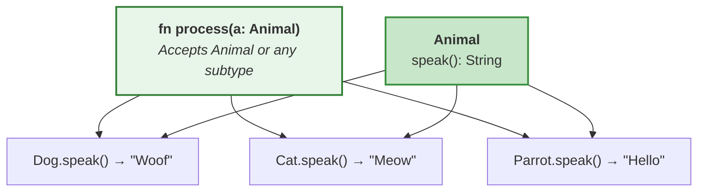

#### The mechanism: late binding (dynamic dispatch)

When `process(a)` calls `a.speak()`, the decision of *which* `speak()`
implementation to run is deferred until **runtime**. The compiler does
not hardwire the call; instead, it looks up the actual type of `a` at
the moment of invocation.

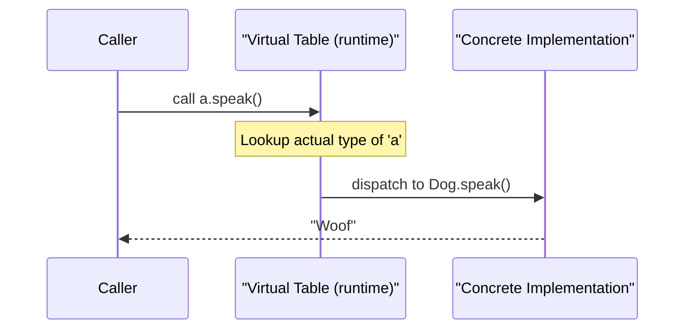

This is the mechanism behind:
- **Virtual methods** in C++ / Java / C#
- **Protocols** in Swift
- **Traits** (as trait objects) in Rust
- **Duck typing** in Python / Ruby (resolved dynamically)

#### Subtype ≠ Subclass

A critical distinction:

| Concept | Definition | Mechanism |
|---------|-----------|-----------|
| **Subclass** | A class that *inherits implementation* from another class | `class Dog extends Animal` |
| **Subtype** | A type whose values can be *safely substituted* where the supertype is expected | Behavioral compatibility (LSP) |

A subclass is *usually* a subtype — but not always. If `Dog` overrides
a method in a way that violates the parent's contract (e.g., throws
unexpected exceptions, or demands stricter preconditions), it is a
subclass but **not** a behavioral subtype. This is exactly what
**Liskov & Wing (1994)** formalized.

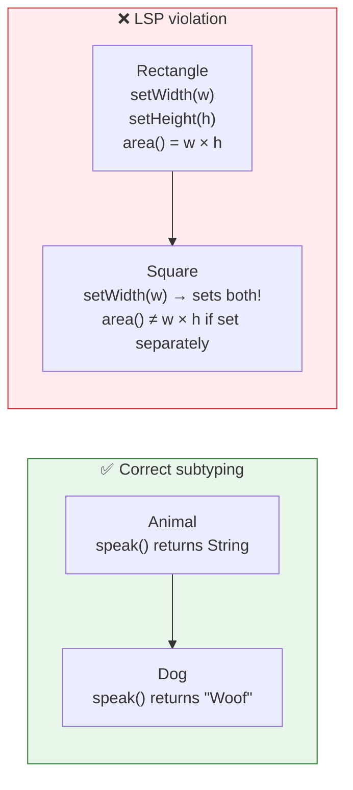

The classic **Square/Rectangle** problem: a `Square` is mathematically
a special case of a `Rectangle`, but as a *subtype* in OOP, `Square`
violates `Rectangle`'s contract because setting width independently
of height breaks the postcondition `area() == width × height`.

#### Inclusion polymorphism with interfaces

When a language supports interfaces (Java, Go, TypeScript), they serve
as a **type without implementation** — any class implementing the
interface is a subtype of it, regardless of its place in the inheritance
hierarchy:

```java
// Interface as a type
interface Speakable {
    String speak();
}

// Unrelated classes, both subtypes of Speakable
class Dog implements Speakable {
    public String speak() { return "Woof"; }
}

class ChatBot implements Speakable {
    public String speak() { return "Hello, human"; }
}

// This function uses inclusion polymorphism
void greet(Speakable s) {
    System.out.println(s.speak());
}
```

> In **Go**, interfaces are satisfied **implicitly** (structural subtyping):
> if a type has the right methods, it implements the interface — no
> `implements` keyword needed. This is closer to duck typing with
> compile-time safety.

#### Duck typing: structural polymorphism at runtime

Duck typing is a style of inclusion-like polymorphism found in
**dynamically typed languages** such as Python, Ruby, and JavaScript.
Instead of checking whether an object declares a specific type or
implements a named interface, the language checks only whether the
object **supports the required behavior at the moment of the call**.

> *"If it walks like a duck and quacks like a duck, it is a duck."*
> — James Whitcomb Riley (popularized in programming by Alex Martelli, 2000)

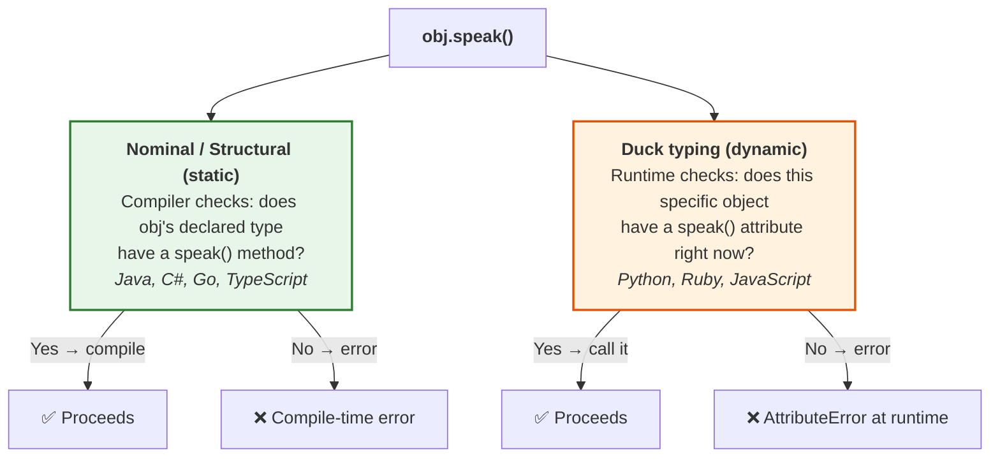

**Python example — duck typing in practice:**
```python
class Dog:
    def speak(self):
        return "Woof"

class ChatBot:
    def speak(self):
        return "Hello, human"

class Kettle:
    def speak(self):
        return "Whistle!"

# No shared base class or interface — duck typing at work
def greet(entity):
    # Python does not check the type of 'entity'.
    # It simply looks up 'speak' on the object at runtime.
    print(entity.speak())

greet(Dog())     # → "Woof"
greet(ChatBot()) # → "Hello, human"
greet(Kettle())  # → "Whistle!" — works, even though a Kettle is not an Animal
```

This flexibility is powerful — but errors surface only at **runtime**:
```python
class Rock:
    pass

greet(Rock())
# AttributeError: 'Rock' object has no attribute 'speak'
# The program crashes; the compiler gave no warning.
```

**Comparison across the spectrum:**

| Style | Check | When | Languages |
|-------|-------|------|-----------|
| **Nominal subtyping** | Declared type must match | Compile time | Java, C#, C++ |
| **Structural subtyping** | Shape of type must match | Compile time | Go, TypeScript |
| **Duck typing** | Object must have the method | Runtime | Python, Ruby, JS |

> **Static duck typing** — TypeScript and Go occupy an interesting
> middle ground: they check structural compatibility at compile time
> without requiring explicit `implements` declarations. This gives the
> flexibility of duck typing with the safety of static checking.

```typescript
// TypeScript — structural typing (static duck typing)
interface Speakable {
    speak(): string;
}

// No 'implements Speakable' — but it fits the shape
class Kettle {
    speak() { return "Whistle!"; }
}

function greet(s: Speakable) {
    console.log(s.speak());
}

greet(new Kettle()); // ✅ Compiles — Kettle has speak(): string
```

> 📖 **Lineage:** Duck typing as a term was coined in the Python
> community by **Alex Martelli** (2000), though the concept appears
> implicitly in Smalltalk (Kay, 1970s) and LISP. Structural type
> systems that formalize the same idea at compile time trace back to
> **Cardelli's** record subtyping (1984) and **Pierce's** work on
> structural subtyping in *Types and Programming Languages* (2002).

---

## Ad-hoc Polymorphism

### Overloading

Overloading allows **multiple functions with the same name** but
**different signatures** (different argument types or arity). The
compiler or runtime selects the correct implementation based on the
types of the arguments at the call site.

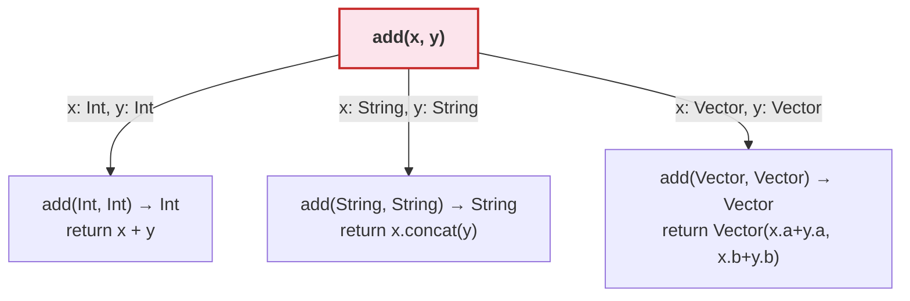

#### Examples

**Java** — method overloading (resolved at compile time):
```java
class Calculator {
    int add(int a, int b)          { return a + b; }
    double add(double a, double b) { return a + b; }
    String add(String a, String b) { return a + b; }
}

// Compiler picks the right version based on argument types
calc.add(1, 2);           // → int version
calc.add(1.0, 2.0);       // → double version
calc.add("hi", " there"); // → String version
```

**Haskell** — type classes (a principled approach to overloading):
```haskell
-- The Eq type class defines overloaded equality
class Eq a where
    (==) :: a -> a -> Bool

-- Each type provides its own implementation
instance Eq Int where
    x == y = intEq x y    -- primitive integer comparison

instance Eq Char where
    x == y = ord x == ord y

-- (==) is overloaded: same symbol, different implementations
```

> Haskell's **type classes** (Wadler & Blott 1989) are the most elegant
> formalization of overloading — they turn ad-hoc polymorphism into
> something almost as structured as parametric polymorphism. Rust's
> **traits** descend directly from this idea.

#### Overloading vs. Parametric polymorphism

| Aspect | Parametric | Overloading |
|--------|-----------|-------------|
| Implementations | **One** body for all types | **Multiple** bodies, one per type |
| Type awareness | Unaware of concrete type | Aware — different code per type |
| Extension | Works automatically for new types | Must add new overload for each type |
| Resolution | None needed (or monomorphization) | Compiler picks at call site |

> **Combining both** is common and powerful: a generic sorting function
> (`sort :: Ord a => [a] -> [a]`) uses parametric polymorphism for the
> list structure, and overloading (via `Ord` type class) for the
> comparison operation.

---

### Coercion (Implicit Type Conversion)

Coercion is a form of ad-hoc polymorphism where the **language
automatically converts** a value from one type to another to make an
operation work. The function *appears* polymorphic — it accepts
different types — but internally, the language inserts a conversion
step.

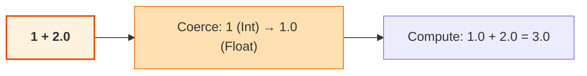

#### Explicit vs. implicit

| Kind | Name | Who controls it | Example |
|------|------|----------------|---------|
| **Explicit** | Casting | The programmer | `(double) myInt` in Java |
| **Implicit** | Coercion | The language/compiler | `1 + 2.0` → int promoted to float |

Only **implicit** coercion is considered a form of polymorphism —
because from the programmer's perspective, the `+` operator appears
to accept both `Int` and `Float` without explicit intervention.

#### Widening vs. narrowing

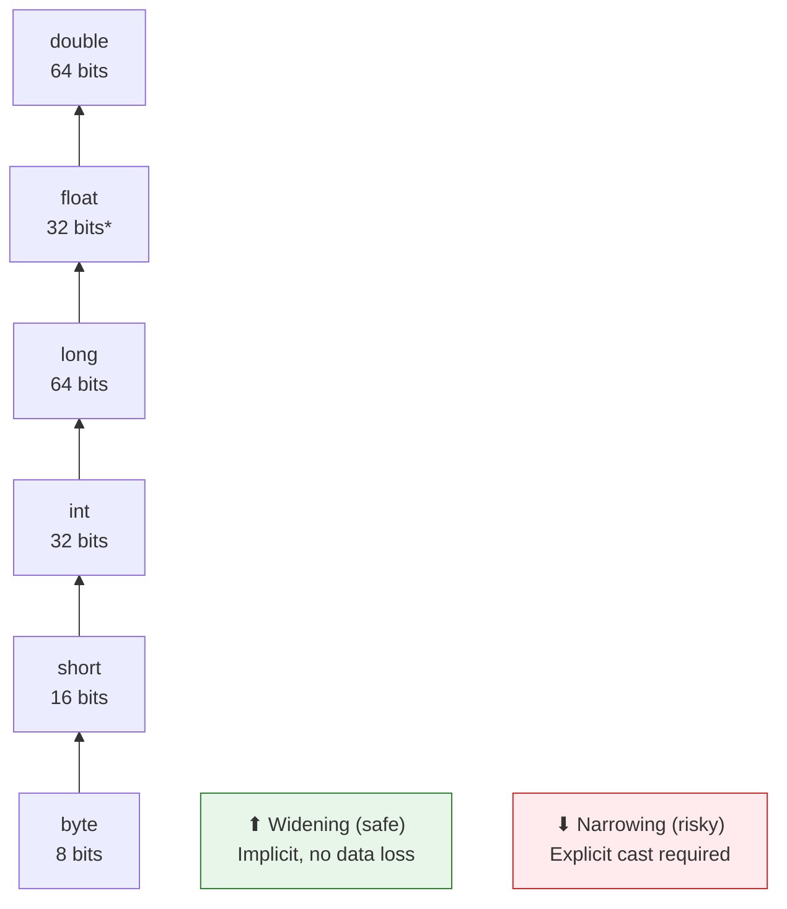

**Widening** (upcast in the type hierarchy) is generally safe and
done implicitly by the compiler:
```java
int x = 42;
double y = x;  // Implicit widening: int → double (safe)
```

**Narrowing** (downcast) risks data loss and must be explicit:
```java
double x = 3.14;
int y = (int) x;  // Explicit narrowing: double → int (loses .14)
```

#### The danger: JavaScript's coercion chaos

Languages with aggressive implicit coercion can produce surprising
results:

```javascript
// JavaScript — implicit coercion gone wild
"5" + 3     // → "53"  (number coerced to string, then concatenated)
"5" - 3     // → 2     (string coerced to number, then subtracted)
true + true // → 2     (booleans coerced to numbers)
[] + {}     // → "[object Object]"
{} + []     // → 0     (depending on context)
```

This is why many style guides prefer **explicit conversion** and why
TypeScript adds static checking on top of JavaScript.

**Contrast with Python** — which is strict about coercion:
```python
"5" + 3       # TypeError: can only concatenate str to str
"5" + str(3)  # "53" — explicit conversion required
```

---

## How the Four Forms Work Together

In real-world code, these forms of polymorphism combine. Consider
sorting a list of objects:

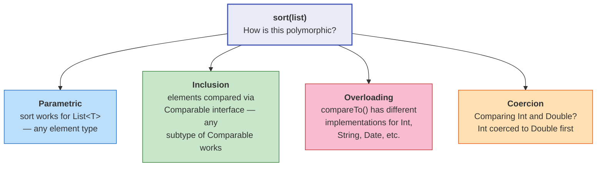

**Java example combining all four:**
```java
// Parametric: T is a type variable
// Inclusion: T must be a subtype of Comparable<T>
public static <T extends Comparable<T>> void sort(List<T> list) {
    // ...
    // Overloading: compareTo() dispatches to the right implementation
    if (list.get(i).compareTo(list.get(j)) > 0) {
        swap(list, i, j);
    }
}

// Coercion: comparing Integer and Double in a mixed context
// (would require explicit handling in Java, but implicit in some languages)
```

---

## Function Signatures

A **function signature** is the compile-time identity of a function:
its name, parameter types, and return type. Signatures are the
mechanism by which the compiler resolves overloading and checks
type safety.

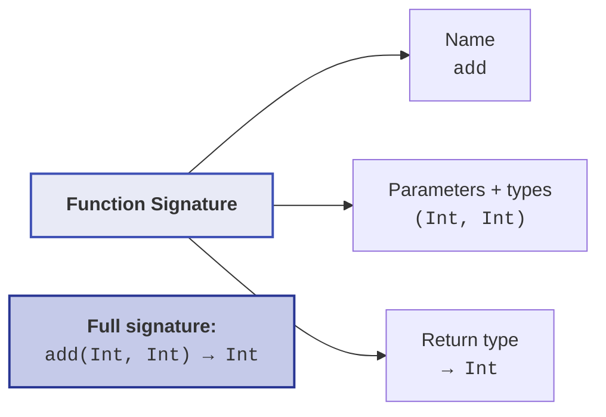

| Language | Signature includes return type? | Overloading by return type? |
|----------|-------------------------------|---------------------------|
| Java | Yes (for full signature) | No — cannot overload by return type alone |
| C++ | Yes | No |
| Haskell | Yes (type annotation) | Yes — via type classes |
| Rust | Yes | No — but traits enable similar patterns |
| Python | No static signature | N/A — dynamic dispatch |

---

## Dispatch: How the Right Code Gets Called

Dispatch is the mechanism by which a language decides **which function
body to execute** when a polymorphic function is called.

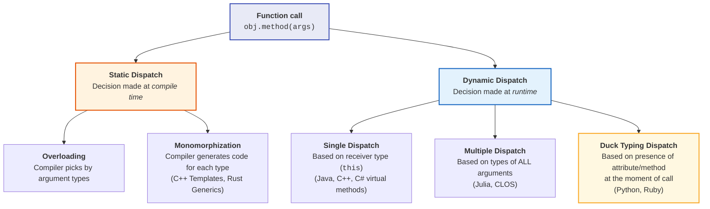

### Single dispatch vs. multiple dispatch

**Single dispatch** (most OOP languages): the method to call is
determined by the **type of the receiver** (`this` / `self`) only:

```java
// Java — single dispatch
// Which draw() is called depends only on the type of 'shape'
shape.draw(canvas);  // dispatches on shape's runtime type
                     // does NOT dispatch on canvas's type
```

**Multiple dispatch** (Julia, Common Lisp CLOS, Clojure): the method
is selected based on the **runtime types of all arguments**:

```julia
# Julia — multiple dispatch
collide(a::Asteroid, b::Asteroid) = "boom"
collide(a::Asteroid, b::Spaceship) = "damage"
collide(a::Spaceship, b::Asteroid) = "dodge"
collide(a::Spaceship, b::Spaceship) = "communicate"

# The runtime picks the right method based on BOTH arguments
collide(Asteroid(), Spaceship())  # → "damage"
```

**Duck typing dispatch** (Python, Ruby): the runtime does not check
the type of the receiver at all — it simply looks for the requested
attribute or method on the object and calls it if found:

```python
# Python — duck typing dispatch
# No type check. Just: does this object have 'speak'?
def greet(entity):
    entity.speak()   # resolved entirely at runtime, per object
```

---

## Summary: The Polymorphism Landscape

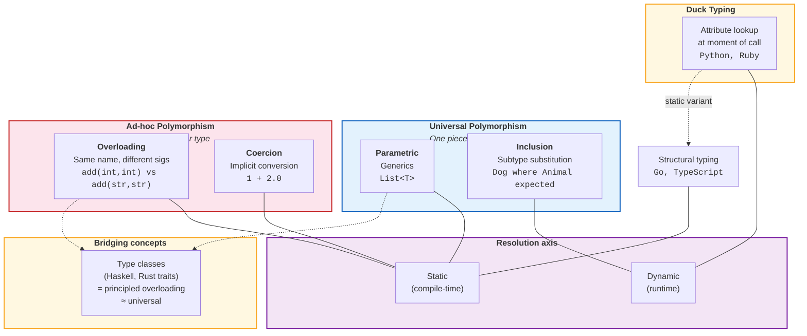

### Quick reference

| Form | "One code for many types?" | Resolved when? | Key mechanism | Key languages |
|------|---------------------------|----------------|---------------|---------------|
| **Parametric** | Yes — truly generic | Compile time | Type parameters | Haskell, Rust, Java, TS |
| **Inclusion** | Yes — via subtype hierarchy | Runtime | Virtual dispatch (vtable) | Java, C++, Python, Go |
| **Overloading** | No — separate impl per type | Compile time | Signature matching | Java, C++, Haskell (type classes) |
| **Coercion** | No — conversion inserted | Compile time | Type promotion rules | C, Java, JavaScript |
| **Duck typing** | Yes — any object with the right methods | Runtime | Attribute lookup | Python, Ruby, JS |
| **Structural typing** | Yes — any type with the right shape | Compile time | Shape matching | Go, TypeScript |

---

## Historical Lineage

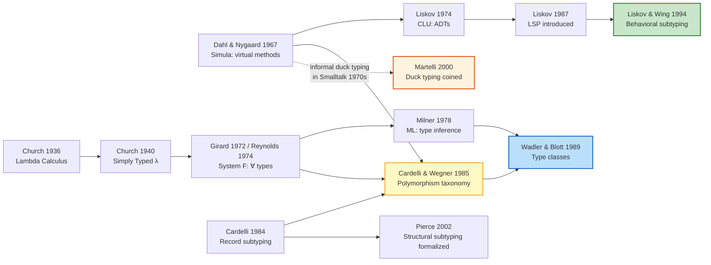

| Year | Milestone | Contribution |
|------|-----------|-------------|
| 1936 | Church — Lambda Calculus | Theoretical foundation for parametric functions |
| 1940 | Church — Simply Typed λ | First typed polymorphism |
| 1967 | Dahl & Nygaard — Simula | Virtual methods → inclusion polymorphism |
| 1972/74 | Girard / Reynolds — System F | Universal quantification over types (∀) |
| 1974 | Liskov — CLU | Abstract Data Types — type = behavior contract |
| 1978 | Milner — ML | Hindley–Milner type inference, parametric polymorphism in practice |
| 1984 | Cardelli — record subtyping | Formal basis for structural subtyping and duck typing |
| 1985 | Cardelli & Wegner | **Canonical taxonomy** of polymorphism (this page's framework) |
| 1987 | Liskov — LSP introduced | Behavioral conditions for safe subtype substitution |
| 1989 | Wadler & Blott — Type classes | Principled overloading that bridges ad-hoc and universal |
| 1994 | Liskov & Wing — LSP formalized | Rigorous pre/postcondition rules for subtyping |
| 2000 | Martelli — duck typing coined | Named the informal Python/Smalltalk practice of structural runtime dispatch |
| 2002 | Pierce — *Types and Programming Languages* | Rigorous treatment of structural subtyping and its relation to duck typing |

---

## See Also

- 🧩 **[OOP & Design](index.md)** — encapsulation, GoF patterns, SOLID principles
- 🔠 **[Type Systems](../types/index.md)** — static vs. dynamic, ADTs, generics, type inference
- λ **[Functional Programming](../functional/index.md)** — parametric polymorphism in FP context
- 📐 **[Paradigms](../paradigms/index.md)** — how OOP relates to other paradigms
- 📄 **[Liskov & Wing 1994](../../works/papers/liskov-1994-subtyping.md)** — behavioral subtyping paper
- 📄 **[Cardelli & Wegner 1985](../../references/bibliography.md)** — polymorphism taxonomy
- 👤 **[Barbara Liskov](../../authors/barbara-liskov.md)** · **[Robin Milner](../../authors/robin-milner.md)** · **[Alan Kay](../../authors/alan-kay.md)**
