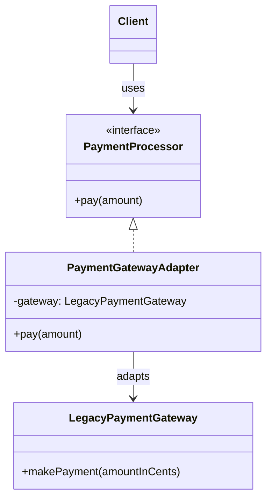
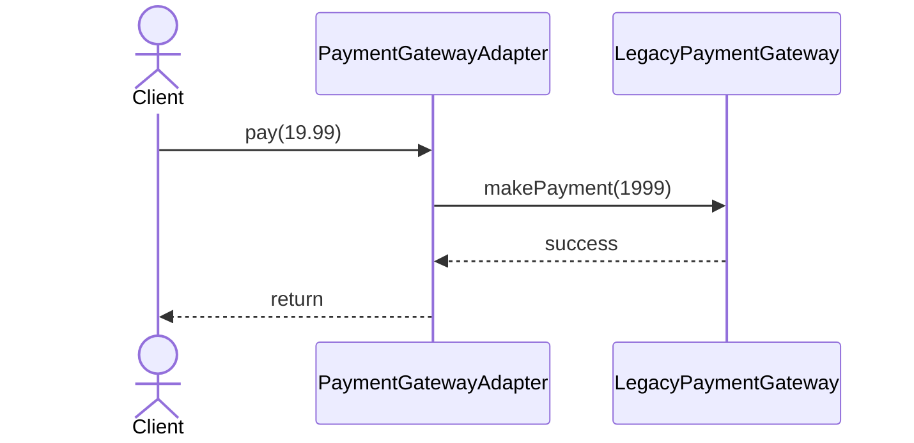

# Adapter

**Group:** Structural  
**Source:** GoF — *Design Patterns: Elements of Reusable Object-Oriented Software* (1994)

> Convert the interface of a class into another interface clients expect.

---

## Contents

1. [What it does](#what-it-does)
2. [How it works](#how-it-works)
3. [Class Diagram](#class-diagram)
4. [Sequence Diagram](#sequence-diagram)
5. [Example](#example)
6. [Typical Use](#typical-use)
7. [See Also](#see-also)

---

## What it does

The **Adapter** pattern lets two incompatible interfaces work together.

It wraps an existing class and presents a new interface that the client expects. The adapter translates calls from the target interface into calls on the adaptee.

This is useful when:

- you need to reuse a legacy class,
- a third-party API has an incompatible interface,
- you want to isolate interface conversion logic.

In this example, a modern `PaymentProcessor` interface is adapted to a legacy payment gateway.

---

## How it works

| Part | Role |
|------|------|
| `PaymentProcessor` | Target interface expected by the client |
| `LegacyPaymentGateway` | Adaptee with an incompatible API |
| `PaymentGatewayAdapter` | Adapter that translates between the two |
| Client | Uses the target interface only |

Typical flow:

1. The client calls the target interface.
2. The adapter receives the call.
3. The adapter converts arguments and forwards them to the adaptee.
4. The adaptee performs the work.

---

## Class Diagram



---

## Sequence Diagram

Example: the client pays using the modern interface, while the adapter calls the legacy gateway.



---

## Example

A Java implementation of the Adapter pattern for a legacy payment gateway.

```java
import java.math.BigDecimal;

interface PaymentProcessor {
    void pay(BigDecimal amount);
}

class LegacyPaymentGateway {
    public void makePayment(int amountInCents) {
        System.out.println("Paid " + amountInCents + " cents using legacy gateway");
    }
}

class PaymentGatewayAdapter implements PaymentProcessor {
    private final LegacyPaymentGateway gateway;

    PaymentGatewayAdapter(LegacyPaymentGateway gateway) {
        this.gateway = gateway;
    }

    @Override
    public void pay(BigDecimal amount) {
        int amountInCents = amount.multiply(BigDecimal.valueOf(100)).intValue();
        gateway.makePayment(amountInCents);
    }
}
```

Usage:

```java
PaymentProcessor processor = new PaymentGatewayAdapter(new LegacyPaymentGateway());
processor.pay(new BigDecimal("19.99"));
```

---

## Typical Use

| Property | Value |
|----------|-------|
| **Use case** | Legacy integration, third-party API wrappers, interface migration |
| **Language** | Java |
| **Description** | The adapter converts one interface into another so existing code can be reused without changing the client. |

---

## See Also

- [Bridge](../structural/bridge.md)
- [Decorator](../structural/decorator.md)
