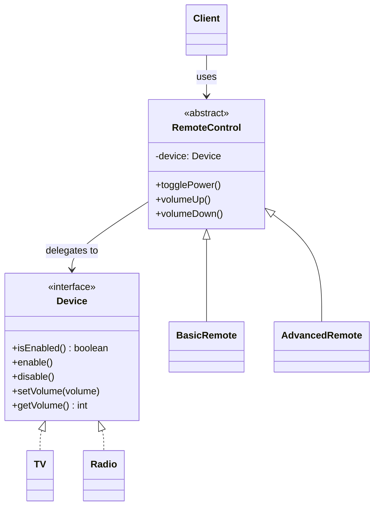
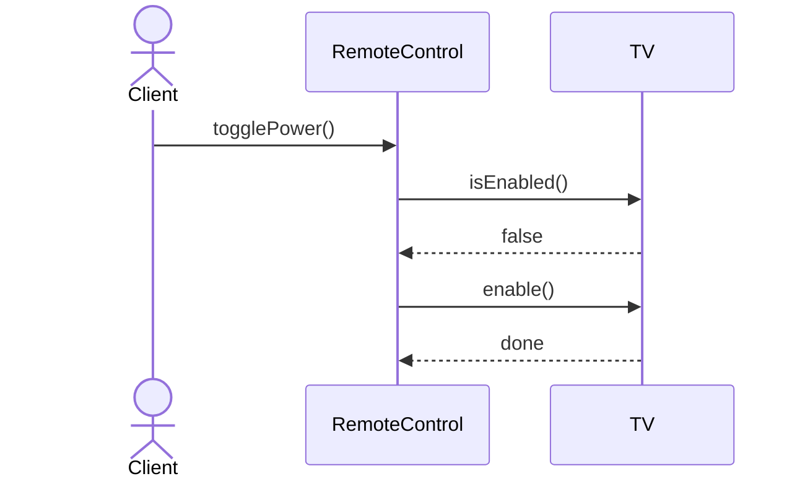

# Bridge

**Group:** Structural  
**Source:** GoF — *Design Patterns: Elements of Reusable Object-Oriented Software* (1994)

> Decouple an abstraction from its implementation so that the two can vary independently.

---

## Contents

1. [What it does](#what-it-does)
2. [How it works](#how-it-works)
3. [Class Diagram](#class-diagram)
4. [Sequence Diagram](#sequence-diagram)
5. [Example](#example)
6. [Typical Use](#typical-use)
7. [See Also](#see-also)

---

## What it does

The **Bridge** pattern separates an abstraction from its implementation so both can evolve independently.

Instead of having a single class hierarchy explode into many combinations, Bridge splits the problem into two dimensions:

- the **abstraction** hierarchy,
- the **implementation** hierarchy.

This is useful when:

- you have multiple variants of abstraction and implementation,
- you want to avoid subclass explosion,
- you want to switch implementations at runtime.

In this example, a `RemoteControl` abstraction works with different `Device` implementations such as `TV` and `Radio`.

---

## How it works

| Part | Role |
|------|------|
| `Device` | Implementor interface |
| `TV`, `Radio` | Concrete implementors |
| `RemoteControl` | Abstraction that delegates work to a device |
| `BasicRemote`, `AdvancedRemote` | Refined abstractions |
| Client | Uses the abstraction, not the concrete device |

Typical flow:

1. The client creates a device implementation.
2. The client injects the device into the abstraction.
3. The abstraction delegates work to the implementor.
4. Both hierarchies can vary independently.

> Compared with **Adapter**, Bridge is designed up front to separate abstraction from implementation. Adapter is usually used to make existing classes compatible.

---

## Class Diagram



---

## Sequence Diagram

Example: the client turns on a TV through the remote control abstraction.



---

## Example

A Java implementation of the Bridge pattern for remotes and devices.

```java
interface Device {
    boolean isEnabled();
    void enable();
    void disable();
    void setVolume(int volume);
    int getVolume();
}

class TV implements Device {
    private boolean enabled;
    private int volume = 10;

    @Override
    public boolean isEnabled() {
        return enabled;
    }

    @Override
    public void enable() {
        enabled = true;
        System.out.println("TV enabled");
    }

    @Override
    public void disable() {
        enabled = false;
        System.out.println("TV disabled");
    }

    @Override
    public void setVolume(int volume) {
        this.volume = volume;
        System.out.println("TV volume: " + this.volume);
    }

    @Override
    public int getVolume() {
        return volume;
    }
}

abstract class RemoteControl {
    protected final Device device;

    protected RemoteControl(Device device) {
        this.device = device;
    }

    public void togglePower() {
        if (device.isEnabled()) {
            device.disable();
        } else {
            device.enable();
        }
    }

    public void volumeUp() {
        device.setVolume(device.getVolume() + 1);
    }

    public void volumeDown() {
        device.setVolume(device.getVolume() - 1);
    }
}

class BasicRemoteControl extends RemoteControl {
    BasicRemoteControl(Device device) {
        super(device);
    }
}

class AdvancedRemoteControl extends RemoteControl {
    AdvancedRemoteControl(Device device) {
        super(device);
    }

    public void mute() {
        device.setVolume(0);
    }
}
```

Usage:

```java
Device tv = new TV();
RemoteControl remote = new BasicRemoteControl(tv);

remote.togglePower();
remote.volumeUp();

AdvancedRemoteControl advancedRemote = new AdvancedRemoteControl(tv);
advancedRemote.mute();
```

---

## Typical Use

| Property | Value |
|----------|-------|
| **Use case** | GUI platforms, device drivers, database abstractions, cross-product hierarchies |
| **Language** | Java |
| **Description** | Bridge separates what an object does from how it does it, so both sides can evolve independently. |

---

## See Also

- [Abstract Factory](../creational/abstract-factory.md)
- [Adapter](../structural/adapter.md)
