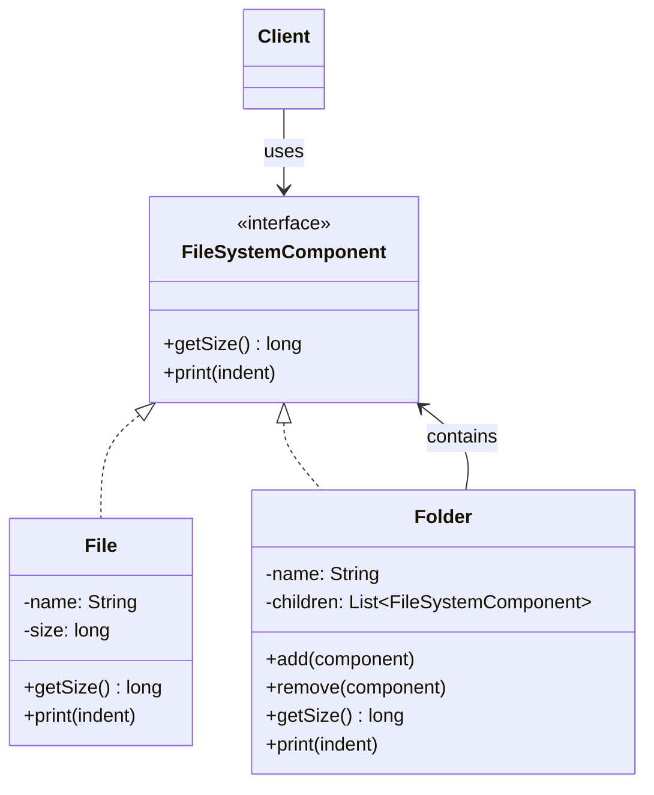
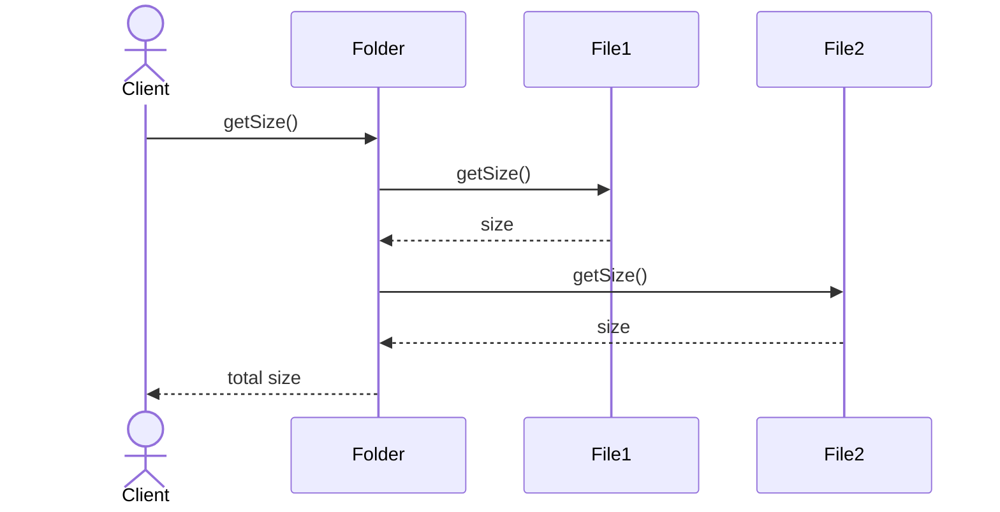

# Composite

**Group:** Structural  
**Source:** GoF — *Design Patterns: Elements of Reusable Object-Oriented Software* (1994)

> Compose objects into tree structures to represent part-whole hierarchies.

---

## Contents

1. [What it does](#what-it-does)
2. [How it works](#how-it-works)
3. [Class Diagram](#class-diagram)
4. [Sequence Diagram](#sequence-diagram)
5. [Example](#example)
6. [Typical Use](#typical-use)
7. [See Also](#see-also)

---

## What it does

The **Composite** pattern lets you treat individual objects and groups of objects uniformly.

It is used to build tree structures, where both leaves and containers implement the same interface.

This is useful when:

- you need part-whole hierarchies,
- clients should not care whether they are dealing with a single object or a group,
- you want recursive behavior over tree structures.

In this example, `File` and `Folder` both implement `FileSystemComponent`.

---

## How it works

| Part | Role |
|------|------|
| `FileSystemComponent` | Common component interface |
| `File` | Leaf node |
| `Folder` | Composite node that contains children |
| Client | Works with the common interface only |

Typical flow:

1. The client creates leaves and composites.
2. Composites store child components.
3. The client calls operations on the common interface.
4. The call is handled recursively for composites.

> Composite is often combined with **Iterator** and **Visitor** for tree traversal and tree operations.

---

## Class Diagram



---

## Sequence Diagram

Example: the client asks a folder for its total size.



---

## Example

A Java implementation of the Composite pattern for a file system tree.

```java
import java.util.ArrayList;
import java.util.List;

interface FileSystemComponent {
    long getSize();
    void print(String indent);
}

class File implements FileSystemComponent {
    private final String name;
    private final long size;

    File(String name, long size) {
        this.name = name;
        this.size = size;
    }

    @Override
    public long getSize() {
        return size;
    }

    @Override
    public void print(String indent) {
        System.out.println(indent + "- " + name + " (" + size + " KB)");
    }
}

class Folder implements FileSystemComponent {
    private final String name;
    private final List<FileSystemComponent> children = new ArrayList<>();

    Folder(String name) {
        this.name = name;
    }

    public void add(FileSystemComponent component) {
        children.add(component);
    }

    public void remove(FileSystemComponent component) {
        children.remove(component);
    }

    @Override
    public long getSize() {
        long total = 0;
        for (FileSystemComponent child : children) {
            total += child.getSize();
        }
        return total;
    }

    @Override
    public void print(String indent) {
        System.out.println(indent + "+ " + name + " (" + getSize() + " KB)");
        for (FileSystemComponent child : children) {
            child.print(indent + "  ");
        }
    }
}
```

Usage:

```java
Folder root = new Folder("root");
root.add(new File("readme.md", 4));

Folder src = new Folder("src");
src.add(new File("App.java", 12));
src.add(new File("Utils.java", 8));

root.add(src);

root.print("");
System.out.println("Total size: " + root.getSize() + " KB");
```

---

## Typical Use

| Property | Value |
|----------|-------|
| **Use case** | File systems, UI component trees, organization charts, menu hierarchies |
| **Language** | Java |
| **Description** | Composite lets clients treat single objects and object groups through the same interface in a tree structure. |

---

## See Also

- [Iterator](../behavioral/iterator.md)
- [Visitor](../behavioral/visitor.md)
- [Decorator](../structural/decorator.md)
