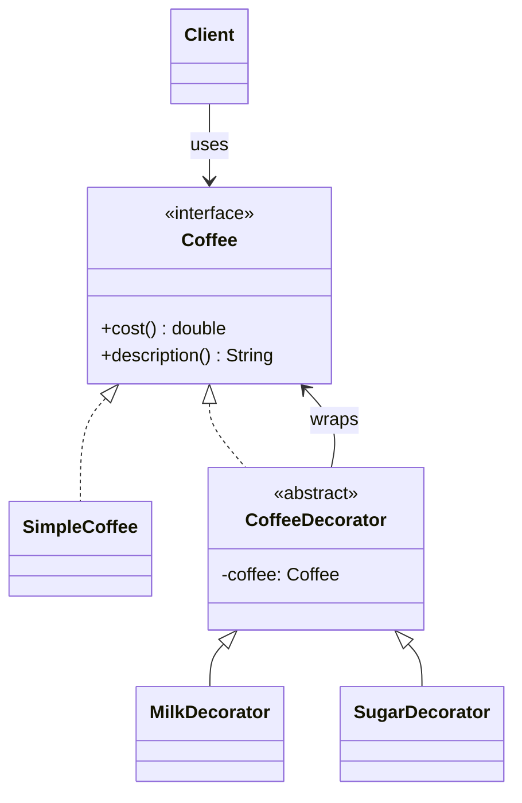
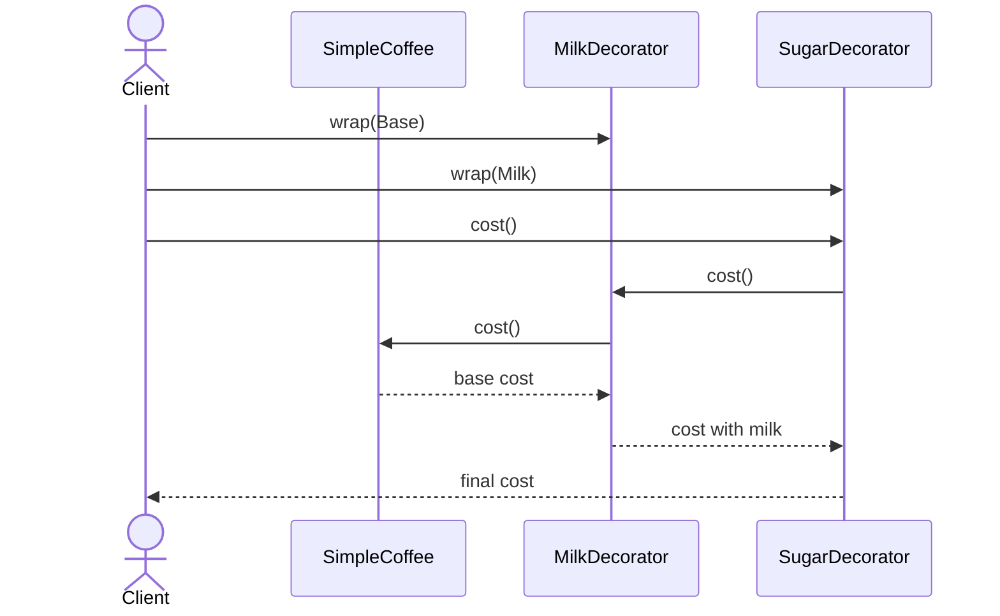

# Decorator

**Group:** Structural  
**Source:** GoF — *Design Patterns: Elements of Reusable Object-Oriented Software* (1994)

> Attach additional responsibilities to an object dynamically.

---

## Contents

1. [What it does](#what-it-does)
2. [How it works](#how-it-works)
3. [Class Diagram](#class-diagram)
4. [Sequence Diagram](#sequence-diagram)
5. [Example](#example)
6. [Typical Use](#typical-use)
7. [See Also](#see-also)

---

## What it does

The **Decorator** pattern adds behavior to an object dynamically by wrapping it in another object.

Decorators implement the same interface as the wrapped object and forward calls while adding extra behavior before or after delegation.

This is useful when:

- you want to add responsibilities without subclassing,
- you want to combine features flexibly,
- you need behavior composition at runtime.

In this example, a `Coffee` can be decorated with milk, sugar, or whipped cream.

---

## How it works

| Part | Role |
|------|------|
| `Coffee` | Component interface |
| `SimpleCoffee` | Concrete component |
| `CoffeeDecorator` | Base decorator that wraps a `Coffee` |
| `MilkDecorator`, `SugarDecorator` | Concrete decorators |
| Client | Stacks decorators as needed |

Typical flow:

1. The client creates a base object.
2. The client wraps it in one or more decorators.
3. Each decorator delegates to the wrapped object.
4. Additional behavior is applied dynamically.

> Compared with **Adapter**, Decorator keeps the same interface and adds behavior. Adapter changes the interface.

---

## Class Diagram



---

## Sequence Diagram

Example: the client builds a coffee step by step with decorators.



---

## Example

A Java implementation of the Decorator pattern for a coffee shop.

```java
interface Coffee {
    double cost();
    String description();
}

class SimpleCoffee implements Coffee {
    @Override
    public double cost() {
        return 2.00;
    }

    @Override
    public String description() {
        return "Simple coffee";
    }
}

abstract class CoffeeDecorator implements Coffee {
    protected final Coffee coffee;

    protected CoffeeDecorator(Coffee coffee) {
        this.coffee = coffee;
    }
}

class MilkDecorator extends CoffeeDecorator {
    MilkDecorator(Coffee coffee) {
        super(coffee);
    }

    @Override
    public double cost() {
        return coffee.cost() + 0.50;
    }

    @Override
    public String description() {
        return coffee.description() + ", milk";
    }
}

class SugarDecorator extends CoffeeDecorator {
    SugarDecorator(Coffee coffee) {
        super(coffee);
    }

    @Override
    public double cost() {
        return coffee.cost() + 0.25;
    }

    @Override
    public String description() {
        return coffee.description() + ", sugar";
    }
}
```

Usage:

```java
Coffee coffee = new SimpleCoffee();
coffee = new MilkDecorator(coffee);
coffee = new SugarDecorator(coffee);

System.out.println(coffee.description()); // Simple coffee, milk, sugar
System.out.println(coffee.cost());        // 2.75
```

---

## Typical Use

| Property | Value |
|----------|-------|
| **Use case** | I/O streams, logging, GUI widgets, formatting, dynamic feature composition |
| **Language** | Java |
| **Description** | Decorator adds behavior by wrapping objects with the same interface, allowing features to be composed dynamically. |

---

## See Also

- [Adapter](../structural/adapter.md)
- [Composite](../structural/composite.md)
- [Strategy](../behavioral/strategy.md)
