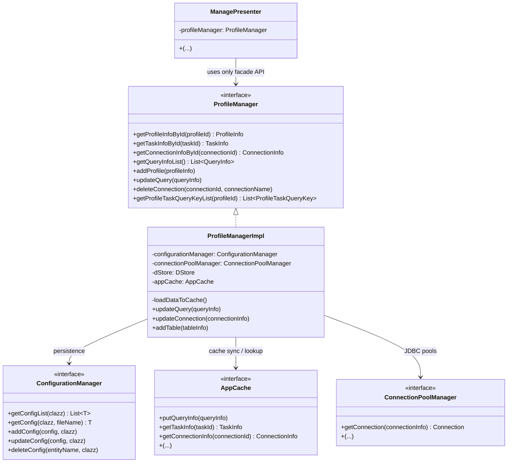
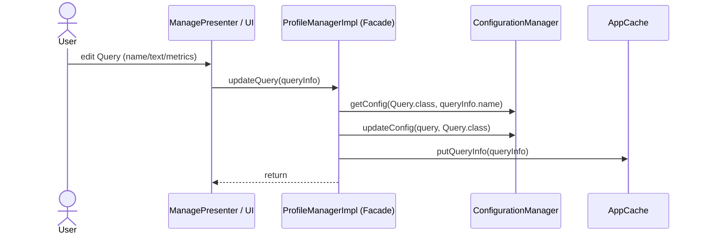

# Facade

**Group:** Structural  
**Source:** GoF — *Design Patterns: Elements of Reusable Object-Oriented Software* (1994)

> Provide a unified interface to a set of interfaces in a subsystem. Facade defines a higher-level interface that makes the subsystem easier to use.

---

## Contents

1. [What it does](#what-it-does)
2. [How it works](#how-it-works)
3. [Class Diagram](#class-diagram)
4. [Sequence Diagram](#sequence-diagram)
5. [Key Files](#key-files)
6. [See Also](#see-also)

---

## What it does

`ProfileManager` acts as a **Facade** over Dimension UI’s “configuration & metadata” subsystem.

UI modules (presenters, views, panels) do not manipulate config files, caches, or database primitives directly. Instead, they call a single entry point:

- **Get by id / get lists**: `getProfileInfoById()`, `getTaskInfoById()`, `getQueryInfoList()`, `getTableInfoList()`…
- **CRUD**: `addProfile()`, `updateQuery()`, `deleteConnection()`…
- **Helper queries**: `getProfileTaskQueryKeyList()`, `getQueryInfoList(profileId, taskId)`, `getProfileInfoByQueryId()`…

This keeps UI code small and readable: it works with domain-shaped DTOs (`ProfileInfo`, `TaskInfo`, `QueryInfo`, `TableInfo`, …) and does not care where/how they’re stored.

---

## How it works

The Facade role is split into two parts:

| Part | Role |
|------|------|
| `ProfileManager` | Facade interface: a “high-level” API tailored for UI needs (CRUD + lookups) |
| `ProfileManagerImpl` | Concrete facade: implements the API and coordinates the subsystem |

The **subsystem** behind the facade is composed of multiple lower-level services/components, for example:

- `ConfigurationManager` — generic persistence of configuration entities (save/get/update/delete).
- `AppCache` — in-memory cache for `*Info` objects used by the UI.
- `ConnectionPoolManager` — creation/access to JDBC connection pools.
- `DStore` (Dimension-DB) — local store used by the application where needed.

`ProfileManagerImpl` hides the wiring and sequencing:
- loads configuration into cache on startup,
- updates persisted configs and synchronizes cache on changes,
- provides a stable API for UI modules.

---

## Class Diagram



---

## Sequence Diagram

Example: user edits a query in UI and the application saves it through the facade.



---

## Example

A UI module works with a single facade instead of multiple low-level services.

```java
// UI code depends only on the facade:
TaskInfo taskInfo = profileManager.getTaskInfoById(taskId);
ConnectionInfo connectionInfo = profileManager.getConnectionInfoById(taskInfo.getConnectionId());

List<QueryInfo> queryInfoList = profileManager.getQueryInfoList().stream()
    .filter(q -> taskInfo.getQueryInfoList().stream().anyMatch(qId -> qId == q.getId()))
    .toList();
```

And inside the facade implementation, the subsystem complexity is hidden:

```java
@Override
public void updateQuery(QueryInfo queryInfo) {
    Query query = configurationManager.getConfig(Query.class, queryInfo.getName());
    query.setDescription(queryInfo.getDescription());
    query.setText(queryInfo.getText());
    query.setMetricList(queryInfo.getMetricList());

    configurationManager.updateConfig(query, Query.class);
    appCache.putQueryInfo(queryInfo);
}
```

---

## Key Files

| Role | File |
|------|------|
| Facade interface | `desktop/src/main/java/ru/dimension/ui/manager/ProfileManager.java` |
| Concrete facade | `desktop/src/main/java/ru/dimension/ui/manager/impl/ProfileManagerImpl.java` |
| Subsystem (config persistence API) | `desktop/src/main/java/ru/dimension/ui/manager/ConfigurationManager.java` |
| Subsystem (connection pools API) | `desktop/src/main/java/ru/dimension/ui/manager/ConnectionPoolManager.java` |
| Subsystem (cache API) | `desktop/src/main/java/ru/dimension/ui/cache/AppCache.java` |
| Facade client example | `desktop/src/main/java/ru/dimension/ui/component/module/manage/ManagePresenter.java` |

---

## Examples

| Property | Value |
|----------|-------|
| **Application** | [Dimension UI](https://github.com/akardapolov/dimension-ui) |
| **Language** | Java |
| **Description** | `ProfileManager` / `ProfileManagerImpl` provides a single high-level API for UI modules to manage profiles, tasks, connections, queries, and tables. Internally it coordinates multiple subsystem components (configuration persistence, caching, connection pools, local store), keeping UI code decoupled from storage and infrastructure details. |

> All code snippets in this document are taken directly from the Dimension UI source code.  
> Additional examples in other languages will be added here as the documentation evolves.

---

## See Also

- [Abstract Factory](../creational/abstract-factory.md)
- [Mediator](../behavioral/mediator.md)
- [Singleton](../creational/singleton.md)
