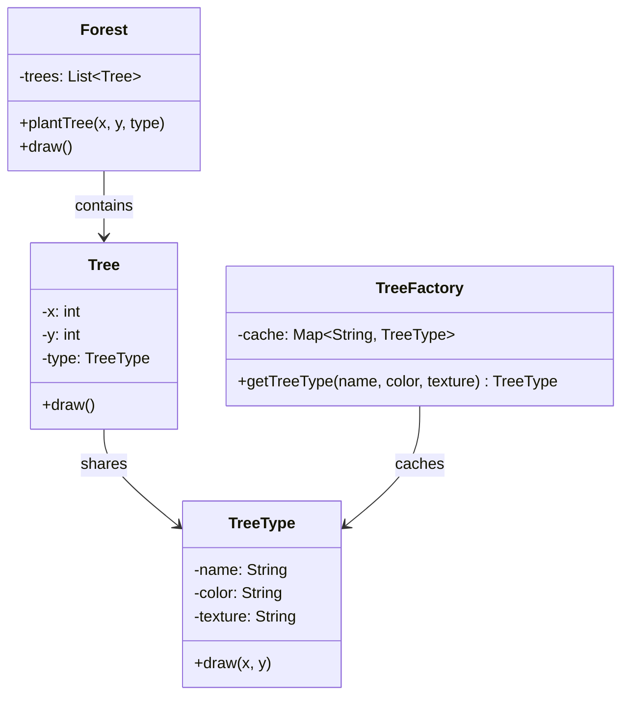
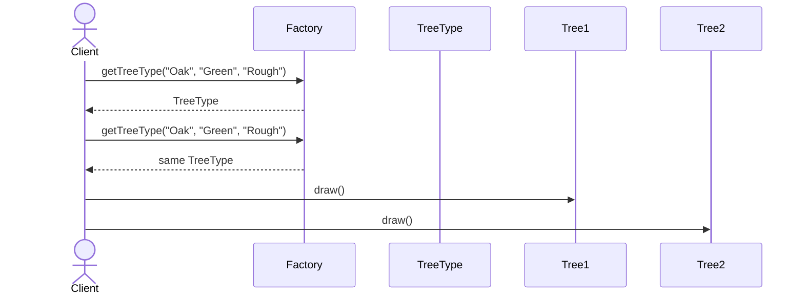

# Flyweight

**Group:** Structural  
**Source:** GoF — *Design Patterns: Elements of Reusable Object-Oriented Software* (1994)

> Use sharing to support large numbers of fine-grained objects efficiently.

---

## Contents

1. [What it does](#what-it-does)
2. [How it works](#how-it-works)
3. [Class Diagram](#class-diagram)
4. [Sequence Diagram](#sequence-diagram)
5. [Example](#example)
6. [Typical Use](#typical-use)
7. [See Also](#see-also)

---

## What it does

The **Flyweight** pattern reduces memory usage by sharing common object state across many fine-grained objects.

It separates state into two parts:

- **intrinsic state** — shared and reusable,
- **extrinsic state** — supplied by the client, context-specific.

This is useful when:

- you have a very large number of similar objects,
- many fields are repeated across objects,
- memory usage is a concern.

In this example, many `Tree` objects reuse shared `TreeType` instances.

---

## How it works

| Part | Role |
|------|------|
| `TreeType` | Flyweight containing intrinsic state |
| `TreeFactory` | Reuses and caches flyweights |
| `Tree` | Context object with extrinsic state |
| `Forest` | Client that creates and draws trees |

Typical flow:

1. The client asks the factory for a shared object.
2. The factory returns an existing flyweight if one matches.
3. The client stores extrinsic state separately.
4. When needed, the client passes extrinsic state into the flyweight operation.

> Flyweight is often combined with **Composite** to represent large trees or forests efficiently.

---

## Class Diagram



---

## Sequence Diagram

Example: two trees share the same `TreeType` flyweight.



---

## Example

A Java implementation of the Flyweight pattern for a forest of trees.

```java
import java.util.ArrayList;
import java.util.HashMap;
import java.util.List;
import java.util.Map;

class TreeType {
    private final String name;
    private final String color;
    private final String texture;

    TreeType(String name, String color, String texture) {
        this.name = name;
        this.color = color;
        this.texture = texture;
    }

    public void draw(int x, int y) {
        System.out.println("Draw " + name + " tree at (" + x + ", " + y + "), color=" + color);
    }
}

class TreeFactory {
    private final Map<String, TreeType> cache = new HashMap<>();

    public TreeType getTreeType(String name, String color, String texture) {
        String key = name + ":" + color + ":" + texture;
        return cache.computeIfAbsent(key, k -> new TreeType(name, color, texture));
    }
}

class Tree {
    private final int x;
    private final int y;
    private final TreeType type;

    Tree(int x, int y, TreeType type) {
        this.x = x;
        this.y = y;
        this.type = type;
    }

    public void draw() {
        type.draw(x, y);
    }
}

class Forest {
    private final List<Tree> trees = new ArrayList<>();

    public void plantTree(int x, int y, TreeType type) {
        trees.add(new Tree(x, y, type));
    }

    public void draw() {
        for (Tree tree : trees) {
            tree.draw();
        }
    }
}
```

Usage:

```java
TreeFactory factory = new TreeFactory();
Forest forest = new Forest();

TreeType oak = factory.getTreeType("Oak", "Green", "Rough");
TreeType pine = factory.getTreeType("Pine", "Dark Green", "Smooth");

forest.plantTree(10, 20, oak);
forest.plantTree(15, 25, oak);
forest.plantTree(50, 80, pine);

forest.draw();
```

---

## Typical Use

| Property | Value |
|----------|-------|
| **Use case** | Text editors, game entities, rendering engines, large object pools |
| **Language** | Java |
| **Description** | Flyweight shares reusable intrinsic state across many objects while keeping extrinsic state outside the shared object. |

---

## See Also

- [Composite](../structural/composite.md)
- [State](../behavioral/state.md)
- [Strategy](../behavioral/strategy.md)
