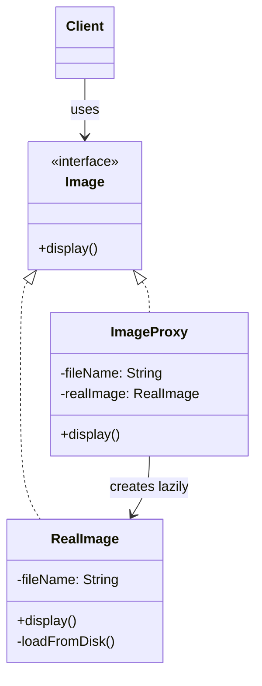
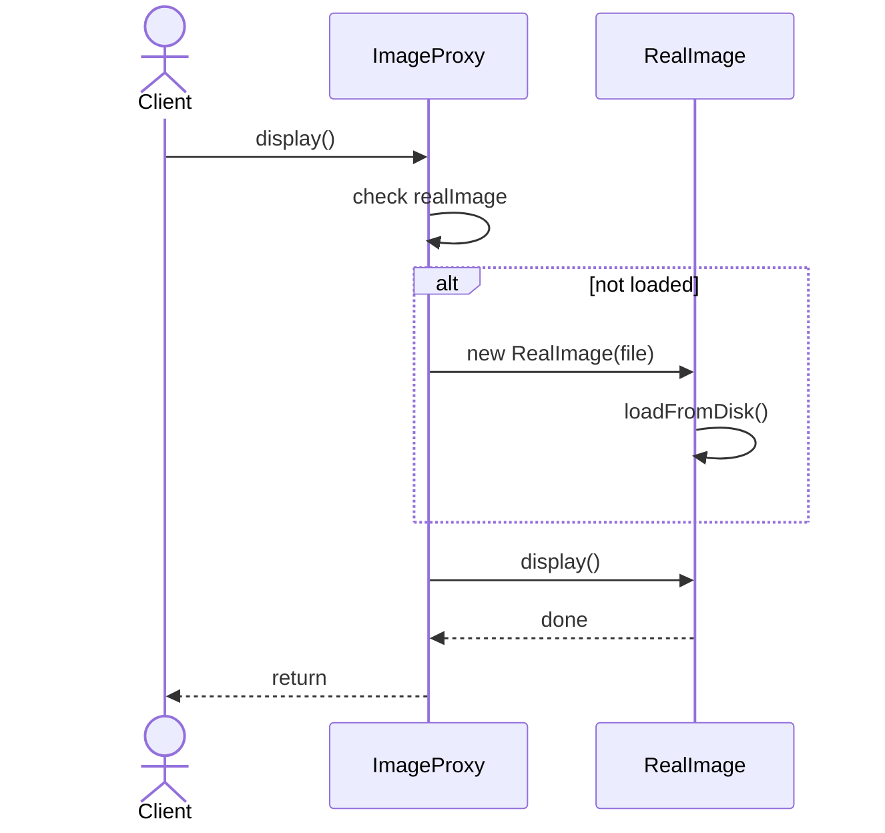

# Proxy

**Group:** Structural  
**Source:** GoF — *Design Patterns: Elements of Reusable Object-Oriented Software* (1994)

> Provide a surrogate or placeholder for another object to control access to it.

---

## Contents

1. [What it does](#what-it-does)
2. [How it works](#how-it-works)
3. [Class Diagram](#class-diagram)
4. [Sequence Diagram](#sequence-diagram)
5. [Example](#example)
6. [Typical Use](#typical-use)
7. [See Also](#see-also)

---

## What it does

The **Proxy** pattern provides a stand-in object that controls access to another object.

The proxy implements the same interface as the real object, but it can add behavior such as:

- lazy initialization,
- access control,
- caching,
- logging,
- remote access.

This is useful when the real object is expensive to create or should not be accessed directly.

In this example, `ImageProxy` loads a large image only when needed.

---

## How it works

| Part | Role |
|------|------|
| `Image` | Subject interface |
| `RealImage` | Real object that does the actual work |
| `ImageProxy` | Proxy that controls access and lazy-loads the real object |
| Client | Uses the subject interface only |

Typical flow:

1. The client creates a proxy.
2. The client calls a method on the proxy.
3. The proxy checks whether the real object is available.
4. If needed, the proxy creates the real object and forwards the call.

> Compared with **Decorator**, Proxy focuses on controlling access, not adding features.

---

## Class Diagram



---

## Sequence Diagram

Example: the client displays an image through a proxy.



---

## Example

A Java implementation of the Proxy pattern with lazy loading for images.

```java
interface Image {
    void display();
}

class RealImage implements Image {
    private final String fileName;

    RealImage(String fileName) {
        this.fileName = fileName;
        loadFromDisk();
    }

    private void loadFromDisk() {
        System.out.println("Loading " + fileName + " from disk...");
    }

    @Override
    public void display() {
        System.out.println("Displaying " + fileName);
    }
}

class ImageProxy implements Image {
    private final String fileName;
    private RealImage realImage;

    ImageProxy(String fileName) {
        this.fileName = fileName;
    }

    @Override
    public void display() {
        if (realImage == null) {
            realImage = new RealImage(fileName);
        }
        realImage.display();
    }
}
```

Usage:

```java
Image image = new ImageProxy("large-photo.png");

image.display(); // loads lazily
image.display(); // uses already loaded real object
```

---

## Typical Use

| Property | Value |
|----------|-------|
| **Use case** | Lazy loading, access control, caching, remote proxies, virtual objects |
| **Language** | Java |
| **Description** | Proxy acts as a substitute for a real object and controls when and how the real object is accessed. |

---

## See Also

- [Decorator](../structural/decorator.md)
- [Adapter](../structural/adapter.md)
