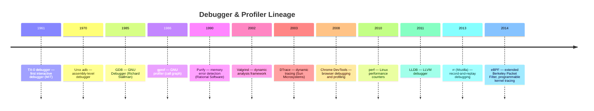

# Debugging & Profiling

Tools for verifying correctness and understanding performance. Debuggers answer
"why did it crash?" Profilers answer "why is it slow?" Tracers answer
"what is it doing?" Together they close the loop between writing code and
shipping reliable software.

## Contents

- [What Are Debugging and Profiling Tools?](#what-are-debugging-and-profiling-tools)
- [A Brief History](#a-brief-history)
- [Comparison](#comparison)
- [Core Concepts Across Tools](#core-concepts-across-tools)
- [Tools](#tools)
- [Related](#related)

---

## What Are Debugging and Profiling Tools?

Three categories of tools, three different questions:

| Category | Question | Example |
|----------|----------|---------|
| **Debugger** | "Why did it crash?" | gdb, lldb, Chrome DevTools |
| **Profiler** | "Why is it slow?" | perf, Valgrind, async-profiler |
| **Tracer** | "What is it doing?" | strace, ltrace, eBPF/bcc |

A **debugger** lets you pause execution, inspect variables and the call stack,
set breakpoints, and step through code line by line. It is the tool for
understanding program state at a specific moment.

A **profiler** measures where time and memory are spent across a program's
execution. It is the tool for understanding program behavior over time.
Profilers produce **flame graphs** — visualizations that make bottlenecks
immediately visible.

A **tracer** records the system calls or library calls a program makes.
It is the tool for understanding the boundary between your code and the
operating system.

!!! note "Debuggers and profilers serve different purposes"
A debugger helps you find the bug. A profiler helps you find the bottleneck.
Some tools (Chrome DevTools, IntelliJ IDEA profiler) combine both, but the
underlying mechanisms differ: debuggers instrument execution flow; profilers
sample or trace execution over time.

---

## A Brief History



The 1985 release of **GDB** established the pattern for source-level debugging:
a command-line tool that understands compiled programs, maps machine code back
to source lines, and lets developers inspect and modify running state.

The 2002 release of **Valgrind** shifted focus from correctness to memory safety:
it detects memory leaks, use-after-free, and uninitialized reads by running
the program in a virtualized CPU. The performance penalty is severe (10-50x
slowdown), but the diagnostic precision is unmatched.

The 2013 release of **rr** by Mozilla introduced **record-and-replay debugging**:
record a failing execution once, then replay it deterministically as many times
as needed. This makes Heisenbugs — bugs that disappear when observed — reproducible.

---

## Comparison

| Tool | Type | Language / Target | License | Key Feature |
|------|------|-------------------|---------|-------------|
| **gdb** | Debugger | C, C++, Fortran, Go | GPL | Breakpoints, watchpoints, core dumps, remote debugging |
| **lldb** | Debugger | C, C++, Swift, Rust | Apache 2.0 | Faster than GDB, better modern toolchain integration |
| **strace** | Tracer | Linux processes | LGPL | Trace system calls; diagnose permission and IO issues |
| **ltrace** | Tracer | Linux processes | GPL | Trace library calls; understand shared library usage |
| **perf** | Profiler | Linux processes | GPL | CPU profiling, flame graphs, hardware counters |
| **Valgrind** | Profiler / Analyzer | C, C++ | GPL | Memory error detection, leak checking, cache profiling |
| **Chrome DevTools** | Debugger + Profiler | JavaScript / Browser | BSD | DOM inspection, network analysis, JS profiling, memory snapshots |
| **rr** | Debugger | Linux x86_64 | BSD / MPL 2.0 | Record-and-replay; deterministic reverse execution |

---

## Core Concepts Across Tools

| Concept | gdb | lldb | strace | ltrace | perf | Valgrind | Chrome DevTools | rr |
|---------|-----|------|--------|--------|------|----------|-----------------|-----|
| **Breakpoints** | Yes | Yes | — | — | — | — | Yes | Yes (on replay) |
| **Watchpoints** | Yes | Yes | — | — | — | — | Yes | Yes |
| **Stack traces** | Yes | Yes | — | — | Via `perf script` | — | Yes | Yes |
| **Step execution** | Yes | Yes | — | — | — | — | Yes | Yes |
| **CPU profiling** | — | — | — | — | Yes (sampling) | Via Callgrind | Yes (Performance tab) | — |
| **Memory profiling** | — | — | — | — | — | Yes (Memcheck) | Yes (Memory tab) | — |
| **Flame graphs** | — | — | — | — | Yes | Via tools | Yes | — |
| **Reverse execution** | Limited | Limited | — | — | — | — | — | Yes (full) |
| **System call tracing** | — | — | Yes | — | — | — | — | — |
| **Library call tracing** | — | — | — | Yes | — | — | — | — |

---

## Tools

### gdb

The GNU Debugger. Created by Richard Stallman in 1985.

**Key strengths:**
- **Source-level debugging** — step through C, C++, Fortran, and Go code
- **Breakpoints and watchpoints** — stop on line execution or data changes
- **Core dump analysis** — inspect the state of a crashed program from its core file
- **Remote debugging** — debug embedded systems and servers over a network
- **Scriptable** — Python and GDB scripting for automated debugging workflows

**Example:**
```bash
# Compile with debug symbols
gcc -g -o program program.c

# Start gdb
gdb ./program

# Inside gdb:
(gdb) break main          # set breakpoint at main
(gdb) run                 # start execution
(gdb) next                # step to next line
(gdb) print variable      # inspect variable
(gdb) backtrace           # show call stack
(gdb) continue            # resume execution
```

### lldb

The LLVM Debugger. Part of the LLVM project, released in 2011.

**Key strengths:**
- **Faster than GDB** — better performance on large binaries
- **Modern architecture** — built as a set of reusable libraries
- **Better integration** — native support for Clang, Swift, and Rust
- **Python scripting** — more powerful and consistent than GDB's Python API
- **Expression evaluation** — evaluate complex expressions in the context of the debuggee

**Trade-offs:**
- Less ubiquitous than GDB (not preinstalled on all Linux distributions)
- Some advanced GDB features are missing or work differently

### strace

Trace system calls. A Linux diagnostic tool.

**Key strengths:**
- **No recompilation needed** — attach to any running process
- **Diagnose permission issues** — see which files a process tries to open and why it fails
- **Understand IO patterns** — track reads, writes, and network activity at the syscall level
- **Filter by syscall type** — focus on `open`, `connect`, `read`, etc.

**Example:**
```bash
# Trace all system calls of a command
strace ./program

# Trace a running process
strace -p 1234

# Show only file operations
strace -e trace=open,openat,stat ./program

# Count syscalls
strace -c ./program
```

### ltrace

Trace library calls. Complements strace by showing interactions with shared libraries.

**Key strengths:**
- **See library API usage** — which functions from libc, OpenSSL, etc. are called
- **Count library calls** — identify hot paths in library usage
- **Filter by library** — focus on specific shared libraries

### perf

Linux Performance Counters. The standard Linux profiling tool.

**Key strengths:**
- **Low overhead** — uses hardware performance counters, minimal slowdown
- **CPU profiling** — sample the call stack to find hot functions
- **Flame graphs** — generate visualizations of where time is spent
- **Hardware events** — cache misses, branch mispredictions, CPU cycles
- **Kernel and user space** — profile both application and kernel code

**Example:**
```bash
# Record CPU profile for 30 seconds
perf record -g -- ./program

# Generate report
perf report

# Generate flame graph
perf script | ./stackcollapse-perf.pl | ./flamegraph.pl > profile.svg
```

### Valgrind

A dynamic analysis framework. Created by Julian Seward in 2002.

**Key strengths:**
- **Memory error detection** — use-after-free, buffer overflows, uninitialized reads
- **Leak detection** — find memory that was allocated but never freed
- **Cache profiling** — understand cache behavior (Cachegrind)
- **Thread error detection** — race conditions and deadlocks (Helgrind, DRD)

**Trade-offs:**
- **10-50x slowdown** — programs run much slower under Valgrind
- **Not suitable for production** — use in testing and debugging only

**Example:**
```bash
# Check for memory errors
valgrind --leak-check=full ./program

# Check for cache performance
valgrind --tool=cachegrind ./program

# Check for thread errors
valgrind --tool=helgrind ./program
```

### Chrome DevTools

Built into Google Chrome and other Chromium-based browsers.

**Key strengths:**
- **Integrated** — no installation; available in every Chrome window
- **DOM and CSS inspection** — inspect and modify page structure and styles live
- **Network analysis** — waterfall diagrams of all HTTP requests
- **JavaScript debugging** — breakpoints, step execution, console
- **Performance profiling** — CPU timeline, flame charts, memory snapshots
- **Lighthouse** — automated audits for performance, accessibility, SEO

**Panels:**
| Panel | Purpose |
|-------|---------|
| **Elements** | DOM tree and CSS styles |
| **Console** | JavaScript execution and logging |
| **Sources** | JavaScript debugging |
| **Network** | HTTP request waterfall |
| **Performance** | CPU profiling and timeline |
| **Memory** | Heap snapshots and allocation tracking |
| **Application** | Storage, service workers, caches |
| **Lighthouse** | Automated audits |

### rr (Record and Replay)

Created by Mozilla in 2013. Enables deterministic debugging of non-deterministic failures.

**Key strengths:**
- **Record once, replay infinitely** — capture a failing execution, then debug it repeatedly
- **Reverse execution** — step backwards in time (`reverse-step`, `reverse-continue`)
- **Deterministic** — the replay is bit-exact; Heisenbugs become reproducible
- **Low overhead recording** — typically 1.2x slowdown during recording

**Workflow:**
```bash
# Record
rr record ./program

# Replay
rr replay

# Inside GDB (rr wraps gdb):
(gdb) break some_function
(gdb) continue
(gdb) reverse-step     # step backwards!
(gdb) reverse-continue # run backwards to previous breakpoint
```

**Trade-offs:**
- Linux x86_64 only
- Requires certain CPU features (Intel PT or AMD Zen)
- Does not support programs that use shared memory extensively

---

## Related

- [Languages](../../languages/index.md) — debuggers are language-specific
- [Build Systems](../process/build-systems/index.md) — debug builds require `-g` flags
- [CI/CD Providers](../process/ci-cd/index.md) — tests and profilers run in pipelines
- [Testing](../testing/index.md) — TDD and debugging are intertwined practices
- [Containers & Orchestration](../containers/index.md) — remote debugging in containers
- [Developer Tools Overview](index.md) — back to the developer tools overview
