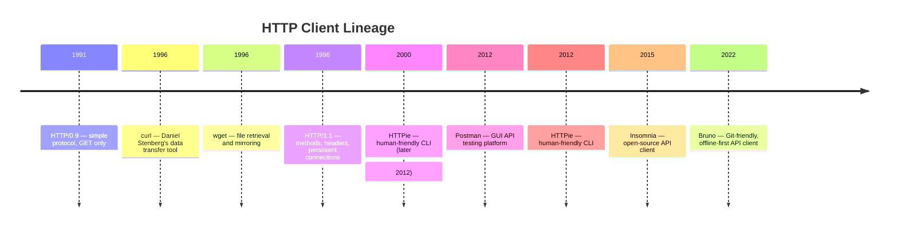

# HTTP & API Tools

Tools for interacting with HTTP services: testing endpoints, exploring APIs,
automating requests, and debugging network issues.

## Contents

- [What Are HTTP Clients?](#what-are-http-clients)
- [A Brief History](#a-brief-history)
- [Comparison](#comparison)
- [Core Concepts Across Tools](#core-concepts-across-tools)
- [Tools](#tools)
- [Related](#related)

---

## What Are HTTP Clients?

An HTTP client sends requests to a server and displays the response. They
range from command-line utilities for scripting and automation to graphical
applications for exploration and team collaboration.

The distinction between CLI and GUI tools is not absolute:

- **CLI tools** (curl, HTTPie) excel at automation, CI/CD pipelines, and
  quick one-off requests. They are composable with shell tools (`jq`, `grep`, `awk`).
- **GUI tools** (Postman, Insomnia) excel at exploration, complex authentication
  flows, team sharing of collections, and visual inspection of responses.

Modern tools blur the line: CLI tools offer rich formatting and interactive
features; GUI tools generate code snippets and support command-line execution.

---

## A Brief History



The 1996 release of **curl** established the pattern for programmable HTTP
clients: a single binary that speaks multiple protocols (HTTP, FTP, SMTP, etc.)
and is scriptable from any shell. For two decades, curl was the default answer
to "how do I make an HTTP request from the command line?"

The 2012 release of **Postman** shifted the focus to GUI-based API exploration
and team collaboration. Postman introduced the concept of **collections** —
saved groups of requests that can be shared, versioned, and run in CI/CD pipelines.

The 2022 release of **Bruno** responded to a growing concern: API collections
stored in proprietary cloud services are hard to version control. Bruno stores
collections as plain files in a directory structure, making them diffable,
reviewable, and Git-friendly.

---

## Comparison

| Tool | Year | Type | Scriptable | Auth Support | Best For |
|------|------|------|------------|-------------|----------|
| **curl** | 1996 | CLI | Fully (shell scripts) | Basic, Digest, Bearer, OAuth, NTLM, Kerberos | Automation, CI/CD, scripting |
| **wget** | 1996 | CLI | Partial (batch mode) | Basic, Digest | File downloads, mirroring, recursive fetching |
| **HTTPie** | 2012 | CLI | Fully (shell scripts) | Basic, Digest, Bearer | Interactive API exploration, JSON APIs |
| **Postman** | 2012 | GUI | Via CLI runner (Newman) | OAuth 1/2, Bearer, API Key, Basic, Digest | Team collaboration, API documentation, testing |
| **Insomnia** | 2015 | GUI | Via CLI | OAuth 1/2, Bearer, API Key, Basic, Digest | Lighter alternative to Postman, open-source |
| **Bruno** | 2022 | GUI + CLI | Via CLI (Bru CLI) | OAuth 2, Bearer, API Key, Basic | Git-friendly collections, offline-first |

---

## Core Concepts Across Tools

| Concept | curl | HTTPie | wget | Postman | Insomnia | Bruno |
|---------|------|--------|------|---------|----------|-------|
| **HTTP methods** | All | All | GET, POST | All | All | All |
| **Headers** | `-H` flag | Natural syntax | `--header` | GUI fields | GUI fields | GUI fields |
| **Body (JSON)** | `-d` with manual JSON | Automatic JSON | `--post-data` | GUI editor | GUI editor | GUI editor |
| **Variables / Environments** | Shell variables | Shell variables | — | Built-in | Built-in | Built-in |
| **Collections** | Scripts | Scripts | — | Native | Native | Native (file-based) |
| **Assertions / Tests** | — | — | — | JavaScript tests | JavaScript tests | Bru-lang assertions |
| **Code generation** | — | — | — | Yes (many languages) | Yes | Yes |
| **Offline / local storage** | Always | Always | Always | Cloud sync optional | Cloud sync optional | File-based, always local |

---

## Tools

### curl

The universal data transfer tool. Created by Daniel Stenberg in 1996.
Supports dozens of protocols; HTTP is the most common use case.

**Key strengths:**
- **Ubiquitous** — preinstalled on virtually every Unix-like system
- **Scriptable** — every option is a command-line flag; easy to embed in shell scripts
- **Protocol breadth** — HTTP, HTTPS, FTP, FTPS, SMTP, IMAP, and more
- **Flexible output** — save to file, pipe to other tools, control verbosity

**Example:**
```bash
# GET request with headers
curl -H "Authorization: Bearer $TOKEN" \
     -H "Accept: application/json" \
     https://api.example.com/users

# POST JSON
curl -X POST \
     -H "Content-Type: application/json" \
     -d '{"name":"Alice","role":"admin"}' \
     https://api.example.com/users
```

**Trade-offs:**
- Verbose syntax for complex requests
- No built-in formatting or pretty-printing

### HTTPie

A human-friendly HTTP CLI. Created by Jakub Roztocil in 2012.

**Key strengths:**
- **Intuitive syntax** — `http POST api.example.com/users name=Alice`
- **Automatic JSON** — request body is JSON by default; responses are colorized and formatted
- **Built-in authentication** — `http -a username:password`, `http -A bearer -a $TOKEN`
- **Sessions** — persistent cookies and headers across requests

**Example:**
```bash
# GET with auth
http GET api.example.com/users Authorization:"Bearer $TOKEN"

# POST JSON (automatic)
http POST api.example.com/users name=Alice role=admin
```

**Trade-offs:**
- Less flexible than curl for non-HTTP protocols
- Requires Python installation

### wget

A file retrieval tool. Created by the GNU project in 1996.

**Key strengths:**
- **Recursive downloading** — mirror entire websites
- **Resume support** — continue interrupted downloads
- **Robots.txt compliance** — respects web crawler conventions

**Trade-offs:**
- Primarily for file retrieval, not API testing
- Less flexible than curl for HTTP-specific features

### Postman

The dominant GUI API testing platform. Founded by Abhinav Asthana in 2012.

**Key strengths:**
- **Collections** — organize requests into folders, share with teams
- **Environments** — switch between dev, staging, and prod configurations
- **Automated testing** — write JavaScript assertions that run with each request
- **Documentation** — generate shareable API documentation from collections
- **CI/CD integration** — run collections via Newman CLI in pipelines

**Trade-offs:**
- Heavy application; can be slow with large collections
- Cloud sync is the default; offline use requires configuration
- Free tier has team size limits

### Insomnia

An open-source API client. Created by Gregory Schier in 2015.

**Key strengths:**
- **Lighter than Postman** — faster startup, simpler UI
- **Open-source core** — transparent, community-driven
- **GraphQL support** — first-class query editing and schema exploration
- **Plugin ecosystem** — extend with custom themes and templates

**Trade-offs:**
- Smaller ecosystem than Postman
- Acquired by Kong in 2019; some features moved to paid tiers

### Bruno

A Git-friendly, offline-first API client. Created by Anoop M D in 2022.

**Key strengths:**
- **File-based collections** — each request is a file in a directory; diffable in Git
- **Bru markup language** — human-readable request format
- **No cloud lock-in** — everything is local by design
- **CLI support** — run collections from CI/CD via `bru` command

**Example collection structure:**
```
my-api/
├── bruno.json
├── environments/
│   ├── local.bru
│   └── production.bru
├── users/
│   ├── get-users.bru
│   ├── create-user.bru
│   └── delete-user.bru
```

**Trade-offs:**
- Newer; smaller community and ecosystem
- GUI less polished than Postman or Insomnia

---

## Related

- [Architecture & Modularity](../architecture/index.md) — REST, GraphQL, and API design patterns
- [Containers & Orchestration](../containers/index.md) — services running in containers expose HTTP APIs
- [CI/CD Providers](../process/ci-cd/index.md) — API tests run in pipelines
- [Developer Tools Overview](index.md) — back to the developer tools overview
