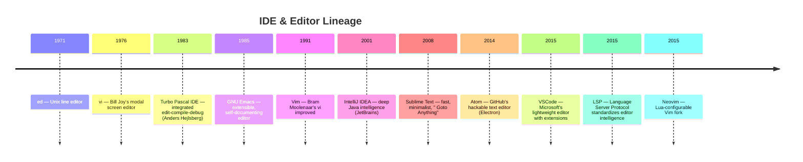

# IDE & Editors

The environment where code is written, read, navigated, and transformed.
The choice of editor shapes daily ergonomics more than any other tool decision.

## Contents

- [What Is an IDE?](#what-is-an-ide)
- [A Brief History](#a-brief-history)
- [Comparison](#comparison)
- [Core Concepts Across Tools](#core-concepts-across-tools)
- [Tools](#tools)
- [Related](#related)

---

## What Is an IDE?

An **Integrated Development Environment (IDE)** is an application that combines
multiple development functions into a single interface: code editing, building,
testing, debugging, and version control.

A **text editor** is lighter: it focuses on editing text, leaving build, test,
and debug to external tools invoked from the terminal.

The distinction has blurred. Modern editors like VSCode and Neovim offer
debugging integration, terminal panels, and Git visualization through extensions.
Meanwhile, IDEs like IntelliJ IDEA have streamlined their UI to compete with
lighter editors. The practical difference today is often **defaults vs extensions**:
IDEs ship with deep language support built in; editors acquire it through plugins.

---

## A Brief History

The 2015 introduction of the **Language Server Protocol (LSP)** was pivotal.
Before LSP, each editor had to implement language-specific features
(completion, goto-definition, refactoring) independently. After LSP, a
language-specific server provides these features, and any LSP-capable editor
consumes them. This enabled lightweight editors to offer IDE-grade intelligence
without the IDE's resource footprint.

---

## Comparison

| Tool | Year | Type | License | Key Features | Best For |
|------|------|------|---------|-------------|----------|
| **VSCode** | 2015 | Editor | Open Source (MIT) | Extensions, LSP, built-in terminal, debug adapter protocol | General-purpose, polyglot, team collaboration |
| **IntelliJ IDEA** | 2001 | IDE | Commercial / Apache 2.0 (Community) | Deep refactoring, JVM-first, database tools, framework support | Java/Kotlin, large codebases, enterprise |
| **Vim** | 1991 | Editor | Vim License | Modal editing, ubiquitous, minimal resource use | Server editing, quick fixes, muscle-memory workflows |
| **Neovim** | 2015 | Editor | Apache 2.0 | Lua configuration, built-in LSP, tree-sitter, modern plugin ecosystem | Vim users wanting modern features |
| **Emacs** | 1985 | Editor | GPL | ELisp extensibility, org-mode, self-documenting, "everything is a buffer" | Customization, org-mode, Lisp development |
| **Sublime Text** | 2008 | Editor | Proprietary | Speed, "Goto Anything", multiple cursors, minimal UI | Fast editing, large files, distraction-free work |

---

## Core Concepts Across Tools

| Concept | VSCode | IntelliJ IDEA | Vim | Neovim | Emacs | Sublime Text |
|---------|--------|---------------|-----|--------|-------|-------------|
| **LSP support** | Native | Native (custom) | Via plugin | Native | Via Eglot/LSP-mode | Via LSP package |
| **Debugger integration** | Debug Adapter Protocol | Built-in (many languages) | Limited | Via DAP plugin | Via GUD/REALGUD | Limited |
| **Refactoring** | Via extensions | Deep, language-aware | Basic (plugins) | Via LSP/Tree-sitter | Via CEDET/LSP | Basic |
| **Extension ecosystem** | VS Code Marketplace | JetBrains Marketplace | Vim script / Lua | Lua plugins | ELisp (MELPA) | Package Control |
| **Modal editing** | Via extension (Vim) | Via plugin (IdeaVim) | Native | Native | Via Evil mode | Via Vintage mode |
| **Startup time** | ~1-2s | ~5-15s | ~50ms | ~50-100ms | ~1-3s | ~0.5s |
| **Memory footprint** | ~200-500 MB | ~1-2 GB | ~10-50 MB | ~20-100 MB | ~50-200 MB | ~100-200 MB |

---

## Tools

### VSCode

Developed by Microsoft and released in 2015. Built on Electron, it runs on
Windows, macOS, and Linux with a consistent experience.

**Key strengths:**
- **Extension marketplace** — thousands of extensions for languages, themes, themes, and tools
- **LSP-native** — works well with any language that has an LSP server
- **Debug Adapter Protocol (DAP)** — unified debugging interface across languages
- **Built-in terminal, Git integration, and live share** for pair programming
- **Settings sync** and **dev containers** for reproducible environments

**Trade-offs:**
- Electron-based: higher memory use and startup time than native editors
- Extension quality varies; misbehaving extensions can degrade performance

### IntelliJ IDEA

Developed by JetBrains. The flagship of a family of language-specific IDEs
(PyCharm, WebStorm, GoLand, Rider, etc.).

**Key strengths:**
- **Deep language intelligence** — refactoring, navigation, and analysis that
  goes beyond LSP (e.g., "find usages" across Spring annotations)
- **Framework awareness** — understands Spring, Jakarta EE, Android, and more
- **Database tools, HTTP client, and Docker integration** built in
- **Index-based search** — fast global find across large codebases

**Trade-offs:**
- Resource-intensive: requires significant RAM and CPU
- Best for JVM languages; support for other languages via plugins is good but
  not as deep as language-specific JetBrains IDEs

### Vim

Created by Bram Moolenaar in 1991, based on Bill Joy's vi (1976).
Ubiquitous on Unix-like systems.

**Key strengths:**
- **Modal editing** — separate modes for navigation, insertion, and command
  reduces keystrokes and repetitive strain
- **Ubiquitous** — preinstalled on virtually every server
- **Extremely fast startup and low resource use**
- **Vim script** ecosystem for customization

**Trade-offs:**
- Steep learning curve; modal editing is unintuitive for beginners
- Configuration and plugin management require investment
- LSP and modern features require plugin assembly

### Neovim

A fork of Vim started in 2014, focused on extensibility and modern features.

**Key strengths:**
- **Lua configuration** — faster and more expressive than Vim script
- **Built-in LSP and tree-sitter** — modern code intelligence out of the box
- **Remote API** — embeddable and scriptable from external processes
- **Active community** — rapid development, modern plugin ecosystem (Lazy.nvim, packer)

**Trade-offs:**
- Still modal; same learning curve as Vim
- Plugin ecosystem is powerful but fragmented

### Emacs

Created by Richard Stallman in 1985. The original extensible editor.

**Key strengths:**
- **ELisp** — entire editor is programmable in a Lisp dialect
- **Org-mode** — plain-text organizer, notebook, and publishing system
- **Self-documenting** — every function and variable is documented and explorable
- **"Everything is a buffer"** — email, file manager, shell, and editor share one UI

**Trade-offs:**
- Emacs Lisp configuration has a learning curve
- Finger strain from modifier-key chords (mitigated by Evil mode or ergonomic keybindings)
- Slower than Vim/Neovim for quick edits

### Sublime Text

Developed by Jon Skinner. A proprietary editor focused on speed and minimalism.

**Key strengths:**
- **Extremely fast** — native C++ core, opens instantly
- **"Goto Anything"** — fuzzy file and symbol search
- **Multiple cursors** — edit multiple locations simultaneously
- **Minimal UI** — stays out of the way

**Trade-offs:**
- Proprietary and paid (but has an unlimited trial)
- Smaller extension ecosystem than VSCode
- No built-in LSP; relies on third-party packages

---

## Related

- [Build Systems](../process/build-systems/index.md) — build tools integrate deeply with IDEs
- [Languages](../../languages/index.md) — each language has preferred editor support
- [Version Control & Git](../vcs/index.md) — editors embed Git workflows
- [Process & Testing](../process/index.md) — TDD and CI/CD workflows are editor-integrated
- [Developer Tools Overview](index.md) — back to the developer tools overview
