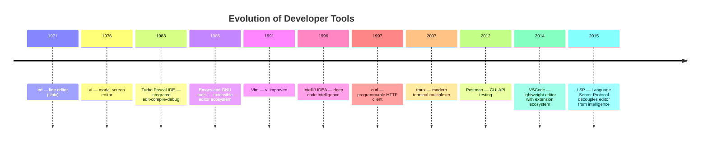

# Developer Tools

The software developers use every day to write, test, debug, and interact
with code. While languages, architectures, and processes shape what we build,
developer tools shape how we build it — and how productive we are while doing so.

## Contents

- [What Are Developer Tools?](#what-are-developer-tools)
- [Choosing a Tool](#choosing-a-tool)
- [Comparison by Category](#comparison-by-category)
- [IDE & Editors](#ide--editors)
- [HTTP & API Tools](#http--api-tools)
- [Terminal & Shell](#terminal--shell)
- [Debugging & Profiling](#debugging--profiling)
- [Related Topics](#related-topics)

---

## What Are Developer Tools?

Developer tools sit between the programmer and the system they are building.
They fall into several broad categories:

1. **Editors and IDEs** — where code is written, navigated, and refactored
2. **HTTP and API clients** — how services are explored, tested, and scripted
3. **Terminal and shell tools** — the command-line environment where builds, tests,
   and deployments are orchestrated
4. **Debuggers and profilers** — how correctness and performance are verified

These categories overlap. An IDE may embed a debugger, a terminal multiplexer
may run an HTTP client, and a profiler may be triggered from a build script.
What unifies them is their role in the **developer's inner loop** — the
cycle of edit, build, test, and debug that consumes most of a programmer's time.

The history of developer tools is one of progressive abstraction:

The decisive shift in the 2010s was the **Language Server Protocol (LSP)**:
for the first time, deep code intelligence (completion, navigation, refactoring)
could be provided by a language-specific server and consumed by any editor.
This broke the monopoly of heavyweight IDEs and enabled a new generation of
lightweight, extensible editors.

---

## Choosing a Tool

| Factor | Considerations |
|--------|---------------|
| **Task** | Writing code (editor), testing APIs (HTTP client), managing sessions (terminal), finding bugs (debugger) |
| **Environment** | Local desktop, remote SSH, container, or cloud IDE |
| **Integration** | How well does it connect to your build system, VCS, and CI/CD pipeline? |
| **Ecosystem** | Extensions, plugins, community support, documentation quality |
| **Learning curve** | Immediate productivity vs long-term mastery (Vim, Emacs) |
| **Collaboration** | Team sharing, cloud sync, pair programming support |
| **License** | Open source, freemium, or proprietary; commercial restrictions |

---

## Comparison by Category

| Category | Typical Use Case | Key Skills |
|----------|------------------|------------|
| **IDE & Editors** | Writing, navigating, and refactoring code | Shortcuts, extensions, debugging integration |
| **HTTP & API Tools** | Exploring APIs, testing endpoints, automation | HTTP semantics, auth, scripting |
| **Terminal & Shell** | Running commands, managing sessions, automation | Shell scripting, multiplexing, configuration |
| **Debugging & Profiling** | Finding bugs, understanding performance | Breakpoints, stack traces, flame graphs |

---

## IDE & Editors

Where code is written. The spectrum ranges from lightweight text editors
(Vim, VSCode) to heavyweight integrated development environments
(IntelliJ IDEA, Eclipse) that embed build, test, debug, and version control.

The modern editor is defined by the **Language Server Protocol (LSP)**,
which separates the editor (UI, keybindings, extensions) from the language
intelligence (parsing, type checking, refactoring). Any LSP-capable editor
can offer IDE-grade features for any LSP-capable language.

→ [IDE & Editors](ide.md) — full comparison and tool guide

---

## HTTP & API Tools

How developers interact with HTTP services. CLI tools (curl, HTTPie) excel
at scripting and automation. GUI tools (Postman, Insomnia) excel at
exploration, team collaboration, and complex authentication flows.

The boundary is blurring: modern CLI tools offer rich output formatting,
and modern GUI tools generate code snippets and support CI/CD integration.

→ [HTTP & API Tools](http-clients.md) — full comparison and tool guide

---

## Terminal & Shell

The command-line environment is the universal interface to build systems,
version control, deployment pipelines, and remote servers. Terminal
multiplexers (tmux, screen) enable persistent sessions across disconnects.
Modern shells (zsh, fish) offer completions, syntax highlighting, and
autosuggestions that reduce friction.

→ [Terminal & Shell](terminal.md) — full comparison and tool guide

---

## Debugging & Profiling

Debuggers verify correctness: they let you pause execution, inspect state,
and step through code. Profilers verify performance: they measure where
time and memory are spent. Both are essential, but they answer different
questions.

| Question | Tool |
|----------|------|
| "Why did it crash?" | Debugger (gdb, lldb, Chrome DevTools) |
| "Why is it slow?" | Profiler (perf, Valgrind, Chrome DevTools Performance tab) |
| "What system calls is it making?" | Tracer (strace, ltrace) |
| "Can I replay this failure?" | Record-and-replay (rr) |

→ [Debugging & Profiling](debugging.md) — full comparison and tool guide

---

## Related Topics

- [Build Systems](../process/build-systems/index.md) — tools that compile and package code
- [CI/CD Providers](../process/ci-cd/index.md) — tools that automate testing and deployment
- [Version Control & Git](../vcs/index.md) — tools that track code history
- [Containers & Orchestration](../containers/index.md) — tools that run code in isolated environments
- [Process & Testing](../process/index.md) — methodologies that the tools enable
- [Languages](../../languages/index.md) — programming languages that the tools support
