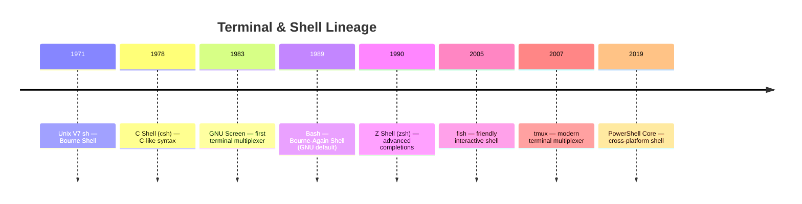

# Terminal & Shell

The command-line environment where developers run builds, manage version control,
navigate systems, and orchestrate deployments. Terminal multiplexers preserve
sessions across disconnects; modern shells reduce friction through completions
and autosuggestions.

## Contents

- [What Is a Terminal Multiplexer? / Shell?](#what-is-a-terminal-multiplexer--shell)
- [A Brief History](#a-brief-history)
- [Comparison](#comparison)
- [Core Concepts Across Tools](#core-concepts-across-tools)
- [Tools](#tools)
- [Related](#related)

---

## What Is a Terminal Multiplexer? / Shell?

A **terminal multiplexer** creates multiple virtual terminals inside a single
physical terminal window. It lets you:

- Run multiple programs side by side (panes)
- Switch between different contexts (windows)
- Keep sessions alive when you disconnect (sessions)

A **shell** is the command interpreter: it reads what you type, executes
programs, and manages environment variables, aliases, and scripting. The shell
is what you talk to; the terminal multiplexer is the room you talk in.

Both are essential for remote work (SSH sessions that survive network drops),
long-running tasks (builds, tests, deployments), and complex workflows that
require multiple concurrent views of a system.

---

## A Brief History



The terminal has been the primary developer interface since Unix. The
innovation has been in what sits between the developer and the operating
system: the shell (command language) and the multiplexer (session manager).

**tmux** (2007) replaced GNU Screen as the default terminal multiplexer by
offering a cleaner configuration syntax, better default keybindings, and
a more active development community.

**zsh** (1990) gained mainstream adoption after Apple made it the default
shell on macOS in 2019, displacing bash.

**fish** (2005) took a different approach: rather than being compatible with
POSIX shell syntax, it prioritizes discoverability with syntax highlighting,
autosuggestions, and web-based configuration.

---

## Comparison

| Tool | Year | Type | License | Key Feature |
|------|------|------|---------|-------------|
| **tmux** | 2007 | Multiplexer | ISC / BSD | Sessions, panes, windows; client-server architecture |
| **GNU Screen** | 1987 | Multiplexer | GPL | The original; serial console support |
| **zsh** | 1990 | Shell | MIT-like | Advanced completions, globbing, oh-my-zsh |
| **fish** | 2005 | Shell | GPL | Syntax highlighting, autosuggestions, web config |
| **Bash** | 1989 | Shell | GPL | Default on Linux; POSIX-compatible; ubiquitous |
| **PowerShell** | 2006 (Windows) / 2016 (Core) | Shell | MIT | Object pipeline, .NET integration, cross-platform |

---

## Core Concepts Across Tools

| Concept | tmux | GNU Screen | zsh | fish | Bash | PowerShell |
|---------|------|------------|-----|------|------|------------|
| **Sessions** | Named, detachable | Named, detachable | — | — | — | — |
| **Panes** | Vertical/horizontal split | Limited split | — | — | — | — |
| **Windows** | Multiple per session | Multiple per session | — | — | — | — |
| **Configuration file** | `~/.tmux.conf` | `~/.screenrc` | `~/.zshrc` | `~/.config/fish/config.fish` | `~/.bashrc` | `$PROFILE` |
| **Plugin ecosystem** | TPM (Tmux Plugin Manager) | Limited | oh-my-zsh, zplug, antigen | fisher, omf | bash-it | PowerShell Gallery |
| **Completions** | — | — | Extensive, programmable | Automatic, built-in | Basic (programmable) | Extensive (command + parameter) |
| **Syntax highlighting** | — | — | Via zsh-syntax-highlighting | Built-in | Via external tools | Built-in |
| **Autosuggestions** | — | — | Via zsh-autosuggestions | Built-in | Via external tools | Predictive IntelliSense |
| **Scripting language** | — | — | POSIX + extensions | fish (not POSIX) | POSIX | PowerShell (.NET) |

---

## Tools

### tmux

The modern terminal multiplexer. Created by Nicholas Marriott in 2007.

**Key strengths:**
- **Client-server architecture** — multiple clients can attach to the same session
- **Panes and windows** — split the screen and switch contexts without leaving the terminal
- **Session persistence** — detach from a session, log out, reconnect later — your work is still there
- **Scriptable** — every action can be scripted via the `tmux` command

**Example workflow:**
```bash
# Start a new named session
tmux new -s myproject

# Split the screen
tmux split-window -h  # horizontal
tmux split-window -v  # vertical

# Create a new window
tmux new-window -n logs

# Detach and reattach later
tmux detach
tmux attach -t myproject
```

**Configuration:**
```bash
# ~/.tmux.conf
set -g mouse on              # enable mouse support
set -g prefix C-a            # change prefix from Ctrl-b to Ctrl-a
bind | split-window -h       # custom split key
bind - split-window -v
```

### GNU Screen

The original terminal multiplexer. Created by Oliver Laumann in 1987.

**Key strengths:**
- **Ubiquitous** — preinstalled on most Unix-like systems
- **Serial console support** — essential for embedded and network device management
- **Copy mode** — scrollback and text selection

**Trade-offs:**
- Configuration syntax is less intuitive than tmux
- Less active development; fewer modern features

### Zsh (Z Shell)

Created by Paul Falstad in 1990. Gained mainstream adoption when Apple made
it the default macOS shell in 2019.

**Key strengths:**
- **Advanced completions** — context-aware, programmable, and fuzzy
- **Globbing** — powerful pattern matching (`**/*.js`, `(#i)readme`)
- **Plugin frameworks** — oh-my-zsh, zplug, and antigen make customization easy
- **Compatibility** — mostly POSIX-compatible with bash

**Popular plugins:**
- **oh-my-zsh** — framework with 300+ plugins and themes
- **zsh-syntax-highlighting** — real-time command validation
- **zsh-autosuggestions** — fish-like autosuggestions
- **powerlevel10k** — fast, customizable prompt theme

### Fish (Friendly Interactive Shell)

Created by Axel Liljencrantz in 2005.

**Key strengths:**
- **Out-of-the-box experience** — syntax highlighting, autosuggestions, and
  tab completions work immediately without configuration
- **Web-based configuration** — `fish_config` opens a browser UI for themes and settings
- **User-friendly errors** — helpful messages when commands fail

**Trade-offs:**
- **Not POSIX-compatible** — bash scripts will not run in fish
- **Different syntax** — some habits from bash/zsh do not transfer

**Example differences from bash:**
```fish
# fish: no $ needed for variables in conditionals
if test $status -eq 0
    echo "Success"
end

# fish: arrays are space-separated, not quoted strings
set fruits apple banana cherry
for fruit in $fruits
    echo $fruit
end
```

### Bash

The Bourne-Again Shell. Created by Brian Fox for the GNU Project in 1989.

**Key strengths:**
- **Default on virtually every Linux system** — the safe choice for portability
- **POSIX-compatible** — scripts written for sh will run in bash
- **Massive ecosystem** — the most documented and tested shell
- **Built-in features** — arrays, associative arrays, regex matching, coprocesses

**Trade-offs:**
- Basic completions and no autosuggestions by default
- Less interactive-friendly than zsh or fish

### PowerShell

Created by Jeffrey Snover at Microsoft. Originally Windows-only (2006);
cross-platform PowerShell Core released in 2016.

**Key strengths:**
- **Object pipeline** — passes structured .NET objects between commands, not text
- **Consistent syntax** — `Verb-Noun` command naming (e.g., `Get-Process`, `Stop-Service`)
- **Deep Windows integration** — manages Active Directory, Exchange, Azure
- **Cross-platform** — runs on Linux and macOS

**Example:**
```powershell
# Object pipeline: filter processes by CPU, sort, select top 5
Get-Process | Where-Object { $_.CPU -gt 10 } | Sort-Object CPU -Descending | Select-Object -First 5

# Same in bash (text parsing required):
# ps aux | awk '$3 > 10 {print $2, $3, $11}' | sort -k2 -nr | head -5
```

**Trade-offs:**
- Verbosity compared to POSIX shells
- Different mental model (objects vs text streams)
- Slower startup than bash

---

## Related

- [Build Systems](../process/build-systems/index.md) — builds are run from the terminal
- [CI/CD Providers](../process/ci-cd/index.md) — pipelines are shell-scripted
- [Version Control & Git](../vcs/index.md) — Git is a terminal-first tool
- [Containers & Orchestration](../containers/index.md) — Docker and Kubernetes are CLI-driven
- [Developer Tools Overview](index.md) — back to the developer tools overview
