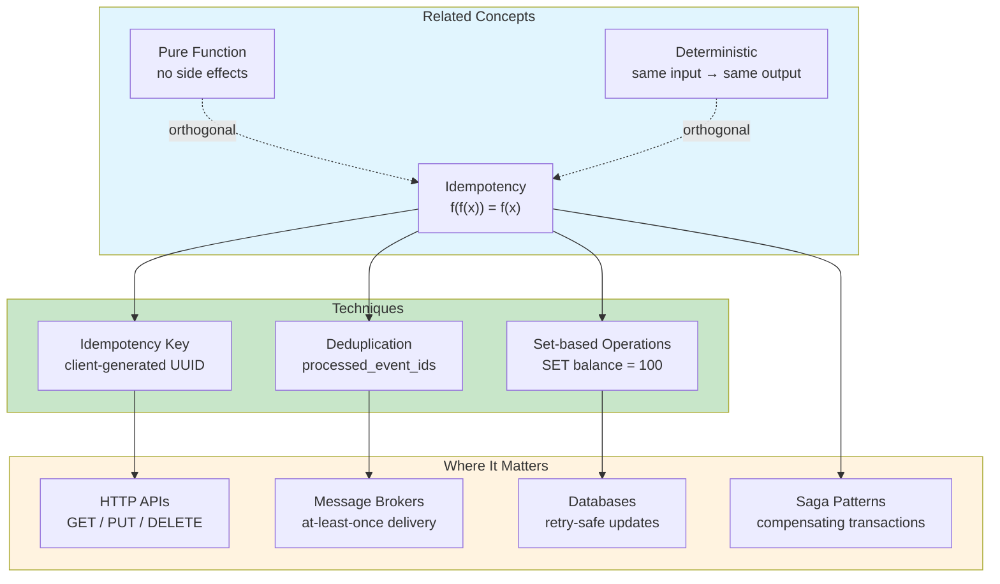
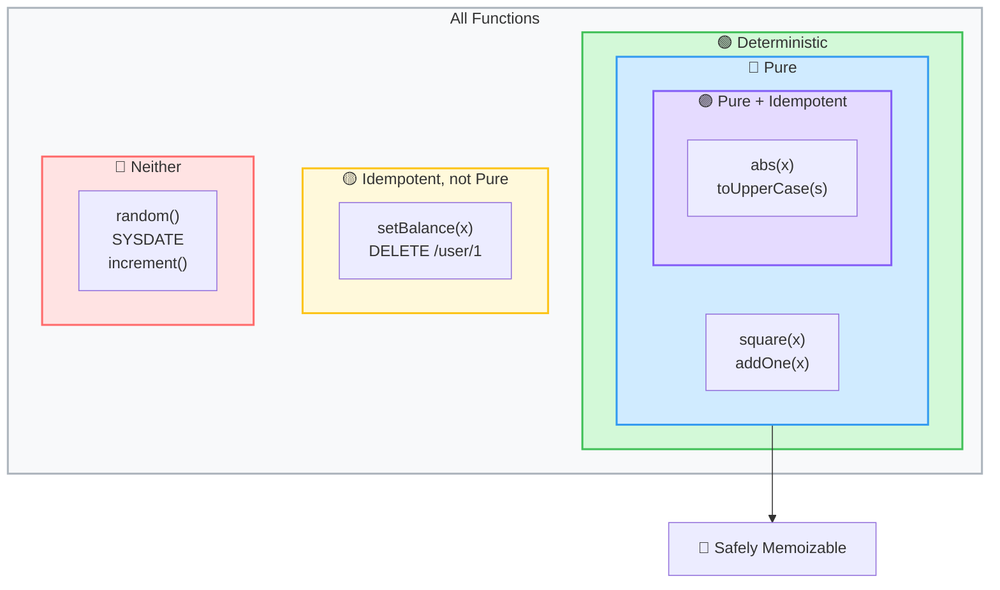
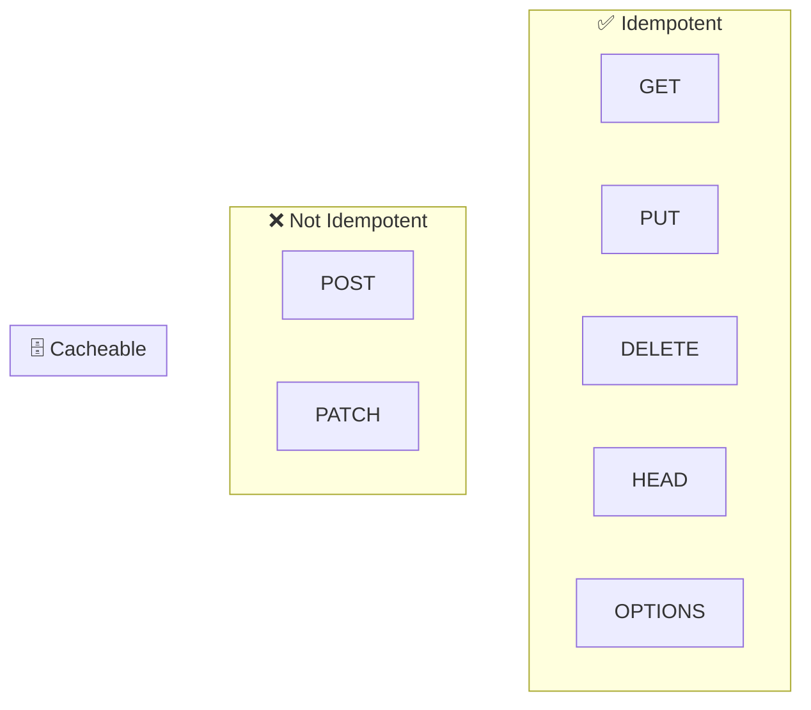
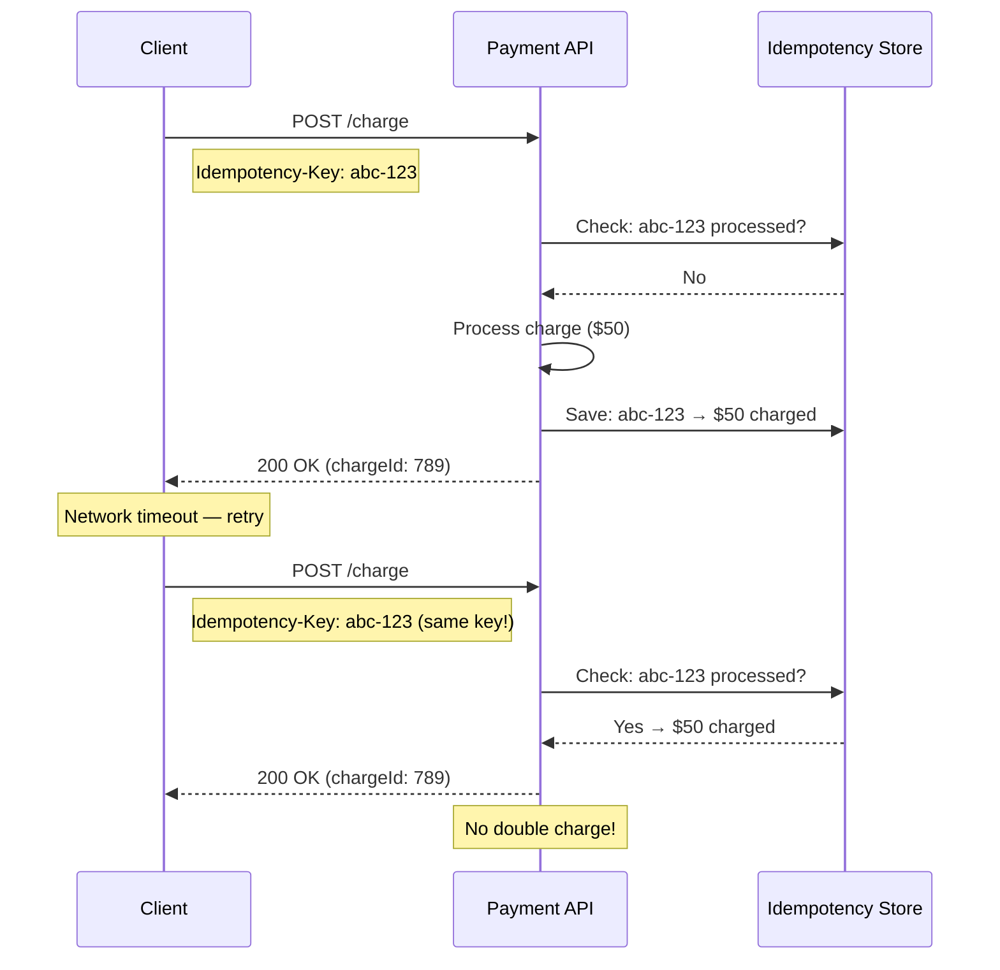
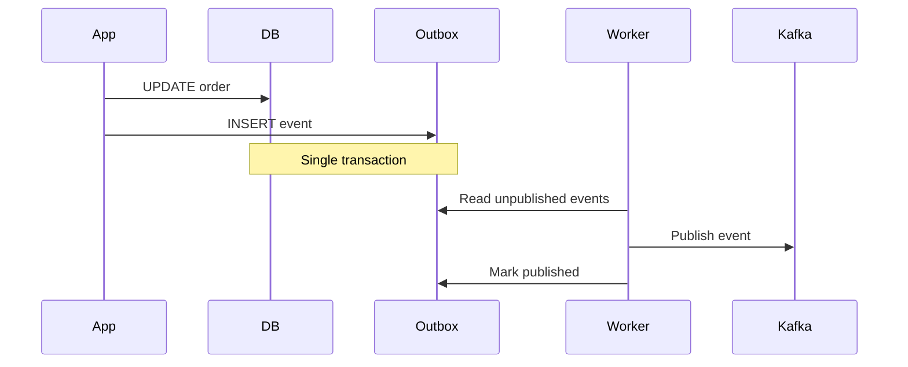

# Idempotency

In a distributed system, messages get lost, retries fire, and the same
request can arrive twice. Idempotency is the property that makes this
safe: applying an operation multiple times has the same effect as
applying it once.

Idempotency is not about performance. It is about **correctness under
uncertainty**. It is the reason you can safely retry a failed payment,
replay a Kafka stream, or resend a webhook without fear of double
charges, double orders, or double shipments.

## The Big Picture



## What Is Idempotency?

An operation is **idempotent** if executing it multiple times produces
the same result as executing it once.

```text
f(x) = y
f(f(x)) = y    ← idempotent
f(f(x)) ≠ y    ← not idempotent
```

**Examples:**

```java
// Idempotent: repeated calls have the same effect
void setStatus(String status) {
    this.status = status;  // second call: same value, no change
}

// NOT idempotent: each call changes state
void increment() {
    counter++;  // f(f(x)) = x + 2, not x + 1
}
```

```sql
-- Idempotent: balance becomes exactly 100
UPDATE users SET balance = 100 WHERE id = 1;

-- NOT idempotent: balance grows with each execution
UPDATE users SET balance = balance + 100 WHERE id = 1;

-- Idempotent: deleting the same row twice is a no-op
DELETE FROM users WHERE id = 1;

-- NOT idempotent: inserting creates a new row each time
INSERT INTO orders (user_id, total) VALUES (1, 50);
```

## Idempotency vs Purity vs Determinism

These three concepts are related but distinct:

| Property | Definition | Side effects allowed? | Example |
|----------|-----------|----------------------|---------|
| **Deterministic** | Same input → same output | Yes | `user.setName("Bob")` |
| **Pure** | No side effects, deterministic | No | `square(x)` |
| **Idempotent** | `f(f(x)) = f(x)` | Yes | `setBalance(100)` |



| Function | Pure? | Idempotent? | Safely Memoizable? |
|----------|-------|-------------|-------------------|
| `square(x)` | Yes | No (`square(square(2)) = 16 ≠ 4`) | Yes |
| `abs(x)` | Yes | Yes (`abs(abs(-1)) = 1`) | Yes |
| `setBalance(x)` | No (side effect) | Yes | No |
| `DELETE /user/1` | No (side effect) | Yes | No |
| `random()` | No | No | No |

**Key insight:** Purity and idempotency are orthogonal. A pure function
may not be idempotent (e.g., `addOne`). An idempotent operation may not
be pure (e.g., `DELETE`).

## HTTP Methods and Idempotency

HTTP defines idempotency at the protocol level:

| Method | Idempotent? | Safe? | Cachable? | Meaning |
|--------|------------|-------|-----------|---------|
| **GET** | Yes | Yes (read-only) | Yes | Retrieve resource |
| **HEAD** | Yes | Yes | Yes | Retrieve metadata |
| **PUT** | Yes | No | No | Replace resource |
| **DELETE** | Yes | No | No | Remove resource |
| **POST** | Usually **no** | No | Sometimes | Create resource |
| **PATCH** | Sometimes | No | No | Partial update |



**Why GET is both idempotent and cacheable:**

```http
GET /users/42 HTTP/1.1

HTTP/1.1 200 OK
Cache-Control: max-age=3600
ETag: "abc123"
```

Because GET is read-only and idempotent, a cache can return the stored
response without re-contacting the server. The `ETag` header lets the
client validate that the cached response is still fresh.

**Why POST is not idempotent:**

```http
POST /orders HTTP/1.1
Content-Type: application/json

{"user_id": 42, "total": 50}
```

Each POST creates a new order. If the client retries due to a timeout,
two orders are created. This is why payment APIs use **idempotency keys**.

## Idempotency in Databases

Database operations can be made idempotent by design:

```sql
-- ❌ NOT idempotent: balance grows on retry
UPDATE accounts SET balance = balance + 100 WHERE id = 1;

-- ✅ Idempotent: balance is set to an absolute value
UPDATE accounts SET balance = 100 WHERE id = 1;

-- ✅ Idempotent: UPSERT (insert or update)
INSERT INTO users (id, name, email)
VALUES (1, 'Alice', 'alice@example.com')
ON CONFLICT (id) DO UPDATE
SET name = EXCLUDED.name, email = EXCLUDED.email;
-- Second execution: no-op if data is the same
```

```java
// Idempotent: "set" semantics
@Transactional
public void updateStatus(long orderId, Status status) {
    Order order = orderRepository.findById(orderId);
    order.setStatus(status);  // same value on retry → no change
    orderRepository.save(order);
}

// NOT idempotent: "add" semantics
@Transactional
public void addPoints(long userId, int points) {
    User user = userRepository.findById(userId);
    user.setPoints(user.getPoints() + points);  // doubles on retry!
    userRepository.save(user);
}
```

## Idempotency Keys

When an operation is inherently non-idempotent (like `POST`), the client
can provide an **idempotency key** — a unique identifier that the server
uses to detect duplicates.



```java
@PostMapping("/charge")
public ChargeResponse charge(
        @RequestHeader("Idempotency-Key") String key,
        @RequestBody ChargeRequest request) {

    // Check if already processed
    Optional<ChargeResult> existing = idempotencyStore.find(key);
    if (existing.isPresent()) {
        return existing.get().toResponse();  // return cached result
    }

    // Process new charge
    ChargeResult result = paymentGateway.charge(request);

    // Store for future deduplication
    idempotencyStore.save(key, result);
    return result.toResponse();
}
```

## Kafka: Idempotent Producer and Consumer

Kafka relies heavily on idempotency for exactly-once semantics.

### Idempotent Producer

```text
Kafka stores: producerId + sequenceNumber
and silently drops duplicates.
```

When a producer retries a message due to a network timeout, Kafka
recognises the duplicate by its sequence number and discards it. No
double delivery.

### Idempotent Consumer

```java
@KafkaListener(topics = "orders")
@Transactional
public void handle(OrderCreatedEvent event) {
    // Check if already processed
    if (processedEvents.exists(event.getId())) {
        return; // already handled — safe to ignore
    }

    processOrder(event);
    processedEvents.save(event.getId());
}
```

**Why the consumer must be idempotent:** Kafka guarantees
**at-least-once delivery**. A message may be delivered multiple times.
The consumer must handle duplicates gracefully.

## Transaction Outbox

The Transaction Outbox pattern solves the "dual write" problem: how to
atomically update a database and publish an event.



The worker that forwards events to Kafka may crash or retry. Therefore:
- The worker itself must be idempotent (don't publish the same event twice)
- Kafka consumers must be idempotent (as shown above)

## Retry and Idempotency

Retry is only safe when the operation is idempotent.

```java
// ❌ DANGEROUS: retry without idempotency
public void chargeCard(BigDecimal amount) {
    paymentGateway.charge(amount);  // may double-charge on retry!
}

// ✅ SAFE: idempotency key makes retry safe
public void chargeCard(BigDecimal amount, String idempotencyKey) {
    paymentGateway.charge(amount, idempotencyKey);
    // Same key → same result, no matter how many retries
}
```

| Retry Strategy | Requires Idempotency? | Typical Use |
|----------------|----------------------|-------------|
| Fixed interval | Yes | Background jobs |
| Exponential backoff | Yes | API calls |
| Circuit breaker | No (stops trying) | Unhealthy services |

→ [Retry Pattern](../../architecture/resilience/retry-pattern.md)

## Comparison: The Full Picture

| Concept | Stateful? | Needs Invalidation? | Side Effects? | Goal |
|---------|-----------|---------------------|---------------|------|
| **Pure function** | No | No | No | Predictability |
| **Memoization** | Usually no | No | No | Performance |
| **Cache** | Yes | Yes | May have | Performance |
| **Idempotency** | Yes (tracks processed) | No | Yes | Correctness |

All of these answer the same question in different ways:

| What repeats? | Solution |
|---------------|----------|
| Function computation | Memoization |
| Data read | Cache |
| API request | Idempotency key |
| Event delivery | Idempotent consumer |
| Database operation | Set-based update |

## Timeline

| Year | Event | Significance |
|------|-------|------------|
| 1991 | HTTP/1.0 | GET defined as safe and idempotent |
| 1996 | HTTP/1.1 RFC 2616 | Formalised idempotency for PUT, DELETE |
| 2007 | Fielding — REST dissertation | Idempotency as a constraint of REST architecture |
| 2011 | Kafka 0.7 | At-least-once delivery becomes standard |
| 2017 | Kafka 0.11 — idempotent producer | Exactly-once semantics for producers |
| 2018 | Stripe API — idempotency keys | Mainstream adoption in payment APIs |
| 2020 | Debezium / Outbox pattern | Transactional event publishing |

## Further Reading

- [Functional Programming](../functional/index.md) — purity as the foundation
- [Memoization](../functional/memoization.md) — caching for pure functions
- [Saga Pattern](../../architecture/resilience/saga-pattern.md) — distributed transactions with compensation
- [Retry Pattern](../../architecture/resilience/retry-pattern.md) — when and how to retry
- [CQRS](../../architecture/data/cqrs.md) — separating reads from writes
- [Event Sourcing](../../architecture/data/event-sourcing.md) — immutable events as source of truth
- Fielding — *Architectural Styles and the Design of Network-based Software Architectures* (2000)

## Related Topics

- [Distributed Systems](./index.md) — consensus, replication, CAP
- [Functional Programming](../functional/index.md) — purity, referential transparency
- [Concurrency](../concurrency/index.md) — race conditions and safe retries
- [Databases](../databases/index.md) — ACID, transactions, consistency models
