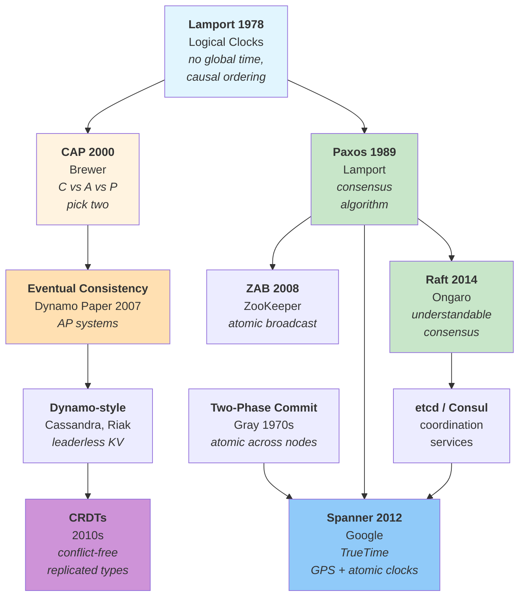
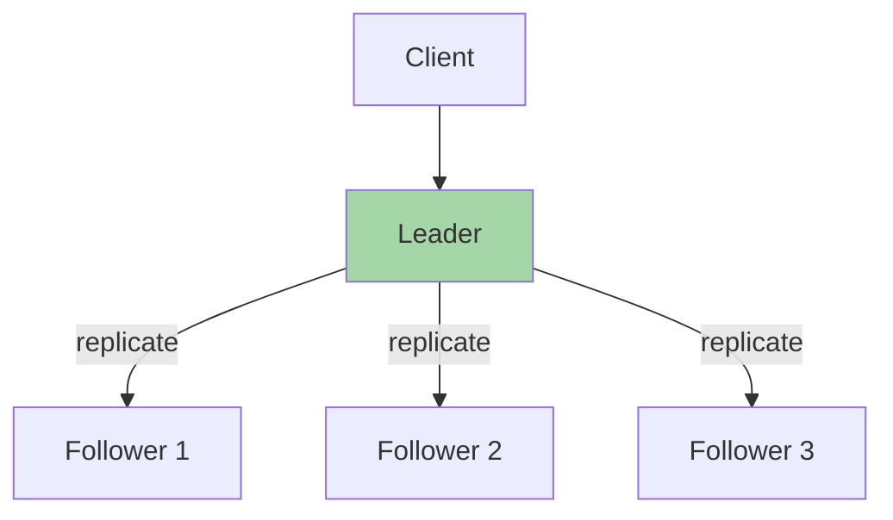
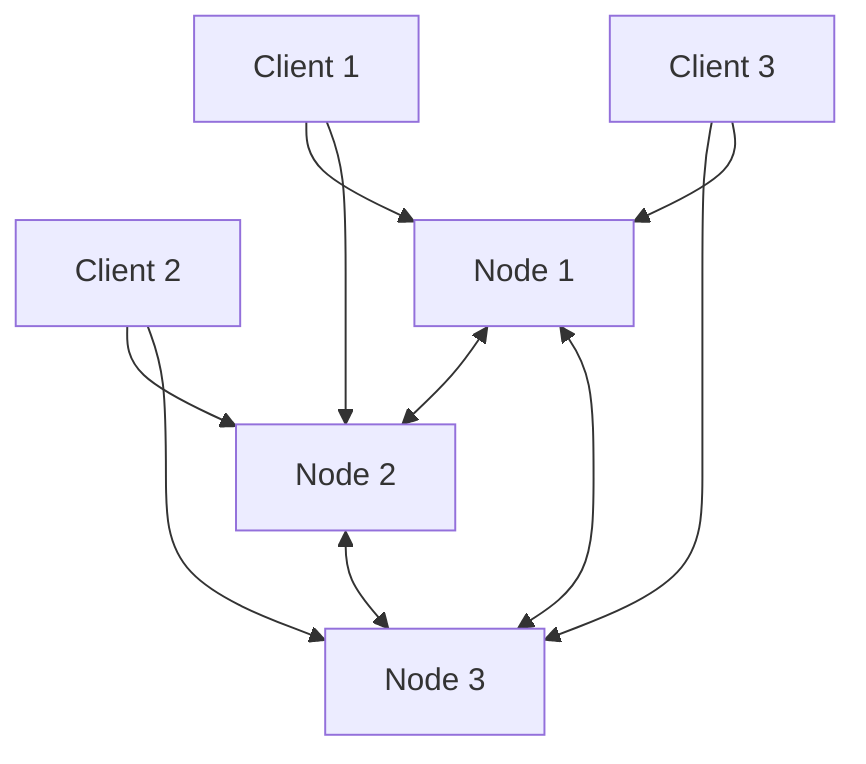
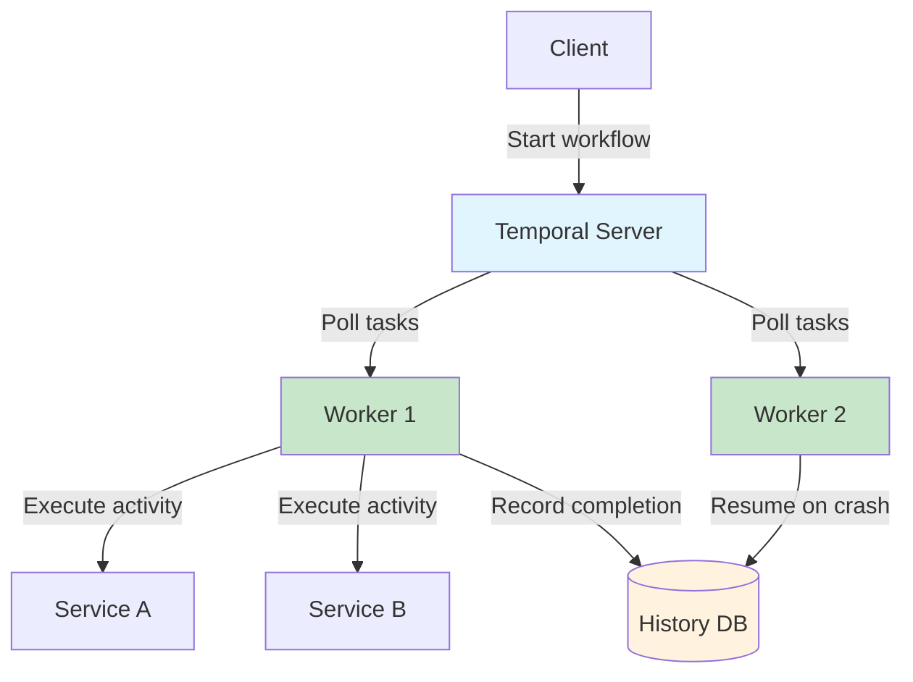

# Distributed Systems

Computing across multiple machines. A distributed system is one where
**a computer you didn't even know existed can render your own computer
unusable** (Leslie Lamport).

Distributed systems enable scale, fault tolerance, and geographic distribution —
but they introduce new categories of problems: no global time, unreliable
networks, and partial failures.

## The Big Picture



## What Is a Distributed System?

A distributed system is a collection of **independent computers** that
appear to users as a single coherent system.

**Characteristics:**

- **No shared memory** — nodes communicate only via messages
- **No global clock** — each node has its own clock, drifting apart
- **Independent failures** — one node can fail while others continue
- **Asynchronous communication** — message delivery is unpredictable

**Why distributed?**

| Reason | Example |
|---------|----------|
| **Scale** | More data than fits on one machine |
| **Fault tolerance** | Survive node failures without downtime |
| **Geographic distribution** | Low latency for users worldwide |
| **Parallelism** | Process more work in parallel |

## Time and Ordering

### The Problem

In a distributed system, there is no global clock. Two machines cannot
agree on "what time it is" precisely enough to order events.

**Network delays are unpredictable:**
- Messages can arrive out of order
- Clocks drift at different rates
- You cannot perfectly synchronise clocks

### Lamport's Logical Clocks (1978)

Leslie Lamport's insight: for most coordination, you don't need
to know **when** events happened — you need to know **in what order**
they happened.

**Happened-before relation (→):**

1. If events `a` and `b` occur in the same process, and `a` occurs first, then `a → b`
2. If `a` is the sending of a message and `b` is the receipt, then `a → b`
3. The relation is transitive: if `a → b` and `b → c`, then `a → c`

**Logical clocks** assign timestamps such that if `a → b`, then `C(a) < C(b)`.

```
Process A:  [1] ──send──→ [2] ──────→ [5]
                          ↑              ↓
Process B:        [1] ──→ [3] ──send──→ [4]
```

Events not related by `→` are **concurrent** — they happen "at the same time"
in the distributed sense.

**Key insight:** Physical time is irrelevant for ordering. Causality matters.

### Vector Clocks (1988)

Lamport clocks cannot detect concurrency. Vector clocks (Mattern, Fidge)
extend the idea:

- Each node maintains a vector `[t₁, t₂, ..., tₙ]`
- For two vectors $V_a$ and $V_b$, $V_a < V_b$ if and only if $\forall i: V_a[i] \le V_b[i]$ AND $\exists i: V_a[i] < V_b[i]$
- If neither $V_a < V_b$ nor $V_b < V_a$, then the events are **concurrent** ($V_a \parallel V_b$)

This enables **causal consistency**: if event `a` causally precedes `b`,
any node that observes `b` is guaranteed to have already observed `a`.

→ [Leslie Lamport](../../authors/leslie-lamport.md) ·
[Time, Clocks paper](../../works/papers/lamport-1978-clocks.md)

## CAP Theorem (2000)

### The Theorem

Eric Brewer's **CAP theorem** (proven by Gilbert and Lynch in 2002) states that a distributed data store
cannot simultaneously provide more than two of:

| Property | Meaning | Formal Definition |
|----------|---------|-------------------|
| **Consistency (C)** | Equivalent to **Linearizability** | Every read receives the most recent successful write or an error |
| **Availability (A)** | High availability of non-failing nodes | Every non-failing node returns a non-error response (no guarantee it contains the latest write) |
| **Partition Tolerance (P)** | System continues operating despite arbitrary message loss | The system continues to operate despite arbitrary partitioning of the network |

**During a partition**, you must choose:
- **CP systems** (e.g., ZooKeeper, etcd) — reject writes or fail reads to preserve strict consistency
- **AP systems** (e.g., Cassandra, Riak) — accept writes on partition halves, risking temporary inconsistency

### CAP is About Partitions

CAP only forces a hard trade-off **during an active network partition**. When the network
is healthy, a system can provide both consistency and availability.

### The Reality

Network partitions are inevitable. So the practical choice is:
- Design for CP and accept unavailable periods during partition events
- Design for AP and accept inconsistent states that must be reconciled later

**PACELC extension** (Abadi 2012): Even when the network is running normally (**E**lse),
you must choose between Latency (**L**) and Consistency (**C**).

→ [Eric Brewer](../../authors/eric-brewer.md) ·
[CAP Conjecture](../../works/papers/brewer-2000-cap.md)

## Consistency Models

Different systems provide different guarantees:

| Model | Description | Trade-off |
|--------|-------------|------------|
| **Strong (Linearizable)** | Operations appear to execute instantaneously at a single point in time | High latency, coordination overhead |
| **Sequential** | All nodes see operations in the same order | Weaker than linearizable; no real-time guarantees |
| **Causal** | Causally-related operations are ordered; concurrent ones can be seen in different orders | If node sees `b` (caused by `a`), it must see `a` first |
| **Eventual** | If no updates, all nodes eventually converge | Strongest latency guarantees, weakest consistency |

### When to use which?

| Use case | Recommended consistency |
|----------|----------------------|
| Financial transactions | Strong (linearizable) |
| Social media feed | Eventual |
| Shopping cart | Causal (user sees their own updates) |
| Analytics | Eventual (high throughput) |

## Consensus

### The Problem

How can a group of distributed nodes agree on a single value when
nodes can fail (fail-stop) and messages can be lost?

### Paxos (1989 / 1998)

Leslie Lamport's **Paxos** solved the fault-tolerant consensus problem:
- A **proposer** proposes a value
- **Acceptors** accept or reject proposals
- **Learners** learn the agreed value

Paxos guarantees:
- **Safety** — only one value is ever chosen
- **Liveness** — if a majority of nodes is reachable, a value will eventually be chosen

Paxos is notoriously difficult to understand. Lamport described it
using an allegory set on the Greek island of Paxos — which confused
reviewers so much the paper wasn't published until 1998.

### Raft (2014)

**Raft** (Diego Ongaro) was designed to be "an understandable
consensus algorithm":

**Key idea:** Consensus is about agreeing on a sequence of values (a replicated log).

| Phase | What happens |
|-------|--------------|
| **Leader election** | One node becomes leader (via majority vote) |
| **Append entries** | Leader appends entries to log, replicates to followers |
| **Commit** | Entry is committed when majority has it in log |

Raft's clarity made consensus accessible. It's used in:
- **etcd** (Kubernetes coordination)
- **Consul** (service discovery)
- **HashiCorp Nomad** (scheduling)

### Two-Phase Commit (2PC)

For atomic transactions across multiple database nodes, **2PC** ensures atomicity:

**Phase 1 — Prepare:**
- Coordinator asks all participants: "Can you commit?"
- Each participant votes: YES or NO

**Phase 2 — Commit:**
- If all voted YES: coordinator sends "COMMIT" to all
- If any voted NO: coordinator sends "ABORT" to all

**Problem:** 2PC is a blocking protocol. If the coordinator fails permanently after phase 1, participants are blocked and cannot release database locks. This is why **3PC** (non-blocking but complex) and **saga patterns** are used in practice.

→ [Jim Gray](../../authors/jim-gray.md) — transactions

## Replication

### Single-Leader Replication

One node handles all writes, replicates to followers:



| Strength | Weakness |
|----------|-----------|
| Strong consistency (reads from leader) | Leader is single point of failure |
| Simple conflict resolution | Write throughput limited by leader |

**Used by:** PostgreSQL streaming replication, MySQL master-slave, MongoDB.

### Leaderless Replication

Clients can write to any node:



**Quorum reads and writes:**
- Write to `W` nodes
- Read from `R` nodes
- Choose `R + W > N` (where `N` is total replicas) to ensure at least one node has latest value

**Used by:** Cassandra, Riak.

**Conflict resolution:** Last-write-wins (by timestamp), merge functions,
or CRDTs.

## Event Sourcing and CQRS

*Note: While these patterns are applicable in monolithic applications, they are foundational in distributed architectures for reliable state representation across network boundaries.*

### Event Sourcing

Store events, not current state:

```
State: {balance: 100, transactions: []}

Events:
  + Deposit(50)    → state becomes {balance: 150, transactions: [Deposit(50)]}
  + Withdraw(30)   → state becomes {balance: 120, transactions: [Deposit(50), Withdraw(30)]}
```

**Benefits:**
- Complete audit trail
- Can reconstruct state at any point in time
- Natural replication (replicate log of events)
- Enables temporal queries

### CQRS — Command Query Responsibility Segregation

Separate read and write models:

```
Write Model (Event Sourced):
  EventLog → Projections → Read Model

Read Model (Optimised for queries):
  Denormalised tables, search indexes
```

**Why CQRS?**
- Write and read patterns are different
- Can scale reads and writes independently
- Complex read queries don't slow down writes

→ [Martin Kleppmann](../../authors/martin-kleppmann.md) ·
[DDIA](../../works/books/kleppmann-2017-ddia.md)

## Conflict-Free Replicated Data Types — CRDTs

**CRDTs** enable concurrent updates to be merged automatically without conflicts:

**Example — State-based LWW-Element-Set Register:**

```json
// Node A: {value: "hello", timestamp: 100}
// Node B: {value: "world", timestamp: 50}

// Merge: take highest timestamp
// Result: {value: "hello", timestamp: 100}
```

**Example — Counter:**

```haskell
-- G-Counter: supports increments from any node
type GCounter = Map Node Int

merge :: GCounter -> GCounter -> GCounter
merge a b = unionWith max a b

-- If A increments by 3, B by 5:
-- A: {A: 3}, B: {B: 5}
-- Merge: {A: 3, B: 5} → total: 8
```

**Used by:** Local-first apps, collaborative editing (Google Docs),
real-time collaboration tools.

## Fault Tolerance

### Failure Modes

| Failure type | Description |
|-------------|-------------|
| **Crash-stop** | Node stops executing permanently |
| **Crash-recovery** | Node stops, but can restart and resume execution |
| **Omission failure** | Node fails to send or receive messages |
| **Byzantine failure** | Node behaves arbitrarily (lying, corruption, malicious actions) |
| **Network partition** | Communication lost between subsets of nodes |

### Replication as Fault Tolerance

Replication tolerates failures. In quorum-based consensus systems (Raft, Paxos), majority is required:

| Replication factor ($N$) | Quorum ($Q = \lfloor N/2 \rfloor + 1$) | Faults tolerated ($N - Q$) |
|-------------------------|----------------------------------------|---------------------------|
| 1 | 1 | 0 |
| 2 | 2 | 0 |
| 3 | 2 | 1 |
| 5 | 3 | 2 |
| 7 | 4 | 3 |

### Leader Election

How to select a new leader when the current one fails:

**Bully algorithm (Classic):**
- Highest ID node becomes leader
- Nodes send "are you alive?" messages
- If higher ID responds, step down
- *Note: Rarely used in modern production systems due to high message overhead during failure.*

**Raft election:**
- Node increments term, requests votes
- Vote for first candidate in term
- Majority wins

**ZAB (ZooKeeper Atomic Broadcast):**
- Primary election based on transaction ID (zxid) to ensure node with most complete log wins
- ZK nodes execute recovery phase before service starts

## Tail Latency and Percentiles

In distributed systems, the **mean** latency is almost never what matters.
What matters is the **tail** — the slowest requests.

### The Tail-at-Scale Problem

When a request fans out to many services (e.g., 100 backend calls
to build a search result page), the overall latency is determined by
the **slowest dependency**, not the average:

```text
If each backend has p99 ≈ 10 ms:
  - 1 backend call:  p99 ≈ 10 ms
  - 10 calls:        p99 ≈ 10 ms  (still okay)
  - 100 calls:       p99 ≈ 10 ms  (tail compounds)

With enough fan-out, the 99th-percentile of the aggregate
becomes the median of the individual services.
```

This is the **tail-at-scale** problem: at large scale, rare events
become common.

### Why Percentiles Beat the Mean

| Metric | What it tells you | Why it falls short |
|--------|-------------------|-------------------|
| **Mean** | Average experience | Hides outliers; users don't feel average |
| **p50 (median)** | Typical experience | Ignores the worst half |
| **p95** | Threshold for "almost everyone" | Good for capacity planning |
| **p99** | Worst-case baseline | Captures the tail that hurts users |
| **p99.9** | Extreme outliers | Reveals saturation, GC pauses, retries |

**Rule of thumb:** measure what your users actually feel.
If 1% of users time out, the mean won't tell you — p99 will.

### Mitigating Tail Latency

| Technique | How it helps |
|-----------|-------------|
| **Hedged requests** | Send the same request to two replicas, use the faster response |
| **Tied cancellation** | Cancel slow requests after a deadline |
| **Backup requests** | Retry if the first request exceeds a threshold (e.g., p95 + margin) |
| **Load balancing** | Avoid hot spots; prefer least-loaded over round-robin |
| **Request coalescing** | Deduplicate identical in-flight requests |

→ [Jeff Dean — *The Tail at Scale* (2013)](https://research.google/pubs/pub40801/)

## The Log as a Unifying Abstraction

Many distributed systems use an **append-only log**:

| System | How it uses log |
|---------|----------------|
| **Kafka** | Topics are partitioned logs |
| **Databases** | Write-ahead logging for crash recovery |
| **Event sourcing** | Log of events as source of truth |
| **Replication** | Log of operations to replicate |
| **Consensus (Raft)** | Append-only log of committed entries |

**Why the log?**

- **Immutable** — once written, never changed
- **Ordered** — defines causality
- **Replicable** — easy to copy between nodes
- **Recoverable** — replay log to reconstruct state

## Distributed Transactions

### Distributed Transaction Patterns

| Pattern | Description |
|---------|-------------|
| **Two-Phase Commit (2PC)** | Standard atomic commit protocol. Problem: coordinator failure blocks participants. |
| **Sagas** | Break transaction into sequence of local transactions with compensating actions |
| **Eventual consistency + reconciliation** | Accept temporary inconsistency, fix later |
| **CRDTs** | Conflict-free merge for specific data types |
| **[Idempotent operations](../distributed/idempotency.md)** | Retry-safe operations — applying an operation twice has the same effect as once |
| **[Transactional Outbox](../distributed/transactional-outbox.md)** | Guarantee events are never lost by writing them to an outbox table in the same DB transaction as business data |
| **[Leased Outbox](../distributed/leased-outbox.md)** | A high-throughput, non-transactional outbox variant for NoSQL databases using LWTs for consumer partition leasing |
| **[Transactional Inbox](../distributed/transactional-inbox.md)** | Guarantee duplicate messages are handled safely via deduplication in the consumer's database |

```
Saga Example: Book Flight + Book Hotel
  1. Book Flight → SUCCESS
  2. Book Hotel → FAIL
  3. Compensate: Cancel Flight → SUCCESS
```

## Durable Workflow Orchestration (Temporal)

**Temporal** is a platform for building durable, reliable distributed workflows. It guarantees that a sequence of steps (a "workflow") will complete exactly as written, even in the face of crashes, network failures, or long waits.

### Core Concepts

| Concept | Description |
|---------|-------------|
| **Workflow** | A sequence of activities written in code (Java, Go, TypeScript, etc.) that defines the business process |
| **Activity** | An individual unit of work — typically a call to an external service or database |
| **Durable execution** | Workflow state is automatically persisted after every step; if a worker crashes, execution resumes from the last completed step |
| **Persistent timers** | Timers survive process restarts — a `sleep(30 days)` is stored in the database and resumed exactly after 30 days |
| **Activity deduplication** | Activities are retried automatically on failure; Temporal guarantees *at-least-once* execution of the activity code with *exactly-once* result semantics via built-in deduplication (idempotency tokens) |

### How Temporal Works



**Key components:**
- **Temporal Server** — manages workflow state, task queues, and scheduling
- **History DB** — stores the event history of every workflow (strongly consistent: Cassandra, PostgreSQL or MySQL)
- **Workers** — long-running processes that poll for tasks and execute workflow code

### Relationship to Distributed Systems Fundamentals

| Fundamental | How Temporal Applies It |
|-------------|------------------------|
| **Event sourcing** | Workflow history is an append-only log of events (commands, completions, timers) |
| **Saga pattern** | Built-in compensation and retry for long-running transactions |
| **Exactly-once execution** | Activity results are cached by ID; duplicate executions return the same result |
| **Fault tolerance** | Worker crashes are transparent — state is recovered from the history DB |
| **CAP** | The history DB is configured for strong consistency (typically CP or strongly consistent write paths) to guarantee execution history integrity |

## Consensus in Practice

### etcd

Key-value store for Kubernetes configuration:
- Uses Raft for consensus
- Strong consistency
- Watch API for change notifications

### ZooKeeper

Configuration and coordination service:
- Uses ZAB protocol (ZooKeeper Atomic Broadcast)
- ZNode hierarchy (like filesystem)
- Leader election, service discovery

### Consul

Service discovery and configuration:
- Raft-based consensus
- Health checking, KV store
- Service registration/discovery

### Spanner

Google's globally distributed database:
- Uses **TrueTime** — synchronises clocks with GPS + atomic clocks to obtain tight bounds on clock uncertainty ($\epsilon$)
- Achieves **external consistency** (strict serialisability) — globally consistent across datacenters
- Supports **global transactions** using 2PC on top of Paxos groups

## Timeline

| Year | Event | Impact |
|------|-------|--------|
| 1978 | Lamport — Logical Clocks | Foundation of distributed ordering |
| 1981 | Gray — "The Transaction Concept" | ACID properties for distributed systems formalised |
| 1989 | Lamport — Paxos | Classic consensus algorithm designed |
| 1998 | Paxos published | Consensus becomes accessible after original paper delay |
| 2000 | Brewer — CAP Theorem | Consistency vs availability trade-off introduced |
| 2002 | Gilbert & Lynch — CAP proof | Formal linearizability proof of CAP |
| 2007 | Amazon Dynamo Paper | AP-system model publicized (vector clocks, leaderless) |
| 2008 | ZooKeeper / ZAB | Highly available atomic broadcast system open-sourced |
| 2012 | Google Spanner | External consistency across datacenters using Paxos and TrueTime |
| 2012 | AWS DynamoDB launch | Managed DB service launched (using Paxos, distinct from 2007 AP Dynamo model) |
| 2014 | Ongaro — Raft | Understandable consensus algorithm published |
| 2017 | Kleppmann — DDIA | Comprehensive guide to distributed systems |

## The Pragmatic View

**Fallacies of Distributed Computing** (L. Peter Deutsch, 1994):

1. The network is reliable
2. Latency is zero
3. Bandwidth is infinite
4. The network is secure
5. Topology doesn't change
6. There is one administrator
7. Transport cost is zero
8. The network is homogeneous

**Design reality:**
- Network partitions WILL happen
- Messages WILL be delayed, lost, reordered
- Nodes WILL fail
- You CANNOT have global time
- You MUST handle partial failures

**Choose your trade-offs:**

| Scenario | Recommended approach |
|----------|---------------------|
| Strong consistency required | CP systems (ZooKeeper, etcd) |
| High availability critical | AP systems (Dynamo-style) |
| Multi-datacenter, strong consistency | Spanner-style (TrueTime) |
| Collaborative editing | CRDTs |
| Order matters, consistency doesn't | Eventual + conflict resolution |
| Transactional semantics | Sagas, 2PC with timeout handling |

## Further Reading

- Lamport — *Time, Clocks, and Ordering* (1978)
- Brewer — *CAP Conjecture* (2000)
- Gilbert & Lynch — *Brewer's Conjecture* (2002)
- Kleppmann — *Designing Data-Intensive Applications* (2017)
- Ongaro — *In Search of an Understandable Consensus Algorithm* (2014)
- Helland — *Life Beyond Distributed Transactions* (2007)

## Key Authors

- [Leslie Lamport](../../authors/leslie-lamport.md) — logical clocks, Paxos
- [Jim Gray](../../authors/jim-gray.md) — transactions, ACID
- [Eric Brewer](../../authors/eric-brewer.md) — CAP theorem
- [Martin Kleppmann](../../authors/martin-kleppmann.md) — DDIA
- [Diego Ongaro](../../authors/diego-ongaro.md) — Raft

## Related Topics

- [Databases](../databases/index.md) — storage engines, data models, query languages (the foundation distributed systems build on)
- [Concurrency](../concurrency/index.md) — shared-memory vs distributed
- [Idempotency](../distributed/idempotency.md) — retry-safe operations in distributed systems
- [Leased Outbox](../distributed/leased-outbox.md) — high-throughput outbox for NoSQL
- [Architecture & Modularity](../architecture/index.md) — microservices, system design
- [Process](../process/index.md) — how teams build distributed systems
- [Containers & Orchestration](../containers/index.md) — runtime substrate for distributed systems (Kubernetes uses etcd / Raft)
- [Languages](../../languages/index.md) — Erlang (actor model), Go (CSP)