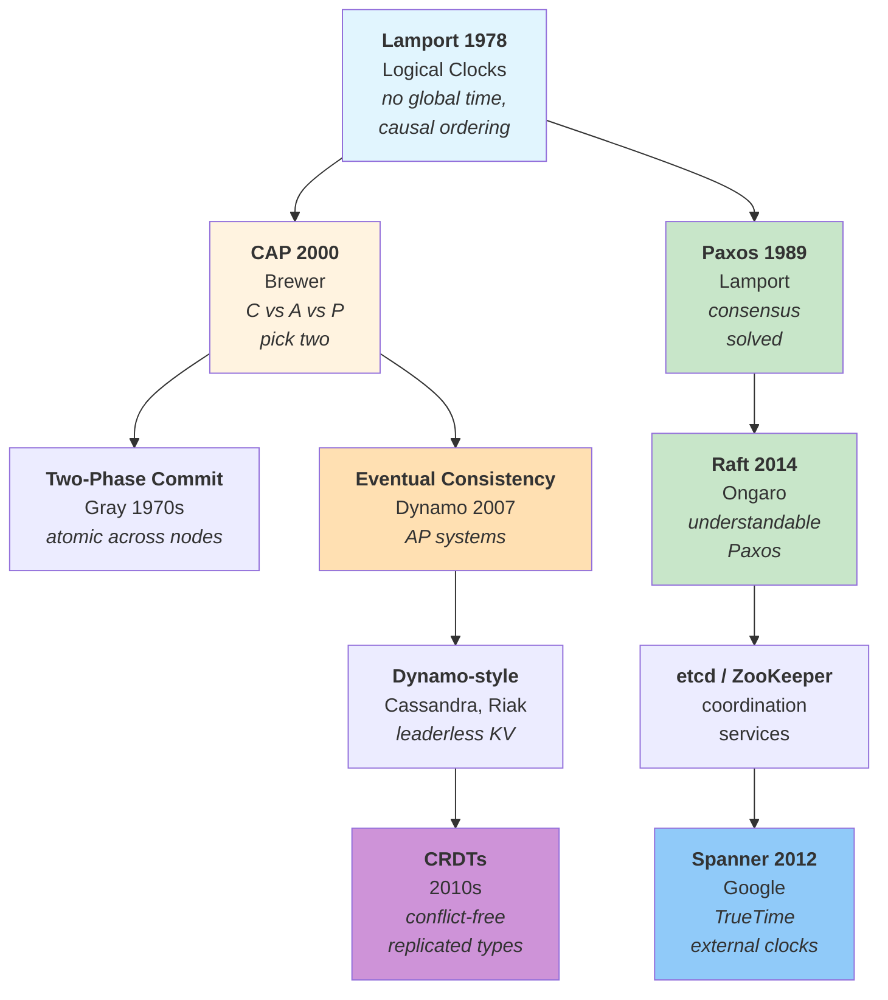
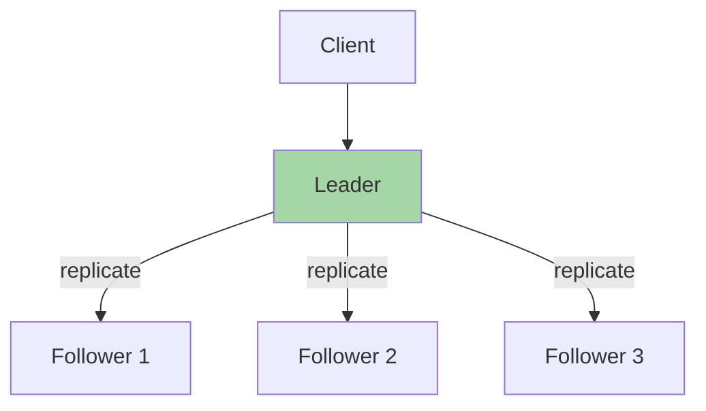
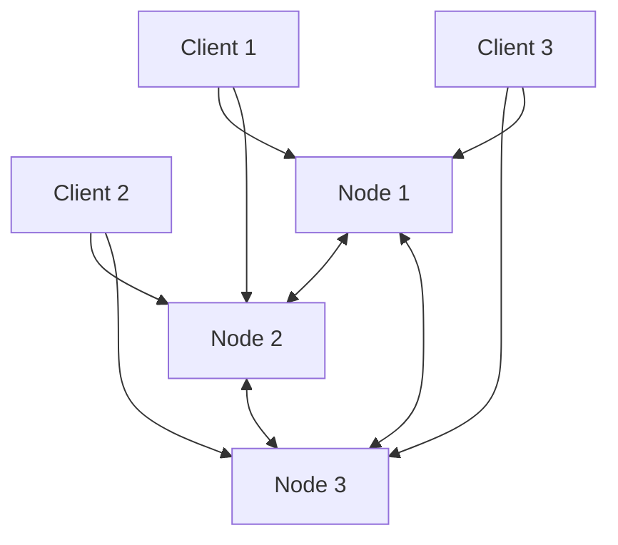

# Distributed Systems

Computing across multiple machines. A distributed system is one where
**a computer you didn't even know existed can render your own computer
unusable** (Leslie Lamport).

Distributed systems enable scale, fault tolerance, and geographic distribution —
but they introduce new categories of problems: no global time, unreliable
networks, and partial failures.

## The Big Picture



## What Is a Distributed System?

A distributed system is a collection of **independent computers** that
appear to users as a single coherent system.

**Characteristics:**

- **No shared memory** — nodes communicate only via messages
- **No global clock** — each node has its own clock, drifting apart
- **Independent failures** — one node can fail while others continue
- **Asynchronous communication** — message delivery is unpredictable

**Why distributed?**

| Reason | Example |
|---------|----------|
| **Scale** | More data than fits on one machine |
| **Fault tolerance** | Survive node failures without downtime |
| **Geographic distribution** | Low latency for users worldwide |
| **Parallelism** | Process more work in parallel |

## Time and Ordering

### The Problem

In a distributed system, there is no global clock. Two machines cannot
agree on "what time it is" precisely enough to order events.

**Network delays are unpredictable:**
- Messages can arrive out of order
- Clocks drift at different rates
- You cannot perfectly synchronise clocks

### Lamport's Logical Clocks (1978)

Leslie Lamport's insight: for most coordination, you don't need
to know **when** events happened — you need to know **in what order**
they happened.

**Happened-before relation (→):**

1. If events `a` and `b` occur in the same process, and `a` occurs first, then `a → b`
2. If `a` is the sending of a message and `b` is the receipt, then `a → b`
3. The relation is transitive: if `a → b` and `b → c`, then `a → c`

**Logical clocks** assign timestamps such that if `a → b`, then `C(a) < C(b)`.

```
Process A:  [1] ──send──→ [2] ──────→ [5]
                          ↑              ↓
Process B:        [1] ──→ [3] ──send──→ [4]
```

Events not related by `→` are **concurrent** — they happen "at the same time"
in the distributed sense.

**Key insight:** Physical time is irrelevant for ordering. Causality matters.

### Vector Clocks (1988)

Lamport clocks cannot detect concurrency. Vector clocks (Mattern, Fidge)
extend the idea:

- Each node maintains a vector `[t₁, t₂, ..., tₙ]`
- `C(a) ≤ C(b)` if all timestamps in `C(a)` are ≤ corresponding in `C(b)`, and at least one is `<`
- If `C(a)` and `C(b)` are incomparable (neither ≤ the other), events are concurrent

This enables **causal consistency**: if event `a` causally precedes `b`,
all nodes will eventually see `a` before `b`.

→ [Leslie Lamport](../../authors/leslie-lamport.md) ·
[Time, Clocks paper](../../works/papers/lamport-1978-clocks.md)

## CAP Theorem (2000)

### The Theorem

Eric Brewer's **CAP theorem** states that a distributed data store
cannot simultaneously provide more than two of:

| Property | Meaning |
|----------|----------|
| **Consistency (C)** | All nodes see the same data at the same time |
| **Availability (A)** | Every request receives a response (success or error) |
| **Partition Tolerance (P)** | System continues operating when network between nodes is lost |

**During a partition**, you must choose:
- **CP systems** (e.g., ZooKeeper, etcd) — reject writes to stay consistent
- **AP systems** (e.g., Cassandra, Dynamo) — accept writes, risk inconsistency

### CAP is About Partitions

CAP only applies **during a network partition**. When the network
is healthy, you can have all three: consistency, availability,
and partition tolerance.

The theorem was proven formally by Gilbert and Lynch (2002).

### The Reality

Network partitions are inevitable. So the practical choice is:
- Design for CP and accept unavailable periods
- Design for AP and accept inconsistent states

**PACELC extension** (Abadi 2010): Even without partitions,
you must choose between latency and consistency.

→ [Eric Brewer](../../authors/eric-brewer.md) ·
[CAP Conjecture](../../works/papers/brewer-2000-cap.md)

## Consistency Models

Different systems provide different guarantees:

| Model | Description | Trade-off |
|--------|-------------|------------|
| **Strong (Linearizable)** | Operations appear to execute instantaneously at a single point in time | High latency, coordination overhead |
| **Sequential** | All nodes see operations in the same order | Weaker than linearizable |
| **Causal** | Causally-related operations are ordered by all nodes | Concurrent operations may appear in different orders |
| **Eventual** | If no updates, all nodes eventually converge | Strongest latency guarantees, weakest consistency |

### When to use which?

| Use case | Recommended consistency |
|----------|----------------------|
| Financial transactions | Strong (linearizable) |
| Social media feed | Eventual |
| Shopping cart | Causal (user sees their own updates) |
| Analytics | Eventual (high throughput) |

## Consensus

### The Problem

How can a group of distributed nodes agree on a single value when
nodes can fail and messages can be lost?

### Paxos (1989 / 1998)

Leslie Lamport's **Paxos** solved the consensus problem:
- A **proposer** proposes a value
- **Acceptors** accept or reject proposals
- **Learners** learn the agreed value

Paxos guarantees:
- **Safety** — only one value is ever chosen
- **Liveness** — if a majority is reachable, a value will eventually be chosen

Paxos is notoriously difficult to understand. Lamport described it
using an allegory set on Greek island of Paxos — which confused
reviewers so much the paper wasn't published until 1998.

### Raft (2014)

**Raft** (Diego Ongaro) was designed to be "an understandable
consensus algorithm":

**Key idea:** Consensus is about agreeing on a sequence of values (a log).

| Phase | What happens |
|-------|--------------|
| **Leader election** | One node becomes leader (via majority vote) |
| **Append entries** | Leader appends entries to log, replicates to followers |
| **Commit** | Entry is committed when majority has it in log |

Raft's clarity made consensus accessible. It's used in:
- **etcd** (Kubernetes coordination)
- **Consul** (service discovery)
- **HashiCorp Nomad** (scheduling)

### Two-Phase Commit (2PC)

For transactions across multiple nodes, **2PC** ensures atomicity:

**Phase 1 — Prepare:**
- Coordinator asks all participants: "Can you commit?"
- Each participant votes: YES or NO

**Phase 2 — Commit:**
- If all voted YES: coordinator sends "COMMIT" to all
- If any voted NO: coordinator sends "ABORT" to all

**Problem:** If coordinator fails after phase 1, participants are
blocked (cannot release locks). This is why **3PC** and
**saga patterns** exist.

→ [Jim Gray](../../authors/jim-gray.md) — transactions

## Replication

### Single-Leader Replication

One node handles all writes, replicates to followers:



| Strength | Weakness |
|----------|-----------|
| Strong consistency (reads from leader) | Leader is single point of failure |
| Simple conflict resolution | Write throughput limited by leader |

**Used by:** PostgreSQL streaming replication, MySQL master-slave, MongoDB.

### Leaderless Replication

Clients can write to any node:



**Quorum reads and writes:**
- Write to `W` nodes where `W > N/2`
- Read from `R` nodes where `R > N/2`
- Choose `R + W > N` to ensure at least one node has latest value

**Used by:** Cassandra, Riak, DynamoDB.

**Conflict resolution:** Last-write-wins (by timestamp), merge functions,
or CRDTs.

## Event Sourcing and CQRS

### Event Sourcing

Store events, not current state:

```
State: {balance: 100, transactions: []}

Events:
  + Deposit(50)    → state becomes {balance: 150, transactions: [Deposit(50)]}
  + Withdraw(30)   → state becomes {balance: 120, transactions: [Deposit(50), Withdraw(30)]}
```

**Benefits:**
- Complete audit trail
- Can reconstruct state at any point in time
- Natural replication (replicate log of events)
- Enables temporal queries

### CQRS — Command Query Responsibility Segregation

Separate read and write models:

```
Write Model (Event Sourced):
  EventLog → Projections → Read Model

Read Model (Optimised for queries):
  Denormalised tables, search indexes
```

**Why CQRS?**
- Write and read patterns are different
- Can scale reads and writes independently
- Complex read queries don't slow down writes

→ [Martin Kleppmann](../../authors/martin-kleppmann.md) ·
[DDIA](../../works/books/kleppmann-2017-ddia.md)

## Conflict-Free Replicated Data Types — CRDTs

**CRDTs** enable concurrent updates to be merged automatically without conflicts:

**Example — Last-Write-Wins Register:**

```json
// Node A: {value: "hello", timestamp: 100}
// Node B: {value: "world", timestamp: 50}

// Merge: take highest timestamp
// Result: {value: "hello", timestamp: 100}
```

**Example — Counter:**

```haskell
-- G-Counter: supports increments from any node
type GCounter = Map Node Int

merge :: GCounter -> GCounter -> GCounter
merge a b = unionWith max a b

-- If A increments by 3, B by 5:
-- A: {A: 3}, B: {B: 5}
-- Merge: {A: 3, B: 5} → total: 8
```

**Used by:** Local-first apps, collaborative editing (Google Docs),
real-time collaboration tools.

## Fault Tolerance

### Failure Modes

| Failure type | Description |
|-------------|-------------|
| **Crash failure** | Node stops and doesn't restart |
| **Omission failure** | Node doesn't respond to messages |
| **Byzantine failure** | Node behaves arbitrarily (lying, malicious) |
| **Network partition** | Communication lost between subsets of nodes |

### Replication as Fault Tolerance

Replication tolerates failures:

| Replication factor | Faults tolerated |
|-------------------|-------------------|
| 2 | 0 (no benefit) |
| 3 | 1 |
| 5 | 2 |
| 7 | 3 |

With 3 replicas, you can lose 1 node and still have a quorum.

### Leader Election

How to select a new leader when current one fails:

**Bully algorithm:**
- Highest ID node becomes leader
- Nodes send "are you alive?" messages
- If higher ID responds, step down

**Raft election:**
- Node increments term, requests votes
- Vote for first candidate in term
- Majority wins

**ZAB (ZooKeeper Atomic Broadcast):**
- Similar to Raft
- Guarantees total order of messages
- Used by ZooKeeper

## The Log as a Unifying Abstraction

Many distributed systems use an **append-only log**:

| System | How it uses log |
|---------|----------------|
| **Kafka** | Topics are partitioned logs |
| **Databases** | Write-ahead logging for crash recovery |
| **Event sourcing** | Log of events as source of truth |
| **Replication** | Log of operations to replicate |
| **Consensus (Raft)** | Append-only log of committed entries |

**Why the log?**

- **Immutable** — once written, never changed
- **Ordered** — defines causality
- **Replicable** — easy to copy between nodes
- **Recoverable** — replay log to reconstruct state

## Distributed Transactions

### The Problem

How to maintain ACID properties across multiple nodes?

### Two-Phase Commit (2PC)

See earlier section. Problem: coordinator failure blocks participants.

### Sagas

Break transaction into sequence of local transactions with compensating actions:

```
Saga: Book Flight + Book Hotel
  1. Book Flight → SUCCESS
  2. Book Hotel → FAIL
  3. Compensate: Cancel Flight → SUCCESS
```

**Benefits:**
- Each step is independent
- Can continue after failure
- Works across multiple services

### Distributed Transaction Patterns

| Pattern | Description |
|---------|-------------|
| **Saga** | Sequence of compensating transactions |
| **Eventual consistency + reconciliation** | Accept temporary inconsistency, fix later |
| **CRDTs** | Conflict-free merge for specific data types |
| **Idempotent operations** | Retry-safe operations |

## Consensus in Practice

### etcd

Key-value store for Kubernetes configuration:
- Uses Raft for consensus
- Strong consistency
- Watch API for change notifications

### ZooKeeper

Configuration and coordination service:
- Uses ZAB protocol
- ZNode hierarchy (like filesystem)
- Leader election, service discovery

### Consul

Service discovery and configuration:
- Raft-based consensus
- Health checking, KV store
- Service registration/discovery

### Spanner

Google's globally distributed database:
- Uses **TrueTime** — synchronises clocks with GPS + atomic clocks
- Achieves **external consistency** — consistent across datacenters
- Supports **global transactions**

## Timeline

| Year | Event | Impact |
|------|-------|--------|
| 1978 | Lamport — Logical Clocks | Foundation of distributed ordering |
| 1981 | Gray — Transactions | ACID properties for distributed systems |
| 1989 | Lamport — Paxos | Consensus algorithm |
| 1998 | Paxos published | Understanding consensus becomes accessible |
| 2000 | Brewer — CAP Theorem | Consistency vs availability trade-off |
| 2002 | Gilbert & Lynch — CAP proof | Formal foundation |
| 2004 | Dynamo paper (Amazon) | Leaderless replication, eventual consistency |
| 2007 | DynamoDB launch | First major AP system |
| 2012 | Google Spanner | External consistency across datacenters |
| 2014 | Ongaro — Raft | Understandable consensus |
| 2017 | Kleppmann — DDIA | Comprehensive guide to distributed systems |

## The Pragmatic View

**Fallacies of Distributed Computing** (L. Peter Deutsch, 1994):

1. The network is reliable
2. Latency is zero
3. Bandwidth is infinite
4. The network is secure
5. Topology doesn't change
6. There is one administrator
7. Transport cost is zero
8. The network is homogeneous

**Design reality:**
- Network partitions WILL happen
- Messages WILL be delayed, lost, reordered
- Nodes WILL fail
- You CANNOT have global time
- You MUST handle partial failures

**Choose your trade-offs:**

| Scenario | Recommended approach |
|----------|---------------------|
| Strong consistency required | CP systems (ZooKeeper, etcd) |
| High availability critical | AP systems (Dynamo-style) |
| Multi-datacenter, strong consistency | Spanner-style (TrueTime) |
| Collaborative editing | CRDTs |
| Order matters, consistency doesn't | Eventual + conflict resolution |
| Transactional semantics | Sagas, 2PC with timeout handling |

## Further Reading

- Lamport — *Time, Clocks, and Ordering* (1978)
- Brewer — *CAP Conjecture* (2000)
- Gilbert & Lynch — *Brewer's Conjecture* (2002)
- Kleppmann — *Designing Data-Intensive Applications* (2017)
- Ongaro — *In Search of an Understandable Consensus Algorithm* (2014)
- Helland — *Life Beyond Distributed Transactions* (2007)

## Key Authors

- [Leslie Lamport](../../authors/leslie-lamport.md) — logical clocks, Paxos
- [Jim Gray](../../authors/jim-gray.md) — transactions, ACID
- [Eric Brewer](../../authors/eric-brewer.md) — CAP theorem
- [Martin Kleppmann](../../authors/martin-kleppmann.md) — DDIA
- [Diego Ongaro](../../authors/diego-ongaro.md) — Raft

## Related Topics

- [Concurrency](../concurrency/) — shared-memory vs distributed
- [Architecture & Modularity](../architecture/) — microservices, system design
- [Process](../process/) — how teams build distributed systems
- [Languages](../../languages/) — Erlang (actor model), Go (CSP)
