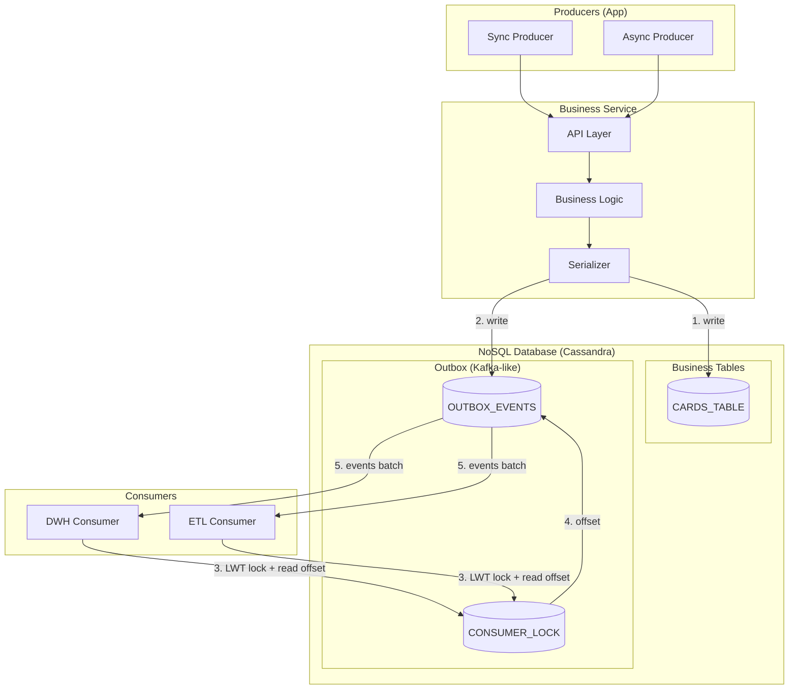
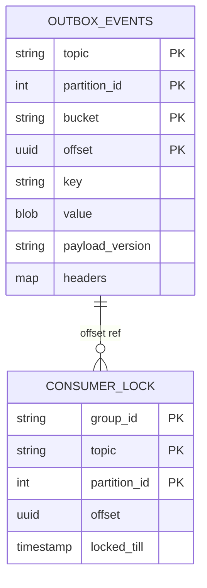
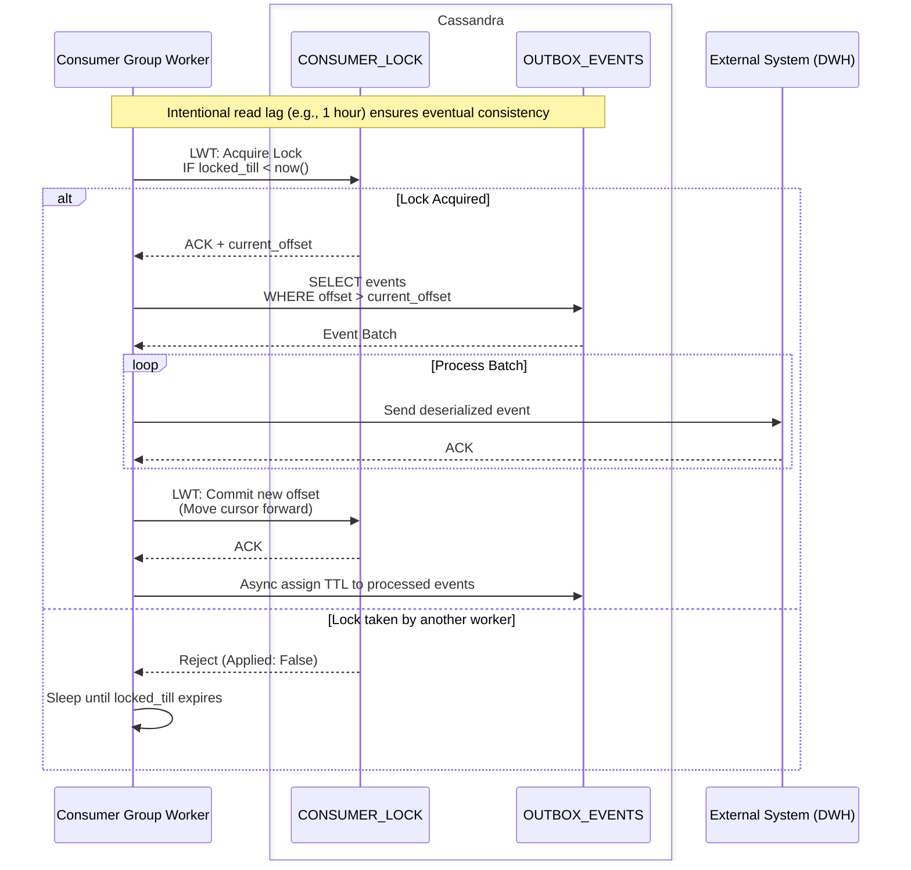

# Leased Outbox (Non-transactional Outbox)

**Category:** Distributed Systems / Reliability / High Throughput
**Source:** T-Bank (Tinkoff) Engineering, adapted for NoSQL (Apache Cassandra)

> A high-throughput variant of the Outbox pattern that avoids write-path transactions. It writes events asynchronously and uses consumer-side partition leasing (Lightweight Transactions) to coordinate event delivery.

The classic [Transactional Outbox](transactional-outbox.md) relies on ACID transactions to guarantee atomicity between state changes and event creation. However, in distributed NoSQL databases like Apache Cassandra, distributed transactions or Lightweight Transactions (LWTs) on the critical write path introduce unacceptable latency.

The **Leased Outbox** (sometimes called *Partitioned Outbox* or *Non-transactional Outbox*) solves this by mimicking a message broker (like Kafka) directly inside the database. It trades write-path transactions for eventual consistency, relying on idempotent retries on failure and LWT-based "range locks" (leases) on the consumer side.

---

## The Big Picture



**Flow:**
1. The service writes to the business table (`CARDS_TABLE`) and the `OUTBOX_EVENTS` table in parallel (or sequentially), **without** a heavy ACID transaction.
2. If any write fails, an error is returned to the client, triggering a retry. (Both writes must be idempotent).
3. Consumers attempt to acquire a lease (lock) on a specific partition in `CONSUMER_LOCK` using an LWT (`IF locked_till < now()`).
4. Upon successful lock, the consumer gets the current `offset` and reads a batch of events from `OUTBOX_EVENTS`.
5. After processing, the consumer updates the `offset` in `CONSUMER_LOCK` (via another LWT) and releases the lease.

---

## Schema Design: "Kafka Inside the Database"

To enable high throughput and parallel consumption without a centralized broker, the tables are modeled after Kafka's internal structure:



### Key Concepts:
*   **Partitioning:** Events are sharded across `partition_id` (derived from the business key), allowing multiple consumer instances to read in parallel safely.
*   **Bucketing:** A `bucket` (e.g., timestamp `2024-01-15-10-00`) is used as part of the primary key to prevent *hot partitions* (unbounded partition growth in Cassandra).
*   **Consumer Groups:** `CONSUMER_LOCK` acts like Kafka's consumer offsets topic, tracking where each `group_id` left off per partition.

---

## The Consumer Flow (Read + Lock)

The most critical part of this pattern is how consumers coordinate without stepping on each other's toes. This is achieved via **Partition Leasing** using LWTs (Lightweight Transactions / Compare-and-Set).



### What is "Read + Lock"?
The consumer sends a single conditional query to the database:
```sql
UPDATE CONSUMER_LOCK
SET locked_till = now() + 5m, offset = current_offset
WHERE group_id = 'dwh' AND topic = 'cards' AND partition_id = 0
IF locked_till < now(); -- The LWT condition
```
*   **Lock:** Claims the partition for the next 5 minutes.
*   **Read:** If successful, returns the current state of the row, yielding the `offset` from which to start reading events.

---

## Trade-offs and Guardrails

Because this pattern sacrifices ACID transactions on the write path, it requires specific guardrails:

### 1. Intentional Read Lag
In eventual-consistency systems (like Cassandra), if a consumer reads immediately, it might miss events due to replication delays or out-of-order writes.
*   **Solution:** Consumers are configured to read with a time lag (e.g., 10 minutes to 1 hour behind real-time). This ensures the cluster's anti-entropy mechanisms have settled and quorum is fully established.

### 2. Idempotency is Mandatory
Since writes are non-transactional:
*   If `CARDS_TABLE` succeeds but `OUTBOX_EVENTS` fails, the API returns `500`.
*   The client retries the request.
*   The API must process the retry safely (upserting the business data and successfully writing the event).

### 3. Missing Events (At-Least-Once)
In severe datacenter outages, it is mathematically possible for a business record to be committed while the outbox event is dropped.
*   **Solution:** A periodic reconciliation job (cron) scans the main tables, detects missing records in downstream systems, and pushes manual events into a retry queue.

---

## Leased Outbox vs. Transactional Outbox

| Feature | Transactional Outbox | Leased Outbox |
|---------|-----------------------|---------------|
| **Database Type** | Relational (PostgreSQL, MySQL) | NoSQL (Cassandra, DynamoDB) |
| **Write Atomicity** | ACID Transaction | Non-transactional (Client Retry) |
| **Performance Overhead**| High (Locks rows on write) | Very Low (Append-only / Upsert) |
| **Message Broker** | Requires external (Kafka, RabbitMQ) | None (DB acts as the broker) |
| **Latency to Consumer** | Near real-time (with CDC) | Delayed (10m - 1h due to replication lag) |
| **Consumer Coordination**| Handled by CDC/Broker | Handled by DB via Leases (LWTs) |

## When to use Leased Outbox?

*   You are constrained to a NoSQL tech stack (like Cassandra) that lacks performant ACID distributed transactions.
*   You cannot introduce new infrastructure (like Kafka or Debezium) due to compliance, cost, or operational limits.
*   Your system can tolerate a processing delay (minutes/hours) for outgoing events.
*   You need extreme write availability and throughput, prioritizing the core business transaction over immediate downstream delivery.

## See Also
*   [Transactional Outbox](transactional-outbox.md)
*   [Idempotency](idempotency.md)
*   [CAP Theorem](index.md#cap-theorem-2000) (Eventual Consistency)
