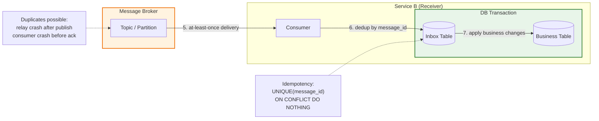

# Transactional Inbox

**Category:** Distributed Systems / Reliability  
**Source:** Industry pattern, paired with Transactional Outbox (2010s)

> Guarantee that duplicate messages are handled safely, making at-least-once delivery sufficient.

Even when a sender uses the [Transactional Outbox](transactional-outbox.md) pattern, messages can still be delivered more than once. Network retries, consumer crashes before offset commits, and relay restarts all create duplicates at the receiver.

The **Transactional Inbox** pattern solves this by treating the message broker and the consumer's database as a single unit of work: every incoming message is recorded in an inbox table (with deduplication) before business logic runs. If the same message arrives again, it is silently ignored.

---

## The Big Picture



**Flow:**
1. The consumer receives a message from the broker.
2. It opens a local database transaction.
3. It attempts to insert the `message_id` into the inbox table (with a `UNIQUE` constraint).
4. If the insert succeeds, business logic runs and the transaction commits.
5. If the insert fails (duplicate), the transaction completes without running business logic.
6. Only after a successful database commit does the consumer acknowledge the message to the broker.

---

## The Problem

Message brokers guarantee **at-least-once** delivery by default. Duplicates arise in two critical places:

**1. Producer side (relay crash):**
- The relay publishes a message to Kafka.
- Kafka acknowledges.
- The relay crashes before marking the outbox row as `SENT`.
- On restart, the relay re-reads the same `PENDING` row and publishes again.

**2. Consumer side (offset commit delay):**
- The consumer receives a message.
- It successfully writes to its database and commits.
- The consumer crashes **before** committing the offset back to Kafka.
- Kafka reassigns the partition; the new consumer reads the same message again.

> **The system deliberately accepts duplicates to ensure no message is ever lost.** The inbox pattern makes those duplicates harmless.

---

## The Pattern

The inbox table is a regular database table that guards the entry point to business logic:

```sql
CREATE TABLE inbox (
    id          SERIAL PRIMARY KEY,
    message_id  UUID NOT NULL UNIQUE,   -- the event_id from the outbox
    event_type  TEXT NOT NULL,
    payload     JSONB NOT NULL,
    received_at TIMESTAMP DEFAULT NOW(),
    status      TEXT DEFAULT 'NEW'       -- NEW | PROCESSED
);
```

**Atomic consumption:**

```sql
BEGIN TRANSACTION;

-- If message_id already exists, the insert fails (or is ignored)
INSERT INTO inbox (message_id, event_type, payload)
VALUES ('event_abc', 'OrderCreated', '{"id": "order_123", "total": 1500}')
ON CONFLICT (message_id) DO NOTHING;

-- Only proceed if the inbox insert actually inserted a row
-- (application-level check: if INSERT affected 0 rows, skip business logic)

-- Business logic runs here, only for new messages:
UPDATE warehouse SET stock = stock - 1 WHERE item_id = 'item_xyz';

COMMIT;
```

**How it works:**

| Scenario | `INSERT INTO inbox` result | Business logic |
|----------|---------------------------|----------------|
| First arrival | Success (1 row inserted) | Runs |
| Duplicate arrival | Conflict (0 rows inserted) | Skipped |

The `UNIQUE` constraint on `message_id` is the last and most reliable line of defense. Even if the application logic has a bug, the database prevents duplicate processing.

---

## Why Kafka Exactly-Once Is Not Enough

Kafka offers **Exactly-Once Semantics (EOS)** through transactional producers and idempotent consumers. However, this is insufficient for real-world systems:

**1. Limited scope:** Kafka EOS guarantees exactly-once delivery only *within Kafka itself* — between topics and partitions. It knows nothing about external relational databases (PostgreSQL, MySQL, Oracle).

**2. The non-atomic commit problem:**

```
Consumer: receives message from Kafka
Consumer: writes to PostgreSQL → COMMIT succeeds
Consumer: crashes before committing offset to Kafka
Kafka: re-sends the same message
PostgreSQL: cannot auto-rollback its commit based on a failed Kafka session
```

The database and Kafka are independent systems with no distributed transaction coordinator. Even with Kafka EOS, **database-side idempotency through the Inbox pattern remains mandatory.**

---

## Consumer Configuration

### Kafka-Specific Settings

| Setting | Value | Why |
|---------|-------|-----|
| `enable.auto.commit` | `false` | Disable automatic offset commits |
| Offset commit timing | After DB `COMMIT` | Only acknowledge to Kafka once the database transaction is durable |
| `isolation.level` | `read_committed` | Skip messages from aborted producer transactions |

**Correct offset management:**

```python
# Pseudocode for a safe consumer loop
for message in consumer:
    db.begin_transaction()

    result = db.execute(
        "INSERT INTO inbox (message_id, ...) VALUES (...) ON CONFLICT DO NOTHING"
    )

    if result.rowcount > 0:          # only process if this is a new message
        process_business_logic(message)

    db.commit()                       # database transaction is now durable

    consumer.commit_sync()            # NOW and only now, ack to Kafka
```

**Wrong order (dangerous):**

```python
consumer.commit_sync()   # ← ack Kafka BEFORE database commit
# crash here → message is acked but not processed
db.commit()
```

---

## Beyond Simple Deduplication

The inbox pattern can be extended:

### Tracking Processing State

Instead of deleting or ignoring duplicates, track full processing lifecycle:

```sql
CREATE TABLE inbox (
    message_id  UUID PRIMARY KEY,
    event_type  TEXT NOT NULL,
    payload     JSONB NOT NULL,
    status      TEXT DEFAULT 'NEW',   -- NEW | PROCESSING | PROCESSED | FAILED
    received_at TIMESTAMP DEFAULT NOW(),
    processed_at TIMESTAMP,
    error_count INT DEFAULT 0,
    last_error  TEXT
);
```

This enables:
- **Retries with backoff** — retry failed messages up to N times
- **Dead letter queue** — move permanently failed messages to a separate table
- **Observability** — query processing status of any message

### Ordering Guarantees

If messages must be processed in order (e.g., `OrderCreated` before `OrderCancelled`), the inbox pattern can enforce this:

```sql
-- Process only if no earlier messages for the same aggregate are pending
SELECT * FROM inbox
WHERE aggregate_id = 'order_123' AND status = 'NEW'
ORDER BY received_at
FOR UPDATE SKIP LOCKED;
```

This serializes processing per aggregate while allowing concurrency across different aggregates.

---

## The Philosophy

> **Better a duplicate event than a lost event.**

Distributed systems operate under the harsh physics of networks (CAP theorem). Attempting to build a transport layer with 100% exactly-once guarantees is extremely expensive and practically impossible under failure.

The pragmatic approach:

1. **At-least-once at the transport layer** — the network may resend, but nothing is lost.
2. **Idempotency at the application layer** — the receiver is prepared for duplicates. A duplicate arrives? The database silently ignores it. A new message arrives? It is processed.

This architecture does not try to avoid duplicates. It makes their occurrence **expected, controlled, and safe.**

---

## See Also

- [Transactional Outbox](transactional-outbox.md) — the sender-side counterpart
- [Idempotency](idempotency.md) — the correctness property that makes the inbox pattern work
- [Event-Driven Architecture](../architecture/communication/event-driven-architecture.md) — where inbox is most commonly applied
- [Saga Pattern](../architecture/resilience/saga-pattern.md) — long-running transactions across services
- [Distributed Systems](index.md) — consistency models, CAP theorem

## Further Reading

- Kleppmann — *Designing Data-Intensive Applications* (2017), Chapter 11
- Helland — *Life Beyond Distributed Transactions* (2007)
- "Idempotent Consumer" — Chris Richardson, Microservices.io
- Debezium documentation — CDC + outbox + inbox patterns

## Related Topics

- [Distributed Systems](index.md) — consensus, replication, consistency models
- [Databases](../databases/index.md) — transactions, isolation levels, unique constraints
- [Architecture & Modularity](../architecture/index.md) — microservices, event-driven design
- [Concurrency](../concurrency/index.md) — ordering, parallelism, race conditions
