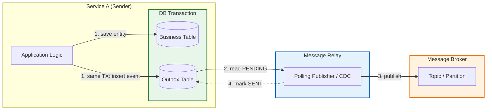

# Transactional Outbox

**Category:** Distributed Systems / Reliability  
**Source:** Industry pattern, widely adopted in microservices (2010s)

> Guarantee that events are never lost when state changes and messaging must happen together.

The fundamental problem in distributed systems: saving data to a database and sending a message to a broker are two separate operations with no atomic guarantee. If the database commit succeeds but the network call to the broker fails, the system is inconsistent — downstream services never learn about the change.

The **Transactional Outbox** pattern solves this by making the event part of the same local database transaction as the business write. A separate **Message Relay** then reads the outbox table and publishes events to the message broker.

---

## The Big Picture



**Flow:**
1. Business logic writes to the business table **and** inserts an event into the outbox table — inside **one local transaction**.
2. The relay reads pending events from the outbox.
3. The relay publishes each event to the broker.
4. The relay marks the event as sent (or deletes it).

---

## The Problem

Without an outbox, a service typically does this:

```
1. BEGIN DB transaction
2. INSERT INTO orders ...
3. COMMIT
4. SEND event to Kafka        ← network call, can fail
```

If step 4 fails, the order exists in the database but no other service knows about it. The system is now inconsistent.

**Reverse order is equally broken:**

```
1. SEND event to Kafka        ← succeeds
2. BEGIN DB transaction
3. INSERT INTO orders ...     ← fails and rolls back
```

Now downstream services processed an event for an order that was never created.

Neither ordering is safe. The only safe approach is to make the event emission part of the same atomic unit as the state change — the local database transaction.

---

## The Pattern

The outbox table is a regular database table that lives alongside business tables:

```sql
CREATE TABLE outbox (
    id           SERIAL PRIMARY KEY,
    event_id     UUID NOT NULL,
    event_type   TEXT NOT NULL,
    aggregate_id TEXT NOT NULL,
    payload      JSONB NOT NULL,
    created_at   TIMESTAMP DEFAULT NOW(),
    status       TEXT DEFAULT 'PENDING'   -- PENDING | SENT
);
```

**Atomic write:**

```sql
BEGIN TRANSACTION;

INSERT INTO orders (id, user_id, total)
VALUES ('order_123', 'user_99', 1500);

INSERT INTO outbox (event_id, event_type, aggregate_id, payload, status)
VALUES (
    'event_abc',
    'OrderCreated',
    'order_123',
    '{"id": "order_123", "total": 1500}',
    'PENDING'
);

COMMIT;
```

Both inserts succeed or both fail. There is no intermediate inconsistent state.

---

## The Message Relay

The relay is a separate process responsible for reading the outbox and publishing to the broker. Two main approaches:

### Polling Publisher

The relay periodically queries the database:

```sql
SELECT * FROM outbox WHERE status = 'PENDING' LIMIT 100;
```

After successful publication, it updates the status:

```sql
UPDATE outbox SET status = 'SENT' WHERE id = ?;
-- or: DELETE FROM outbox WHERE id = ?;
```

| Strength | Weakness |
|----------|----------|
| Simple to implement | Adds query load to the database |
| Works with any database | Latency bounded by polling interval |
| No extra infrastructure | Can miss events if polling stops |

### Change Data Capture (CDC)

A more production-grade approach. Tools like **Debezium** read the database transaction log (WAL in PostgreSQL, binlog in MySQL) and stream changes directly to Kafka.

| Strength | Weakness |
|----------|----------|
| No polling load on the database | Requires log-level access |
| Near-real-time latency | Additional infrastructure (Debezium, Kafka Connect) |
| Captures all changes, including deletions | More complex to operate |

**When to choose which:**

| Context | Recommendation |
|---------|---------------|
| New project, small scale | Polling Publisher |
| High throughput, low latency | CDC with Debezium |
| Existing PostgreSQL / MySQL | Either works; CDC is preferred for production |
| Cloud-managed databases (RDS, Cloud SQL) | Polling (CDC requires custom config) |

---

## At-Least-Once Delivery

The outbox pattern guarantees **at-least-once** delivery, not exactly-once. Duplicates are expected and must be handled downstream.

**Where duplicates originate:**

1. **Relay crash after publish, before mark:** The relay publishes an event to Kafka, Kafka acknowledges, but the relay crashes before updating the outbox row to `SENT`. On restart, the relay sees the same `PENDING` row and publishes again.

2. **Database rollback on mark:** The relay publishes, then attempts to mark `SENT`, but the `UPDATE` fails or the transaction rolls back. The row remains `PENDING`.

> **Better a duplicate event than a lost event.** This is the core trade-off of the pattern.

---

## Producer Configuration

### Kafka Producer Settings

| Setting | Value | Purpose |
|---------|-------|---------|
| `acks` | `all` (or `-1`) | The broker acknowledges only after **all in-sync replicas (ISR)** have written the message. `acks=1` risks data loss if the leader crashes before replication; `acks=0` offers no durability guarantee. |
| `enable.idempotence` | `true` | Assigns each message a producer ID and sequence number. The broker deduplicates retries **at the network level** — prevents the relay from publishing duplicates due to a transient network error on the same `send()` call. Does not prevent duplicates from reading the same outbox row twice. |
| `retries` | `Integer.MAX_VALUE` | Number of retry attempts on transient failure. With `enable.idempotence=true`, unlimited retries are safe because the broker deduplicates them. Without idempotence, high retry counts increase duplicate risk. |
| `retry.backoff.ms` | `100`–`1000` | Wait time between retries. Prevents hammering a broker that is temporarily overloaded or recovering. |
| `max.in.flight.requests.per.connection` | `5` (with idempotence) or `1` (without) | Maximum concurrent unacknowledged requests per broker connection. With `enable.idempotence=true`, up to 5 are safe. Without idempotence, must be `1` to prevent message reordering on retry. |
| `delivery.timeout.ms` | `120000` ms | Total time budget for a message to be acknowledged, including retries. If exceeded, the send fails. Should exceed `request.timeout.ms` × `retries`. |
| `linger.ms` | `0`–`5` | How long the producer waits to batch messages before sending. `0` sends immediately; small values (1–5 ms) improve throughput at the cost of slight latency. For the relay, `0` is often preferred for predictable latency. |
| `batch.size` | `16384` bytes | Maximum batch size per partition. Larger batches improve throughput but increase memory usage and latency. Tune in conjunction with `linger.ms`. |
| `compression.type` | `snappy` / `lz4` | Compresses batches before sending. Reduces network and storage costs significantly for JSON payloads. `snappy` is a good default; `lz4` offers faster decompression. |
| `transactional.id` | stable unique ID | Required for Kafka transactions (EOS). Allows the relay to use `beginTransaction()` / `commitTransaction()` for atomic multi-topic writes. The ID must be stable across relay restarts. |

> **`enable.idempotence` scope:** prevents duplicates caused by the *producer retrying the same send call* over the network.
> It does **not** prevent the relay from reading the same `PENDING` outbox row twice and calling `send()` twice.
> That class of duplicates is handled by the [Transactional Inbox](transactional-inbox.md) pattern on the consumer side.

### RabbitMQ Producer Settings

| Setting | Value | Purpose |
|---------|-------|---------|
| `publisher_confirms` (Publisher Confirms) | `true` | The broker sends an `ack` or `nack` back to the producer after the message is persisted. Without confirms, the relay cannot know whether the publish succeeded and risks data loss on broker crash. |
| `delivery_mode` (message property) | `2` (persistent) | Message is written to disk, not just held in memory. Survives RabbitMQ restart. Must be combined with a durable exchange and durable queue. |
| `durable` (exchange) | `true` | Exchange configuration survives broker restart. |
| `durable` (queue) | `true` | Queue and its messages survive broker restart. |
| `mandatory` flag | `true` | If the broker cannot route the message to any queue (e.g., misconfigured binding), it returns the message to the producer via `basic.return`. Without this, unroutable messages are silently dropped. |
| `alternate_exchange` | AE name | Fallback exchange for messages that could not be routed from the primary exchange. Safer alternative to `mandatory` for production: unroutable messages go here instead of being returned to the producer. |
| `connection.heartbeat` | `60` s | Frequency of TCP-level heartbeats. Detects dead connections faster than OS TCP timeouts (which can take minutes). Important for long-running relay processes. |
| `channel_max` | depends on load | Maximum number of channels per connection. Each relay goroutine/thread can use its own channel; one connection can multiplex many channels efficiently. |
| `prefetch_count` (relay consumer, if using pull model) | `1` | If the relay consumes from a staging queue before publishing externally, prefetch limits how many messages it holds at once, reducing re-delivery scope on crash. |

> **Publisher Confirms vs. Transactions in RabbitMQ:**
> RabbitMQ supports AMQP transactions (`tx.select` / `tx.commit`), but they are roughly 250× slower than Publisher Confirms.
> For a high-throughput outbox relay, always prefer **Publisher Confirms** in async mode:
> send a batch, then wait for confirms before marking outbox rows as `SENT`.

### Delivery Guarantee Comparison

| Guarantee | Kafka setting | RabbitMQ setting | What it protects |
|-----------|--------------|-----------------|-----------------|
| Message reaches broker | `acks=all` | Publisher Confirms | Relay crash after send but before ack |
| Message survives broker restart | `log.flush` policy / replication | `delivery_mode=2` + durable queue | Broker process restart or crash |
| No producer-side network duplicates | `enable.idempotence=true` | — (not available natively) | Network retry of the same send call |
| No consumer-side duplicates | Manual offset commit after DB commit | `ack_mode=manual` after DB commit | Consumer crash before ack |
| Application-level deduplication | — | — | Same outbox row published twice (both brokers) — requires Inbox pattern |

---

## Broker Portability

The outbox pattern is not tied to Kafka. It works with any message broker:

| Broker | Notes |
|--------|-------|
| **Kafka** | Event streaming, durable log, replay capability |
| **RabbitMQ** | Classical queues, explicit ack/nack, routing flexibility |
| **NATS** | Lightweight, JetStream for persistence |
| **Pulsar** | Tiered storage, geo-replication |
| **AWS SQS** | Managed, simple, at-least-once by design |
| **Redis Streams** | In-memory, good for low-latency scenarios |

### Kafka vs RabbitMQ for Outbox

| Criterion | Kafka | RabbitMQ |
|-----------|-------|----------|
| **Model** | Event streaming (durable log) | Message queue (remove on ack) |
| **Persistence** | Retains history (configurable) | Removes on consumer ack |
| **Throughput** | Millions of messages/sec | Hundreds of thousands/sec |
| **Routing** | Simple (key → partition) | Flexible (exchanges, routing keys) |
| **Replay** | Yes — reset offset and re-read | No — message is gone after ack |
| **Best for** | Event-driven systems, analytics, logs | Task queues, RPC, job scheduling |

---

## The Philosophy

> This architecture does not try to avoid duplicates in the network. It makes their occurrence expected, controlled, and absolutely safe.

In distributed systems, network partitions and process crashes are inevitable (CAP theorem). Attempting to build a network with 100% exactly-once guarantees is prohibitively expensive and practically impossible under failure.

Instead, the pragmatic approach:
1. **At-least-once at the transport layer** — accept that a message may be sent 2–3 times during failure recovery, but never lost.
2. **Idempotency at the receiver** — make the consumer duplicate-safe. A duplicate arrives? The database silently ignores it. A new message arrives? Process it normally.

---

## See Also

- [Leased Outbox](leased-outbox.md) — high-throughput, non-transactional variant for NoSQL
- [Transactional Inbox](transactional-inbox.md) — the receiver-side counterpart
- [Idempotency](idempotency.md) — the property that makes duplicate events safe
- [Event-Driven Architecture](../architecture/communication/event-driven-architecture.md) — where outbox is most commonly applied
- [Saga Pattern](../architecture/resilience/saga-pattern.md) — long-running transactions across services
- [Message-Driven Architecture](../architecture/communication/message-driven-architecture.md)

## Further Reading

- Kleppmann — *Designing Data-Intensive Applications* (2017), Chapter 11 — "Stream Processing" and the outbox pattern
- Helland — *Life Beyond Distributed Transactions* (2007) — why to avoid 2PC
- Debezium documentation — CDC-based outbox implementation
- "The Outbox Pattern" — Chris Richardson, Microservices.io

## Related Topics

- [Distributed Systems](index.md) — consistency models, CAP theorem, consensus
- [Databases](../databases/index.md) — transactions, isolation levels
- [Architecture & Modularity](../architecture/index.md) — microservices, system boundaries
- [Containers & Orchestration](../containers/index.md) — runtime substrate for relays and consumers
