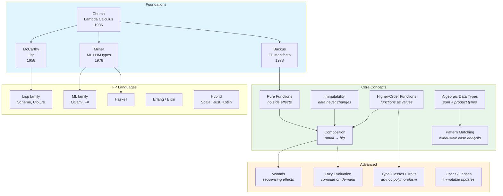

# Functional Programming

How we avoid accidental complexity — by building programs from pure
functions that transform immutable data.

## The Big Picture



## What Makes a Program "Functional"?

A functional program is built from **expressions** that compute values,
rather than **statements** that change state. The difference is
fundamental:

```python
# Imperative: HOW to compute (step by step, mutating state)
total = 0
for item in items:
    if item.is_active():
        total += item.price
```

```python
# Functional: WHAT to compute (expression, no mutation)
total = sum(item.price for item in items if item.is_active())
```

Both compute the same result. The functional version:

- Has no mutable variable (`total` is never modified)
- Is a single expression (composable, returnable)
- Separates "which items" from "how to aggregate" (modular)

## Core Concepts

### 1. Pure Functions

A **pure function** depends only on its inputs and produces only its
output. No side effects — no mutation, no I/O, no global state access.

```haskell
-- Pure: same input → always same output
add :: Int -> Int -> Int
add x y = x + y

-- Impure (conceptually): depends on external state
-- getCurrentTime :: IO UTCTime
```

**Referential transparency:** any call to a pure function can be
replaced by its result without changing the program's meaning.

```haskell
-- These are equivalent in a pure language:
let x = add 3 4 in x + x
-- same as:
add 3 4 + add 3 4
-- same as:
7 + 7
-- same as:
14
```

**Why purity matters:**

| Benefit | Explanation |
|---------|-------------|
| **Testability** | No setup/teardown — just call the function and check the result |
| **Reasoning** | Understand each function in isolation |
| **Parallelism** | Pure functions can run in any order — no data races |
| **Caching** | Same input = same output = safe to memoize |
| **Refactoring** | Substitution is always safe |

### 2. Immutability

Data structures are never modified in place. "Changing" a value means
creating a new value:

```clojure
;; Clojure — persistent data structures
(def original [1 2 3])
(def extended (conj original 4))

;; original is still [1 2 3]
;; extended is [1 2 3 4]
;; They share structure (efficient!)
```

```rust
// Rust — immutable by default
let v1 = vec![1, 2, 3];
// v1.push(4);  // ERROR: v1 is not mutable
let mut v2 = v1.clone();
v2.push(4);  // OK: v2 is explicitly mutable
```

**Persistent data structures** (Clojure, Haskell, Scala) use structural
sharing — the new version shares most of its structure with the old one,
making "copying" O(log n) instead of O(n).

**Why immutability matters:**

- Eliminates data races (concurrent reads are always safe)
- Eliminates aliasing bugs (no one can change your data behind your back)
- Enables easy undo/redo (keep old versions)
- Simplifies debugging (state doesn't change unexpectedly)

### 3. Higher-Order Functions

Functions that take functions as arguments or return functions. This
is the primary mechanism for abstraction and code reuse in FP.

```python
# map, filter, reduce — "big three"
names = ["alice", "bob", "charlie"]

# map: transform each element
upper_names = list(map(str.upper, names))
# ["ALICE", "BOB", "CHARLIE"]

# filter: select elements
long_names = list(filter(lambda n: len(n) > 3, names))
# ["alice", "charlie"]

# reduce: combine all elements into one
from functools import reduce
total_length = reduce(lambda acc, n: acc + len(n), names, 0)
# 15
```

```haskell
-- Haskell — higher-order functions are the default style
upperNames = map toUpper names
longNames  = filter (\n -> length n > 3) names
totalLength = foldr (\n acc -> length n + acc) 0 names
```

**Closures** — functions that capture their environment — enable
powerful patterns:

```javascript
// JavaScript — closure
function multiplier(factor) {
    return function(x) {
        return x * factor;  // captures 'factor' from outer scope
    };
}

const double = multiplier(2);
const triple = multiplier(3);
console.log(double(5));  // 10
console.log(triple(5));  // 15
```

### 4. Function Composition

Build complex functions by combining simple ones. This is the
fundamental structuring mechanism in FP — analogous to object
composition in OOP.

```haskell
-- Haskell — composition with (.)
countWords :: String -> Int
countWords = length . words

-- Equivalent to:
-- countWords s = length (words s)

-- Pipeline of transformations
processFile :: String -> [String]
processFile = sort . nub . filter (not . null) . lines
-- 1. Split into lines
-- 2. Remove empty lines
-- 3. Remove duplicates
-- 4. Sort
```

```clojure
;; Clojure — threading macros for readability
(->> input
     (str/split-lines)          ; 1. split into lines
     (remove str/blank?)        ; 2. remove empty lines
     (distinct)                 ; 3. remove duplicates
     (sort))                    ; 4. sort
```

```rust
// Rust — method chaining on iterators
let result: Vec<&str> = input
    .lines()                    // 1. split into lines
    .filter(|l| !l.is_empty()) // 2. remove empty lines
    .collect::<HashSet<_>>()   // 3. remove duplicates
    .into_iter()
    .sorted()                  // 4. sort
    .collect();
```

### 5. Algebraic Data Types (ADTs)

**Product types** (AND): a value contains field A AND field B:

```haskell
-- A Point has an x AND a y
data Point = Point { x :: Double, y :: Double }
```

**Sum types** (OR): a value is one of several variants:

```haskell
-- A Shape is a Circle OR a Rectangle OR a Triangle
data Shape
    = Circle Double              -- radius
    | Rectangle Double Double    -- width, height
    | Triangle Double Double Double  -- three sides
```

**Pattern matching:** handle each case exhaustively:

```haskell
area :: Shape -> Double
area (Circle r)          = pi * r * r
area (Rectangle w h)     = w * h
area (Triangle a b c)    = let s = (a + b + c) / 2
                           in sqrt (s * (s-a) * (s-b) * (s-c))
-- If you add a new Shape variant, the compiler warns you about
-- every pattern match that doesn't handle it. No "forgot a case" bugs.
```

```rust
// Rust — enums are ADTs
enum Shape {
    Circle(f64),
    Rectangle(f64, f64),
    Triangle(f64, f64, f64),
}

fn area(shape: &Shape) -> f64 {
    match shape {
        Shape::Circle(r) => std::f64::consts::PI * r * r,
        Shape::Rectangle(w, h) => w * h,
        Shape::Triangle(a, b, c) => {
            let s = (a + b + c) / 2.0;
            (s * (s - a) * (s - b) * (s - c)).sqrt()
        }
    }
    // Exhaustive — compiler enforces it
}
```

### 6. Making Illegal States Unrepresentable

ADTs let you encode business rules in the type system so that invalid
states simply cannot exist:

```haskell
-- BAD: using strings and booleans
data Order = Order
    { status     :: String    -- "draft"? "submitted"? "misspelled"?
    , items      :: [Item]
    , shippedAt  :: Maybe UTCTime  -- what if status isn't "shipped"?
    }

-- GOOD: use ADTs to make invalid states impossible
data Order
    = Draft [Item]                     -- must have items to submit
    | Submitted [Item] UTCTime         -- has submission time
    | Shipped [Item] UTCTime UTCTime   -- has ship time too
    | Cancelled CancelReason           -- no items needed

-- A Shipped order ALWAYS has a ship time.
-- A Draft order NEVER has a ship time.
-- The compiler enforces this. No runtime checks needed.
```

## Handling Effects: The Boundary Problem

Pure functions can't do I/O, access databases, or read the clock. Real
programs must do these things. FP handles this tension in several ways:

### Functional Core / Imperative Shell

The most practical pattern (Gary Bernhardt, 2012): keep pure logic
at the centre, push effects to the edges.

```
┌─────────────────────────────────┐
│  Imperative Shell               │  reads input, calls core,
│  (thin, hard to test)           │  writes output, handles I/O
│  ┌─────────────────────────┐   │
│  │  Functional Core         │   │  pure functions, easy to test,
│  │  (thick, easy to test)   │   │  all business logic
│  └─────────────────────────┘   │
└─────────────────────────────────┘
```

```python
# Functional core — pure, testable
def calculate_discount(order, rules):
    """Pure function: takes data, returns data. No I/O."""
    applicable = [r for r in rules if r.applies_to(order)]
    if not applicable:
        return order
    best = max(applicable, key=lambda r: r.discount)
    return order.with_discount(best.discount)

# Imperative shell — thin, handles I/O
def handle_request(request):
    """Shell: reads DB, calls core, writes DB."""
    order = db.get_order(request.order_id)       # I/O
    rules = db.get_discount_rules()               # I/O
    updated = calculate_discount(order, rules)    # PURE
    db.save_order(updated)                        # I/O
    email.send_confirmation(updated)              # I/O
```

### Monads (Haskell)

Haskell uses the type system to track effects. The `IO` type marks
functions that perform side effects:

```haskell
-- Pure function — no IO in the type
calculateDiscount :: Order -> [Rule] -> Order

-- Effectful function — IO in the type
handleRequest :: Request -> IO ()
handleRequest req = do
    order <- getOrder (orderId req)        -- IO
    rules <- getDiscountRules              -- IO
    let updated = calculateDiscount order rules  -- pure!
    saveOrder updated                      -- IO
    sendConfirmation updated               -- IO
```

The compiler **enforces** the boundary: you cannot call an `IO` function
from a pure function. Effects are tracked in types.

### Managed Effects (Clojure, Erlang)

Some FP languages take a pragmatic approach: effects are allowed but
managed by convention and architecture rather than the type system.

```clojure
;; Clojure — pure core, effectful shell by convention
(defn calculate-discount [order rules]   ;; pure
  (let [applicable (filter #(applies? % order) rules)]
    (if (empty? applicable)
      order
      (apply-discount order (best-discount applicable)))))

(defn handle-request [request]           ;; effectful
  (let [order (db/get-order (:order-id request))
        rules (db/get-discount-rules)
        updated (calculate-discount order rules)]  ;; pure call
    (db/save-order updated)
    (email/send-confirmation updated)))
```

## FP in Different Languages

| Feature | Haskell | Clojure | Rust | Python | Java 17+ |
|---------|---------|---------|------|--------|----------|
| Pure functions | Enforced by type system | By convention | By convention | By convention | By convention |
| Immutability | Default | Default | Default (opt-in `mut`) | Opt-in | Opt-in (`final`, records) |
| ADTs | ✅ `data` types | Partial (protocols) | ✅ `enum` | ❌ (simulate with classes) | Partial (sealed classes) |
| Pattern matching | ✅ exhaustive | Partial (`case`) | ✅ exhaustive | Partial (3.10+ `match`) | Partial (21+ patterns) |
| Higher-order functions | ✅ | ✅ | ✅ closures | ✅ `lambda` | ✅ lambdas (8+) |
| Lazy evaluation | Default | `lazy-seq` | Iterators | Generators | Streams (lazy) |
| Type inference | ✅ HM | N/A (dynamic) | ✅ local | N/A (dynamic) | ❌ (var since 10) |
| Monads | ✅ | N/A | `Result`, `Option` | N/A | `Optional` |

## The FP Design Toolkit

| Tool | Problem it solves | Imperative equivalent |
|------|------------------|-----------------------|
| `map` | Transform each element | `for` loop with mutation |
| `filter` | Select elements | `for` loop with `if` |
| `fold`/`reduce` | Combine elements | Accumulator variable |
| Composition | Build pipelines | Sequence of statements |
| Currying / partial application | Specialise functions | Object with config |
| ADTs + pattern matching | Handle cases | `if/else` chains, `instanceof` |
| `Option`/`Maybe` | Absence of value | Null checks |
| `Result`/`Either` | Error handling | Try/catch, error codes |
| Monads | Sequence effects | Imperative statements |

## Timeline

| Year | Event | Significance |
|------|-------|-------------|
| 1936 | Church — Lambda Calculus | Theoretical foundation |
| 1958 | McCarthy — Lisp | First FP language |
| 1975 | Steele & Sussman — Scheme | Lexical scoping, closures |
| 1978 | Backus — FP Manifesto | The case against imperative |
| 1978 | Milner — ML | Typed FP, type inference |
| 1989 | Hughes — Why FP Matters | Positive case for FP |
| 1990 | Haskell 1.0 | Pure, lazy FP |
| 2003 | Armstrong — Erlang thesis | FP for concurrency |
| 2007 | Hickey — Clojure | Practical FP on JVM |
| 2010 | Rust announced | Systems FP |
| 2011 | Hickey — Simple Made Easy | Simplicity over familiarity |
| 2012 | Bernhardt — Boundaries | Functional Core / Imperative Shell |
| 2014 | Java 8 — lambdas | FP in mainstream |
| 2018 | Wlaschin — Domain Modeling FP | DDD meets FP |
| 2020 | Zhidkov — Ergonomic Approach | Functional style in Java/Kotlin |

### Industrial Functional Architecture (Zhidkov 2020–present)

Alexander Zhidkov applies functional programming principles to practical Java/Kotlin development through his **Ergonomic Approach**:

- **Pure business logic** — functions without side effects
- **Immutable aggregates** — domain objects as immutable values
- **Functional Core, Imperative Shell** — pattern from Gary Bernhardt
- **Avoidance of JPA/Hibernate** — supports immutable data models

The approach argues that functional style reduces development cost by:
- Making code easier to test (pure functions are trivially testable)
- Reducing bugs (no mutable state = no data races)
- Enabling parallelism (pure functions can run in any order)

→ [Alexander Zhidkov](../../authors/alexander-zhidkov.md) ·
[Functional Programming and Cost article](../../works/talks/zhidkov-2024-fp-stoimost.md)

## Further Reading

- Church — [Lambda Calculus (1936)](../../works/papers/church-1936-lambda.md)
- Backus — ["Can Programming Be Liberated?"](../../works/papers/backus-1978-liberated.md) (1978)
- Hughes — ["Why Functional Programming Matters"](../../works/papers/hughes-1989-why-fp.md) (1989)
- Hickey — ["Simple Made Easy"](../../works/talks/hickey-2011-simple-made-easy.md) (2011)
- Bernhardt — ["Boundaries"](../../works/talks/bernhardt-2012-boundaries.md) (2012)
- Wlaschin — [*Domain Modeling Made Functional*](../../works/books/wlaschin-2018-dmf.md) (2018)

## Related Topics

- [Paradigms](../paradigms/) — FP in the context of all paradigms
- [Type Systems](../types/) — how types support FP
- [OOP & Design](../design/) — contrast with OOP
- [Concurrency](../concurrency/) — FP's advantage for parallel code

## Related Authors

- [Alonzo Church](../../authors/alonzo-church.md) · [John McCarthy](../../authors/john-mccarthy.md) · [John Backus](../../authors/john-backus.md) · [John Hughes](../../authors/john-hughes.md) · [Joe Armstrong](../../authors/joe-armstrong.md) · [Rich Hickey](../../authors/rich-hickey.md) · [Gary Bernhardt](../../authors/gary-bernhardt.md) · [Scott Wlaschin](../../authors/scott-wlaschin.md) · [Alexander Zhidkov](../../authors/alexander-zhidkov.md)
