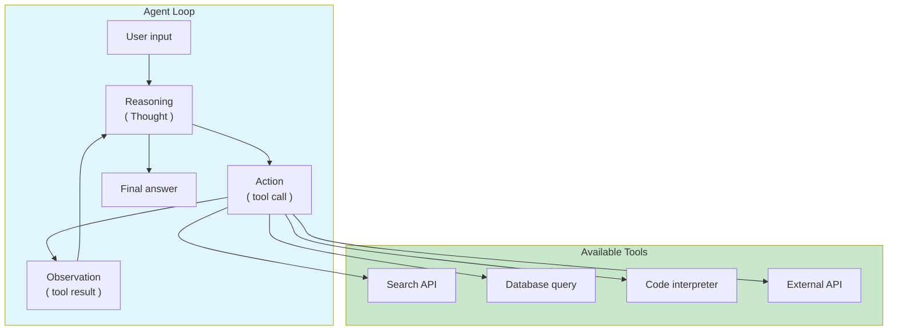

# Agents & Tool Use

An LLM agent is a system in which the language model is the reasoning
engine, and it is given access to tools (functions, APIs, databases,
code interpreters) that it can call to gather information or take actions.

The key insight is that **an LLM alone is a text predictor; an LLM with
tools is a reasoning system that can act on the world**. The shift from
passive generation to active execution is what makes agents powerful —
and what makes them dangerous.

## The Big Picture



---

## What Is an Agent?

An agent is a loop:

1. The model receives the user's request and the conversation history
2. The model **reasons** about what to do (generates a Thought)
3. The model **acts** by calling a tool (generates an Action)
4. The application **executes** the tool and returns an Observation
5. The model **observes** the result and decides whether to continue or answer

This cycle repeats until the model produces a final answer or hits a
maximum step limit.

```python
# Conceptual agent loop
def agent_run(user_input, tools, max_steps=10):
    context = f"User: {user_input}\n"

    for step in range(max_steps):
        # 1. Model decides what to do
        response = llm.complete(context, tools=tools)

        if response.is_final_answer:
            return response.content

        # 2. Execute the tool call
        tool = tools[response.tool_name]
        observation = tool.execute(**response.tool_args)

        # 3. Append to context for next reasoning step
        context += f"\nThought: {response.thought}\n"
        context += f"Action: {response.tool_name}({response.tool_args})\n"
        context += f"Observation: {observation}\n"

    raise AgentMaxStepsExceeded()
```

---

## The ReAct Pattern

ReAct (Yao et al., 2022) interleaves reasoning (Thought) and action
(Act) steps, with observations fed back into the context:

```
Question: What is the current price of Apple stock?

Thought: I need to find the current price of AAPL.
Action: search("AAPL stock price today")
Observation: AAPL is trading at $213.42 as of market close.

Thought: I have the price. I can now answer the question.
Answer: Apple's stock closed at $213.42 today.
```

Each thought-action-observation cycle is appended to the context,
so the model can condition its next step on everything that has happened.

**Why ReAct works:** The explicit reasoning steps serve as a "chain of
thought" for action selection. The model is not just guessing which tool
to call — it is reasoning about why, then acting, then observing, then
reasoning again.

---

## Tool Use and Function Calling

Modern LLM APIs support **function calling**: the model can emit a
structured request to call a function, and the application executes
it and returns the result.

```python
# OpenAI function calling
tools = [
    {
        "type": "function",
        "function": {
            "name": "get_stock_price",
            "description": "Get the current stock price for a ticker symbol",
            "parameters": {
                "type": "object",
                "properties": {
                    "ticker": {
                        "type": "string",
                        "description": "Stock ticker symbol, e.g. AAPL"
                    }
                },
                "required": ["ticker"]
            }
        }
    },
    {
        "type": "function",
        "function": {
            "name": "send_email",
            "description": "Send an email to a recipient",
            "parameters": {
                "type": "object",
                "properties": {
                    "to": {"type": "string"},
                    "subject": {"type": "string"},
                    "body": {"type": "string"}
                },
                "required": ["to", "subject", "body"]
            }
        }
    }
]

response = client.chat.completions.create(
    model="gpt-4",
    messages=[{"role": "user", "content": "What's AAPL at?"}],
    tools=tools
)
```

**Key properties of good tool definitions:**
- Clear, specific descriptions
- Explicit parameter types and constraints
- Examples of valid inputs
- Descriptions of what the tool does (and does not do)

---

## Memory Patterns

Agents operating over multiple turns or long sessions need memory
beyond the context window:

| Memory type | Implementation | Trade-off |
|-------------|---------------|-----------|
| **In-context** | Append all history to prompt | Simple; limited by context window |
| **Summarization** | Compress old turns into summary | Loses detail; saves tokens |
| **External (RAG)** | Store and retrieve past interactions | Scalable; retrieval latency |
| **Entity memory** | Extract and track key entities | Structured; requires extraction step |
| **Vector memory** | Embed all turns; retrieve relevant ones | Semantic relevance; approximate |

```python
# Summarization memory pattern
class SummarizingMemory:
    def __init__(self, llm, max_tokens=2000):
        self.llm = llm
        self.max_tokens = max_tokens
        self.recent_turns = []
        self.summary = ""

    def add_turn(self, user_msg, assistant_msg):
        self.recent_turns.append((user_msg, assistant_msg))
        if self.estimate_tokens() > self.max_tokens:
            self._compress()

    def _compress(self):
        # Summarize oldest turns
        old_turns = self.recent_turns[:-5]  # keep 5 most recent
        self.summary = self.llm.summarize(self.summary, old_turns)
        self.recent_turns = self.recent_turns[-5:]

    def get_context(self):
        return f"Summary of previous conversation:\n{self.summary}\n\nRecent turns:\n" + \
               "\n".join(f"User: {u}\nAssistant: {a}" for u, a in self.recent_turns)
```

---

## Agent Reliability Challenges

Agents are powerful but brittle in ways that differ from standard software:

### Cascading errors

A wrong tool call in step 2 corrupts all subsequent reasoning. The model
conditions each step on previous observations, so one bad observation
can send the agent down an unrecoverable path.

**Mitigation:**
- Validate tool outputs before feeding them back
- Allow the model to detect and recover from errors
- Set maximum step budgets
- Implement retry logic with fallbacks

### Prompt injection

Malicious content in retrieved documents or tool-returned text can
hijack the agent's plan. An attacker who controls a search result or
database entry can inject instructions that override the system prompt.

**Mitigation:**
- Sanitize tool outputs before appending to context
- Use structured formats (JSON) for tool I/O instead of free text
- Implement allowlists for tool arguments
- Require human approval for high-stakes actions

### Infinite loops

Without explicit termination conditions, agents can cycle indefinitely:
- Calling the same tool with the same arguments
- Oscillating between two states
- Searching without finding and never giving up

**Mitigation:**
- Hard maximum step limits
- Detect repeated tool calls with identical arguments
- Require the model to explicitly decide when to stop
- Implement timeouts at the application level

### Unpredictable latency

Multi-step tool calls make response time non-deterministic. Each step
adds LLM inference time + tool execution time.

**Mitigation:**
- Streaming responses (show reasoning in real time)
- Async tool execution where possible
- Progressive disclosure (show partial results while working)
- Set user expectations about variable response times

---

## Agent Design Patterns

### Router pattern

A lightweight classifier routes the user request to the appropriate
specialized agent:

```
User input
    │
    ▼
Router (LLM or classifier)
    │
    ├─→ Code agent (programming tasks)
    ├─→ Research agent (information retrieval)
    ├─→ Support agent (customer service)
    └─→ General agent (everything else)
```

This reduces complexity and improves reliability by giving each agent
a focused tool set and system prompt.

### Supervisor pattern

A supervisor agent coordinates multiple worker agents, each with
specialized tools. The supervisor plans, delegates, and synthesizes
results.

```
Supervisor
    │
    ├─→ Worker 1 (search)
    ├─→ Worker 2 (calculation)
    ├─→ Worker 3 (code execution)
    └─→ Worker 4 (database query)
```

### Plan-and-execute

The model first generates a plan (list of steps), then executes each
step. The plan provides structure and makes the agent's behavior more
predictable.

```
User: "Find the cheapest flight from NYC to London next week"

Plan:
1. Search for flights NYC → LON for dates [next week]
2. Extract prices and airlines from results
3. Sort by price
4. Return the cheapest option with details

Execute: [step 1] → [step 2] → [step 3] → [step 4]
```

---

## When to Use Agents

**Use agents when:**
- The task requires multiple distinct capabilities (search + calculate + format)
- The steps needed depend on intermediate results
- The problem is open-ended and benefits from iterative refinement
- Human oversight is available for high-stakes actions

**Do not use agents when:**
- The task is a single, well-defined transformation (use a pipeline)
- Latency requirements are strict (each step adds delay)
- The cost of a wrong action is high and irreversible
- The problem is fully deterministic (use code)

---

## Timeline

| Year | Event | Significance |
|------|-------|------------|
| 2022 | Yao et al. — ReAct | Reasoning + acting interleaved |
| 2022 | Schick et al. — Toolformer | LLM learns to use tools via API calls |
| 2023 | AutoGPT | Autonomous agent with goal decomposition |
| 2023 | LangChain | Framework for building agent workflows |
| 2023 | OpenAI — Function calling | Structured tool use in API |
| 2023 | Multi-agent systems | Collaboration between specialized agents |
| 2024 | Claude — Computer use | Agent can control a computer |
| 2024 | Agent evaluation frameworks | Measuring agent reliability |

---

## Further Reading

- Yao et al. — [ReAct: Synergizing Reasoning and Acting](../../works/papers/yao-2022-react.md) (2022)
- Schick et al. — Toolformer: Language Models Can Teach Themselves to Use Tools (2022)
- [Prompting Strategies](prompting.md) — how agents reason
- [RAG](rag.md) — retrieval as an agent tool
- [Safety](safety.md) — securing agent systems
- [Evaluation](evaluation.md) — measuring agent performance

---

## Related Topics

- [Large Language Models](./index.md) — the parent topic
- [Prompting Strategies](prompting.md) — reasoning and tool selection
- [RAG](rag.md) — retrieval as a tool
- [Safety](safety.md) — prompt injection and adversarial control
- [Evaluation](evaluation.md) — benchmarking agent behavior
- [Testing](../testing/index.md) — testing non-deterministic systems
