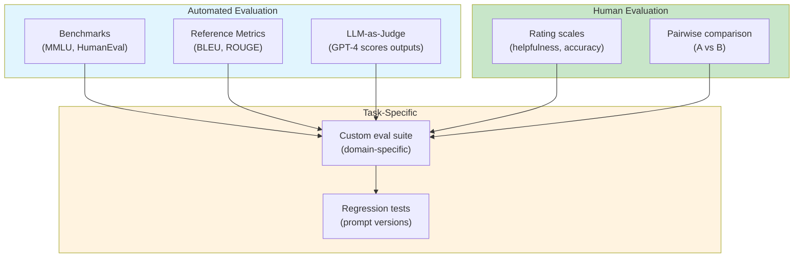

# Evaluation

Evaluating LLM systems is harder than evaluating deterministic software.
There is no ground-truth output for most open-ended tasks, and small
changes in prompts or models can produce large, subtle shifts in quality.

The core insight is that **LLM evaluation is not a single metric — it is
a portfolio of signals, each capturing a different dimension of quality**.
No single method is sufficient; the best eval suites combine multiple
approaches.

## The Big Picture



---

## What Is LLM Evaluation?

LLM evaluation is the process of measuring the quality, correctness,
and reliability of an LLM system's outputs. It serves two purposes:

1. **Model selection:** Choose the right model for a task
2. **System iteration:** Detect regressions when prompts, models, or
   infrastructure change

Unlike traditional software testing, LLM evaluation must handle:
- **Non-determinism:** The same input can produce different outputs
- **Open-endedness:** No single correct answer for many tasks
- **Subjectivity:** Quality depends on human judgment

---

## Benchmark Evaluation

Standardized datasets with known answers. Useful for tracking capability
across model versions.

| Benchmark | What it measures | Format |
|-----------|-----------------|--------|
| **MMLU** | Knowledge across 57 subjects | Multiple-choice QA |
| **HumanEval** | Code generation | Function signature → implementation |
| **MATH** | Mathematical reasoning | Word problems with numeric answers |
| **HellaSwag** | Commonsense reasoning | Sentence completion |
| **GSM8K** | Grade-school math | Word problems |
| **BBH** | Complex reasoning | Hard BIG-Bench tasks |

```python
# Conceptual: running a benchmark
from datasets import load_dataset

def evaluate_mmlu(model, subset="all"):
    dataset = load_dataset("cais/mmlu", subset)
    correct = 0
    total = 0

    for example in dataset["test"]:
        prompt = format_mmlu_prompt(example)
        answer = model.complete(prompt)
        if extract_answer(answer) == example["answer"]:
            correct += 1
        total += 1

    return correct / total
```

**Limitations:**
- Benchmarks measure general capability, not task-specific quality
- Models can be trained on benchmark data (contamination)
- High benchmark scores do not imply good real-world performance

---

## Human Evaluation

Gold standard for quality, but expensive and slow.

**Rating scales:**

| Dimension | Scale | Description |
|-----------|-------|-------------|
| Helpfulness | 1–5 | Did the answer solve the user's problem? |
| Accuracy | 1–5 | Are the facts correct? |
| Coherence | 1–5 | Is the response well-structured and clear? |
| Safety | 1–5 | Is the response harmless and appropriate? |

**Pairwise comparison:**

Present two outputs for the same input; ask which is better. This is
more reliable than absolute ratings because humans are better at
comparing than scoring.

```
Prompt: "Explain quantum computing to a 10-year-old."

Response A: [shown]
Response B: [shown]

Which response is better? (A / B / Tie)
```

**Limitations:**
- Expensive at scale ($0.50–$2.00 per example)
- Slow (hours to days for large batches)
- Inter-annotator disagreement (different raters give different scores)
- Rater bias (cultural, demographic, expertise-based)

---

## LLM-as-Judge

Use a stronger LLM (e.g., GPT-4) to evaluate outputs from a weaker or
different model.

```python
# LLM-as-judge pattern
JUDGE_PROMPT = """You are an expert evaluator.
Rate the following response on a scale of 1-5 for accuracy.

Question: {question}
Reference answer: {reference}
Model response: {response}

Rate (1-5) and explain your reasoning:"""

def llm_as_judge(question, reference, response, judge_model):
    prompt = JUDGE_PROMPT.format(
        question=question,
        reference=reference,
        response=response
    )
    evaluation = judge_model.complete(prompt)
    return extract_score(evaluation)
```

**When it works well:**
- Fact-checking against known references
- Checking output structure and format compliance
- Detecting obvious errors (contradictions, nonsense)

**When it fails:**
- The judge model also struggles with the task
- Nuanced domain expertise is required
- The evaluation criteria are subjective (creativity, style)

**Bias in LLM judges:**
- Position bias: prefers the first option in pairwise comparisons
- Length bias: prefers longer responses
- Self-preference: favors outputs from the same model family

---

## Reference-Based Metrics

Compare generated text to a reference output using automated metrics.

| Metric | What it measures | Best for |
|--------|-----------------|----------|
| **BLEU** | N-gram overlap | Machine translation |
| **ROUGE** | Recall-oriented overlap | Summarization |
| **BERTScore** | Semantic similarity via BERT embeddings | Any text generation |
| **METEOR** | Synonym-aware overlap | Translation |

```python
# BERTScore example
from bert_score import score

references = ["The cat sat on the mat."]
predictions = ["A cat was sitting on the mat."]

P, R, F1 = score(predictions, references, lang="en")
print(f"BERTScore F1: {F1.mean():.3f}")  # 0.92 (high semantic similarity)
```

**Limitations:**
- Reference-based metrics assume a single correct answer
- They penalize valid paraphrases
- They do not capture factual correctness
- They are poor proxies for overall quality on open-ended generation

---

## Task-Specific Evaluation

Define the success criteria for your specific use case and build an
eval suite around them. This is the most practically useful form of
evaluation.

**Example: RAG evaluation**

```python
# RAG eval suite
def evaluate_rag(query, expected_sources, response, retrieved_chunks):
    metrics = {}

    # Retrieval accuracy: did we get the right chunks?
    metrics["recall"] = len(
        set(expected_sources) & set(c.source for c in retrieved_chunks)
    ) / len(expected_sources)

    # Answer correctness: does the answer match expected?
    metrics["answer_correct"] = llm_as_judge(
        query, expected_answer, response
    )

    # Faithfulness: does the answer use only retrieved context?
    metrics["faithfulness"] = check_faithfulness(response, retrieved_chunks)

    # Latency
    metrics["latency_ms"] = measure_latency()

    return metrics
```

**Components of a task-specific eval:**
1. **Input-output pairs:** Curated examples with known-good answers
2. **Automated checks:** Format validation, keyword matching, regex checks
3. **LLM-as-judge:** For open-ended quality dimensions
4. **Human spot-checks:** Periodic validation of automated metrics
5. **Regression tracking:** Compare scores across prompt/model versions

---

## The Eval Loop

```
Define task → collect examples → run model → score outputs
      ▲                                            │
      └────────── iterate on prompt/model ◄────────┘
```

**Best practices:**

1. **Automate everything** — evals should run on every commit
2. **Track over time** — scores should be logged and trended
3. **Use held-out sets** — don't optimize on your test set
4. **Test edge cases** — adversarial inputs, ambiguous queries, empty results
5. **Measure regression** — new prompts should not break old examples

---

## Evaluation Tools

| Tool | What it does | Best for |
|------|-------------|----------|
| **LangSmith** | Tracing, evaluation, prompt management | Production monitoring |
| **Weights & Biases Weave** | Experiment tracking, eval dashboards | Research & iteration |
| **Helicone** | Observability, cost tracking, evals | Cost-conscious teams |
| **Promptfoo** | Prompt testing, side-by-side comparison | Prompt engineering |
| **Evidently AI** | ML monitoring, data drift detection | ML ops teams |

---

## When Evaluation Goes Wrong

### Optimizing for the wrong metric

If you optimize BLEU score, you get outputs that score well on BLEU
but may be unnatural or factually wrong. **The metric is not the goal.**

### Eval set contamination

If the model was trained on your evaluation data, scores are meaningless.
Always use held-out data and check for overlap with training corpora.

### Overfitting the eval

Iterating on prompts using the same eval set leads to overfitting,
just like in ML. Keep a final test set that is only evaluated after
all iterations are complete.

### Ignoring failure modes

An eval that only measures average performance misses rare but critical
failures (safety issues, hallucinations, privacy leaks). Test for
adversarial and edge-case inputs explicitly.

---

## Timeline

| Year | Event | Significance |
|------|-------|------------|
| 2002 | BLEU (Papineni et al.) | N-gram overlap for translation |
| 2003 | ROUGE (Lin) | Recall-oriented overlap |
| 2019 | BERTScore (Zhang et al.) | Semantic similarity via embeddings |
| 2020 | MMLU (Hendrycks et al.) | Broad knowledge benchmark |
| 2021 | HumanEval (Chen et al.) | Code generation benchmark |
| 2022 | HELM (Liang et al.) | Holistic evaluation framework |
| 2023 | LLM-as-judge (Zheng et al.) | Using LLMs to evaluate LLMs |
| 2023 | MT-Bench | Multi-turn conversation evaluation |
| 2024 | Agent evaluation | Measuring tool use and reasoning |

---

## Further Reading

- Liang et al. — Holistic Evaluation of Language Models (2022)
- Zheng et al. — Judging LLM-as-a-Judge with MT-Bench and Chatbot Arena (2023)
- [Prompting Strategies](prompting.md) — how prompts affect evaluation
- [RAG](rag.md) — evaluating retrieval quality
- [Agents](agents.md) — evaluating multi-step systems
- [Safety](safety.md) — evaluating harmful outputs

---

## Related Topics

- [Large Language Models](./index.md) — the parent topic
- [Prompting Strategies](prompting.md) — how prompts affect outputs
- [RAG](rag.md) — evaluating retrieval and generation
- [Agents](agents.md) — evaluating tool use and reasoning
- [Safety](safety.md) — evaluating harmful outputs
- [Testing](../testing/index.md) — testing principles apply to evals
- [Process](../process/index.md) — CI/CD for eval pipelines
