# Large Language Models

How language models are built, how they work, and how software engineers
integrate them into real systems — from transformer fundamentals to
production RAG pipelines and agent architectures.

---

## Position in the Atlas

| Dimension     | Value                                                                 |
|---------------|-----------------------------------------------------------------------|
| Group         | Machine Learning & LLMs                                               |
| Connects to   | Architecture (RAG, agents), Developer Tools (Copilot, Cursor), Distributed Systems (serving infrastructure), Databases (vector stores) |
| Key authors   | Vaswani, Kaplan, Brown, Wei, Ouyang, Karpathy                        |
| Key works     | Attention Is All You Need (2017), Scaling Laws (2020), GPT-3 (2020), InstructGPT (2022), Chain-of-Thought (2022) |

---

## What This Topic Covers

This topic approaches LLMs from the perspective of a **software engineer**
building with them — not an ML researcher training them from scratch.
The goal is to understand the machinery well enough to make good design
decisions: when to prompt, when to fine-tune, when to use RAG, how to
evaluate, and how to reason about failure modes.

---

## Map of Concepts

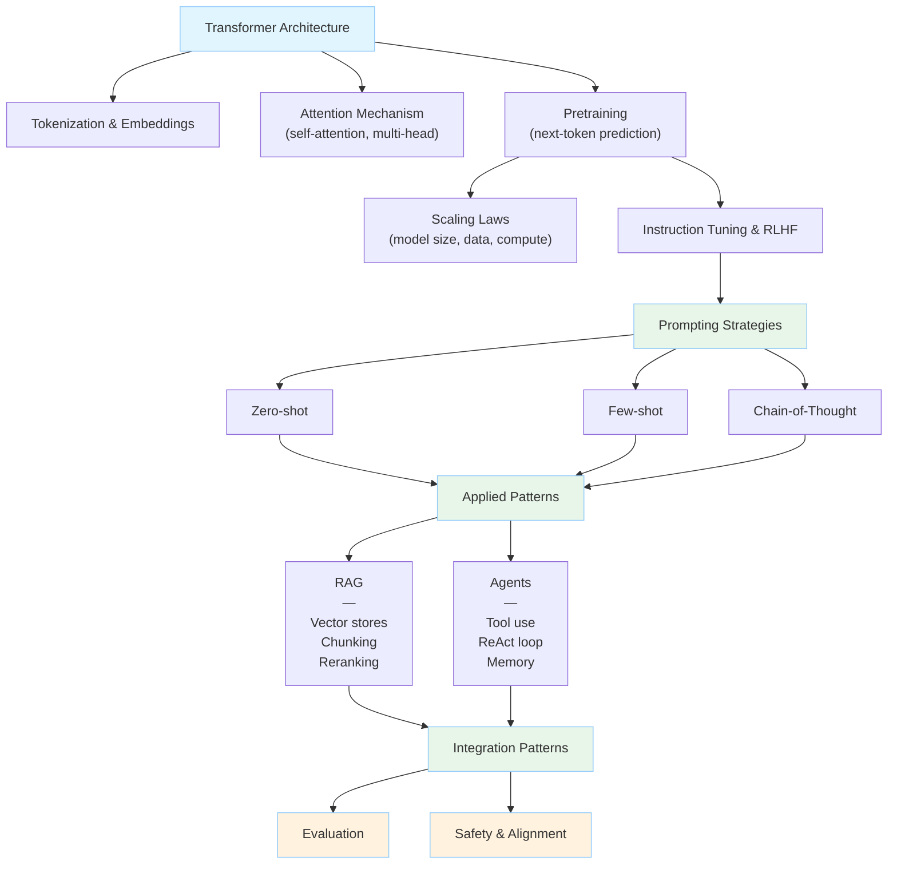

---

## Foundations

### How LLMs Work

A large language model is a neural network trained to predict the next
token in a sequence. The architecture that made this practical at scale
is the **transformer**, introduced by Vaswani et al. in 2017.

The transformer replaced recurrent networks (RNNs, LSTMs) with a
mechanism called **self-attention**, which allows every token in a
sequence to attend directly to every other token — regardless of distance.
This made parallel training over long sequences feasible and unlocked
the scaling that defines modern LLMs.

Three concepts are worth understanding before moving to applied work:

**Tokenization.** LLMs do not process characters or words — they process
tokens, subword units produced by algorithms like Byte-Pair Encoding (BPE).
"unbelievable" might become ["un", "believ", "able"]. Token count is the
unit of cost, context, and limit. Understanding tokenization explains
why LLMs struggle with character-level tasks (counting letters, reversing
strings) and why whitespace and punctuation behave unexpectedly.

**Embeddings.** Each token is mapped to a vector in a high-dimensional
space. Proximity in that space reflects semantic similarity. Embeddings
are also the basis for retrieval in RAG systems — documents and queries
are embedded so that nearest-neighbor search can find relevant content.

**Context window.** The model processes a fixed-length window of tokens
at inference time. Everything the model "knows" about the current
interaction must fit in that window — system prompt, conversation history,
retrieved documents, and the current user input. Managing the context
window is one of the core engineering challenges in LLM systems.

### Transformer internals at a glance

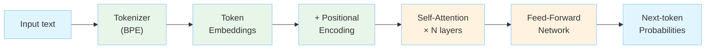

---

### Pretraining and Scaling Laws

LLMs are pretrained on large text corpora using next-token prediction
as a self-supervised objective. No labels are needed — the text itself
provides the signal. This is why pretraining can scale to trillions of tokens.

The 2020 **Scaling Laws** paper (Kaplan et al.) showed that model
performance follows predictable power laws as a function of model size,
dataset size, and compute budget. The practical implication: given a
fixed compute budget, there are optimal ways to allocate parameters
versus training tokens. The Chinchilla paper (Hoffmann et al., 2022)
revised the original scaling law estimates and showed that many large
models at the time were undertrained relative to their size.

---

### Instruction Tuning and RLHF

A pretrained model predicts text — it does not follow instructions.
To make models useful as assistants, two further steps are common:

**Instruction tuning** (also called supervised fine-tuning, SFT) trains
the model on examples of instructions paired with ideal responses.
This teaches the model to follow the format of a question-answer or
instruction-completion interaction.

**Reinforcement Learning from Human Feedback (RLHF)** uses human
preference judgments to train a reward model, then uses that reward
model to further fine-tune the language model with reinforcement
learning. InstructGPT (Ouyang et al., 2022) introduced this pipeline
for GPT-3 and demonstrated large improvements in helpfulness and
harmlessness relative to SFT alone.

**Direct Preference Optimization (DPO)** is a more recent alternative
to RLHF that achieves similar alignment results without a separate
reward model, by framing the preference learning problem directly as
a classification objective over the language model.

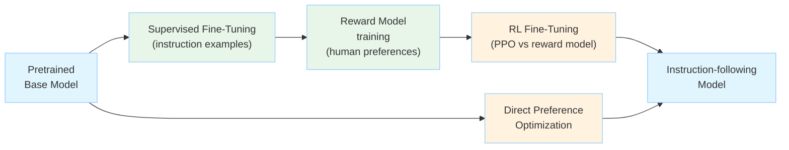

---

## Prompting

Prompting is the primary interface between software engineers and LLMs.
A prompt is the text (or structured input) sent to the model at inference
time. How that prompt is constructed dramatically affects output quality.

### Prompting strategies compared

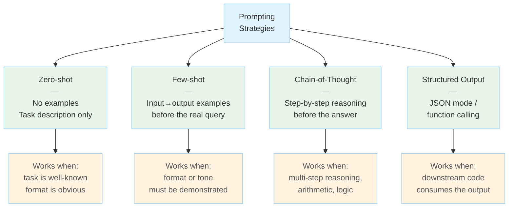

### Zero-shot prompting

Ask the model to perform a task with no examples. Works well for tasks
within the model's training distribution and where the desired format
is self-evident.

```
Classify the sentiment of this review as positive, negative, or neutral.

Review: "The battery life is excellent but the screen is dim."
```

### Few-shot prompting

Provide a small number of input-output examples before the actual input.
Demonstrates the desired format, tone, and reasoning style without
any gradient updates to the model.

```
Review: "Fast shipping, terrible packaging." → negative
Review: "Exactly as described, very happy." → positive
Review: "The battery life is excellent but the screen is dim." → ?
```

### Chain-of-thought prompting

Wei et al. (2022) showed that asking the model to reason step by step
before giving a final answer dramatically improves performance on
multi-step reasoning tasks (arithmetic, symbolic reasoning, commonsense).

```
Q: Roger has 5 tennis balls. He buys 2 more cans of 3 balls each.
   How many tennis balls does he have now?

A: Roger starts with 5 balls. He buys 2 cans × 3 balls = 6 balls.
   5 + 6 = 11. The answer is 11.

Q: The cafeteria had 23 apples. They used 20 to make lunch and bought
   6 more. How many apples do they have?
```

The key insight: chain-of-thought works because the intermediate
reasoning steps are themselves tokens, and the model's next-token
prediction can condition on them. The model is not doing internal
symbolic reasoning — it is generating text that happens to be
reasoning, and that text helps it generate better text next.

### Structured output

Most production LLM systems need structured data, not prose. Modern
APIs support **JSON mode** or **function calling** (also called tool
use or structured output) that constrains the model's output to a
schema. This is more reliable than asking for JSON in a prompt and
parsing the result.

```json
{
  "name": "extract_sentiment",
  "parameters": {
    "sentiment": { "type": "string", "enum": ["positive", "negative", "neutral"] },
    "confidence": { "type": "number" }
  }
}
```

### System prompts and prompt architecture

In chat-format APIs, the **system prompt** sets the model's persona,
constraints, and task context before the conversation begins. Production
systems commonly structure their prompt as:

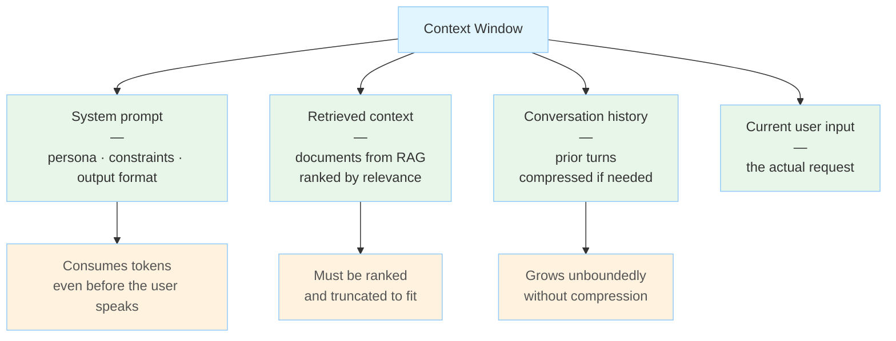

---

## Retrieval-Augmented Generation (RAG)

RAG is an architecture pattern that augments an LLM's response with
content retrieved from an external knowledge source at inference time.
It solves two problems simultaneously: the model's knowledge cutoff
(pretraining data has a date), and the context window constraint
(you cannot fit an entire knowledge base into a prompt).

### Basic RAG pipeline

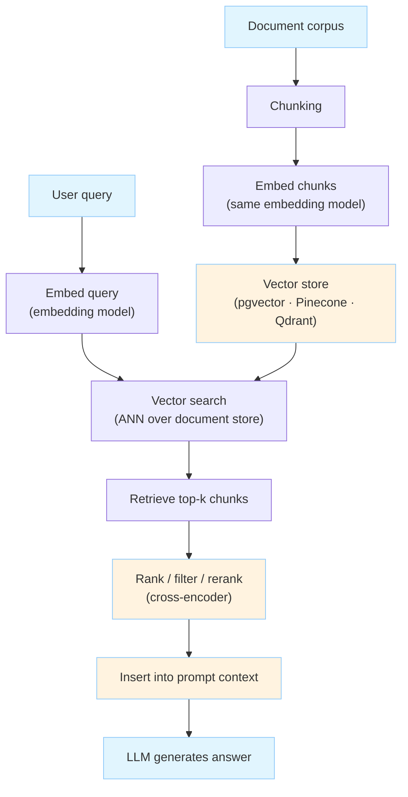

### Key design decisions

**Chunking strategy.** How documents are split into retrievable units
matters more than most teams expect. Fixed-size chunks lose sentence
boundaries. Semantic chunking (split on topic change) is more expensive
but improves retrieval precision. Chunk size is a hyperparameter:
smaller chunks improve precision, larger chunks preserve more context.

**Embedding model.** The model used to embed documents and queries must
be the same, and its quality directly determines retrieval quality.
Dedicated embedding models (e.g., text-embedding-3, BGE, E5) outperform
general-purpose LLMs for this task.

**Vector store.** Retrieved by approximate nearest-neighbor (ANN) search
over embedding vectors. Common choices: pgvector (PostgreSQL extension),
Pinecone, Weaviate, Qdrant, Chroma. The right choice depends on scale,
latency requirements, and whether you need hybrid search (vector +
keyword).

**Reranking.** A first-stage retrieval returns the top-k candidates by
embedding similarity. A second-stage reranker (a cross-encoder model)
rescores those candidates more accurately by jointly encoding the query
and each candidate. Reranking significantly improves precision at the
cost of additional latency.

**Context assembly.** Retrieved chunks must be inserted into the prompt
in a way that the model can use effectively. Research (the "lost in the
middle" paper) shows that LLMs perform worse on content placed in the
middle of long contexts — placing the most relevant retrieved content
at the beginning or end of the context window improves performance.

### When RAG fits — and when it does not

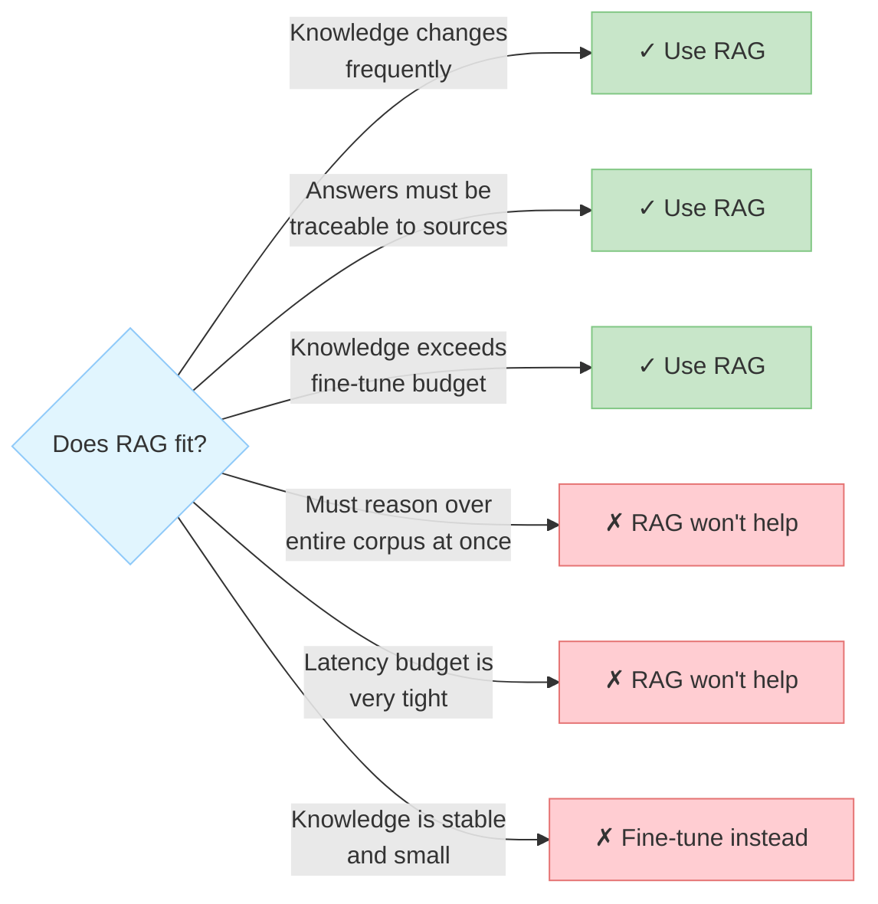

---

## Agents and Tool Use

An LLM agent is a system in which the language model is the reasoning
engine, and it is given access to tools (functions, APIs, databases,
code interpreters) that it can call to gather information or take actions.
The model generates a plan, calls tools, observes results, and continues
reasoning until it produces a final response.

### The ReAct loop

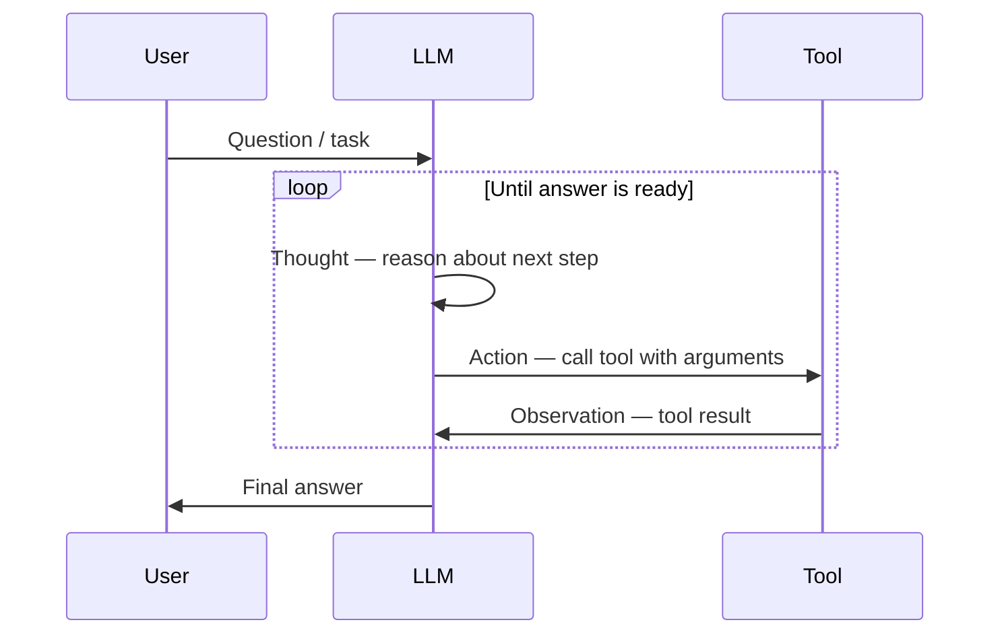

### Tool use and function calling

Modern LLM APIs support **function calling**: the model can emit a
structured request to call a function, and the application executes
it and returns the result. This is more reliable than asking the model
to emit a tool call as free text and parsing it.

```python
tools = [
    {
        "name": "get_stock_price",
        "description": "Get the current stock price for a ticker symbol",
        "parameters": {
            "ticker": {"type": "string", "description": "e.g. AAPL"}
        }
    }
]
```

### Memory patterns

Agents operating over multiple turns or long sessions need memory
beyond the context window:

| Memory type      | Implementation                         | Trade-off                            |
|------------------|----------------------------------------|--------------------------------------|
| In-context       | Append all history to prompt           | Simple; limited by context window    |
| Summarization    | Compress old turns into summary        | Loses detail; saves tokens           |
| External (RAG)   | Store and retrieve past interactions   | Scalable; retrieval latency          |
| Entity memory    | Extract and track key entities         | Structured; requires extraction step |

### Agent reliability challenges

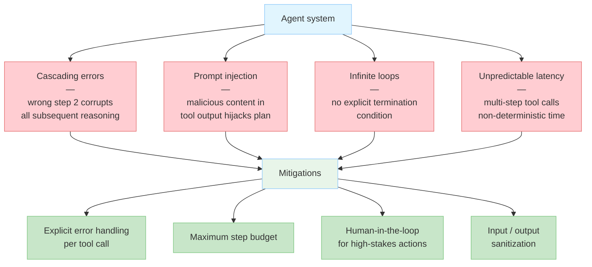

---

## Integration Patterns

### Patterns overview

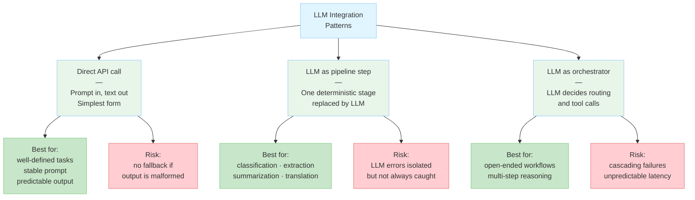

### Direct API integration

The simplest integration: call an LLM API, pass a prompt, receive text.
Appropriate for well-defined, low-complexity tasks where the prompt
is stable and the output format is predictable.

Design considerations:
- Retry logic with exponential backoff (rate limits, transient errors)
- Timeout handling (LLM latency is variable)
- Cost tracking (token consumption can grow unexpectedly)
- Output validation before using the result downstream

### LLM as a component in a pipeline

The LLM handles one step in a larger data or processing pipeline:
classification, extraction, summarization, translation. Surrounding
steps are deterministic code. This is the most reliable integration
pattern because failures are isolated and the system degrades gracefully.

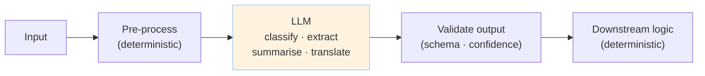

### LLM as orchestrator

The LLM decides what to do next: which tool to call, which branch to
take, whether to ask the user a clarifying question. This enables
flexible, open-ended workflows but introduces the reliability challenges
described in the agents section.

### Caching

LLM API calls are expensive and slow. Caching is viable when:
- The same prompt (or semantically equivalent prompt) is sent repeatedly
- **Exact-match caching** — hash the prompt, cache the response
- **Semantic caching** — embed the prompt, retrieve cached responses for
  similar queries (higher hit rate, lower precision)

### Observability

LLM systems require observability at a different layer than traditional
software:

| Signal           | What to track                                      |
|------------------|----------------------------------------------------|
| Latency          | Time-to-first-token, total completion time         |
| Token usage      | Prompt tokens, completion tokens, cost per request |
| Quality          | Automated eval scores, human feedback, thumbs      |
| Failures         | Rate limit errors, context overflow, refusals      |
| Prompt versions  | Which prompt template produced which output        |

Tools like LangSmith, Weights & Biases Weave, and Helicone provide
LLM-specific tracing and eval infrastructure.

---

## Evaluation

Evaluating LLM systems is harder than evaluating deterministic software.
There is no ground-truth output for most open-ended tasks.

### Evaluation approaches compared

```mermaid
quadrantChart
    title Evaluation approaches — cost vs. reliability
    x-axis Low cost --> High cost
    y-axis Low reliability --> High reliability
    quadrant-1 Ideal
    quadrant-2 Expensive but trustworthy
    quadrant-3 Avoid
    quadrant-4 Fast iteration
    Task-specific evals: [0.45, 0.80]
    Human evaluation: [0.85, 0.90]
    LLM-as-judge: [0.35, 0.65]
    Benchmark eval: [0.20, 0.50]
    Reference metrics (BLEU/ROUGE): [0.15, 0.30]
```

**Benchmark evaluation.** Run the model on a standardized dataset with
known answers (MMLU, HumanEval, MATH, HellaSwag). Useful for tracking
capability across model versions. Not a reliable proxy for task-specific
quality.

**Human evaluation.** Ask humans to rate outputs on dimensions like
helpfulness, accuracy, coherence. Gold standard, but expensive and slow.
Not practical for continuous evaluation during development.

**LLM-as-judge.** Use a stronger LLM (e.g., GPT-4) to evaluate outputs
from a weaker or different model. Scalable and surprisingly consistent
with human judgments on many tasks, but inherits the judge model's biases
and is not reliable for tasks where the judge model also struggles.

**Reference-based metrics.** Compare generated text to a reference output
using metrics like BLEU, ROUGE, or BERTScore. Useful for translation
and summarization where reference outputs exist. Poor proxies for overall
quality on open-ended generation.

**Task-specific evals.** Define the success criteria for your specific
use case and build an eval suite around them. This is the most
practically useful form of evaluation and the hardest to build without
domain knowledge.

### The eval loop

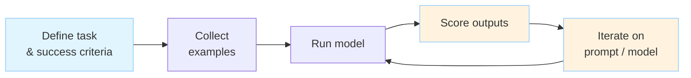

Treat evals like tests: automate them, run them on every prompt change,
and track metrics over time. Regression in LLM quality is as real as
regression in software behavior.

---

## Safety and Alignment

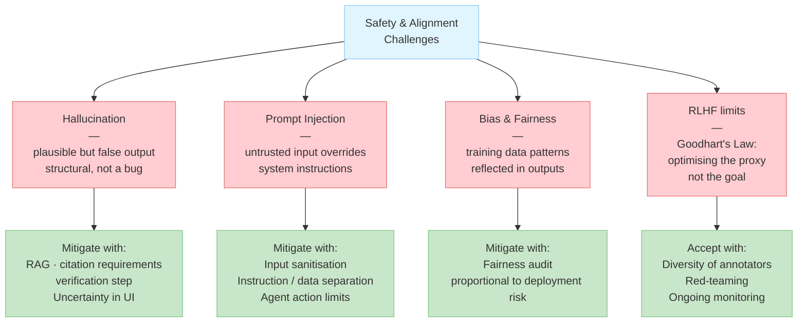

### Hallucination

LLMs generate plausible-sounding text, not necessarily true text.
They have no internal world model that they check facts against — they
predict tokens that are likely given the context. Hallucination is a
structural property of the architecture, not a bug that will be fixed.

Mitigation strategies:
- **RAG** — ground answers in retrieved source documents
- **Citation requirements** — instruct the model to cite sources for
  factual claims and surface those citations to users
- **Verification step** — use a second LLM call or deterministic check
  to verify claims before displaying them
- **Confidence communication** — design UI to communicate uncertainty
  rather than presenting all outputs as equally reliable

### Prompt injection

Malicious content in user input or retrieved documents can override
the system prompt's instructions. This is the LLM equivalent of SQL
injection: untrusted input is concatenated with trusted instructions
and interpreted as instructions.

Mitigations are imperfect: input sanitization, clear structural
separation between instructions and data, monitoring for anomalous
outputs, and limiting what actions an agent can take without human
confirmation.

### Bias and fairness

LLMs reflect patterns in their training data, including social biases
around gender, race, nationality, and other dimensions. This matters
more in some deployment contexts than others — a code completion tool
has different risk exposure than a hiring screening tool. Evaluation
should include fairness audits proportional to the stakes of the deployment.

### RLHF and its limits

RLHF improves helpfulness and reduces obvious harms but does not
eliminate them. The reward model is trained on human preferences, and
human preferences are inconsistent, gameable, and dependent on who the
annotators are. Models optimized for RLHF can learn to produce outputs
that score well on the reward model without actually being more truthful
or safe — a form of Goodhart's Law applied to alignment.

---

## AI-Assisted Development

LLMs have changed the daily workflow of software engineers.
The most widely used tools:

| Tool             | Primary use                                          |
|------------------|------------------------------------------------------|
| GitHub Copilot   | Inline code completion in the editor                 |
| Cursor           | AI-native editor with chat, edit, and agent modes    |
| Codeium          | Free alternative to Copilot                          |
| Aider            | LLM pair programmer in the terminal                  |
| ChatGPT / Claude | General-purpose chat for design, debugging, writing  |

### What works — and what needs care

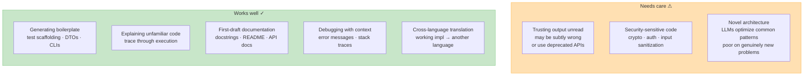

The sustainable workflow treats the LLM as a fast but fallible
collaborator: its output always passes through the engineer's judgment,
tests, and review.

---

## Key Authors

| Author            | Contribution                                                      |
|-------------------|-------------------------------------------------------------------|
| Ashish Vaswani    | Co-author of Attention Is All You Need; transformer architecture  |
| Ilya Sutskever    | Co-founder OpenAI; GPT series; scaling insight                    |
| Jared Kaplan      | Scaling Laws for Neural Language Models (2020)                    |
| Tom Brown         | Lead author of GPT-3 paper (2020)                                 |
| Jason Wei         | Chain-of-thought prompting (2022); instruction tuning             |
| Long Ouyang       | InstructGPT / RLHF paper (2022)                                   |
| Andrej Karpathy   | Educator and practitioner; nanoGPT; LLM intuition building        |
| Lilian Weng       | Influential blog posts on agents, prompting, alignment            |

---

## Key Works

| Work                                            | Authors           | Year | Significance                                          |
|-------------------------------------------------|-------------------|------|-------------------------------------------------------|
| Attention Is All You Need                       | Vaswani et al.    | 2017 | Introduced the transformer architecture               |
| Language Models are Few-Shot Learners           | Brown et al.      | 2020 | GPT-3; demonstrated in-context learning at scale      |
| Scaling Laws for Neural Language Models         | Kaplan et al.     | 2020 | Power-law relationships between compute, data, size   |
| Training language models to follow instructions | Ouyang et al.     | 2022 | InstructGPT; RLHF pipeline for alignment              |
| Chain-of-Thought Prompting Elicits Reasoning    | Wei et al.        | 2022 | Step-by-step reasoning improves complex task accuracy |
| ReAct: Synergizing Reasoning and Acting         | Yao et al.        | 2022 | Interleaved reasoning and tool use in agents          |
| Lost in the Middle                              | Liu et al.        | 2023 | LLMs underuse context placed in the middle of prompts |
| Direct Preference Optimization                  | Rafailov et al.   | 2023 | Alignment without a separate reward model             |

---

## Reading Path

```mermaid
flowchart LR
    S1["1 · Start here<br/>Karpathy — Let's build GPT<br/>~2h video, builds transformer<br/>from scratch"]
    S2["2 · Architecture<br/>Transformer deep dive<br/>attention · tokens · context"]
    S3["3 · Scale<br/>Scaling Laws — Kaplan 2020<br/>why bigger works"]
    S4["4 · Alignment<br/>InstructGPT — Ouyang 2022<br/>RLHF pipeline"]
    S5["5 · Prompting<br/>zero-shot · few-shot<br/>chain-of-thought · structured"]
    S6["6 · Retrieval<br/>RAG patterns<br/>external knowledge"]
    S7["7 · Agents<br/>ReAct · function calling<br/>memory · reliability"]
    S8["8 · Production<br/>Evaluation + Safety<br/>quality & failure modes"]

    S1 --> S2 --> S3 --> S4 --> S5 --> S6 --> S7 --> S8

    style S1 fill:#e1f5fe,color:#333333,stroke:#90caf9
    style S2 fill:#e8f5e9,color:#333333,stroke:#90caf9
    style S3 fill:#e8f5e9,color:#333333,stroke:#90caf9
    style S4 fill:#e8f5e9,color:#333333,stroke:#90caf9
    style S5 fill:#fff3e0,color:#333333,stroke:#90caf9
    style S6 fill:#fff3e0,color:#333333,stroke:#90caf9
    style S7 fill:#fff3e0,color:#333333,stroke:#90caf9
    style S8 fill:#fff3e0,color:#333333,stroke:#90caf9
```

---

*LLMs connect to [Architecture](../architecture/index.md) through RAG and
agent patterns, to [Developer Tools](../dev-tools/index.md) through
AI-assisted coding, to [Databases](../databases/index.md) through vector
stores, and to [Distributed Systems](../distributed/index.md) through the
infrastructure needed to serve models at scale.*
