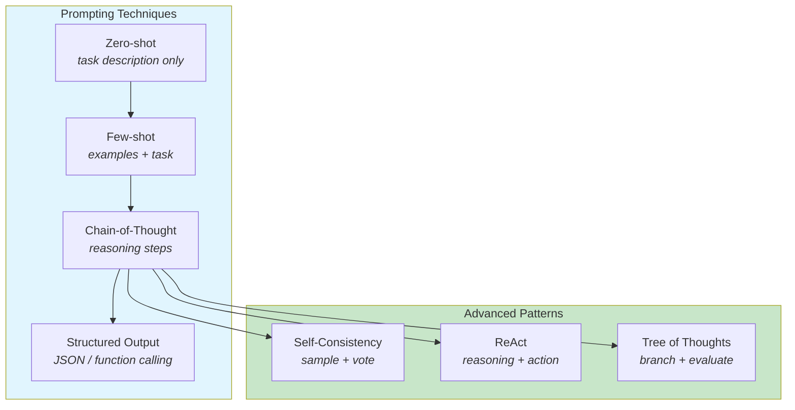

# Prompting Strategies

Prompting is the primary interface between software engineers and large
language models. The same model, with the same parameters, can produce
radically different outputs depending on how the prompt is structured.

The key insight is that **an LLM does not "understand" a task in the
human sense** — it predicts the most probable continuation of the prompt.
Crafting a prompt is designing a probability distribution over outputs
by conditioning on the right context.

## The Big Picture



---

## Zero-Shot Prompting

Give the model a task description with no examples. Works best when the
task is well-represented in the pretraining data and the desired output
format is obvious.

```
Classify the sentiment of this review as positive, negative, or neutral.

Review: "The battery life is excellent but the screen is dim."
Sentiment:
```

**When it works:**
- Common tasks the model has seen extensively (sentiment, summarization,
  translation)
- Simple classification with obvious labels
- Tasks where the instruction is unambiguous

**When it fails:**
- Niche domains (medical coding, legal analysis)
- Complex multi-step reasoning
- Tasks requiring specific output formats

---

## Few-Shot Prompting

Provide examples of input-output pairs before the actual input. The
model generalizes from the pattern.

```
Review: "Fast shipping, terrible packaging." → negative
Review: "Exactly as described, very happy." → positive
Review: "Meh, it works." → neutral
Review: "The battery life is excellent but the screen is dim." →
```

**Key design decisions:**

| Decision | Guidance |
|----------|----------|
| Number of examples | 3–5 usually sufficient; diminishing returns beyond 10 |
| Example selection | Choose diverse, representative, edge-case examples |
| Example ordering | Random or strategically varied; last example often most influential |
| Label distribution | Match expected real-world distribution |

**In-context learning** (Brown et al., 2020) is the phenomenon where
models improve at a task simply by seeing examples in the prompt — with
no gradient updates. GPT-3 demonstrated this at scale.

---

## Chain-of-Thought Prompting

Wei et al. (2022) showed that prompting the model to "think step by step"
before answering dramatically improves reasoning on multi-step tasks.

```
Q: Roger has 5 tennis balls. He buys 2 more cans of 3 balls each.
How many tennis balls does he have now?

A: Roger starts with 5 balls. He buys 2 cans × 3 balls = 6 balls.
5 + 6 = 11. The answer is 11.

Q: The cafeteria had 23 apples. They used 20 to make lunch and bought
6 more. How many apples do they have?

A: Let's think step by step. The cafeteria started with 23 apples.
They used 20, leaving 23 - 20 = 3 apples. They bought 6 more,
so 3 + 6 = 9. The answer is 9.
```

**Why it works:** The intermediate reasoning steps are themselves tokens.
The model's next-token prediction can condition on them, making the
final answer more likely to be correct.

**Variants:**

| Variant | How it works | Best for |
|---------|-------------|----------|
| **Zero-shot CoT** | Append "Let's think step by step" | Simple reasoning without examples |
| **Few-shot CoT** | Provide reasoning examples | Complex tasks requiring demonstration |
| **Self-consistency** | Generate multiple CoT paths, vote on answer | High-stakes reasoning |
| **Tree of Thoughts** | Branch reasoning, evaluate, prune | Search and planning problems |

---

## Structured Output

Production systems need structured data, not free text. Modern APIs
provide **JSON mode** and **function calling** to constrain outputs.

```python
# OpenAI function calling example
tools = [{
    "type": "function",
    "function": {
        "name": "extract_sentiment",
        "parameters": {
            "type": "object",
            "properties": {
                "sentiment": {
                    "type": "string",
                    "enum": ["positive", "negative", "neutral"]
                },
                "confidence": {"type": "number"},
                "key_phrases": {
                    "type": "array",
                    "items": {"type": "string"}
                }
            },
            "required": ["sentiment", "confidence"]
        }
    }
}]

response = client.chat.completions.create(
    model="gpt-4",
    messages=[{"role": "user", "content": "The battery life is excellent but the screen is dim."}],
    tools=tools,
    tool_choice={"type": "function", "function": {"name": "extract_sentiment"}}
)
```

**Benefits over prompt-based JSON:**
- Guaranteed valid JSON (no parsing errors)
- Guaranteed schema compliance
- Better instruction following for nested structures

---

## System Prompt Architecture

In chat-format APIs, the **system prompt** sets the model's persona,
constraints, and task context.

```
[System]     You are a precise technical assistant.
             Always respond in valid JSON.
             Never include explanations outside the JSON.

[User]       Extract entities from: "Apple Inc. was founded in 1976."
```

**Production prompt structure:**

```
1. SYSTEM PROMPT     — persona, constraints, output format
2. STATIC CONTEXT    — business rules, taxonomy, reference data
3. RETRIEVED CONTEXT — documents from RAG (if applicable)
4. FEW-SHOT EXAMPLES — demonstrations of desired behavior
5. USER INPUT        — the actual request
```

**Trade-offs:**

| Element | Cost | Benefit |
|---------|------|---------|
| System prompt | Low (once per conversation) | Establishes consistent behavior |
| Static context | Medium | Reduces hallucination of rules |
| Retrieved context | High (per query) | Grounds answers in facts |
| Few-shot examples | High | Demonstrates complex formats |

---

## Advanced Patterns

### Role Prompting

```
You are a senior Rust engineer reviewing code for safety and performance.
Point out any unsafe patterns, unnecessary allocations, or missed
optimizations.
```

Role prompts shape tone, depth, and domain expertise. They are a form
of conditional generation — the model shifts its output distribution
to match the persona described.

### Step-Back Prompting

Before answering a detailed question, ask the model to answer a more
general question first:

```
Q: What is the area of the triangle with vertices (0,0), (1,2), (3,4)?

Step back: What is the formula for the area of a triangle given its vertices?
Answer: The shoelace formula: A = ½|x₁(y₂−y₃) + x₂(y₃−y₁) + x₃(y₁−y₂)|

Now apply: A = ½|0(2−4) + 1(4−0) + 3(0−2)| = ½|0 + 4 − 6| = ½|−2| = 1
```

### Self-Consistency

Generate multiple independent answers and take the majority vote:

```python
answers = []
for _ in range(5):
    response = llm.complete(prompt, temperature=0.7)
    answers.append(extract_answer(response))

final_answer = Counter(answers).most_common(1)[0][0]
```

This trades latency and cost for accuracy. Effective on reasoning tasks
where a single sample might be unlucky.

---

## When Prompting Goes Wrong

### Overfitting to the prompt

A few-shot prompt with too many or too similar examples can cause the
model to overfit — producing outputs that match the examples too closely
rather than generalizing to the actual input.

### Prompt brittleness

Small changes in wording, punctuation, or example ordering can produce
large changes in output. This makes prompts hard to maintain and test.

```python
# These can produce different answers:
"Classify as positive or negative:"
"Classify the sentiment as positive or negative:"
"Is this review positive or negative?"
```

### Context window overflow

Long prompts with many few-shot examples consume the context window,
leaving less room for the actual input and output.

### Adversarial inputs

Carefully crafted inputs can cause the model to ignore instructions or
produce harmful outputs. This is the **prompt injection** problem.

---

## Prompt Engineering Checklist

- [ ] Task is clearly defined and unambiguous
- [ ] Output format is specified (JSON schema, enum, template)
- [ ] Few-shot examples cover edge cases and failure modes
- [ ] System prompt establishes constraints and persona
- [ ] Prompt length fits within context window with margin
- [ ] Temperature is appropriate for the task (low for structured, high for creative)
- [ ] Prompt is versioned and tested against a held-out eval set

---

## Timeline

| Year | Event | Significance |
|------|-------|------------|
| 2020 | Brown et al. — GPT-3 | In-context learning; few-shot prompting at scale |
| 2021 | Reynolds & McDonell — Prompt Programming | Formalized prompt design as programming |
| 2022 | Wei et al. — Chain-of-Thought | Step-by-step reasoning via prompting |
| 2022 | Kojima et al. — Zero-Shot CoT | "Let's think step by step" without examples |
| 2022 | Yao et al. — ReAct | Interleaved reasoning and action |
| 2023 | Yao et al. — Tree of Thoughts | Branching reasoning with search |
| 2023 | OpenAI — JSON mode / Function calling | Structured output via API |
| 2024 | Multi-turn tool use | Complex agent workflows via function calling |

---

## Further Reading

- Wei et al. — [Chain-of-Thought Prompting](../../works/papers/wei-2022-chain-of-thought.md) (2022)
- Yao et al. — [ReAct](../../works/papers/yao-2022-react.md) (2022)
- Brown et al. — [GPT-3 / Few-Shot Learning](../../works/papers/brown-2020-gpt3.md) (2020)
- [Transformer Architecture](transformer.md) — how the model processes prompts
- [RAG](rag.md) — augmenting prompts with retrieved context
- [Agents](agents.md) — prompting for tool use and reasoning

---

## Related Topics

- [Large Language Models](./index.md) — the parent topic
- [Transformer Architecture](transformer.md) — how prompts are processed
- [RAG](rag.md) — dynamic context via retrieval
- [Agents](agents.md) — multi-step reasoning and tool use
- [Evaluation](evaluation.md) — measuring prompt quality
- [Safety](safety.md) — prompt injection and adversarial inputs
