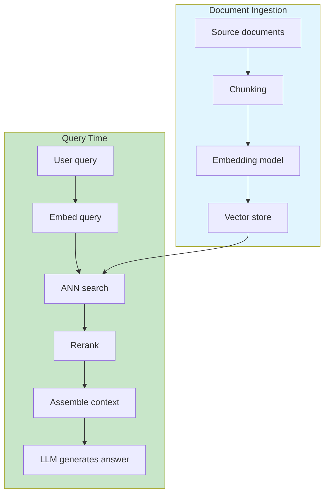

# Retrieval-Augmented Generation (RAG)

RAG is an architecture pattern that augments an LLM's response with
content retrieved from an external knowledge source at inference time.
It is the dominant pattern for building knowledge-grounded LLM applications.

The core insight is that **an LLM cannot know what it was not trained
on, and it cannot hold an entire knowledge base in its context window**.
RAG solves both problems by retrieving relevant passages and inserting
them into the prompt.

## The Big Picture



---

## What Is RAG?

RAG combines two systems:

1. **Retrieval system** — finds relevant documents from a knowledge base
2. **Generation system** — an LLM that produces an answer conditioned on
   the retrieved documents

At query time, the user's question is converted into an embedding vector,
which is used to find the most similar document chunks in the vector
store. Those chunks are inserted into the prompt as context, and the
LLM generates an answer grounded in that context.

```python
# Conceptual RAG pipeline
def rag_answer(query, vector_store, llm):
    # 1. Embed the query
    query_embedding = embed_model.encode(query)

    # 2. Retrieve relevant chunks
    chunks = vector_store.similarity_search(query_embedding, k=5)

    # 3. Build prompt with retrieved context
    context = "\n\n".join(chunk.text for chunk in chunks)
    prompt = f"""Use the following context to answer the question.
    If the answer is not in the context, say "I don't know".

    Context:
    {context}

    Question: {query}
    Answer:"""

    # 4. Generate answer
    return llm.complete(prompt)
```

---

## Chunking Strategy

How documents are split into retrievable units is the most important
RAG design decision.

| Strategy | How it works | Pros | Cons |
|----------|-------------|------|------|
| **Fixed size** | Split every N tokens/characters | Simple, fast | Cuts sentences; loses context at boundaries |
| **Sentence/paragraph** | Split on natural boundaries | Preserves coherence | Variable chunk sizes |
| **Semantic** | Split when topic changes (using embeddings) | High relevance | Expensive; requires a model pass |
| **Hierarchical** | Small chunks with parent references | Precise retrieval; rich context | Complex indexing |
| **Sliding window** | Overlapping chunks | No information loss at boundaries | Redundant storage |

**Chunk size trade-offs:**

- **Small chunks** (128–256 tokens): Higher retrieval precision, more
  chunks fit in context, but each chunk has less self-contained context
- **Large chunks** (1024+ tokens): More context per chunk, but fewer
  fit in the context window and retrieval precision drops

**A good rule of thumb:** A chunk should be self-contained enough that
a human could answer a question about it without seeing the rest of the
document.

---

## Embedding Models

The embedding model converts text into dense vectors. Its quality
determines retrieval quality.

```python
# Example: using a dedicated embedding model
from sentence_transformers import SentenceTransformer

model = SentenceTransformer('BAAI/bge-large-en-v1.5')

doc_embeddings = model.encode(documents)
query_embedding = model.encode("How do I configure rate limiting?")
```

**Popular embedding models:**

| Model | Dimensions | Strengths |
|-------|-----------|-----------|
| text-embedding-3-large | 3072 | High quality; good multilingual support |
| BGE-large-en-v1.5 | 1024 | Strong retrieval; open source |
| E5-mistral-7b-instruct | 4096 | Instruction-tuned; task-aware |
| GTE-large | 1024 | Fast; competitive quality |
| Cohere embed-english-v3 | 1024 | Good for short queries |

**Critical rule:** The embedding model used for indexing documents must
be the same model used for querying. Mixing models destroys retrieval
quality.

---

## Vector Stores

Vector stores index embedding vectors for fast approximate nearest-neighbor
(ANN) search.

| Store | Type | Best for |
|-------|------|----------|
| **pgvector** | PostgreSQL extension | Teams already using Postgres; ACID compliance |
| **Pinecone** | Managed SaaS | Rapid prototyping; zero ops |
| **Weaviate** | Open source / managed | Hybrid search; GraphQL interface |
| **Qdrant** | Open source | Rust-based; fast; good filtering |
| **Chroma** | Open source | Local development; easy setup |
| **Milvus** | Open source / managed | Large scale; GPU acceleration |

**Key features to evaluate:**
- **Filtering:** Can you filter by metadata (tenant_id, date_range) before vector search?
- **Hybrid search:** Does it support combining vector + keyword (BM25) scores?
- **Quantization:** Does it support dimension reduction for memory savings?

---

## Reranking

A two-stage retrieval pipeline improves precision:

1. **First stage (retrieval):** Fast ANN search returns top-k candidates
   (e.g., k=100) using embedding similarity
2. **Second stage (reranking):** A cross-encoder model scores each
   query-chunk pair more accurately, returning the top-n (e.g., n=5)

```python
# Two-stage retrieval with reranking
# Stage 1: fast retrieval
candidates = vector_store.similarity_search(query_embedding, k=100)

# Stage 2: precise reranking
scores = cross_encoder.predict([
    (query, candidate.text) for candidate in candidates
])
top_chunks = [c for _, c in sorted(zip(scores, candidates), reverse=True)[:5]]
```

**Why reranking helps:** The bi-encoder (embedding model) encodes query
and document independently, which is fast but loses fine-grained
interactions. The cross-encoder jointly encodes query and document,
capturing subtle relevance signals at the cost of speed.

---

## Context Assembly

Retrieved chunks must be inserted into the prompt effectively. Research
shows that **LLMs underuse content in the middle of long contexts** (the
"lost in the middle" problem, Liu et al., 2023).

**Best practices for context assembly:**

1. **Place most relevant chunks at the beginning or end** of the context
2. **Add source references** so the model can cite where information came from
3. **Deduplicate** — the same passage may be retrieved multiple times
4. **Truncate intelligently** — cut less relevant content to fit the window

```python
def assemble_context(chunks, max_tokens=4000):
    # Sort by relevance score
    sorted_chunks = sorted(chunks, key=lambda c: c.score, reverse=True)

    context_parts = []
    total_tokens = 0

    for chunk in sorted_chunks:
        chunk_tokens = estimate_tokens(chunk.text)
        if total_tokens + chunk_tokens > max_tokens:
            break
        context_parts.append(f"[Source: {chunk.source}]\n{chunk.text}")
        total_tokens += chunk_tokens

    return "\n\n---\n\n".join(context_parts)
```

---

## When RAG Fits — and When It Does Not

**RAG is appropriate when:**
- The knowledge base changes frequently (pricing, documentation, policies)
- The required knowledge exceeds what can be fine-tuned into the model
- Answers must be traceable to source documents
- Multiple users/tenants need isolated knowledge bases

**RAG is not the right tool when:**
- The task requires reasoning over the entire knowledge base, not retrieval
- Latency constraints make multi-step retrieval unacceptable
- The knowledge is stable and compact enough to include in a fine-tuned model
- The task is purely creative generation with no grounding requirement

---

## RAG Failure Modes

### Retrieval misses the relevant document

The embedding model may not capture the semantic relationship between
the query and the relevant passage. This is especially common for:
- **Keyword-heavy queries** where synonyms matter
- **Multi-hop reasoning** requiring connecting multiple documents
- **Very domain-specific terminology** not well-represented in the embedding model

**Mitigation:** Hybrid search (vector + keyword), query expansion,
metadata filtering.

### Retrieved but not used

The LLM may ignore retrieved context and hallucinate an answer from its
pretraining. This happens when:
- The retrieved context contradicts the model's pretraining knowledge
- The prompt does not strongly instruct the model to ground answers in context

**Mitigation:** Strong system prompts ("Only use the provided context"),
citation requirements, eval metrics that check answer grounding.

### Chunk boundary problems

Information split across chunk boundaries may be impossible to reconstruct.
If a table spans two chunks, neither chunk contains the full table.

**Mitigation:** Semantic chunking, hierarchical chunking with parent
references, smaller chunks with overlap.

---

## Timeline

| Year | Event | Significance |
|------|-------|------------|
| 2017 | Vaswani et al. — Transformers | Architecture enabling LLMs |
| 2020 | Lewis et al. — RAG (Facebook) | Formalized retrieval + generation |
| 2020 | Guu et al. — REALM | Pretrained retriever + reader jointly |
| 2021 | Karpukhin et al. — Dense Passage Retrieval | Dense retrieval outperforms BM25 |
| 2022 | OpenAI — ChatGPT plugins | RAG via browsing / retrieval |
| 2023 | Liu et al. — Lost in the Middle | LLMs underuse middle context |
| 2023 | Advanced RAG patterns | Query rewriting, HyDE, multi-query |
| 2024 | GraphRAG | Knowledge graphs + vector retrieval |

---

## Further Reading

- Lewis et al. — Retrieval-Augmented Generation for Knowledge-Intensive NLP Tasks (2020)
- Karpukhin et al. — Dense Passage Retrieval for Open-Domain QA (2020)
- Liu et al. — [Lost in the Middle](../../works/papers/liu-2023-lost-in-middle.md) (2023)
- [Transformer Architecture](transformer.md) — how LLMs process retrieved context
- [Prompting Strategies](prompting.md) — crafting prompts with retrieved context
- [Agents](agents.md) — RAG as a tool in agent systems

---

## Related Topics

- [Large Language Models](./index.md) — the parent topic
- [Transformer Architecture](transformer.md) — how the model processes text
- [Prompting Strategies](prompting.md) — how to prompt with retrieved context
- [Agents](agents.md) — RAG as an agent tool
- [Evaluation](evaluation.md) — measuring RAG quality
- [Databases](../databases/index.md) — vector stores as databases
- [Distributed Systems](../distributed/index.md) — scaling RAG infrastructure
