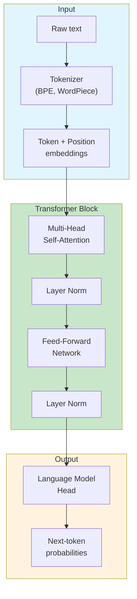

# Transformer Architecture

The transformer is the neural network architecture that made large
language models practical. It replaced recurrence with attention,
allowing every token in a sequence to attend to every other token
in parallel — regardless of distance.

The central insight is that **distance in the sequence does not have
to mean distance in the computation graph**. An RNN processes tokens
one at a time; a transformer processes them all at once, using attention
to focus on the relevant ones.

## The Big Picture



---

## What Is a Transformer?

A transformer is a neural network architecture consisting of stacked
**encoder** and/or **decoder** blocks. Each block contains two main
sub-layers:

1. **Multi-head self-attention** — lets the model attend to all positions
   in the input sequence simultaneously
2. **Feed-forward network** — a position-wise dense layer applied to each
   token independently

Between each sub-layer is **residual connection** and **layer normalization**.

The original transformer (Vaswani et al., 2017) used an encoder-decoder
structure for machine translation. Modern LLMs like GPT use only the
decoder, trained with next-token prediction. BERT uses only the encoder,
trained with masked language modeling.

---

## Tokenization

LLMs do not read text directly. They read **tokens** — subword units
produced by algorithms like Byte-Pair Encoding (BPE) or WordPiece.

```python
# Example: GPT-2 BPE tokenization
"unbelievable"  → ["un", "believ", "able"]
"hello world"   → ["hello", " world"]     # note the leading space
"12345"         → ["1", "23", "45"]       # not digit-by-digit
```

**Why subwords?**
- **Rare words** are decomposed into known pieces ("antidisestablishmentarianism")
- **Typos and names** are handled gracefully
- **Vocabulary size** stays manageable (~32k–100k tokens)

**Key properties:**

| Property | Implication |
|----------|-------------|
| Token count ≠ word count | ~1.3 tokens per English word |
| Leading spaces matter | " world" and "world" are different tokens |
| Numbers split unpredictably | "100" may be ["1", "00"] or ["100"] |
| Code has high token density | `def foo():` ≈ 5–7 tokens |

Token count is the unit of **cost**, **context limit**, and **latency**.
Understanding tokenization explains why LLMs struggle with tasks like
counting letters in a word or reversing a string.

---

## Embeddings

Each token is mapped to a dense vector in a high-dimensional space
(typically 768–12,288 dimensions). These **token embeddings** are learned
during pretraining.

```python
# Conceptual: embedding lookup
vocab_size = 50_000        # size of token vocabulary
d_model = 768              # embedding dimension

# Each token ID maps to a learned vector
embedding_matrix = torch.randn(vocab_size, d_model)
token_id = tokenizer.encode("transformer")[0]
vector = embedding_matrix[token_id]  # shape: (768,)
```

**Positional encodings** are added to token embeddings so the model
knows where each token sits in the sequence. The original transformer
used sinusoidal encodings; modern models often use learned positional
embeddings or **rotary positional embeddings** (RoPE).

**Semantic proximity:** Tokens with similar meanings end up near each
other in embedding space. This property is the foundation for retrieval
in RAG systems — documents and queries are embedded so that nearest-neighbor
search finds relevant content.

---

## Self-Attention

Self-attention is the mechanism that lets every token "look at" every
other token. For each token, the model computes three vectors:

- **Query (Q)** — what am I looking for?
- **Key (K)** — what do I contain?
- **Value (V)** — what information do I provide?

```python
# Simplified scaled dot-product attention
import torch
import torch.nn.functional as F

def attention(Q, K, V, mask=None):
    d_k = Q.size(-1)
    scores = torch.matmul(Q, K.transpose(-2, -1)) / torch.sqrt(d_k)
    if mask is not None:
        scores = scores.masked_fill(mask == 0, float('-inf'))
    attn_weights = F.softmax(scores, dim=-1)
    return torch.matmul(attn_weights, V), attn_weights
```

**The attention formula:**

```
Attention(Q, K, V) = softmax(QK^T / √d_k) · V
```

**Causal (autoregressive) masking** prevents the model from attending
to future tokens during training. Each position can only attend to itself
and previous positions:

```
      t1  t2  t3  t4
  t1 [ 1   0   0   0 ]
  t2 [ 1   1   0   0 ]
  t3 [ 1   1   1   0 ]
  t4 [ 1   1   1   1 ]
```

### Multi-Head Attention

Instead of one attention computation, the transformer runs **multiple
heads in parallel** — each with its own learned Q, K, V projections.
Different heads learn different types of relationships:

| Head type | What it learns |
|-----------|----------------|
| Syntactic | Subject-verb agreement, prepositional attachments |
| Coreference | Pronoun resolution ("he" → "John") |
| Semantic | Synonymy, antonymy, related concepts |
| Positional | Nearby token relationships |

The outputs of all heads are concatenated and projected back to the
model dimension.

---

## Feed-Forward Network

After attention, each token passes through a position-wise feed-forward
network:

```python
# Standard FFN in a transformer block
FFN(x) = max(0, xW₁ + b₁)W₂ + b₂

# Modern variant: Gated Linear Unit (GLU)
GLU(x) = (xW + b) ⊙ σ(xV + c)
```

The FFN is applied **independently to each position**. It has no access
to other positions — its job is to transform the representation of each
token based on the information gathered by the attention layer.

The inner dimension is typically 4× the model dimension (e.g., 3072 for
d_model=768).

---

## Why Transformers Beat RNNs

| Property | RNN / LSTM | Transformer |
|----------|-----------|-------------|
| **Parallel training** | Sequential (one token at a time) | Fully parallel |
| **Long-range dependencies** | Vanishing gradients | Direct attention links |
| **Training speed** | Slow | Fast (GPU-friendly) |
| **Inference cost** | O(1) memory per step | O(n²) attention per step |
| **Scaling** | Sub-linear improvements | Predictable power laws |

The O(n²) attention cost at inference is the main drawback: generating
each new token requires attending to all previous tokens. This is why
**context window length** and **KV cache optimization** are active
research areas.

---

## Context Window

The context window is the maximum number of tokens the model can process
at once. Early models had 512-token windows; modern models handle
128k–2M tokens.

**Why it matters:**
- Everything the model "knows" in a conversation must fit in the window
- System prompt + conversation history + retrieved documents + user input
  must all fit
- Exceeding the window causes truncation or errors

**Techniques to extend context:**

| Technique | How it works |
|-----------|-------------|
| **RoPE scaling** | Interpolate or extrapolate positional encodings |
| **ALiBi** | Add bias terms based on distance instead of position embeddings |
| **Sliding window** | Limit attention to a local neighborhood |
| **Ring attention** | Distribute attention computation across devices |
| **RAG** | Retrieve only relevant chunks instead of full documents |

---

## When Transformers Go Wrong

### Hallucination of structure

```python
# DON'T: assume the model understands structure it wasn't trained on
def reverse_string(s):
    prompt = f"Reverse this string: {s}"
    return llm.complete(prompt)

reverse_string("abcdef")  # May return "fedcba" or "bcdefa" or nonsense
```

The model predicts tokens that *look like* a reversed string. It does
not perform a reversal algorithm.

### Over-reliance on pattern matching

Transformers excel at pattern completion but struggle with tasks that
require systematic reasoning, precise arithmetic, or multi-step logic
that isn't present in the training distribution.

### Quadratic memory scaling

At inference, attention requires O(n²) memory in the sequence length.
A 128k context window needs ~16× more memory than a 32k window for the
attention matrices alone.

---

## Timeline

| Year | Event | Significance |
|------|-------|------------|
| 2014 | Bahdanau — Neural Machine Translation by Jointly Learning to Align | Introduced attention for RNNs |
| 2017 | Vaswani et al. — Attention Is All You Need | Transformer architecture; no recurrence |
| 2018 | BERT (Devlin et al.) | Bidirectional encoder; pretraining + fine-tuning |
| 2018 | GPT-1 (Radford et al.) | Decoder-only; generative pretraining |
| 2019 | GPT-2 | 1.5B parameters; zero-shot capability emerges |
| 2020 | GPT-3 (Brown et al.) | 175B parameters; in-context learning at scale |
| 2021 | Switch Transformers | Sparse routing; 1.6T parameters |
| 2022 | Chinchilla (Hoffmann et al.) | Revised scaling laws; data > size |
| 2023 | LLaMA (Touvron et al.) | Efficient open weights; reproducible research |
| 2023 | GPT-4 | Multimodal; strong reasoning; closed weights |
| 2024 | DeepSeek-V3 / Claude 3.5 | Mixture-of-Experts; long context; tool use |

---

## Further Reading

- Vaswani et al. — [Attention Is All You Need](../../works/papers/vaswani-2017-attention.md) (2017)
- Karpathy — [Let's build GPT](https://www.youtube.com/watch?v=kCc8FmEb1nY) (video, 2022)
- Kaplan et al. — [Scaling Laws](../../works/papers/kaplan-2020-scaling-laws.md) (2020)
- Hoffmann et al. — Training Compute-Optimal Large Language Models (2022)
- [Prompting Strategies](prompting.md) — how to interface with transformers
- [RAG](rag.md) — augmenting context with external knowledge

---

## Related Topics

- [Large Language Models](./index.md) — the parent topic
- [Prompting Strategies](prompting.md) — the primary interface
- [RAG](rag.md) — extending context with retrieval
- [Agents](agents.md) — transformers as reasoning engines
- [Distributed Systems](../distributed/index.md) — serving models at scale
- [Functional Programming](../functional/index.md) — referential transparency, immutability
